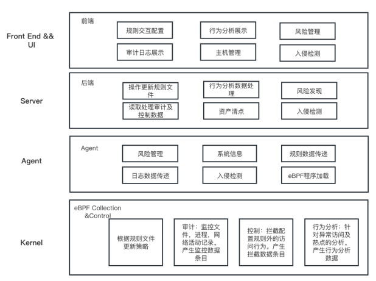
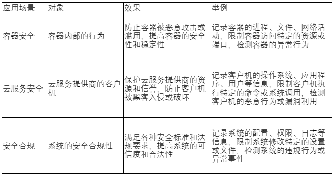

针对操作系统、内核安全，联通云操作系统团队开发了的一个基于 eBPF 的 Linux 安全防护系统 safeguard，可以实现安全操作的审计拦截及安全防护功能。项目采用 libbpfgo 库，使用 go 语言实现顶层控制。safeguard 在联通云 CULinux 操作系统中已得到应用，目前项目已在 openEuler 仓库开源[1]。

## 简介

### KRSI (eBPF+LSM)

eBPF 是扩展的伯克利包过滤器（extended Berkeley Packet Filter）的缩写，它是一种可以在内核空间运行沙箱化程序的技术。eBPF 可以在不修改或重新编译内核、插入内核 KO 的情况下，动态地增加内核的能力。通过 eBPF，可以实现网络、观测、跟踪和安全等多种用例。

LSM 是 Linux 安全模块（Linux Security Module）的缩写，它是一种提供可插拔的安全框架机制，可以让不同的安全模块在内核中注册并实施自定义的安全策略。LSM 提供了一系列的钩子（hooks），可以在系统调用或其他安全相关事件发生前后执行安全检查。

eBPF 和 LSM 可以结合使用，形成一种基于 eBPF 的 LSM 扩展，叫做 KRSI (eBPF+LSM)。它允许用户在运行时使用 eBPF 程序实现和执行自定义的安全策略和审计规则。它的优点是不需要修改或重新编译内核，也不需要配置现有的 LSM 模块。KRSI (eBPF+LSM)  的工作原理是将 eBPF 程序加载到 LSM 钩子中，然后在调用路径中执行这些程序，对系统资源的访问进行检查和控制。

### safeguard 架构及功能介绍

safeguard 基于 KRSI (eBPF+LSM) 实现，整体架构采取了 C/S 架构，分 Agent、Server、UI 等几个组件，功能涵盖了审计控制、行为分析、主机管理、风险管理、入侵检测等（详细介绍参考下文）。

图1 架构图

### 应用场景

safeguard 是一种基于 KRSI(eBPF+LSM) 的 Linux 安全审计和管控解决方案，可以实现对系统的全面监控和保护。下面是一些可能的应用场景：

表1 应用场景

## 项目功能

### 审计控制

1. 文件
   
   - 追踪文件系统的活动，包括文件的打开、关闭、读写、删除等。
   - 修改文件系统的行为，例如拦截某些文件操作，或者实现自定义的安全策略。
   
   > **安全策略**：
   > 
   > 1. 拦截或重定向文件（比如密钥文件、用户账号文件或需要安全防护的各种类型文件等）操作，使用eBPF来拦截对敏感文件的读写操作，或者重定向对某些文件的访问到其他位置。
   > 2. 实现自定义的访问控制，使用 eBPF 来检查对文件的访问者的身份、权限、环境等信息，然后根据一些规则来允许或拒绝访问。
   > 3. 实现自定义的审计和监控，使用 eBPF 来记录对某些文件的操作的详细信息，如操作者、时间、内容等，并将这些信息输出到日志。
2. 进程：
   
   - 追踪进程的生命周期，例如进程的创建、终止、调度、上下文切换等。
   - 修改进程的行为，例如注入或修改某些系统调用，或者实现自定义的调度策略。
3. 网络：
   
   - 追踪网络的活动，例如网络包的发送、接收、转发、丢弃等。
   - 修改网络的行为，例如过滤或重写某些网络包，或者实现自定义的路由策略。

### 行为分析

1. 收集并分析文件系统的性能、热点、异常等。（选择合适的 eBPF 程序类型和挂载点，例如，使用kprobes 或 tracepoints 来追踪文件系统相关的内核函数或事件，如 vfs\_read, vfs\_write, ext4\_sync\_file 等。）
2. 收集信息来分析进程的资源消耗、状态变化、依赖关系等（do\_fork, do\_exit, schedule 等）。
3. 收集信息，分析网络的流量、延迟、丢包率、拥塞等（使用 tc 或 xdp 来追踪网络包的发送、接收、转发、丢弃等事件）。

### 主机管理

从安全角度自动化构建细粒度资产信息，支持对业务层资产精准识别和动态感知，让保护对象清晰可见。功能包括：账号展示、端口列表、进程列表等。账号展示可以列出系统管理员及用户账号，端口列表展示了系统开放的网络端口，进程列表展示系统内运行的各种进程。

### 风险管理

精准发现内部风险，快速定位问题并有效解决安全风险，提供详细的资产信息、风险信息以供分析和响应。功能包括：漏洞检测、安全补丁、弱密码、系统风险、账号风险等。漏洞扫描提供了系统的安全漏洞扫描功能，安全补丁功能会提示系统是否需要更新某些补丁，弱密码可以扫描出系统中存在的简单密码并提示修改，系统风险、账号风险展示了系统中可能出现的其他系统及账号相关的其他风险。

### 入侵检测

提供多锚点的检测能力，能够实时、准确的感知入侵事件，发现失陷主机，并提供对入侵事件的响应手段。功能包括：暴力破解、异常登录、反弹 shell 、本地提权、后门检测，Web 后门等。检测系统的可疑事件，发现暴力破解，异常登录，反弹 shell 行为，或者存在风险的本地提权行为，并提供后门检测，Web 后门扫描功能。

## 发布路线

项目目前已经实现了审计控制及部分行为分析模块功能，整体规划如下：

表2 项目整体规划

## 加入我们

欢迎感兴趣的朋友们参与到 openEuler eBPF SIG，探讨 eBPF 领域技术[2]，也可以添加小助手微信，加入 eBPF 技术交流微信群。欢迎您的围观和加入！

## 参考链接

1. safeguard gitee 源码仓：https://gitee.com/openeuler/safeguard
2. eBPF SIG 介绍：https://gitee.com/openeuler/community/tree/master/sig/sig-ebpf
