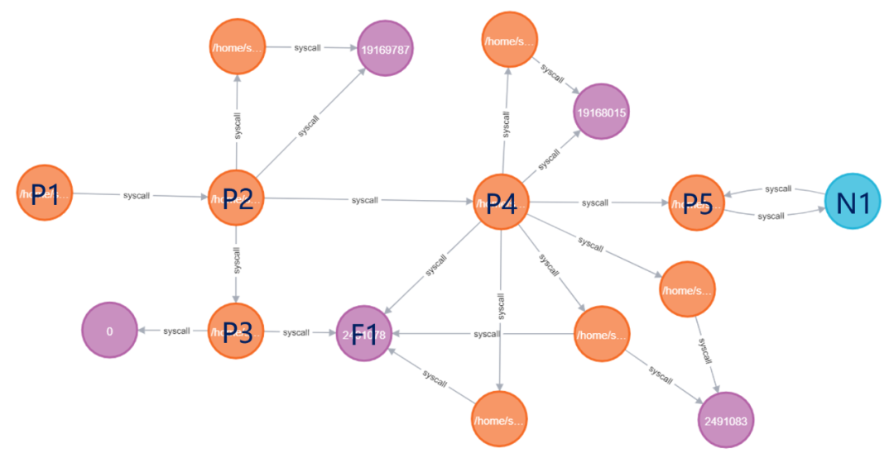
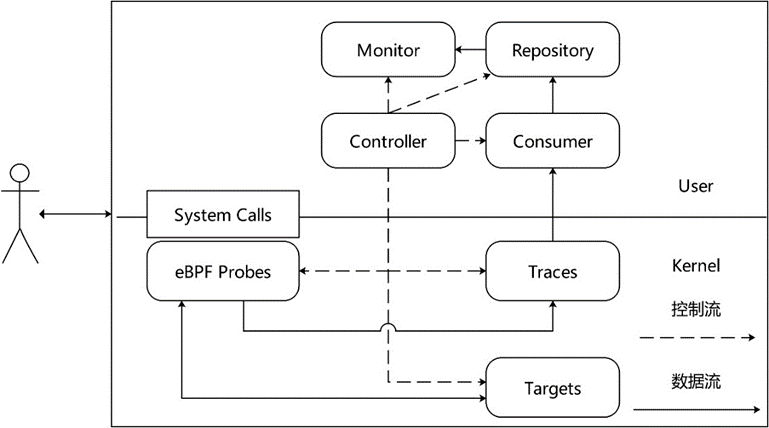
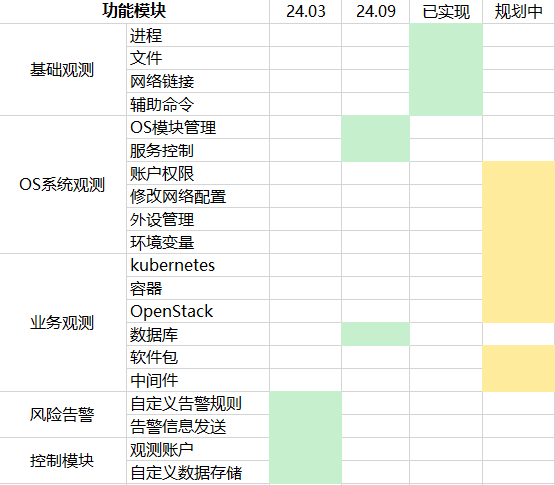
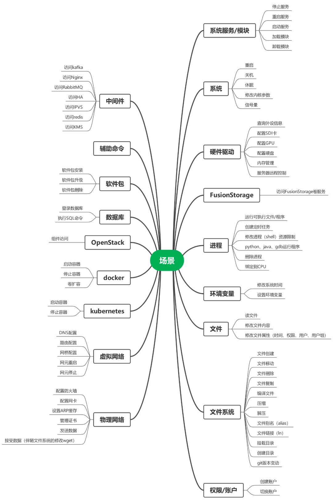

针对 openEuler 运维变更过程观测困难的问题，华为 2012 服务实验室 OSMind 团队开发了基于 eBPF 的变更观测工具—— Agith。Agith 可以识别与变更相关的行为，并将变更过程表示为一种拓扑结构——变更影响面。通过变更影响面可以完成变更告警、审计、根因定位、依赖分析等功能。

## 背景

云计算成为信息时代的算力底座，服务千家万户。作为重要的基础实施，稳定压倒一切。但同时云计算也在追求扩大规模以及适配上层业务。因此带来频繁的变更难免会引发故障。

变更任务大致可以分为两类。第一类白屏变更是通过运维工具执行操作，适用于版本变更、资源扩缩容、灾备倒换等流程固定的任务。但是灵活性差，只能执行标准流程。另一类黑屏变更需要运维人员登录系统，通过执行命令来完成变更过程。黑屏变更简单灵活，适合中小型企业的 IT 运维与复杂的运维任务，例如根因分析或故障修复。黑屏变更是变更不确定性的主要来源，也更容易引发故障，需要加强可观测性。

目前对于变更过程的主要观测方法是记录变更过程中运维人员输入的所有命令。在变更结束后，通过审计监察发现潜在的风险。这种方式需要大量的专家经验。因为命令日志很难表示变更过程。例如``` 2022-09-12 00:00:00.0 张三 obs\_cmd.sh 1818 华东 10.164.179.21```，包含时间、人员、主机IP，主机集群（华东）和最重要的命令（```obs\_cmd.sh 1818```）。但是如果没有专家经验，这条命令是无法解读的。

## Agith与变更影响面

Agith 是 Agent Smith 的缩写。这是致敬《黑客帝国》的 Smith 探员。虽然 Smith 探员是电影中的反派角色，但从运维工程师的视角来看，探员是 Matrix 系统中最优秀的运维工程师。Matrix 系统每时每刻有数十亿的流量接入，但是探员却可以感知轻微的变更异常，并通过最近的节点登入以处理故障（Kill Neo）。这种观测能力正是 Agith 的设计目标。系统每时每刻都在处理大量的请求，包括正常的上层服务与变更任务。Agith 需要从中区分出变更任务，将变更的行为记录下来，整理为变更影响面拓扑图。

Agith 是一款面向变更过程的观测工具。相比只记录命令名，Agith 更关注命令的行为。这种区别体现在最终输出上。传统方法输出的是运维人员的所有输入，组织为日志数据。而 Agith 的输出的是变更影响面，如下图所示：



**图1 变更影响面示例**

橙色节点表示进程，紫色节点表示文件，蓝色节点表示一个远程节点。每种类型节点的都有对应的属性信息展示在右侧列表中。例如进程节点属性信息有进程工作路径、执行命令名、PID 等。文件节点有 inode、文件路径。远程节点有 IP-Port 地址，交互信息等。节点之间的边存储了系统调用类型，例如进程节点与文件节点可调用类型有 read、write、unlink（删除）。

图1的变更中，运维人员登录主机后执行了一条命令 ```obs_cmd.sh 1818```，随即退出。这个操作反应在图中是进程节点P1（bash）创建了进程节点P2（obs\_cmd.sh 1818）。进程节点 P2 在执行中又创建了一个 python 脚本（进程节点P3）与一个 shell 脚本（进程进程 P4）。进程节点 P3 创建了一个文件节点 F1。而进程节点 P4 修改了文件 F1，并且通过 curl 命令（进程节点 P5）访问了一个远程节点 N1 的 1818 端口。点击蓝色节点可以看到这次访问的 URL 链接。

相比命令日志，**Agith 更关注命令的行为**。这种方法将无限的命令映射到有限的行为上，方便运维人员理解。只要有这张变更影响面拓扑图，任何一个运维人员都可以理解此次变更的操作，不需要复杂的专家经验。

## Agith 架构

Agith 在设计中采用数据流与控制流分离的策略。eBPF 模块、Consumer、Repository 和 Monitor 可以组成数据筛选-采集-整理-输出的数据流（图 2 中实线）。控制流（图 2 中虚线）则以 Controller 模块为核心，其他模块受 Controller 模块的统一管理。启动时 Controller 模块检测环境，分析配置文件，检查启动参数。然后依次启动部署各个模块。当程序结束时管理各个模块完成清理任务后依次退出。



**图2 Agith架构图**

### eBPF 模块

eBPF 模块包含 eBPF Probes、Traces、Targets 三个部分。这个模块承担数据的筛选工作。筛选方法是一种基于动态目标的变更监控技术。该技术首先建立了两类 map。第一类是 Target map。Target map 保存了监控目标的标识符。例如进程的 pid、文件的 inode、网络的 IP。第二类是Trace map。Trace map 用于存储探针获取的数据。

eBPF Probe 是针对特定的系统调用编写的探针程序。这些程序被触发时，首先根据 Target map 判断系统调用是否与监控目标相关。如果不相关直接返回。如果相关会收集数据写入Trace map。同时 eBPF Probe 会修改 Target map。例如在创建进程的 clone 系统调用处挂载探针程序。当任何程序执行 clone 系统调用，探针会被触发。探针程序检测进程 pid 是否在 Target map 中。如果不存在就返回继续执行 clone。如果存在，会将返回值即子程序的 pid 写入 Trace map，然后将子程序的 pid添加到 Target map 中。这样子程序也被纳入监控范围内了。

### Consumer 模块

Consumer 模块承担采集工作，即读取并缓存 Trace map 的数据。这个过程涉及读写速率控制，数据异常处理，数据融合等。

Consumer 读取的数据类似 strace 得到系统调用记录。这些数据采用“主谓宾”的结构体存储。例如 ```pid:411962, syscall:read, ret: 18, time:974333207983984, ready:1, obj:{fd:3, i\_ino:2505217}``` 是一条监控 read 系统调用得到的记录。“主语”是 ```pid:411962```，表示一个进程号为 411962 的进程。“谓语”是 ```syscall:read```，表示读取操作。“宾语”是 ```obj:{fd:3, i\_ino:2505217}``` 表示是一个文件，文件句柄号是 3，inode 编码是 2505217。除此之外还有这次系统调用的时间和返回值。这条记录的含义是进程 411962 读取了文件 2505217。这条信息非常简陋。进程执行的程序名是什么？读取的文件名是什么？这些信息包含在之前的记录中。例如进程名包含在在 exec 系统调用中，文件名包含在 openat 系统调用中。

### Repository & Monitor

Repository 承担整理与输出工作。它存储 Consumer 读取的记录，将信息填充到变更影响面图中。例如打开一个新文件，会创建一个文件节点，并在进程与文件之间连接一条边。除此之外 Repository 负责向 Monitor 模块传递信息。

Monitor 模块负责告警。如果在采集数据的过程中发现高危操作，例如删除重要的配置文件， Monitor 模块会发送告警。Monitor 的数据来源于 Repository。因为只有 Repository 存储的图中才能掌握完整的上下文信息。仅仅依靠 Consumer 的记录不足以判定是否是高危操作。

## 应用场景

Agith功能是观测变更过程，最终得到的变更影响面可以应用在风险告警、根因定位、变更审计、依赖分析等。

**风险告警**可以直接使用 Agith。首先在配置文件中声明含有风险的行为，例如修改某个文件，访问某项服务，删除进程等等。Agith 在整理过程中发现这类数据，会向配置文件中的邮箱发送告警信息。例如美联航故障事件中删除文件的行为，Agith 可以发现这种异常操作。目前邮件告警功能在开发中，敬请期待。

**根因定位**是变更影响面最重要的用途。相比命令日志，变更影响面数据含有更细粒度的行为数据，可以更容易地发现与故障相关的命令行为。

**变更审计**可以在变更后检查是否有超出预期的行为。对于重要的变更操作，可以在灰度环境中先执行一遍，获取变更影响面。然后在目标环境中执行，得到另一份变更影响面。将两份数据比较，可以发现在变更操作中有没有错误操作。

**依赖分析**是获取一个服务在运行时依赖的各种本地资源与周边服务。这个功能虽然与变更无关。但是只要在终端中启动这个服务，Agith 就可以获取该服务的所有行为，从而得到所依赖的各种资源，例如动态依赖库，配置文件等。

## 路线图

当前 Agith 的功能只能覆盖进程、文件、网络的一部分行为。但是黑屏变更过程中命令行为远远超过这部分。



**表1 Agith开发计划**

表1是未来 Agith 计划覆盖的变更行为。变更行为的整理是一个复杂的过程。我们一开始采用的方案是自底向上。无论什么样的上层服务，从OS的视角来看无非5类行为：进程，内存，文件，网络，外设。只要对这5类行为监控，就可以覆盖所有的命令行为。但是实践并非如此。

首先过度抽象将失去数据的价值。例如执行 mysql、docker、kubernetes 的命令，都是向已有的服务进程发送命令，可以统一为进程交互行为。但是如果只有交互的进程名，根本不能从中判定风险。其次过度抽象意味着所有的底层行为都是需要记录的，会产生巨大的数据冗余。例如一次进程启动，会频繁申请内存，记录这些数据没有意义。

由此我们认识到观测这张网既不能太粗，也不能太细，应当结合运维需求灵活调整。所以我们采用了一种自顶向下的方法。首先收集 239万条变更命令，逐条去分析变更命令，得出这条命令所产生的数据。然后根据数据的相似性合并。例如文件都会有文件名，容器类操作有容器 id 或者镜像 id。合并过程中会舍弃两者差别的数据项。如果这个数据项对于运维价值不大，就是可以舍弃的。如果这个数据对运维很重要，说明这个合并是错误的。在整理的过程中有太多收益与成本的博弈，相信未来还会不断演进。我们最终梳理出需要监控的行为如下图。



**图3 运维变更行为**

## 欢迎加入

如果您对 Agith 有任何建议，欢迎在 [https://gitee.com/openeuler/Agith/issues](https://gitee.com/openeuler/Agith/issues) 提出，也可以添加小助手微信，加入 eBPF 技术交流微信群。如果有合作意向，可以与笔者联系（shangguandongdong1@huawei.com）。


