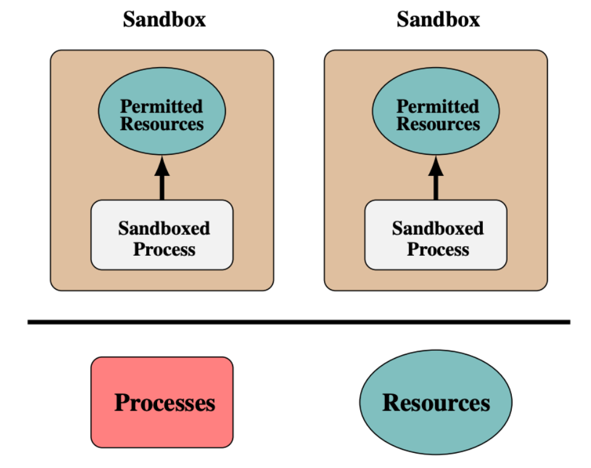
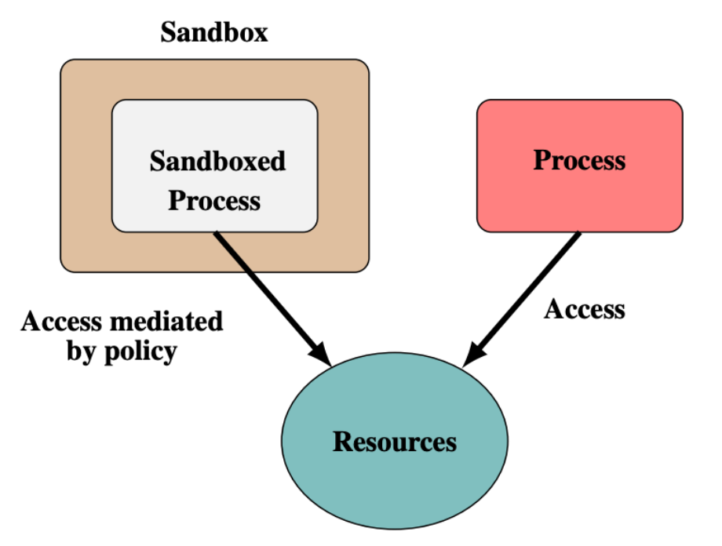
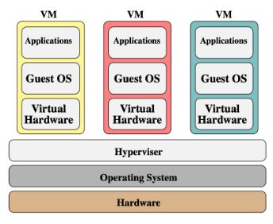
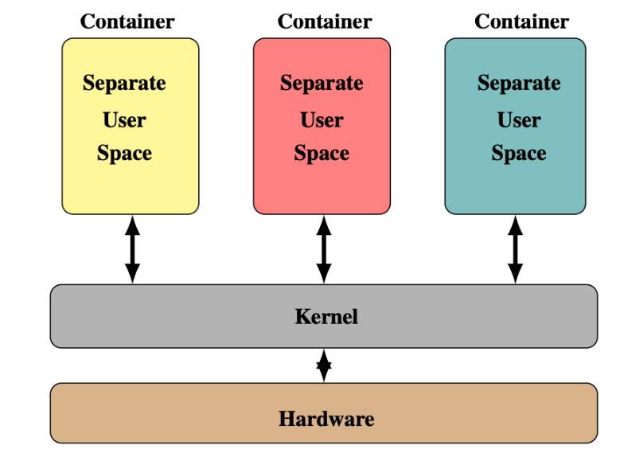
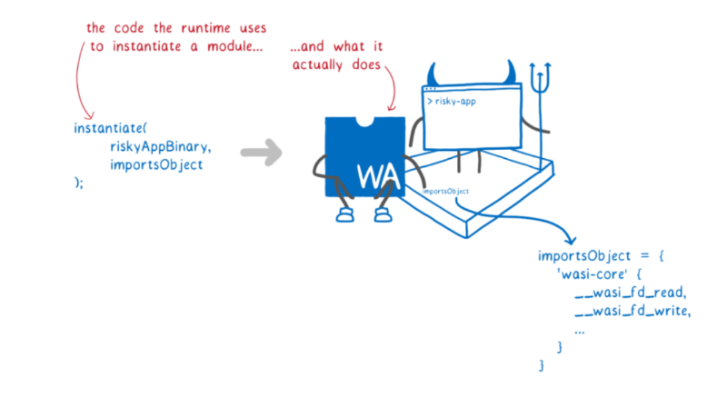
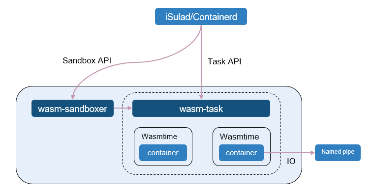
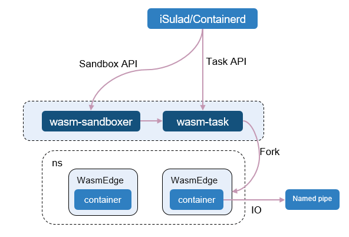
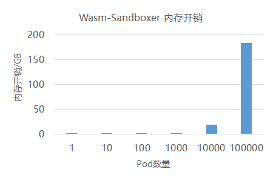
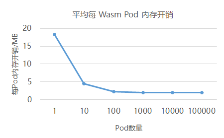

## 沙箱技术背景介绍

不管是 VM、Container，还是 WASM 沙箱，它们本质都是利用了沙箱技术，实现将不信任程序隔离在沙箱环境中执行，避免影响其他应用和服务。沙箱技术大致可以分为两类[1]：

- **基于隔离的沙箱**：该类型的沙箱将应用的执行环境从操作系统环境中隔离出来，形成一个独立的执行环境。
  
  

  图 1. 基于隔离的沙箱
- **基于规则的沙箱**：该类型的沙箱并不是完全关注对于应用程序的隔离，而是用规则的方式控制每个应用的权限，基于规则的沙箱之间可以分享操作系统的逻辑资源。
  
  

  图 2. 基于规则的沙箱

## 沙箱安全隔离能力对比分析

### VM



图 3. VM 安全隔离架构

虚拟机的安全隔离能力可以简单总结为水平和垂直方向的多维度隔离。在水平维度上看，虚拟机 Hypervisor 层水平分隔不同的 Guest OS，保证 Guest OS 的漏洞不会影响其他的 Guest OS；在垂直维度上看，Hypervisor 层分隔不同的操作系统（ Guest OS 和 Host OS 的内核不共享）和物理硬件，控制 Guest OS 中漏洞不会影响到宿主机上的操作系统和物理硬件。

### Container



图 4. Container 安全隔离架构

容器的安全隔离能力也是借鉴了 VM 的这种分隔的思想，将不同的应用水平分隔在不同容器环境中运行，如果容器中的应用存在漏洞，它是不会直接影响到其他应用。

但是在垂直分隔的维度上，容器和容器之间共享同一个内核，没有带来完全意义上的隔离，因此如果一个容器触发了一个内核漏洞导致内核崩溃，就会导致整个系统上的其他容器中的应用也会受到影响。

### WASM 沙箱



图 5. WASM/WASI 安全隔离设计

WASM 从语言设计上就利用了 SFI 软件故障隔离的概念（前面介绍的第一种基于隔离的沙箱技术），将 WASM 应用程序的故障都隔离约束在自己单独的线性地址空间中，确保应用程序不会跳转到故障域之外的地址空间，实现安全隔离的目的。并且 WASM 的虚拟指令集都是纯计算指令集，不会像 VM 或 Container 需要涉及到对内核或者硬件资源的访问，因此通过 SFI 机制就可以保障程序的漏洞不会逃逸和扩散。

WASI[2] 概念则是基于前面提到的第二种基于规则的沙箱技术或者说 capability-based 的安全模型，用规则的方式控制每个 WASM 应用的权限，需要什么能力，就需要显示地为应用配置对应的规则。

**所以说 WASM+WASI 的沙箱技术是双剑合璧，汲取了基于隔离沙箱技术和基于规则沙箱技术的优点，提供的轻量级沙箱技术。**

## WASM 沙箱接入云原生生态

WASM 沙箱在保证安全隔离的前提下，可以获得毫秒级冷启动速度，如果接入到云原生生态中，容器运行时首先要考虑的问题是如何发挥 WASM 极速启动的优势。

Kuasar 基于 Sandbox API 接口的设计将 sandbox 的概念具体的从 containerd-shim 进程模型中解放出来，可以直接映射到实际的沙箱对象上，例如轻量级虚拟机类型的MicroVM沙箱，WASM 语言虚拟机类型的沙箱。

当前 Kuasar 支持业界主流的两种 WASM 运行时：**Wasmtime**[3] 和 **WasmEdge**[4]。

### Kuasar 对接 Wasmtime 方案介绍



图 6. Kuasar 对接 Wasmtime 运行时架构

Kuasar 对接 Wasmtime 运行时的架构采用的是协程模型，wasm-sandboxer 沙箱管理模块和 wasm-task 容器管理模块均运行在同一个进程中，由 wasm-task 创建的 WASM沙箱实例也同样运行在 wasm-sandboxer 进程中，**这样设计的好处是可以充分利用单进程内的协程调度机制来降低 WASM 沙箱实例的调度开销，避免传统每个WASM实例单进程模式对系统PID资源的消耗，提高单节点上 WASM 沙箱实例的部署密度**。

WASM 沙箱实例中 WASM 函数的 IO 流则是通过命名管道与容器引擎进行对接，让容器引擎可以收集到 WASM 函数的输出内容。

### Kuasar 对接 WasmEdge 方案介绍



图 7. Kuasar 对接 WasmEdge 运行时架构

Kuasar 对接 WasmEdge 运行时的架构与 Wasmtime 运行时稍有一些不同，当 wasm-task 接收到创建 WASM 沙箱的请求时，会通过 fork 系统调用创建出一个新的进程来实例化 WASM 沙箱，这样设计的原因是 **WasmEdge 运行时当前暂不支持在一个进程中同时重定向不同 WASM 沙箱实例的标准输入和标准输出**。

## 编译运行 WASM 沙箱

> 说明：
> 
> 1. 下面以 Wasmtime 作为 WASM 运行时为例进行介绍说明，WasmEdge 运行时的编译与运行步骤类似。
> 2. Kuasar 支持 WASM 沙箱是一个预览特性，不支持应用在商用环境中。

### 环境准备

1. 准备一个 openEuler 23.09 版本的 x86 环境
2. 安装 Rust 语言编译工具链，安装方法参考 Rust 官方安装教程[5]
3. 安装 iSulad 容器引擎，安装方法参考 iSulad 容器引擎 - 安装与配置[6]
4. 安装 isula-build 容器镜像构建工具，安装方法参考isula-build 容器镜像构建 - 安装[7]

### 制作 WASM 应用容器镜像

1. 编译 WASM 格式目标应用程序

```bash
# 以 runwasi 项目中 wasi-demo-app 应用为例介绍
$ git clone https://github.com/containerd/runwasi.git

$ cd runwasi/crates/wasi-demo-app

# 安装 rust wasm32-wasi 编译工具链
$ rustup target add wasm32-wasi

# 将 "wasi-demo-app" 程序编译成 wasm 目标格式
$ cargo build --target=wasm32-wasi --release

# 编译生成的 wasm 模块会存放在 target/wasm32-wasi/release/ 目录下
$ ls runwasi/target/wasm32-wasi/release/*.wasm                                  
target/wasm32-wasi/release/wasi-demo-app.wasm
```

2. 创建一个空的目录，将上一步生成的 wasm 格式应用文件拷贝到该空目录中

```bash
$ mkdir build && cd build
$ cp target/wasm32-wasi/release/wasi-demo-app.wasm .
```

3. 编写容器镜像构建所需的 Dockerfile

```bash
$ cat Dockerfile
FROM scratch
ADD wasi-demo-app.wasm /
```

4. 通过 isula-build 构建 WASM 应用容器镜像，并直接导入到 iSulad 容器引擎

```bash
$ isula-build ctr-img build -f Dockerfile -o isulad:wasi-demo-app:v1
STEP  1: FROM scratch
STEP  2: ADD wasi-demo-app.wasm /
Getting image source signatures
Copying blob sha256:2ed8f32f0a3bd46fddc96fbe1639eaebd8a3d0e49c9c284ddf24619300fcfab5
Copying config sha256:59b1ccb0ae18329439e0b3995de75df9a021b5096afaad7a72925fa2b85f4ae4
Writing manifest to image destination
Storing signatures
Committed stage 0 with ID: 59b1ccb0ae18329439e0b3995de75df9a021b5096afaad7a72925fa2b85f4ae4
Getting image source signatures
Copying blob sha256:2ed8f32f0a3bd46fddc96fbe1639eaebd8a3d0e49c9c284ddf24619300fcfab5
Copying config sha256:59b1ccb0ae18329439e0b3995de75df9a021b5096afaad7a72925fa2b85f4ae4
Writing manifest to image destination
Storing signatures
Build success with image id: 59b1ccb0ae18329439e0b3995de75df9a021b5096afaad7a72925fa2b85f4ae4

$ isula images
REPOSITORY                                TAG        IMAGE ID             CREATED              SIZE       
wasi-demo-app                             latest     59b1ccb0ae18         2023-11-21 20:30:53  108.229KB
```

### 编译运行 WASM 沙箱运行时

1. 编译基于`Wasmtime`运行时的`wasm-sandboxer`组件

```bash
# 下载 kuasar 项目源码
$ git clone https://github.com/kuasar-io/kuasar.git

# 切换到 wasm沙箱模块源码目录下
$ cd kuasar/wasm

# 编译 wasm-sandboxer 组件
$ cargo build --release --features=wasmtime

# 生成的 wasm-sandboxer 二进制可执行文件路径
$ ls target/release/wasm-sandboxer
```

2. 启动 wasm-sandboxer 沙箱运行时进程

```bash
RUST_LOG=info wasm-sandboxer --listen /run/wasm-sandboxer.sock --dir /run/kuasar-wasm
```

3. 修改 iSulad 容器引擎配置支持 WASM 沙箱运行时

```json
// 在 iSulad 容器引擎的配置文件 /etc/isulad/daemon.json 中添加下面有关 wasm 沙箱运行时的配置信息
{
  ......
  "cri-runtimes": {
    "wasm": "io.containerd.wasm.v1"
  },
  "cri-sandboxers": {
    "wasm": {
        "name": "wasm",
        "address": "/run/wasm-sandboxer.sock"
      }
  },
  ......
}
```

4. 重启 iSulad 使配置生效

```bash
systemctl restart isulad
```

### 创建 WASM 沙箱并执行 WASM 函数

下面的脚本中定义了 WASM 类型 Pod 沙箱和运行 WASM 函数容器的配置信息，通过 crictl 命令来创建 WASM 沙箱并执行 WASM 函数：

```bash
$ cat run_example_wasm_container_with_isulad.sh
set -e
# Prepare for the wasm Pod and Container config file.
touch pod.json container.json
current_timestamp=$(date +%s)
cat > pod.json <<EOF
{
    "metadata": {
        "name": "test-sandbox$current_timestamp",
        "namespace": "default"
    },
    "log_directory": "/tmp",
    "linux": {
        "security_context": {
            "namespace_options": {
                "network": 2,
                "pid": 1
            }
        }
    }
}
EOF
cat > container.json <<EOF
{
    "metadata": {
        "name": "wasm_$current_timestamp",
        "namespace": "default"
    },
    "image": {
      "image": "wasi-demo-app:latest"
    },
    "command": [
       "/wasi-demo-app.wasm","daemon"
    ],
    "log_path":"wasm.log",
    "linux": {
        "security_context": {
            "namespace_options": {
                "network": 2,
                "pid": 1
            }
        }
    }
}
EOF

# Run a wasm container
crictl run --runtime="wasm" --no-pull container.json pod.json
rm -f container.json pod.json
```

执行上述脚本程序后，可以通过`crictl`命令观测到 WASM 沙箱和 WASM 函数的运行的状态

```bash
$ crictl ps -a
CONTAINER           IMAGE                  CREATED             STATE               NAME                ATTEMPT             POD ID              POD
0b1dee6dc1a6c       wasi-demo-app:latest   2 seconds ago       Running             wasm                0                   37fe4fc2fc358       unknown

$  crictl pods
POD ID              CREATED             STATE               NAME                     NAMESPACE           ATTEMPT             RUNTIME
37fe4fc2fc358       27 seconds ago      Ready               test-sandbox1700546390   default             0                   (default)
```

## 高密部署性能测试

测试验证单节点上能否高密部署10w+规模的 WASM 沙箱实例：

> 说明：
> 
> - 启动10w+规模的 WASM 沙箱实例，可能会触发 wasm-sandboxer 沙箱运行时进程打开文件句柄超过限制的错误，所以在启动 wasm-sandboxer 进程前需要将进程最大可打开的文件句柄数调大，建议将最大可用的文件句柄数调大到 1073741816 。
> - 测试节点上需要保证可用的内存资源 > 200 GB 。

测试代码如下：

```bash
for i in `seq 1 100000`;do bash run_example_wasm_container_with_isulad.sh;sleep 1;done
```

经过测试验证，**10w 个 WASM 沙箱实例可以顺利地在单个节点上启动**，其中 wasm-sandboxer 沙箱运行时进程总计消耗了 183.3 GB 内存，**平均每个 WASM 类型沙箱实例消耗 1.9 MB**。



图 8. wasm-sandboxer 运行时进程内存开销统计



图 9. 每 WASM Pod 平均存开销统计

## 参考文章

[1] Sandboxing in Linux: From Smartphone to Cloud--International Journal of Computer Applications: https://www.ijcaonline.org/archives/volume148/number8/borate-2016-ijca-911256.pdf
[2] Standardizing WASI: A system interface to run WebAssembly outside the web:https://hacks.mozilla.org/2019/03/standardizing-wasi-a-webassembly-system-interface/
[3] Wasamtime：https://github.com/bytecodealliance/wasmtime
[4] WasmEdge: https://github.com/WasmEdge/WasmEdge
[5] Rust 官方安装教程: https://www.rust-lang.org/tools/install
[6] iSulad 容器引擎 - 安装与配置: https://docs.openeuler.org/zh/docs/23.09/docs/Container/%E5%AE%89%E8%A3%85%E4%B8%8E%E9%85%8D%E7%BD%AE.html
[7] isula-build 容器镜像构建 - 安装: https://docs.openeuler.org/zh/docs/23.09/docs/Container/isula-build%E6%9E%84%E5%BB%BA%E5%B7%A5%E5%85%B7.html#%E5%AE%89%E8%A3%85

## 加入我们

文中所述的 iSulad、Kuasar 组件，由 CloudNative SIG 参与，相关源码均已在 openEuler 社区开源。如果您对相关技术感兴趣，欢迎您的围观和加入。您可以添加小助手微信，加入对应 SIG 微信群。

活动预告：openEuler Summit 将于 12月16日 举办 CloudNative 技术分论坛。欢迎大家届时参加，交流精彩议题内容！


