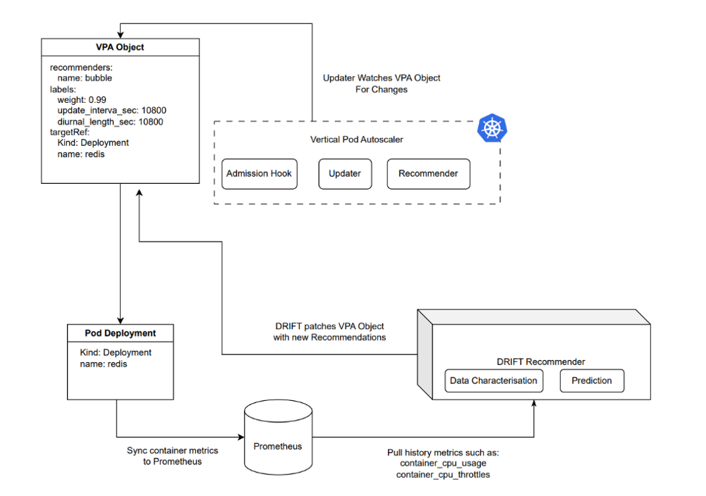
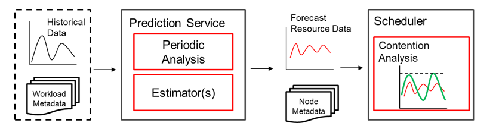
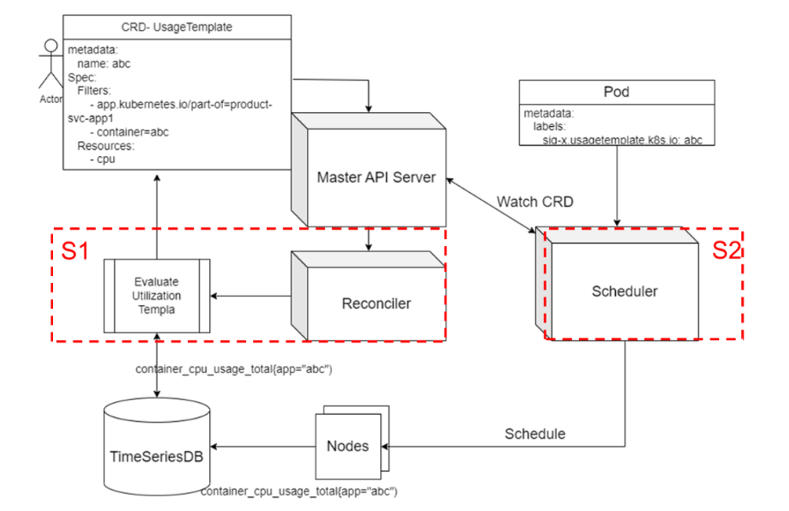
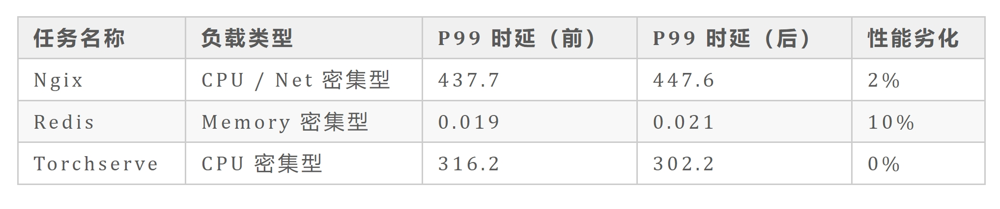

**\[概述\]**
------------

在数据中心，资源利用率指标，尤其是 CPU
利用率常用于量化集群的有效利用程度。在实际环境中，系统给负载分配的资源以及工作负载的调度决策都会影响利用率。

如果工作负载资源分配不准确，集群可能会因空闲而未充分利用。另一方面，如果调度决策不合理，即便是利用率有提升，负载间的资源冲突也会导致性能出现下降。

为了提高资源利用率，同时尽量减少由于干扰导致的性能下降，以保证
QoS，性能感知系统 PAWS(Performance Aware System)应运而生。

PAWS
的愿景是提供一套能够基于负载特征历史特征进行资源推荐，同时尽可能避免互相干扰的调度算法。

**\[特性介绍\]**
----------------

PAWS
主要解决资源精准推荐以及资源干扰的问题，因此其主要围绕着这两方面来构建自己的能力。当前
PAWS 主要主要以下两个特性：

### **特性一、VPA 资源推荐**

#### **算法思想**

VPA (Vertical Pod Autoscaler)
是一种自动伸缩技术，通过对分配给微服务的物理资源（CPU、内存等）进行调整，来满足微服务不断变化的需求。不同的服务有不同的资源需求，这取决于多个因素，例如一天中的时间、用户需求等。为这些服务进行固定的资源分配可能会导致集群的资源利用率非常低。

PAWS 提出了一种将经典的数值优化解决方案与当代的机器学习方法相结合的 VPA
推荐算法，通过对负载历史特征的分析，为工作负载推荐适当的资源，从而释放多余申请的资源，从而提高集群利用率。

PAWS-VPA 的整体架构如下：

其中 DRIFT Recommender 从 Prometheus 中获取所需数据，并通过 VPA
推荐算法，给出对应的数据值。其整体算法包括了主动预测，负载感知以及预测反馈三部分：

-   \[ \] 主动预测：预测负载资源，在变化之前给出建议；

-   \[ \] 负载感知：基于历史数据库感知负载特征模式，并给出建议；

-   \[ \] 反馈机制：通过运行时的反馈系统，快速纠正不当建议；

整个算法的整体思想为，以过去 N 个时间窗口的 CPU
利用率以及资源执行情况为输入，每隔一段时间\*(k)\*进行一次调用，对未来一个或者多个时刻之内，每个容器的
CPU 资源推荐最佳值。

在推荐时，会考虑过往的资源推荐情况，基于过往的
overestimation（过高估计）和
underestimation（过低估计）进行加权，给出最优建议。

在算法中，我们的目标函数（OBJ）是资源高估和低估事件的加权（w）平均值。在这里，

-   \[ \] 高估（overestimation）是指 CPU 的建议高于实际 CPU
    利用率，导致整体利用率偏低；

-   \[ \] 低估（underestimation）指的是 CPU 建议低于 CPU 利用率导致
    throttle 事件，会导致负载性能下降；

数学上，OBJ=w x UE+(1-w)x OE，其中 w
是分配给低估相对于高估的重要性或权重。

#### **模块组成**

整个 PAWS-VPA
推荐算法共包含三个模块：负载表征，数值优化以及机器学习预测。

-   负载表征（Workload Characterization）：分析过去的 CPU
    利用率特征，以给出合理的 OBJ 权重 w

-   数值优化（Numerical Optimization）：使用经典的数值优化来计算过去 M
    个时间段内的最优推荐。具体来说，我们最小化 OBJ
    以获得过去样本的最优目标推荐，并将这个最小化问题描述为混合整数线性规划（Mixed
    Integer Linear Program，MILP）.

-   机器学习预测（Machine Learning Forecast）：在 MILP 计算出过去 M
    个时间间隔的目标值后，本模块将这 M
    个最佳历史推荐作为输入，并根据机器学习算法中定义的预测水平 F
    预测下一个（一个或多个）更新间隔的最佳未来推荐。

### **特性二、时序冲突检测调度**

#### **算法思想**

PAWS
开发了一套调度插件，通过利用负载历史数据中提取的资源利用率并进行时序分析统计，并让调度器基于该统计对负载进行错峰填谷，避免资源冲突的同时实现更高的资源分配。其使用了中的机制，对于系统中标记的进行资源的采集。通过收集作业容器的历史资源使用情况，分析时间序列周期（如每小时），输出每个周期周期的预估资源利用率，从而避免作业资源冲突，最终实现错峰补谷的调度，提升集群资源利用率。

#### **算法流程**

整个算法分为预测和调度两个部分，其中预测主要基于每种负载的历史数据，统计其时序变化情况，以供调度器使用；调度则基于上述信息，结合新任务的特征情况，给出合理的调度决策。

-   预测流程：通过 Prometheus
    等时序数据库，读取每个已知负载的资源利用率历史数据点，分析出小时维度的变化情况，并保存为历史数据，以供调度器参考。

-   调度流程：对于新来的任务，基于任务标签来判断具体策略。对于已知任务，从调度器中选取历史模板，与每个节点历史数据进行叠加求和；对于未知任务，则基于任务资源
    request 与节点数据进行叠加求和。在 Scoring
    阶段，当存在任务运行周期阶段超过阈值的可能性，进行不同的打分并归一。于此同时，系统对于未知任务会实时统计其资源利用率，确保后续该任何再次被拉起时可能进行更精确的打分。

**\[结果评估\]**
----------------

文中所述的 Performance Aware System
通过机器学习与数理分析手段，对负载资源的分配与调度进行优化。我们在实验室场景下模拟了包括
Redis，Nginx 和 Torchserve 等在内的一些典型应用，并通过搭建 10
台服务器的小型集群进行验证。通过测试发现，集群整体利用率在部署前后出现明显的提升。下图为其中某一个节点的利用率变化情况，该节点的峰值利用率从
30%提升到了 40%以上。

我们同时对部署前后的业务性能变化进行了对比，发现 P99 时延劣化在
10%以内，证明了算法在提升集群利用率的同时也能有效避免性能出现下降。

目前本特性代码已在 openEuler Cloud Native SIG
进行开源，地址为：https://gitee.com/openeuler/paws

于此同时，本方案仍然存在一些不够完美的地方，比如当前本方案主重点瞄准 CPU
计算密集型场景，但是在实际场景中，内存以及 IO
可能都成为影响业务的瓶颈点，同时资源竞争导致的性能下降也很难
100%从利用率的角度进行监控。因此也希望对该技术方向有兴趣的伙伴能加入该
SIG，对 PAWS 进行持续优化。

**\[加入我们\]**
----------------

文中所述资源利用率提升技术由 Cloud Native SIG 成员开发，其源码已在
openEuler
社区逐步开源。如果您对相关技术感兴趣，欢迎您的围观和加入。您可以添加小助手微信，加入对应
SIG 微信群。

