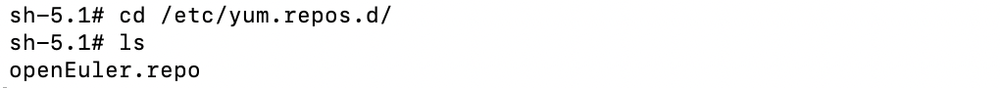
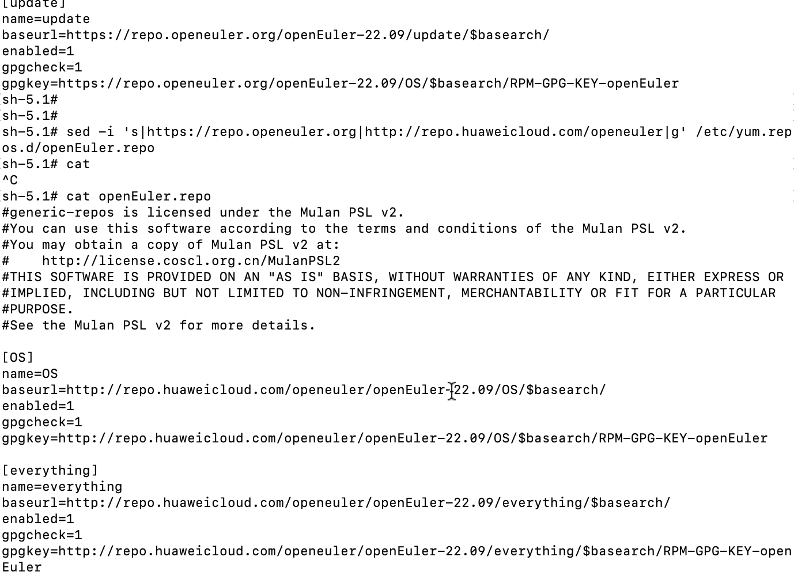
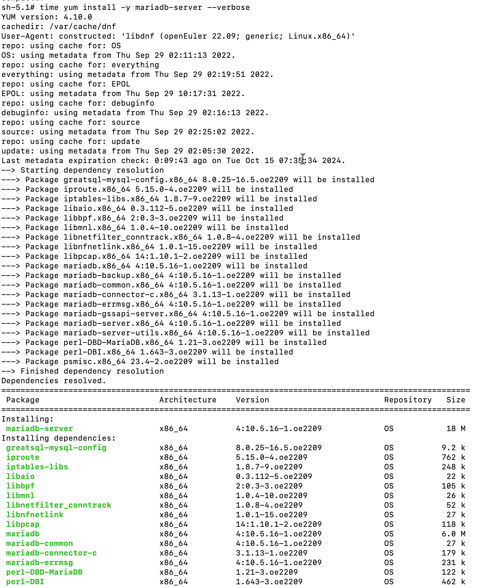
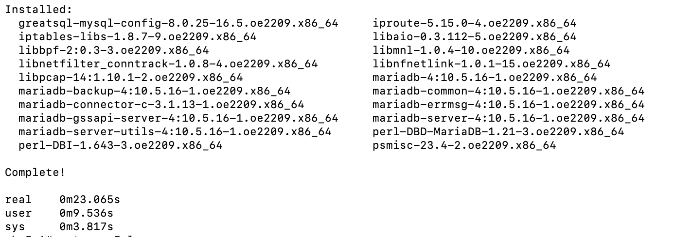
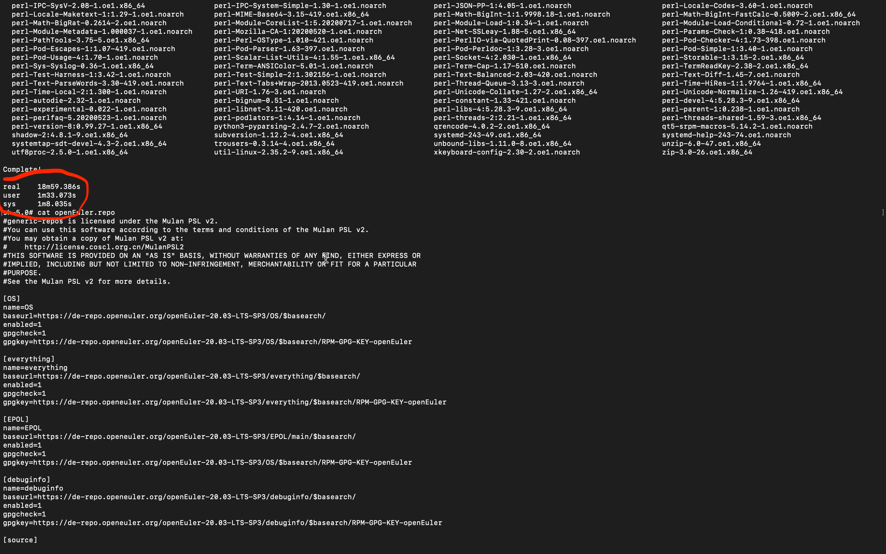
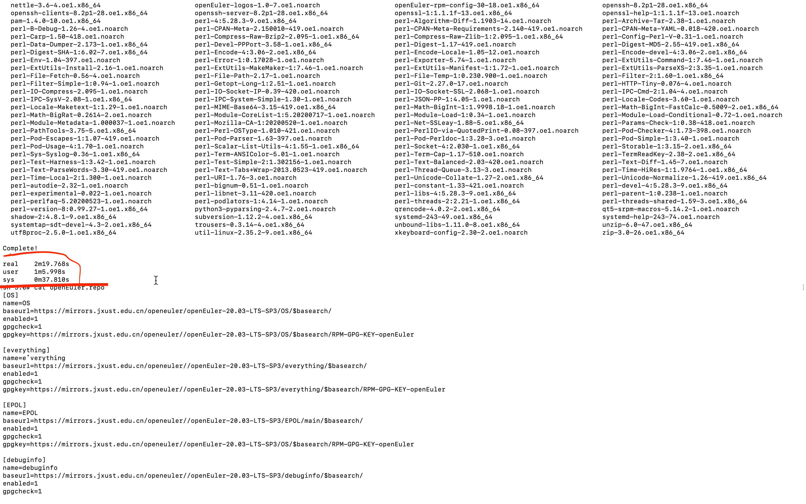
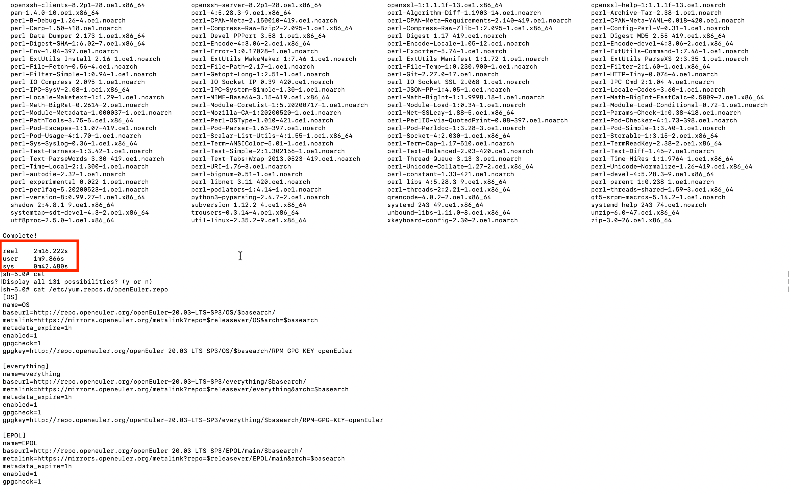

# openEuler 系统中 YUM 拉包下载慢问题解决方案：换源 + 使用 Metalink 加速

在使用 openEuler 系统时，部分用户可能会遇到 YUM 拉取软件包时下载速度较慢的问题，尤其是在网络不稳定或镜像源不理想的情况下。这篇文档将介绍通过 **更换镜像源** 和 **使用 Metalink 技术** 来提升 YUM 拉包速度的具体操作和优化方案。

## 一、换源解决方案

更换为离你更近或速度更快的镜像源，是加速 YUM 拉包下载最直接、有效的方法。openEuler 提供了多个镜像源，你可以根据自己的地理位置选择最佳的源进行替换。以下是步骤详解：

### 1. 查看当前的 YUM 源配置

YUM 源的配置文件通常位于 `/etc/yum.repos.d/` 目录下。你可以通过以下命令查看和编辑这些文件：

```bash
cd /etc/yum.repos.d/
ls
```

通常会看到以 `.repo` 结尾的文件，这些文件定义了 YUM 拉包所使用的源。例如，编辑 `openEuler.repo`(该目录下只有一个文件，文件名各个版本略有不同，可能带上了系统架构名)。
例如，编辑 `openEuler.repo`(该目录下只有一个文件，文件名各个版本略有不同，可能带上了系统架构名)：


### 2. 更换镜像源

根据你的网络环境，可以选择适合的镜像源。在 [https://www.openeuler.org/zh/mirror/list/](https://www.openeuler.org/zh/mirror/list/) 提供了许多国内外镜像源，常用的国内源包括：

- **华为开源镜像站**：
  ```
  http://repo.huaweicloud.com/openeuler/
  ```
- **中国科技大学镜像站**：
  ```
  https://mirrors.ustc.edu.cn/openeuler/
  ```

#### 更换源

你可以编辑对应的 `.repo` 文件，将其中的 `baseurl` 替换为以上镜像地址。
```bash
vi /etc/yum.repos.d/openEuler.repo
```

将 `baseurl` 改为你选择的镜像源，例如，可将镜像地址做批量替换
```bash
sed -i 's|http://repo.openeuler.org|https://mirrors.jxust.edu.cn/openeuler/|g' /etc/yum.repos.d/openEuler.repo
```


```bash
[OS]
name=OS
baseurl=https://mirrors.jxust.edu.cn/openeuler/openEuler-22.09/OS/$basearch/
enabled=1
gpgcheck=1
gpgkey=https://mirrors.jxust.edu.cn/openeuler/openEuler-22.09/OS/$basearch/RPM-GPG-KEY-openEuler

[everything]
name=everything
baseurl=https://mirrors.jxust.edu.cn/openeuler/openEuler-22.09/everything/$basearch/
enabled=1
gpgcheck=1
gpgkey=https://mirrors.jxust.edu.cn/openeuler/openEuler-22.09/everything/$basearch/RPM-GPG-KEY-openEuler

[EPOL]
name=EPOL
baseurl=https://mirrors.jxust.edu.cn/openeuler/openEuler-22.09/EPOL/main/$basearch/
enabled=1
gpgcheck=1
gpgkey=https://mirrors.jxust.edu.cn/openeuler/openEuler-22.09/OS/$basearch/RPM-GPG-KEY-openEuler

[debuginfo]
name=debuginfo
baseurl=https://mirrors.jxust.edu.cn/openeuler/openEuler-22.09/debuginfo/$basearch/
enabled=1
gpgcheck=1
gpgkey=https://mirrors.jxust.edu.cn/openeuler/openEuler-22.09/debuginfo/$basearch/RPM-GPG-KEY-openEuler

[source]
name=source
baseurl=https://mirrors.jxust.edu.cn/openeuler/openEuler-22.09/source/
enabled=1
gpgcheck=1
gpgkey=https://mirrors.jxust.edu.cn/openeuler/openEuler-22.09/source/RPM-GPG-KEY-openEuler

[update]
name=update
baseurl=https://mirrors.jxust.edu.cn/openeuler/openEuler-22.09/update/$basearch/
enabled=1
gpgcheck=1
gpgkey=https://mirrors.jxust.edu.cn/openeuler/openEuler-22.09/OS/$basearch/RPM-GPG-KEY-openEuler
```
修改完成后，保存并退出。

### 2. 清理缓存并更新 YUM 源

执行以下命令清理旧的缓存并刷新新配置的镜像源：

```bash
sudo yum clean all
sudo yum makecache
```

这样，系统将使用新的镜像源拉取软件包，通常可以明显提高下载速度。



## 二、使用 Metalink 加速 YUM 拉包

为了进一步提高下载速度和稳定性，openEuler 支持 **Metalink** 技术。Metalink 可以自动根据用户的网络条件选择最佳的镜像源，并支持断点续传，能够有效提升下载效率。

### 1. 什么是 Metalink？

Metalink 是一种下载加速技术，它通过元数据文件提供了多种下载方式（如 HTTP、FTP 等），并列出了多个可用的镜像源，帮助用户自动选择速度最快的源。此外，Metalink 支持多线程下载和断点续传，可以提高大文件下载的稳定性。

### 2. 启用 Metalink

openEuler 在其 YUM 配置中已经默认支持（openEuler-22.03-LTS-SP2版本后默认支持，之前版本可通过手动配置） Metalink。你只需要确认在 `repo` 文件中启用了 Metalink URL，而不是单纯的 `baseurl`。

在 `/etc/yum.repos.d/openEuler.repo` 中，找到 `metalink` 相关的配置，格式如下：

```bash
[OS]
name=OS
baseurl=http://repo.openeuler.org/openEuler-20.03-LTS-SP3/OS/$basearch/
metalink=https://mirrors.openeuler.org/metalink?repo=$releasever/OS&arch=$basearch
metadata_expire=1h
enabled=1
gpgcheck=1
gpgkey=http://repo.openeuler.org/openEuler-20.03-LTS-SP3/OS/$basearch/RPM-GPG-KEY-openEuler

[everything]
name=everything
baseurl=http://repo.openeuler.org/openEuler-20.03-LTS-SP3/everything/$basearch/
metalink=https://mirrors.openeuler.org/metalink?repo=$releasever/everything&arch=$basearch
metadata_expire=1h
enabled=1
gpgcheck=1
gpgkey=http://repo.openeuler.org/openEuler-20.03-LTS-SP3/everything/$basearch/RPM-GPG-KEY-openEuler

[EPOL]
name=EPOL
baseurl=http://repo.openeuler.org/openEuler-20.03-LTS-SP3/EPOL/main/$basearch/
metalink=https://mirrors.openeuler.org/metalink?repo=$releasever/EPOL/main&arch=$basearch
metadata_expire=1h
enabled=1
gpgcheck=1
gpgkey=http://repo.openeuler.org/openEuler-20.03-LTS-SP3/OS/$basearch/RPM-GPG-KEY-openEuler

[EPOL-UPDATE]
name=EPOL-UPDATE
baseurl=http://repo.openeuler.org/openEuler-20.03-LTS-SP3/EPOL/update/main/$basearch/
metalink=https://mirrors.openeuler.org/metalink?repo=$releasever/EPOL/update/main&arch=$basearch
metadata_expire=1h
enabled=1
gpgcheck=1
gpgkey=http://repo.openeuler.org/openEuler-20.03-LTS-SP3/OS/$basearch/RPM-GPG-KEY-openEuler

[debuginfo]
name=debuginfo
baseurl=http://repo.openeuler.org/openEuler-20.03-LTS-SP3/debuginfo/$basearch/
metalink=https://mirrors.openeuler.org/metalink?repo=$releasever/debuginfo&arch=$basearch
metadata_expire=1h
enabled=1
gpgcheck=1
gpgkey=http://repo.openeuler.org/openEuler-20.03-LTS-SP3/debuginfo/$basearch/RPM-GPG-KEY-openEuler

[source]
name=source
baseurl=http://repo.openeuler.org/openEuler-20.03-LTS-SP3/source/
metalink=https://mirrors.openeuler.org/metalink?repo=$releasever&arch=source
metadata_expire=1h
enabled=1
gpgcheck=1
gpgkey=http://repo.openeuler.org/openEuler-20.03-LTS-SP3/source/RPM-GPG-KEY-openEuler

[update]
name=update
baseurl=http://repo.openeuler.org/openEuler-20.03-LTS-SP3/update/$basearch/
metalink=https://mirrors.openeuler.org/metalink?repo=$releasever/update&arch=$basearch
metadata_expire=1h
enabled=1
gpgcheck=1
gpgkey=http://repo.openeuler.org/openEuler-20.03-LTS-SP3/OS/$basearch/RPM-GPG-KEY-openEuler
```

这将让 YUM 使用 Metalink 自动选择最快的镜像源进行包下载。[不同版本对应的配置]([https://www.openeuler.org/zh/blog/zengchen1024/use-dnf-with-metalink.html])

### 3. 优化 Metalink 设置

你还可以通过调整 YUM 配置文件 `/etc/yum.conf` 来进一步优化 Metalink 使用的速度。可以增加并行连接数，修改 `max_parallel_downloads` 参数：

```bash
sudo vi /etc/yum.conf
```

添加或修改以下内容：

```bash
max_parallel_downloads=10
```

这将允许 YUM 同时从多个源并行下载，从而提高整体速度。

## 三、Metalink测试例子

以下是测试换源与 Metalink 加速效果的简单步骤：

1. **查看原始下载速度**：执行以下命令安装一个测试包，记录下载速度。
   ```bash
   time dnf install -y golang 
   ```
   
如图耗时18分钟+：

2. **更换为国内源**，然后再次执行安装命令，记录速度变化：
   ```bash
   # 此处使用 vi 修改为国内源
   yum clean all
   yum makecache
   time dnf install -y golang
   ```
如图耗时37秒左右：

3. **启用 Metalink 并优化下载设置**，再次测试速度：
   ```bash
   # vi /etc/yum.repos.d/openEuler.repo  修改metalink配置，版本对应配置见[https://www.openeuler.org/zh/blog/zengchen1024/use-dnf-with-metalink.html]
   # vi /etc/yum.conf 添加max_parallel_downloads=10，同时从多个源并行下载，从而提高整体速度
   yum clean all
   yum makecache
   time dnf install -y golang
   ```
如图耗时25秒左右：

## 四、结论
通过更换为更快的镜像源以及启用 Metalink 技术，你可以显著提升在 openEuler 系统中 YUM 拉包的下载速度。镜像源的选择应根据你的网络状况和地理位置进行调整，而 Metalink 则能够为你自动选择最佳的源和加速下载，减少网络不稳定带来的影响。

## 参考链接

- [openEuler 镜像列表](https://www.openeuler.org/zh/mirror/list/)
- [使用 DNF 和 Metalink 的加速方法](https://www.openeuler.org/zh/blog/zengchen1024/use-dnf-with-metalink.html)
- [Metalink 技术在 openEuler 中的应用](https://www.openeuler.org/zh/blog/20230728-metalink/20230728-metalink.html)