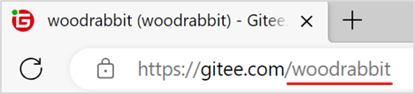
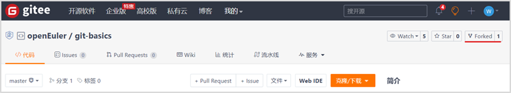
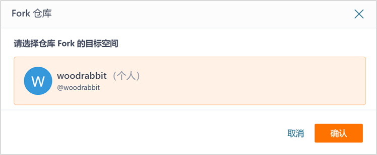
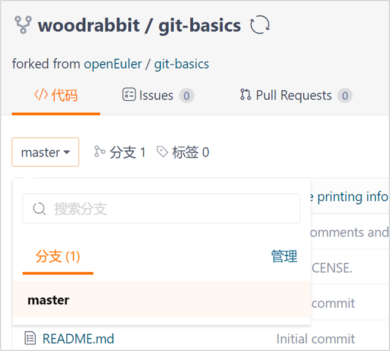
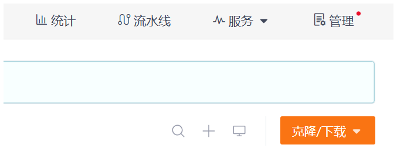
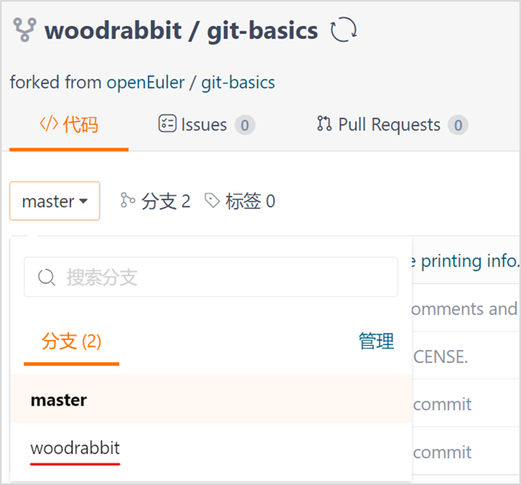
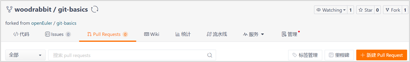
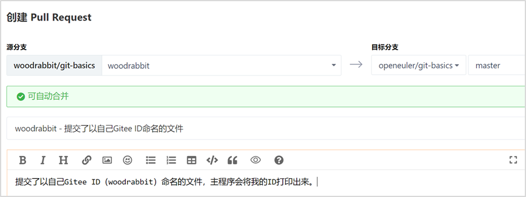
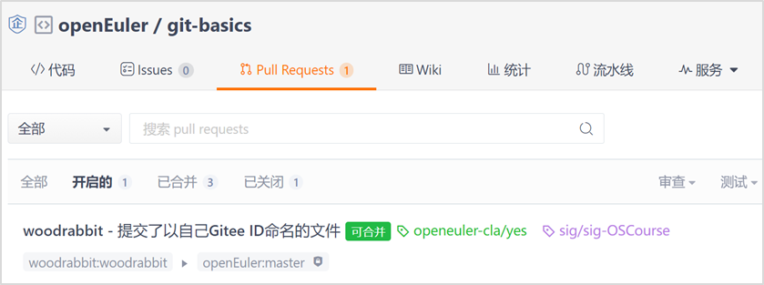
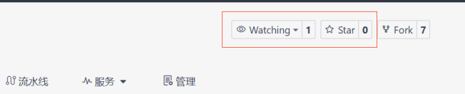

# openEuler开源社区入门经验分享

## 目录

1. [初识openEuler](#初识openeuler)
2. [开发环境准备](#开发环境准备)
3. [贡献路线](#贡献路线)
4. [其他经验](#其他经验)
5. [结语](#结语)

---

## 初识openEuler

openEuler是一个开放、可持续发展的开源操作系统项目。它鼓励全球开发者共同参与，通过代码提交、问题报告、文档编写等方式，共同推动项目的发展。对于像我这样的新手来说，这是一个学习和成长的绝佳平台。

---

## 开发环境准备

### 1. 准备Gitee账号

Gitee是一个代码托管平台，类似于GitHub。我在这里创建了账号，并签署了个人CLA（Contributor License Agreement），这是参与开源项目的必要步骤。

- 在Gitee官网注册Gitee账号：[https://gitee.com/](https://gitee.com/)


- 签署CLA的网址可前往openEuler官方网站查看：[标志 (osinfra.cn)](https://clasign.osinfra.cn/sign/gitee_openeuler-1611298811283968340/)

注：签署CLA的邮箱地址应与Gitee账号关联的“提交邮箱”地址保持一致。所谓Gitee ID即Gitee账号，可以在自己的“个人主页”的URL（Uniform Resource Locator）中查看，如下例所示：



提交邮箱可以在“设置 | 邮箱管理”中查看，如下例所示：


### 2. 安装Git工具

接下来，我安装了Git，这是一个版本控制系统，对于开源项目的贡献至关重要。访问Git官网[Git - Downloads (git-scm.com)](https://git-scm.com/downloads)按照提示在您的系统上安装git工具软件（保持默认安装即可）

  

### 3. 配置Git账号

为了让我的身份与我的Gitee账号关联，我配置了我的Git用户名和邮箱。这样，每当我提交代码时，我的信息就会被正确记录。

```bash
#用户名配置成Gitee账号
git config --global user.name "your-user-name"
#邮箱地址配置成该账号对应的提交邮箱（签署了CLA的邮箱）
git config --global user.email "your-email-address-on-gitee"
#检查配置后的结果,确认填写信息的正确性
git config –list
```

示例如下：

```bash
git config --global user.name "woodrabbit"
git config --global user.email "woodrabbit@qq.com"
git config –list
```

---

## 贡献路线

### 1. Fork上游仓库

我选择了一个感兴趣并有意向为之做贡献的仓库，将其fork到了我的Gitee账号下。这样，我就有权限在这个仓库上进行更改了。



- 点击仓库右上角的“fork”按钮即可fork。
- 本例fork到了一个叫woodrabbit的账号下（您应该fork到自己的账号下）:



- 完成后该仓库会出现在自己的主页下：



注：如果之前已经fork该代码仓又想要删除后重新fork，则可以先进入自己的代码仓，然后进入“Settings（设置）”页面，点击左侧导航栏的“Delete（删除）”链接，在确认操作后，要求对用户进行密码校验确认。校验密码后即可删除仓库。

在gitee页面上fork完毕后，下面的步骤在命令行窗口运行git命令。

### 2. Clone仓库到本地

我使用Git命令将fork后的仓库克隆到本地，这样我就可以开始工作了。

```bash
# 克隆远程仓库到本地
git clone <仓库的URL>
# 进入仓库目录
cd <仓库的本地路径>
# 查看当前分支和工作区状态
git status
```

注：在仓库界面中找到“克隆/下载”，点击可查看仓库的URL。



示例如下：

```bash
git clone https://gitee.com/woodrabbit/git-basics.git  
cd git-basics
git status
```

### 3. 创建新分支

在本地，我创建了一个新的分支，这是进行任何更改前的好习惯。它帮助我隔离开发环境，避免影响到主分支。

```bash
#创建并切换到一个新的分支（建议以自己的Gitee ID创建新的分支名）
git switch -c <自定义分支名>
#列出所有的本地分支，并且会标记出当前所在的分支。
git branch
#显示当前分支的状态
git status
```

示例如下：

```bash
git switch -c woodrabbit
git branch
git status
```

### 4. 创建并提交更改

我在仓库的工作目录中创建了一个以我Gitee ID命名的空文件，并将其添加到Git暂存区。然后，我提交了这个更改，并推送到了我的远端仓库。

```bash
# a) 进入操作的工作目录
#修改都在这个目录进行，不要修改这个目录下的其他文件
cd ./pr/primary/
# b) 以自己的Gitee ID为名建立空文件
cd . > woodrabbit
# c) 将此文件加入到git暂存区(用自己Gitee ID)
git add woodrabbit
# d) 进行commit(可修改记录)
git commit -s -m "Add woodrabbit"
# e) 推送到自己的远端仓库
git push --set-upstream origin woodrabbit
# f) 查看状态
git status
git log
```

注：（1）“cd .”表示改变当前目录为当前目录，等于没改变，故该操作不会有任何输出。将该输出重定向到一个文件，即创建了一个空文件。

（2）在这个过程中，您需要输入Gitee账号及其登录密码。

（3）在d)步骤中提到了commit的修改，它有多种修改规则，可以使得项目提交历史更简洁，现简单展示其中的“编辑”规则运用：

```bash
#修改历史中的某个特定提交，N 是你想要回溯的提交数量，按需修改
git rebase -i HEAD~N
#之后，编译器会自动打开，您可将需要修改的某一条提交记录前的“pick”改为“edit”，保存并关闭，Git 将停止在指定的提交上，让你进行修改
#修改完成后，若继续变基，输入下方命令
git rebase --continue
#重复上述过程，直至修改完毕
#如已修改完毕，输入以下命令，结束变基
git rebase --abort
```

（4） 如果后续还有commit要推送到远端仓库的话，e) 步骤的命令直接用“git push”就行了。

### 5. 提交PR（Pull Request）

我将我的更改推送到了远端仓库后，创建了一个Pull Request。这是一个请求，希望项目维护者将我的更改合并到主分支。我填写了标题和注释，详细说明了我的更改内容，具体步骤如下：

- 切换分支：

  推送到远程仓库之后，自己仓库的代远程码上就会出现自己新建的分支。

  

  鼠标点击这个分支就可以切换到这个分支。（本例是woodrabbit）

- 新建Pull Requests：

  点击“Pull Requests”→“新建Pull Request”



- 选择自己创建的分支提交PR



  （1）选中自己仓库的分支为刚才提交的分支（这里是从自己远端仓库的woodrabbit分支合并到上游仓库的master分支）。

  （2）并填写标题文字和注释（注释说明此次提交做了哪些改动）。

  （3）然后点击右下角的“Create（创建）”按钮。

  （4）提交成功后原仓库将会显示此次提交：

  

### 6. 等待审核结果

这时作为社区的一个contributor，您已经提交完毕。

- 自动测试：如果您提交的是代码，系统一般会自动进行test。
- 等待review：如果合规，社区committer会进行/lgtm动作。
- 最后确认：如果一切顺利，社区maintainer会进行/approve动作
- 认可贡献：以上完成后，您的代码/文档会被合并到上游仓库，表示已被认可。

---

## 其他经验

### 1. Watch（关注）

当你关注（Watch）一个项目时，你会收到关于项目的更新和动态的通知。这包括项目的问题、合并请求、新发布的版本等。这对于希望及时了解项目进展的人很有帮助。

### 2. Star（点赞）

点赞（Star）一个项目表示你对这个项目感兴趣或者支持它；点赞也可作为浏览他人仓库时的记号，让你可以稍后再找到感兴趣的项目。



点亮即为成功。

---

## 结语

通过这次openEuler开源社区的入门经验，我学到了很多关于开源贡献的知识。从注册账号到提交PR，每一步都是我成长的一部分。我希望我的经验能够帮助更多的新手加入到这个充满激情和创造力的开源世界中来。让我们一起为开源社区贡献自己的力量吧！

注：关于上述流程的具体命令及其含义可以参考以下文档进行了解：
[https://gitee.com/openeuler/community/blob/master/zh/contributors/Gitee-workflow.md](https://gitee.com/openeuler/community/blob/master/zh/contributors/Gitee-workflow.md)  
[https://gitee.com/openeuler/community/blob/master/en/sig-infrastructure/command.md](https://gitee.com/openeuler/community/blob/master/en/sig-infrastructure/command.md)

---
