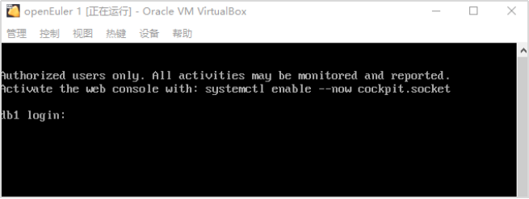

# 使用虚拟机镜像文件导入部署openEuler+openGauss实验指导

## 目录

- [实验简介](#实验简介)
- [实验环境说明](#实验环境说明)
  - [组网说明](#组网说明)
  - [设备介绍](#设备介绍)
- [实验步骤](#实验步骤)
  - [虚拟机VirtualBox下载及安装](#虚拟机virtualbox下载及安装)
  - [镜像文件导入及启动虚拟机](#镜像文件导入及启动虚拟机)
  - [数据库使用](#数据库使用)

## 实验简介

本手册主要描述如何将现有的Virtualbox+openEuler+openGauss镜像文件导入虚拟机，并启动使用openGauss数据库。

## 实验环境说明

### 组网说明

本实验环境为虚拟机VirtualBox 7.0.20、Windows 10 x86 64位操作系统。

本实验中使用的镜像文件(openEuler_openGauss.ova)配置为：openEuler 22.03-LTS + openGauss 5.0.1 

[镜像文件下载地址](https://opengauss.org/zh/download/archive/)

### 设备介绍

为了满足openGauss安装部署实验需要，建议每套实验环境采用以下配置：

| 软件名称 | 软件版本 | 操作系统 |
| --- | --- | --- |
| Windows 10 x86 64位 |  | Windows 10 x86 64位 |
| VirtualBox | 7.0.20 |  |

## 实验步骤

### 虚拟机VirtualBox下载及安装

进入[官方网站下载页面](https://www.virtualbox.org/wiki/Downloads)下载Windows版本的VirtualBox。


下载完成后，双击执行文件进行安装。下载后，本实验文件名为：VirtualBox-7.0.20-163906-Win，双击此执行文件进行安装，安装过程中存放地址可以根据自己想法去设置下，其他所有选项都可以默认，直接按下一步就行，最后安装成功。

### 镜像文件导入及启动虚拟机

#### 镜像文件导入

点击管理器上的“导入”功能。


进入如下界面：


选择镜像文件openEuler_openGauss.ova。然后点击“下一步”。选择好存放位置，然后点击“完成”继续。

镜像文件导入中，等待数分钟后导入完成。


#### 启动虚拟机

镜像导入完成后，在管理器上点击“启动”功能。


启动后具体如下：


在此界面，按下“Enter”键使系统继续启动，启动完成后要求输入用户名进行登录，具体如下：



输入登录用户名（root）及密码（openGauss@123）进行登录，具体如下：


虚拟机启动并登录成功。

#### root密码修改（可选）

```bash
[root@db1 ~]# passwd

Changing password for user root.

New password: 

Retype new password: 

passwd: all authentication tokens updated successfully.

[root@db1 ~]#
```

#### 确认网络

在Linux操作系统上，通过`ifconfig`来查看两张网卡是否都正常启动，具体命令如下：

```bash
[root@db1 ~]# ifconfig
```

导入安装完成。

### 数据库使用

本节描述使用数据库的基本操作。通过此节您可以完成创建数据库、创建表及向表中插入数据和查询表中数据等操作。（由于本实验是对openGauss数据库的基本使用，需要掌握openGauss数据库的基本操作和SQL语法，openGauss数据库支持SQL2003标准语法）

#### 操作步骤

为了操作方便，可以使用SSH工具（比如：PuTTY）从本地电脑通过配置enp0s3网卡的IP地址（如：192.168.56.106）来连接虚拟机，并使用root用户来登录。

1.以操作系统用户omm登录数据库主节点。

```bash
[root@db1 ~]# su - omm 
```

若不确定数据库主节点部署在哪台服务器，请确认连接信息。

2.启动服务。

启动服务命令：

```bash
[omm@db1 ~]$ gs_om -t start
```

结果显示如下：

```bash
Starting cluster.
=========================================
=========================================
Successfully started.
```

3.连接数据库。

```bash
[omm@db1 ~]$ gsql -d postgres -p 26000 -r 
```

当结果显示为如下信息，则表示连接成功。

```bash
gsql ((openGauss 5.0.1 build 33b035fd) compiled at 2023-12-15 19:51:49 commit 0 last mr  )
Non-SSL connection (SSL connection is recommended when requiring high-security)
Type "help" for help.


opengauss=# 
```

其中，postgres为openGauss安装完成后默认生成的数据库。初始可以连接到此数据库进行新数据库的创建。26000为数据库主节点的端口号，需根据openGauss的实际情况做替换，请确认连接信息获取。

说明：

使用数据库前，需先使用客户端程序或工具连接到数据库，然后就可以通过客户端程序或工具执行SQL来使用数据库了。

gsql是openGauss数据库提供的命令行方式的数据库连接工具。

4.连接数据库时，omm用户密码为：openGauss@123，可以先修改密码，比如新密码修改为openGauss@1234（建议用户自定义密码）。

```sql
opengauss=# alter role omm identified by 'openGauss@1234' replace 'openGauss@123';
```

当结果显示为如下信息，则表示修改成功。

```bash
ALTER ROLE
```

5.创建数据库用户。
默认只有openGauss安装时创建的管理员用户可以访问初始数据库，您还可以创建其他数据库用户帐号。

```sql
opengauss=# CREATE USER joe WITH PASSWORD "Bigdata@123"; 
```

当结果显示为如下信息，则表示创建成功。

```bash
CREATE ROLE 
```

如上创建了一个用户名为joe，密码为Bigdata@123的用户。

6.创建数据库。

```sql
opengauss=# CREATE DATABASE db_tpcc OWNER joe; 
```

当结果显示为如下信息，则表示创建成功。

```bash
CREATE DATABASE 
```

创建完db_tpcc数据库后，就可以按\q方法退出postgres数据库，使用新用户连接到此数据库执行接下来的创建表等操作。当然，也可以选择继续在默认的postgres数据库下做后续的体验。

退出postgres数据库。

```sql
opengauss=# \q
```

使用新用户连接到此数据库。

```bash
[omm@db1 ~]$ gsql -d db_tpcc -p 26000 -U joe -W Bigdata@123  -r
```

当结果显示为如下信息，则表示连接成功。

```bash
gsql ((openGauss 5.0.1 build 33b035fd) compiled at 2023-12-15 19:51:49 commit 0 last mr  )
Non-SSL connection (SSL connection is recommended when requiring high-security)
Type "help" for help.


db_tpcc=>
```

7.创建SCHEMA。

```sql
db_tpcc=> CREATE SCHEMA joe AUTHORIZATION joe; 
```

当结果显示为如下信息，则表示创建SCHEMA成功。

```bash
CREATE SCHEMA  
```

8.创建表。

创建一个名称为mytable，只有一列的表。字段名为firstcol，字段类型为integer。

```sql
db_tpcc=> CREATE TABLE mytable (firstcol int); 
CREATE TABLE
```

9.向表中插入数据。

```sql
db_tpcc=> INSERT INTO mytable values (100); 
```

当结果显示为如下信息，则表示插入数据成功。

```bash
INSERT 0 1   
```

查看表中数据。

```sql
db_tpcc=> SELECT * from mytable; 

 firstcol  
----------
       100
(1 row)
```

10.退出postgres数据库

```bash
opengauss=# \q
```

本实验结束。

注：关于上述流程的详细介绍和后续学习可参考：
[《数据库》使用虚拟机镜像文件导入部署openGauss指导手册](http://staff.ustc.edu.cn/~ypb/exp/openEuler-openGauss.pdf)
