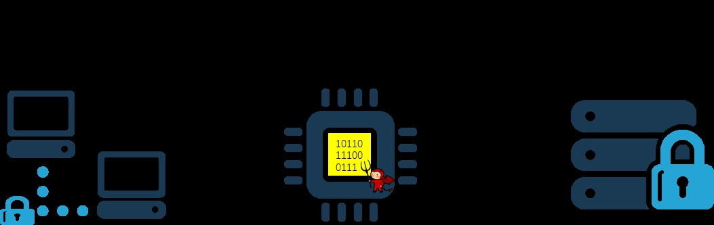
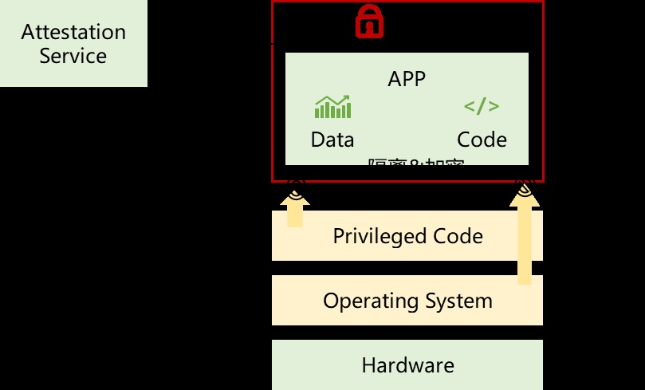
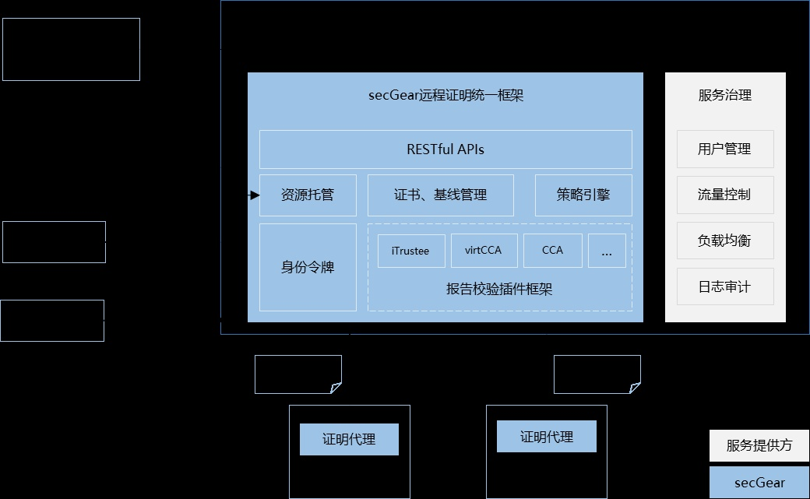
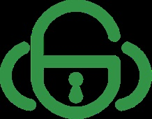
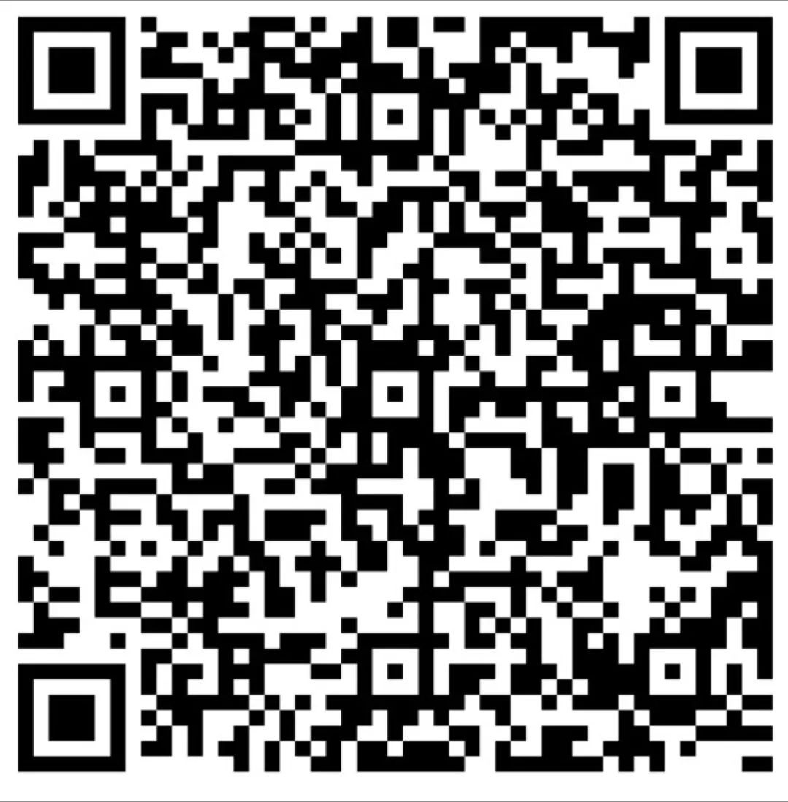
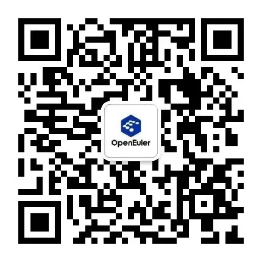

**背景**
--------

在数字化浪潮席卷全球的今天，随着云计算、大数据、人工智能等前沿技术的深度融合与广泛应用，数据已成为驱动数字经济及社会发展的关键生产要素。目前，全球多个国家和地区对数据安全与隐私保护给予高度关注，纷纷出台相关政策举措以确保数据的安全流通以及充分发挥数据价值。而诸如数据加解密等传统的数据安全技术主要集中在数据的传输和存储环节，偏向于静态数据的保护，难以解决数据在使用过程中面临的安全威胁，如图1所示。



图1 数据安全现状与威胁

面对这一严峻挑战，产业界迫切需要一种创新的技术解决方案，能够实现在保障数据高效流通与利用的同时，筑起坚不可摧的安全防线，保护处理中的数据的机密性和完整性。正是在这样的产业背景下，**机密计算技术应运而生，它以独特的理念与先进的技术架构，为数据安全领域带来了革命性的变革\[1\]。**

机密计算是一种在可信硬件基础上，通过隔离、加密、证明等机制，保护使用中数据安全的计算模式，其核心原理是利用受信任的硬件，构建出隔离、可加密、可证明的计算环境，保护计算过程中数据的机密性与完整性，从而实现在不受信任的算力环境中处理数据，如图2所示。机密计算技术实现了计算环境之内运行的代码和数据免于任何特权软件（包括操作系统和虚拟机监控器等）的窥探和修改，极大提高了使用中数据的安全性。**机密计算不仅为数据的可信流通和价值挖掘提供了有力保障，也为数字经济的发展注入了新的活力。**



图2 机密计算机制

随着2018年5月25日欧盟正式实施《通用数据保护条例》（GDPR），开启了数据安全与隐私保护的强监管时代，全球各国也纷纷推出了相关的法规，企业积极响应不断加大在数据安全的投入，加速了机密计算的应用落地。

**应用落地面临的挑战**
----------------------

目前业界存在多种机密计算技术，如Intel SGX/TDX、ARM Trustzone/CCA、AMD
SEV等。这些差异给机密计算的广泛应用带来了一系列挑战：

-   **开发和集成复杂性**：开发者需要针对不同的TEE技术分别进行适配和开发，增加了开发成本和时间。

-   **安全评估和验证难度**：多样的远程证明方式使得对整个系统的安全评估和验证变得异常复杂、难以确保整体的安全性。

-   **互联互通问题**：由于不同TEE的远程证明方案不兼容，导致在跨平台或多供应商环境中难以实现有效的交互和协同工作。

为了解决上述问题，统一远程证明成为了机密计算领域的重要诉求。

-   **简化开发和集成**：开发者可以使用统一的接口和规范进行开发，无需关注不同
    TEE 技术的差异，大大降低开发成本和复杂性。

-   **增强安全性**：统一的远程证明有助于建立更规范、更严格的安全标准和评估体系，提高整个机密计算生态系统的安全性。

-   **互联互通**：不同的 TEE
    技术能够在统一的远程证明框架下进行交互和协作，促进机密计算在更广泛的场景中应用。

综上所述，随着机密计算的不断发展和应用，解决 TEE 远程证明的差异，实现统一的远程证明，对于推动机密计算技术的广泛应用和保障数据安全具有重要的意义。

**secGear远程证明统一框架**
---------------------------

基于以上挑战和诉求，openEuler
机密计算SIG推出secGear远程证明统一框架，遵循RFC9334
RATS标准架构，兼容多TEE平台实现统一远程证明流程，简化证明服务的部署及证明代理的集成，并且支持快速扩展新的TEE平台插件，技术架构如图3所示。



图3 技术架构

### **关键功能组件**

-   **报告校验插件框架**：支持运行时兼容vritCCA/CCA等不同TEE平台证明报告检验，支持扩展新的TEE报告检验插件。

-   **证书基线管理**：支持对不同TEE类型的TCB/TA基线值管理及公钥证书管理，支持多版本基线管理，支持过期版本吊销等，集中部署到服务端。

-   **策略引擎**：支持OPA策略引擎，并提供默认策略（易用），支持用户定制策略（灵活）。

-   **身份令牌**：对不同TEE证明报告验证后，签发JWT格式身份令牌，由证明服务提供方签名背书，实现不同TEE之间通过身份令牌相互认证后，进行交互和协作。

-   **资源托管**：支持用户资源注入，基于证明报告及验证策略鉴权通过后获取托管资源。支持本地存储或对接第三方资源如KMS、OBS等。

-   **证明代理**：兼容TEE报告获取，身份令牌验证等，对接远程证明服务，易集成，使用户聚焦业务。

### **使用方法**

以OpenAtom openEuler（简称\"openEuler\"） 24.09为例，安装依赖包，一键部署证明服务，启动证明代理，运行样例程序请求证明代理，完成获取报告，验证报告，获取身份令牌并验证身份令牌，整体操作流程如下。

#### **环境依赖**

-   **硬件环境**：鲲鹏virtCCA。注意：attestation
    service不依赖硬件，attestation-agent收集TEE证明报告需依赖TEE硬件。

-   **操作系统**：openEuler
    24.09及以后版本。其他系统需源码编译attestation-service和attestation-agent\[2\]。

#### **安装依赖**


```
# 配置repo源
vim /etc/yum.repos.d/openEuler.repo
[everything]
name=everything
baseurl=https://repo.openeuler.org/openEuler-24.09/everything/aarch64/
enabled=1
gpgcheck=0

# 仅部署attestation-agent的环境需要
yum install virtCCA_sdk-devel secGear-aa

# 仅部署attestation-service的环境需要
yum install kunpengsecl-attester secGear-as
```


#### 一键部署证明服务

```
# 下载一键部署脚本
https://gitee.com/openeuler/secGear/blob/master/service/attestation/attestation-service/as_startup.sh

# 自动生成默认配置，在host上拉起attestation-service
./as_startup.sh

# 在容器中启动attestation-service，并指定监听ip和端口
./as_startup.sh -t docker -l 127.0.0.1:8080
```

#### 启动证明代理

```
# 配置证明服务的公钥证书
# 证明服务启动后，默认生成/etc/attestation/attestation-agent/as_cert.pem，将其拷贝到attestation-agent的部署环境的相同目录。
# 启动证明代理，对外提供RESTful API，默认监听127.0.0.1:8081
attestation-agent

# 也可以通过命令参数指定ip:port
attestation-agent -s 127.0.0.1:8081
```

#### 运行样例

本样例通过请求attestation-agent获取证明报告，验证证明报告，并得到身份令牌。

```
# 下载运行样例程序
git clone https://gitee.com/openeuler/secGear.git
cd service/attestation/attestation-agent
cargo run --bin aa-test
```


**应用场景**
------------

需要远程证明服务的场景：

-   TEE互联互通

-   机密容器解决方案

-   公有云实例的第三方认证

-   数据可信流通平台的监管

-   ......

**展望**
--------

### **技术发展**

-   **丰富生态**：扩展支持常见的TEE平台，如TDX、SEV等。

-   **异构环境**：随着AI快速的发展与普及，AI的数据安全也受到重视，远程证明服务应支持对异构机密计算环境（如GPU-TEE、NPU-TEE）提供证明，确保训练、推理过程中的安全、可信。

-   **国密算法**：远程证明流程中相关算法支持启用国密，与信创产业协同发展。

-   **性能提升**：未来有望通过优化算法和硬件支持，减少远程证明过程中的性能开销，让远程证明服务可以更高效地融入各类应用场景。

### **标准与规范**

-   **统一远程证明标准**：行业有望建立更加统一的远程证明标准，让不同的服务提供商和用户之间能够基于共同的规范来实施和接受远程证明。这有助于减少因标准差异导致的互信障碍，推动远程证明服务的广泛应用。

-   **监管合规推动**：随着数据安全相关法规的完善，监管机构可能会要求特定行业必须采用远程证明服务等安全措施，从政策层面推动其发展。

**加入我们**
------------



openEuler机密计算SIG\[3\]致力于提供简单、易用的机密计算软件栈及解决方案，降低机密计算的使用门槛，推动机密计算生态发展，并打造了**secGear机密计算软件及解决方案**的品牌。

-   **安全**：持续探索创新、追求数据"可用而不可见，使用可控、可计量"。

-   **易用**：以推动机密计算生态发展为己任，解决使能机密计算困难的痛点。

-   **开放**：SIG开放、软件开源、框架可扩展，屏蔽南向硬件差异，兼容北向应用生态。

欢迎感兴趣的朋友们参与到机密计算SIG，可以添加小助手微信或扫描微信群二维码。机密计算微信交流群添加小助手

**参考链接**
------------

1.  机密计算专业委员会：https://www.gccorg.com/article/230/201.html

2.  attestation-service和attestation-agent：https://gitee.com/openeuler/secGear/blob/master/service/attestation/README.md

3.  机密计算SIG：https://www.openeuler.org/zh/sig/sig-confidential-computing
