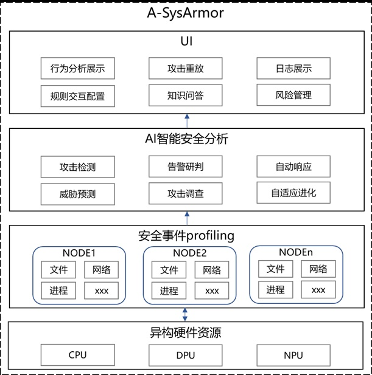

**背景介绍**
------------

APT攻击具有隐蔽、复杂、持续等特点，检测难度大。当前产业界一般采用基于规则和人工分析的失陷指标（Indicators
of
Compromise，IoC）检测方法，存在成本高、准确度低、可解释性差的局限，难以有效防御高级可持续威胁攻击。准确度低:
现有技术往往采用专家实现编写的静态规则，并形成失陷指标。这种专家编写的静态规则难以准确覆盖系统行为，产生误报和漏报。可解释性差:
现有技术只能对单个失陷指标进行简单汇总，缺乏对失陷指标代表的高层的攻击者行为语义的理解。其次，APT攻击一般是"组合拳"的形式，攻击者会采用多种攻击技术和手段，产生大量由相关性的失陷指标。现有技术无法将逻辑上具有关联关系的失陷指标联系起来，需要安全专家人工分析失陷指标的关联性。运营成本高：现有技术有着较高的硬件成本和人工成本，难以支撑大规模系统的部署。硬件上，当前虽然有部分技术利用机器学习来自动化攻击检测，然而由于系统事件的数据量大，机器学习技术需要消耗大量算力。从人工成本上看，由于现有技术准确度不高、可解释性不足，安全团队需要消耗大量人力来手动分析，加剧当前安全防御系统面临的告警疲劳现象。

**A-SysArmor：数据和知识双驱动的异构融合设计**
----------------------------------------------

针对当前技术局限，OpenAtom
openEuler（简称\"openEuler\"）社区项目A-SysArmor采用数据和知识双驱动的算法提高高级可持续威胁检测的准确性和可解释性，并采用异构融合设计的方法降低高级可持续威胁检测的资源成本。

项目地址：https://gitee.com/openeuler/A-SysArmor

> A-SysArmor技术框架

A-SysArmor主要包括三项关键突破：

（1）异构融合设计溯源数据采集：通过对系统软件进行优化，并充分利用CPU、DPU等异构硬件，实现低成本的实时系统安全事件采集和监控，降低监控的硬件开销；

（2）数据驱动的APT攻击检测：提出新一代图学习算法，支持在系统日志中挖掘和发现高级可持续威胁，降低误报率，提高算法分析吞吐量；

（3）知识驱动的APT攻击解释：基于语言模型，针对检测得到的存在APT攻击的部分溯源日志数据，理解APT攻击的攻击行为流程，分析APT攻击的危害域，给出合理的系统防御建议，生成可读的文本型攻击告警报告。

**APT攻击检测分析关键技术**
---------------------------

### **关键技术一：异构融合设计的溯源日志采集**

溯源日志记录系统的全部行为，包括正常用户和攻击者，是后续进行APT攻击检测和分析的基石。因此，如何进行完整全面的溯源日志采集是APT攻击检测分析的核心基点。然而，系统海量的日志生成速率和极为有限的安全分析资源之间的显示矛盾，导致Sysdig\[1\]等现有SOTA溯源日志采集方案难以在有限资源的情况下保证完整的溯源日志采集，对抗PDoS攻击。A-SysArmor设计了一套基于threadlet的采集框架，通过"谁产生谁处理"的核心解决思路，隔离不同进程生成的系统调用日志，实现了对溯源日志完整采集，抵御潜在的PDoS攻击。为解决现有溯源日志采集框架存在客观的安全分析资源受限问题，A-SysArmor针对复杂计算任务下，超高日志生成速率场景，提出一种基于新型硬件（DPU）负载的解决方案。相比于传统方案（如HARDLOG\[2\]）监控log
sender的高CPU资源消耗，A-SysArmor提出了一种新的DPU辅助的"拉取式"架构，利用DPU主动且快速地将溯源日志数据从主机内存拉取到DPU内存中，无需涉及主机CPU，在提升采集效率的同时，也进一步消除了溯源日志采集框架与log
sender相关的潜在攻击面。

### **关键技术二：数据驱动的APT攻击检测**

由于被保护系统无时无刻都在产生大量的系统溯源日志，而攻击者可能在任意时刻潜入并对系统产生危害，故而非实时的APT攻击检测系统难以处理实时的攻击，并可能造成潜在的漏报，而使得被保护系统严重受损。因此，实时性是也是评判一套APT攻击检测系统能否在实际场景中落地发挥作用的关键要点。此外，既有SOTA实时APT攻击检测系统，如UNICORN\[3\]、HOLMES\[4\]等，存在严重的告警误报现象。这种海量的告警结果要求大量的安全分析人力资源进行处理，这在现实场景中难以满足。因此，生成告警的准确性也是APT攻击检测的关键要点。A-SysArmor通过将攻击检测抽象为斯坦纳树构建模型，实现低资源成本的实时准确的APT攻击检测。具体来说，A-SysArmor将攻击检测任务中，严重耗费计算资源的恶意节点关联与探索问题，抽象为斯坦纳树构建问题。并提出了具有最优竞争比的优化斯坦纳树近似搜索策略，将计算复杂度降低到O(N)量级，实现低资源消耗的攻击行为发现。

### **关键技术三：知识驱动的APT攻击溯源分析**

现有商用和科研APT攻击分析工具生成的告警规模庞大，基于行为节点和完整溯源图的告警形式难以被用户直观理解。因此，在APT攻击分析场景中，存在着严重的分析资源和分析效率的矛盾，如何对攻击告警进行精确的APT攻击理解和展示，成为了APT攻击检测系统的关键需求。A-SysArmor基于威胁情报中的高质量攻击知识，构建APT攻击推理机，实现了在低资源消耗的情况下，辅助用户理解系统生成的告警，提升告警分析效率。具体而言，A-SysArmor开发了一套基于多源异构威胁情报的专用数据库，并设计了一种基于快速语义编码的高效的溯源日志攻击可能性查询算法，以生成带解释标签的交互式溯源图作为攻击告警，提升告警的精确性和可读性。进一步地，A-SysArmor利用大语言模型及思维链等优化技术，基于APT生命周期、杀伤链等领域知识，对上述攻击告警进行完整理解和错误匹配消除，并生成可读的文本型攻击报告。

**A-SysArmor实施效果**
----------------------

A-SysArmor在多个实验室场景和真实工业生产场景中进行了部署验证。结果表明，A-SysArmor能够在有限计算资源支持的情况下，实时准确的检测系统遭受的APT攻击。对于每个关键技术对应的系统组件，A-SysArmor分别实现：（1）溯源日志采集方面，相比现有SOTA工作，在确保低资源消耗前提下，实现完整的系统溯源日志采集；（2）APT攻击检测方面，实现实时的高精度APT攻击检测，节点级别的误报消减，相比于SOTA攻击下降约3个数量级；（3）APT攻击分析方面，达成了精确的APT告警理解，攻击行为语义标注正确率近九成，并高效生成涵盖完整攻击行为、对应防御手段的APT攻击报告。

**更多信息，欢迎加入我们深入探讨**
----------------------------------

openEuler社区异构融合SIG（SIG-Long）致力于构建智能基础设施异构融合计算框架，充分发挥不同硬件设备的优势，最大化满足不同应用负载的诉求，同时降低开发门槛和成本。欢迎感兴趣的朋友加入到异构融合SIG，共同探讨最新技术，可以添加小助手微信或扫描微信群二维码，入群讨论。欢迎您的围观和加入！异构融合微信交流群

添加小助手

**参考链接**
------------

> \[1\] Sysdig，https://sysdig.com/
>
> \[2\] Hardlog: Practical tamper-proof system auditing using a novel
> audit device，https://ieeexplore.ieee.org/document/9833745
>
> \[3\] Unicorn: Runtime Provenance-Based Detector for Advanced
> Persistent
> Threats，https://www.ndss-symposium.org/ndss-paper/unicorn-runtime-provenance-based-detector-for-advanced-persistent-threats/
>
> \[4\] HOLMES: Real-Time APT Detection through Correlation of
> Suspicious Information
> Flows，https://ieeexplore.ieee.org/document/8835390
