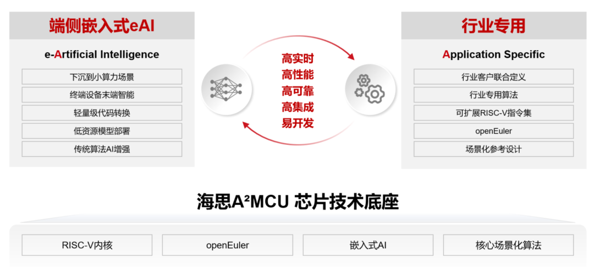
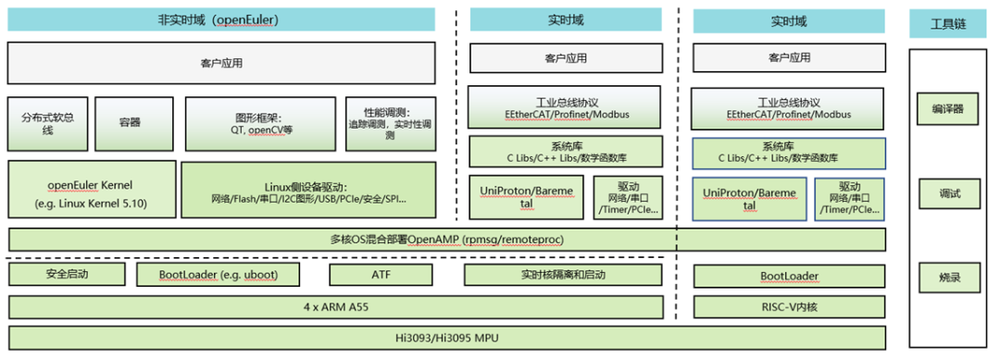

12月16日，在2023年openEuler峰会上，海思宣布了A²MCU和MPU全面支持openEuler。海思A²
是海思针对家电、能源、工业、汽车等领域推出的全新解决方案，它不仅涵盖了基于RISC-V的系列化的MCU，还包含了高性能兼容ARM指令集的MPU，以及与之紧密配合并优化的操作系统。

海思的A²代表的是两个A相乘，从而产生指数级累积效应；其中1个A（Application
Specific）代表行业专用，承载了海思以客户为中心，追求芯片设计和客户应用场景紧密结合的理念；另一个A（Artificial
Intelligence）代表AI技术在MCU以及嵌入式领域的应用。

由于认识到芯片和操作系统深度结合带来的价值，海思A²解决方案把从强调高实时性的MCU到需要高性能实时计算的MPU芯片全面和openEuler进行了深度的协调和优化，因而openEuler和基于openEuler的开源实时操作系统UniProton也成为了海思A²解决方案里重要的组成部分。**通过芯片和操作系统在底层的紧密配合，海思A²解决方案可以针对行业专用化场景进行更为深度定制和优化，从而挖掘出芯片全部的性能。比如针对工业控制场景通过对芯片与openEuler实时操作系统进行深度适配和优化，可以实现极致的工业级低延时和确定性。**

一般情况下，MCU为了保证任务的高实时性，业界现有方案大多不使用操作系统，但是这样由于没有基本的调度功能，导致MCU代码量一旦超过万行级别，写代码的复杂度和后续的维护难度会大幅上升。海思通过和openEuler的联合创新，通过在A²MCU和UniProton进行深度优化，开发出**可以在MCU有限资源上可以运行的UniProton+BareMetal（无OS裸跑）混合部署方案**，该方案对硬件资源的需求极低，最小4KB
RAM和4KB
Flash即可运行。通过该混合方案的部署，一方面保持了原有高实时性任务的优先级和实时性不受到影响，还可以直接运行在BareMetal环境；同时针对实时性要求不高的任务，可以通过调度器进行多线程的任务管理，提供了多线程管理能力，降低了开发者代码开发的复杂度，同时也可以帮助客户进行更便捷的后期维护、以及更方便的进行应用的修改和跨芯片移植。

针对高性能MPU，海思成功的实现了**基于openAMP（开放非对称多处理）的多操作系统框架混合部署**，基于该框架，客户可以在一颗MPU芯片上同时部署多个操作系统实例；比如将海思MPU的4个主处理器分成3+1两组，通过openAMP的双系统架构，客户可以把需要生态应用的openEuler非实时系统部署在其中的三个CPU核上，同时把UniProton实时操作系统部署到另外一个核；通过这种方式，客户可以用一颗芯片上同时实现原有方案中两颗芯片才能实现的功能，一方面帮助客户简化了系统架构，节省了成本，同时也极大的提升了系统的可靠性。**海思是业界首个支持openEuler
embedded同构、异构多核混合部署方案的芯片厂家。**

除了和操作系统的深度协同之外，海思A²解决方案还包含大量其它黑科技，比如资源需求极低到**可以在MCU上部署的轻量级嵌入式AI**、**针对行业应用的高阶算法**、以及可以**针对行业场景自定义指令集的RISC-V内核**等，通过这些技术方向上的探索和创新，海思A²解决方案在MCU以及嵌入式MPU等领域有独特的差异化优势。

目前海思A²MCU和MPU方案已经在多个行业场景进行了部署。比如在家电场景，海思MCU可以实现空调调温阶段节能16%。在工业运动控制场景，海思MPU芯片可以实现在125us运动周期控制下，把时间抖动控制在1us以内，从而帮助半导体、激光等领域场景实现更更快的任务处理和更高的确定性。

"中国的芯片创新可以为行业带来增值，做大产业空间，促进整个行业的良性发展。"海思MCU产品管理部部长李明表示，"海思A²的目标是在MCU和嵌入式MPU领域，通过和openEuler操作系统的深度优化，指令集定制化以及嵌入式AI等多个方面的创新和整合，助力客户实现AI时代的行业引领，带来更多创新和价值"。
