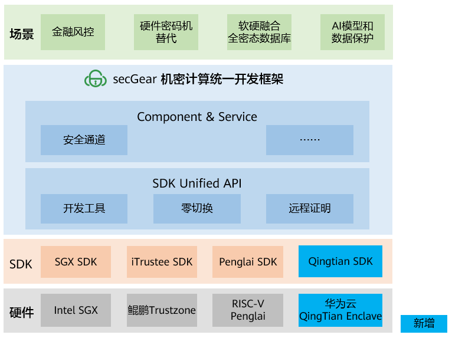
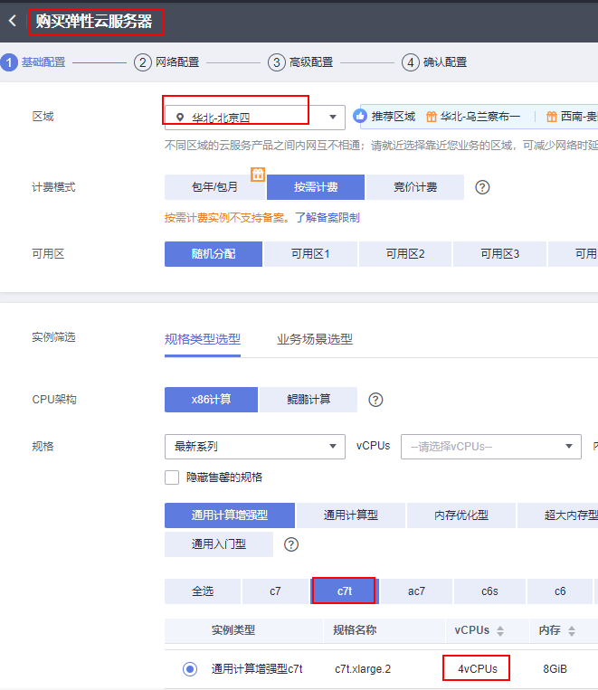
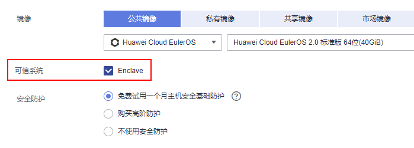
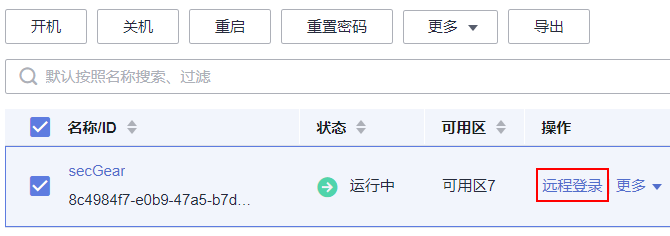

# 背景介绍

secGear[1] 是 openEuler 推出的机密计算统一开发框架，屏蔽 TEE SDK 差异，提供统一开发接口，实现不同架构共源码，已支持 Intel SGX、鲲鹏 Trustzone、RISC-V Penglai，新增支持华为云 QingTian Enclave。用户可在华为云上基于 secGear 开发、部署机密计算应用，帮助用户聚焦业务，降低开发成本，助力机密计算应用生态发展。



图 1. secGear 架构图

QingTian Enclave 是华为云推出的一种机密计算技术，是基于华为云 QingTian 架构部分虚拟机实例的一个高级安全特性，为客户提供了一个安全的、隔离的执行环境 。

# 体验尝鲜

## 环境准备

注意事项：

- 支持 QingTian Enclave 特性的弹性云服务器规格：**c7t** 。
- 支持 QingTian Enclave 特性的局点： 华东-上海一 、华北-北京四。
- QingTian Enclave 的默认配置为使用 1G 大页，具有 1G 内存，2vCPU。

### 购买弹性云服务器 ECS

登录华为云购买 ECS[2]。

#### 基础配置

注意：vCPUs 规格要选大于 2（因为 QingTian Enclave 默认就占用 2vCPU），否则不会显示启用 Enclave 特性选项。



图 2. 基础配置1



图 3. 基础配置2

#### 其他配置

网络配置、高级配置无特别要求，可按需配置，最后检查所有配置，确认无误后，点击购买。

### 登录 ECS

在弹性云服务器列表中选中购买实例，点击远程登录，选择适合的终端登录。
注意：如果购买 ECS 时选择按需计费，不用时请记得关机，减少费用。



图 4. 远程登录

### 安装 QingTian Enclave 软件栈

```shell
yum install qt-enclave-bootstrap virtio-qtbox qingtian-tool libqtsm docker
pip3 install docker knack

// 在配置文件（/etc/qingtian/enclave/qt-enclave-env.conf）中按需配置隔离参数，本教程内使用默认 1G 内存，2个 vCPU，然后启动隔离服务。
systemctl start qt-enclave-env
```

## 运行 Demo

### 获取 openeuler 容器镜像

QingTian Enclave 镜像文件提供了启动 QingTian Enclave 并在其中运行 QingTian Enclave 应用程序所需的系统信息，包括 Linux 操作系统、其他第三方库和 QingTian Enclave 应用程序，是由包含了用户应用程序的容器镜像，经过 QingTian 命令工具转换得来。本 Demo 以 openeuler-22.03-LTS 容器镜像为基础镜像，打包 QingTian Enclave 应用程序及其依赖库。

```shell
wget https://repo.huaweicloud.com/openeuler/openEuler-22.03-LTS/docker_img/update/2023-09-09/x86_64/openEuler-docker.x86_64.tar.xz

docker load --input openEuler-docker.x86_64.tar.xz

[root@openEuler]# docker image ls
REPOSITORY                TAG                 IMAGE ID            CREATED             SIZE
openeuler-22.03-lts       latest              3138523abc5f        2 months ago        190MB
```

### 安装secGear

```shell
# devel 包在 debuginfo 中，默认 repo 源中 debuginfo 未启用，修改为 enabled=1
vim /etc/yum.repos.d/hce.repo
[debuginfo]
name=HCE $releasever debuginfo
baseurl=http://repo.huaweicloud.com/hce/$releasever/debuginfo/$basearch/
enabled=1

yum install secGear-devel
```

### 下载 Demo

```shell
# 安装依赖
yum install git gcc-c++

git clone https://gitee.com/openeuler/secGear.git -b qt_dev
```

### 编译运行 Demo

```shell
# 编译 Demo
cd examples/helloworld/
mkdir build && cd build && cmake -DCC_QT=on .. && make

# 运行 Demo
./host/secgear_helloworld
```

# 应用开发步骤

Demo 目录结构如下，分为 REE 程序、TEE 程序、REE-TEE 交互头文件、其他（编译工程及配置文件）。

```shell
[root@openEuler helloworld]# tree
.
├── CMakeLists.txt
├── enclave
│   ├── CMakeLists.txt
│   ├── config_cloud.ini
│   ├── Dockerfile			// QingTian Enclave对应容器镜像Dockfile
│   ├── enclave.c			// QingTian Enclave中应用程序入口
│   ├── Enclave.config.xml
│   ├── Enclave.lds
│   ├── hello.c               // TEE (Trusted Execution Environment)中的程序（敏感数据处理函数）
│   └── manifest.txt
├── helloworld.edl			// REE-TEE交互头文件
└── host
    ├── CMakeLists.txt
    └── main.c				// REE（Rich Execution Environment）中程序
```

基于 Demo 工程，开发应用步骤：

- 识别敏感数据及处理程序，提取函数到独立文件 private_data_proc.c，放到 enclave 目录，适配编译工程。
- 将 private_data_proc.c 对外接口，添加到 helloworld.edl 文件中。
- 在 REE 侧 main.c 中调用 private_data_proc.c 的对外接口。

secGear 应用开发过程就是将敏感数据处理程序提取独立 lib 库，放到 TEE 中运行，REE 侧通过接口调用 TEE 侧 lib 库，secGear 屏蔽了不同平台下 REE-TEE 的调用细节，帮助用户聚焦业务，提升开发效率。

# 加入我们

Confidential Computing SIG[3] 致力于为用户提供简单、易用的软件栈及解决方案，降低机密计算的使用门槛，推动机密计算生态的发展。

当前 openEuler 社区 Confidential Computing SIG 对 secGear 的实现已经开源，可通过 gitee 源码仓地址访问[4]，也可以添加小助手微信，加入机密计算技术交流微信群。欢迎您的围观和加入！


# 参考

[1] secGear 介绍：https://www.openeuler.org/zh/other/projects/secgear/
[2] 购买 ECS 地址：https://console.huaweicloud.com/ecm/?region=cn-east-3#/ecs/createVm
[3] Confidential Computing SIG：https://www.openeuler.org/zh/sig/sig-detail/?name=sig-confidential-computing
[4] secGear gitee 源码仓：https://gitee.com/openeuler/secGear


