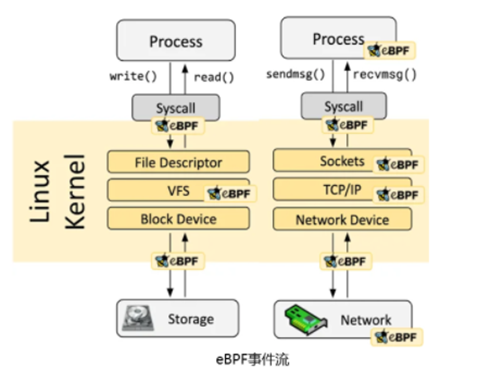

应用可观测性可以对企业运营产生的实际数据进行分析，可观测性将成为企业数据驱动决策的最强支撑。云原生时代的基础设施更复杂，也暴露出可观测性存在一些问题，包括基础设施观测能力不足，缺乏应用视角的基础设施观测数据等，这些都为下一代云原生可观测提供了机会与挑战。

**openEuler社区项目gala-gopher\[1\] 基于 eBPF
技术完成一系列全栈可观测实践工作。**

**eBPF及其对可观测的意义**
--------------------------

eBPF是一个能够在内核运行沙箱程序的技术，提供了一种在内核事件和用户程序事件发生时安全注入代码的机制，使得非内核开发人员也可以对内核进行控制。随着内核的发展，eBPF
逐步从最初的数据包过滤扩展到了网络、内核、安全、跟踪等。

**原理**：eBPF 由事件驱动，通过 Hook 方式在数据流中执行 eBPF 程序。Linux
内核中预定义了一系列常用的 Hook 点（用户态也有 uprobe、USDT 的动静态
Hook 点）。eBPF利用 Just-in-Time (JIT)
技术可以使eBPF代码的运行效率媲美内核原生代码和内核模块；Verification
机制可以保障eBPF 代码安全地运行，不会导致内核崩溃或进入死循环；eBPF
Helper机制使 eBPF代码可以访问内核、应用的运行态数据、状态。

**可观测性**：通过Hook内核、用户态程序，由数据流、系统事件等驱动 eBPF
沙箱内观测程序，可以灵活、按需的观测业务、系统状态，同时给可观测带来低负载、高安全、无侵入等技术特点。

**云原生场景运维带来的变化与挑战**
----------------------------------

云原生场景运维带来的变化与挑战：

-   **变化1**：虚拟化单一架构中"一刀切"分层运维（基础设施、应用分层）向云原生场景融合式运维发展，需要**提供全栈观测、运维能力**；

-   **变化2**：云原生多技术体系（Linux、CNCF
    等）、快速演进等特点，要求可观测性解决方案与其应用/基础设施技术栈解耦，提供**非侵入观测能力**；

-   **变化3**：云原生高密度、分布式部署方式，要求具备集群运维视角，从业务**集群视角**逐层/级定界、定位至具体问题根因。

云原生上述技术特征使得可观测能力的构筑**，天然应下沉至基础软件之内**，而
eBPF
技术在基础软件（尤其是内核）的可观测性方面尤为突出。因为其技术特征天然与云原生可观测要求完美吻合：

-   **无侵入**：通过 eBPF
    字节注入技术可以快速地进行可编程无侵入式观测逻辑注入，轻松应对云原生场景快速迭代的场景特征。

-   **可移植&跨平台**：通过标准eBPF ISA、CO-RE 等技术可以实现不同 Linux
    版本、不同 ISA 架构、不同平台之间兼容相同 eBPF
    Program，可以轻松应对云原生场景中不同平台、系统混合部署的场景。

-   **全栈**：通过 eBPF + USDT、eBPF + Tracepoint、eBPF + kprobe
    等技术，可以覆盖内核、运行时、基础库等大部分基础软件，轻松应对云原生多语言、多网络协议、厚重软件栈的场景特征。

**业界洞察**
------------

可观测性在 K8S
场景逐渐重要，2023年云原生报告显示\[2\]，云原生集群内辅助类应用工作负载上升至
63%，其中近 80% 的企业部署可观测性方案（同比增长 29%）。

下面介绍几款业界较成熟的云原生运维系统：

### **Deepflow**

以网络为中心展开云原生场景运维工作，围绕 eBPF
构建可观测技术，在此基础上构建四大能力特性\[3\]：

-   **Universal Map**：非侵入方式实时构建集群拓扑，全链路时延观测。

-   **Continuous Profiling**：在线持续性代码性能剖析能力。

-   **Distributed
    Tracing**：非侵入全链路分布式跟踪，覆盖ServiceMesh、数据库、DNS、NIC
    等基础设施。

-   **无缝集成**：数据存储可以无缝与Prometheus、Skywalking
    等生态软件对接；数据采集侧可以无缝接入生态采集探针（OLTP等）；观测数据携带
    K8S、VPC等云平台上下文信息。

### **Pixie**

### Pixie 围绕 Kubernetes应用程序可观测性工具\[4\]，基于 eBPF 技术构建，可以查看K8S集群运行状态（ServiceMap、集群资源、应用流量），还可以深入查看更详细的视图（pod 状态、火焰图、单个应用请求）。主要特性包括：

-   **网络监控**：K8S集群内网络流量监控，DNS
监控，TCP质量监控（丢包、重传、拥塞等）。

-   **基础设施监控**：Pod、Node、Namespace
等不同维度的资源（CPU、内存、网络、存储等）监控。

-   **Service Performance**：K8S Service 拓扑构建，Service 性能（覆盖
HTTP1.X，PGSQL，gRPC，Redis 等）监控，性能包括时延、吞吐量、错误率等。

-  **应用性能Profiling**应用性能持续性能剖析，支持多语言栈的性能火焰图分析能力。

-  **中间件监控（DB、Kafka 等）**：提供中间件关键数据流的观测能力，包括 DB
访问过程的观测，Kafka topic 生产/消费过程的观测等。

**eBPF的局限性及解决方案**
--------------------------

在一些有独立运行时的高级语言场景中（尤其是 java），eBPF
的可观测性存在一些局限性，主要表现在：

-   加密流（由JSSE 类库完成加减密）的可观测无法通过 eBPF + uprobe
方式完成观测，导致无法完成加密场景的网络可观测；

-  语言堆栈信息不完整，比如无法有效获取JVM
堆内的软件栈信息，导致在性能Profiling时，堆栈信息不完整，不利于问题定位。

-   解决方案：针对java场景的特殊性，结合java agent +
eBPF技术，综合完成非侵入的可观测能力。例如 java 应用性能 Profiling
的解决思路如下：

**openEuler的实践情况介绍**
---------------------------

openEuler社区项目gala-gopher\[1\]围绕eBPF
技术，并充分考虑多种观测技术的结合，采取探针式架构，通过集成探针快速构建观测能力，其观测全景图如下：

### **关键特性**

-   **探针框架：**：提供 eBPF
探针框架，负责管理探针生命周期，以及探针任务管理、数据上报等工作。

-   **性能观测：**：以火焰图、timeline
图表形式辅助定位应用/系统的内存泄漏、死锁、CPU 调度等疑难故障。

-   **应用观测：**提供进程粒度全栈性能观测能力，覆盖应用、容器、基础库/中间件、内核等。

-   **网络流量观测：**提供云原生场景全流程跟踪能力，具备网络流拓扑构建能力（覆盖各种云原生网络场景），提供L4、L7
层流量各种指标采集能力。

### **架构及关键技术特征**

-   **扩展性**：探针式架构，按需开启采集范围&能力，亦可快速对接第三方探针。

-   **非侵入&多语言**：应用/容器镜像零修改，无需重启；支持对多语言应用的观测，覆盖C/C++、Go、Java、Python
    等主流语言。

-   **生态**：支持OpenTelemetry生态接口，支持对接多种开源运维软件（Prometheus、ES等）。

-   **丰富的上下文**：提供自动化标签能力，所有数据数据应用标签（进程信息、容器信息等）、Node
    标签（IP、Machine ID等）、K8S 标签（POD 信息、Namespace 信息）等。

详细能力可以参考社区文档\[5\]。

**相关链接**
------------

\[1\]gala-gopher gitee
源码仓：https://gitee.com/openeuler/gala-gopher\
[2\] 2023年云原生报告：https://www.dynatrace.com/news/blog/kubernetes-in-the-wild-2023/\
[3\]
Deepflow
介绍：https://deepflow.io/blog/zh/036-ebpf-the-key-technology-to-observability-zh/\
[4\]
Pixie
介绍：https://docs.px.dev/about-pixie/what-is-pixie/\
[5\]gala-gopher
详细能力介绍：https://gitee.com/openeuler/gala-docs/blob/master/demo/A-Ops%E5%8F%AF%E8%A7%82%E6%B5%8B%E8%83%BD%E5%8A%9B%EF%BC%88gala-gopher%EF%BC%89%E4%BB%8B%E7%BB%8D%EF%BC%8823.12%EF%BC%89.pdf

**欢迎加入**
------------

欢迎感兴趣的朋友们参与到 openEuler eBPF
SIG，探讨 eBPF 领域技术，也可以添加小助手微信，加入 gala-gopher交流微信群。欢迎您的围观和加入！

扫码添加小助手
