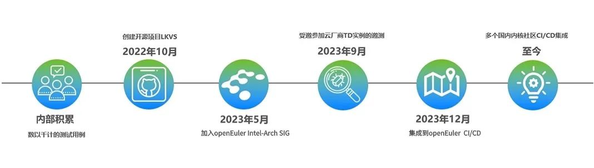
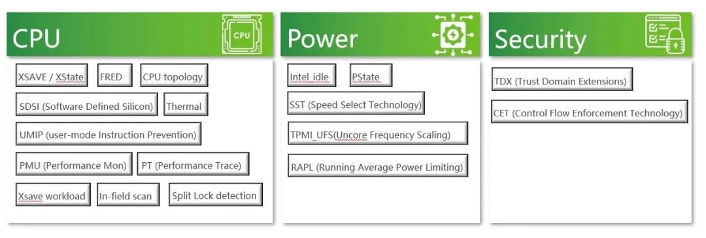
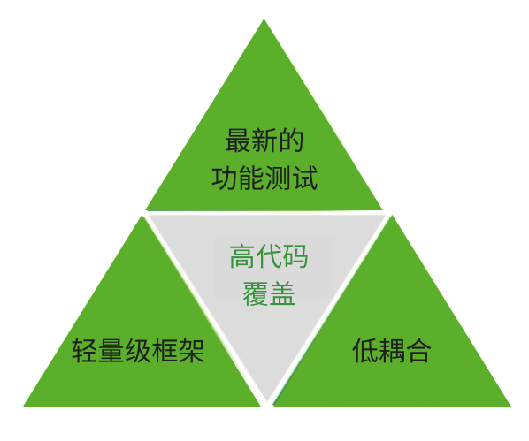
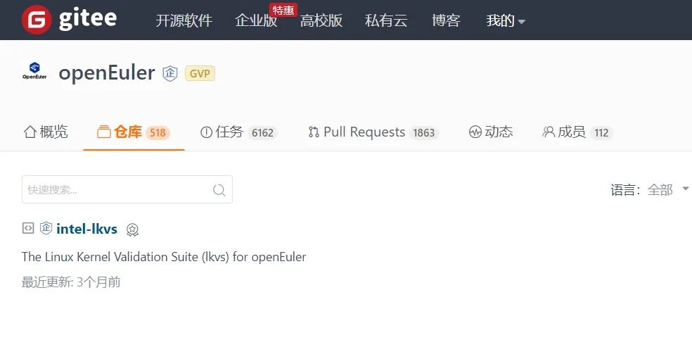

**LKVS 介绍**
=======================================
Linux内核验证套件(LKVS)是英特尔内核组开发的一款面向Linux内核测试的综合测试工具集。**目前已在openEuler社区开源**。**它汇聚了英特尔内核开发和验证团队多年积累的专业知识，具有专业性轻量级、低耦合、高覆盖三大特点，可广泛应用于Linux系统开发和验证的多个场景。**

**高覆盖测试内容**
=======================================
**●  全面测试范围**

LKVS集成了600余项测试用例，覆盖Linux内核的20余项关键特性，测试领域涉及CPU特性、电源管理和安全特性等方面。具体来说包括这些英特尔平台的功能：

CET(Control flow Enhancement Technology)，cstate，Intel\_TH(Trace
Hub)，Intel\_PT，UMIP(User-Mode Instruction Prevention)，xsave，IFS(In
Field Scan)，FRED (in
progress)，guest-test，IFS，ISST，PMU，RAPL，SDSI，splitlock，tdx-compliance，thermal，CPU
topology，UFS，AMX。

**●  深入测试覆盖**

测试内容高度专业，紧跟英特尔当下开发中的新平台、新功能，能够有效覆盖到关键内核路径和硬件集成细节，挖掘异常并提高稳定性。

**●  持续扩展测试**

LKVS套件从上线开始，就不断在迭代更新中。通过涵盖广泛的专业测试内容，LKVS能够有效保证Linux环境在英特尔平台上的健壮性，发现新的或者留存的隐患和异常。

**灵活解耦的测试框架**
=======================================
**●  解耦组件设计**

LKVS是从大量内部功能测试、回滚测试框架中解耦并独立出来的测试用例。最大程度降低了测试用例的耦合度，使得测试用例更易于移植和扩展。可以方便地集成至各类基础设施比如openEuler社区的EulerPipeLine（CI/CD）系统。

**●  多语言测试脚本**

测试套件支持C语言、bash、python等语言编写测试用例。因为各个功能测试之间相互独立，使得各个不同的功能测试之间零耦合，使其对开发者更友好，易于贡献测试用例。

通过这种可扩展可定制的低耦合架构，有利于LKVS的长期演进。

**丰富的场景应用**
=======================================
LKVS可广泛服务于以下关键场景:

**●  CI/CD集成检验**

自动化测试减少集成风险，提高质量管控水平;

**●  基线功能验证**

充分覆盖基线功能，成熟度评估;

**●  硬件兼容性**

验证最新硬件特性，避免兼容性问题;

**●  安全审计**

主动发掘和减轻安全隐患;

**●  回归测试**

定位修补程序和版本升级可能引入的问题。

**后续规划**
=======================================
本项目已开源在openEuler社区，并且已经集成到EulerPipeLine系统中，计划中的开发：

支持将要发布的新平台的新功能。

支持新的内核特性。

进一步完善框架本身，提高测试用例的可扩展性和可移植性。

完善虚拟机测试场景，多虚拟机测试场景。

LKVS是结合Linux
Kernel专业知识而产出的工程化测试集，可广泛应用于Linux系统开发和验证的多个场景。其专业性、低耦合和高覆盖等特点为生态中的众多参与方创造了价值。

欢迎访问和使用:

https://gitee.com/openeuler/intel-lkvs

