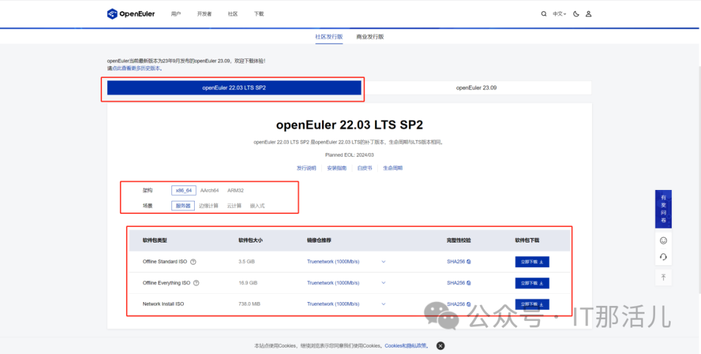

VMware作为一款广泛应用于企业和个人的虚拟化平台，在IT领域得到了广泛的认可。本文将为大家介绍VMware的基本使用方法，并分享如何使用它来安装openEuler操作系统。

openEuler是一个开源免费的Linux发行版系统，通过开放的社区形式与全球的开发者共同构建一个开放、多元和架构包容的软件生态体系。

**openEuler与centos的异同**
=========================

1.1  **相同**

都是基于linux内核开发的操作系统。

1.2  **不同**
    
    1）openEuler支持的架构非常多(ARM64, RISC-V、x86 和
    Kirschberry)，与之相对的，centos则只支持x86\_64、arm架构。
    
    2）openEuler注重全场景的生态与安全性，人工智能等领域的应用场景。而CentOS则更加关注系统稳定性和兼容性，提供了丰富的RHEL兼容性和支持。

    3）openEuler的核心定位是轻量高效的企业级操作系统。

**openEuler基础实验**
=========================
**使用VMware工具安装openEuler虚拟机。**

**2.1 环境**

-   虚拟化工具：VMware（16.1.2 build-17966106）

-   openEuler镜像：openEuler 22.03 LTS SP2

进入官网下载openEuler的ios镜像，需要选择版本，架构以及场景：https://www.openEuler.org/zh/download/?version=openEuler%2022.03%20LTS%20SP2

进入官网我们这里选择的是进入官网我们这里选择的是openEuler
22.03 LTS SP2并非最新版，这里用openEuler 22.03 LTS
SP2版本做演示，架构选择x86\_64，场景选服务器即可。

**2.2 VMware虚拟机配置**

下载完成镜像之后，那么好，让我们进入到VmWare来安装openEuler操作系统：

**1）配置类型**

-   典型：系统将自动给您配置，后续参数依然可以通过虚拟机设置更改；

-   自定义：全手动配置虚拟机。

**2）版本**这里我们选择16.x版本，优点是限制较少，但缺点也很明显，兼容的产品比较少：

-   版本越低，兼容版本越多，但限制也较多；

-   版本越高，兼容版本越少，与此同时限制也较少。

这里可以看到vmware6.0的兼容产品较多，但限制也较多。

**3）安装程序光盘**这里我们没有，暂时不管。

**4）安装程序光盘映像文件**选中后，VMware会自动检测当前常用镜像，这里需要手动选择刚刚下载好的iso镜像存放路径，暗光。选择后，会显示无法识别操作系统，故这里我们选择稍后安装操作系统（但是该方法也能够安装）。因为openEuler是由linux内核进行二次开发的，故我们这里可选择linux，版本可另选，这里我们选择centos的版本。为虚拟机增加名称，安装到指定的路径。这里我们给4核8g运存。

**5）网络配置**

-   **桥接网络**虚拟机使用物理机的ip，虚拟机可以通过该模式，访问外部网络，而外部网络也可访问到该虚拟机；

-   **使用网络地址转换(NAT模式)**在主机上新建一张网卡，与主机共享该网卡的网段，同样的，虚拟机可以访问外网，但是外网无法访问虚拟机；

-   **仅主机模式**物理机和虚拟机之间可以互相通信，但是虚拟机无法访问外网，虚拟机只能与同网段同局域网的其他机器通信（oepnstack私有云搭建也需要使用一张仅主机模式的网卡，用于虚拟机之间的内部通信）；

-   **不使用网络连接**宿主机与虚拟机之间无法进行通信，虚拟机也无法访问外网。

这里我们选择默认推荐的即可。

**6）磁盘**

-   **创建新磁盘**系统生成一个磁盘（新的）。

-   **使用现有虚拟磁盘**使用之前创建的磁盘（旧的），使用旧磁盘。

-   **指定磁盘容量**立即分配：虚拟机立即占用物理机1000g（物理：2t
    那么虚拟机：1000g）。存储为单个文件和存储为多个文件之间差别就是启动虚拟机的效率提供，但影响磁盘性能。

这样，一个虚拟机的模板就创建成功了，我们现在需要做的就是，给这个虚拟机指定iso镜像的路径。

勾选启动时连接。

#### **2.3 openEuler安装**

  

#### 语言：这里我们选择英文。

#### 分区：这里为了方便，我们选择自动分区即可。

如果手动（建议）：

-   /boot 300-500m（存放linux内核）；

-   swap: 运行内存的一到两倍；

-   /：剩下的可以都给根分区，如果有其他需求，后期可在openEuler。

**虚拟机中设置网络设置：**

-   DHCP：自动获取（更方便）；

-   manual：手动输入，自行配置ip（有特定需求时可通过手动，比如，实验环境：设置ip：为xxx.xxx.xxx.xx1、xxx.xxx.xxx.xx2、xxx.xxx.xxx.xx3等）。

**安装方式：**

这里选择最小化安装（后续可通过命令行来安装dde桌面）。**开启root登录：**

-   默认禁止root登录，需要创建一个用户，这里我们开启root登录。

-   这里我们只需要设置分区、网络、安装方式、启用root这四项，其他可不管。

然后完成安装：

**重启系统：**

登录进去openEuler：

至此，openEuler安装完成。

**openEuler图形化界面安装（命令行）**

**3.1 检查网络连通性**

ping baidu.com

**3.2 更新yum中的软件包**

sudo yum -y update

**3.3 安装中文字体**

以防后面出现乱码错误：

sudo yum -y groupinstall fonts

}**3.4 安装深度桌面**

sudo yum -y install dde

**总结**

通过此次实验，我们了解VMware的基本使用方法，以及如何使用VMware工具安装openEuler虚拟机，谢谢阅读，期待下次分享！！！
