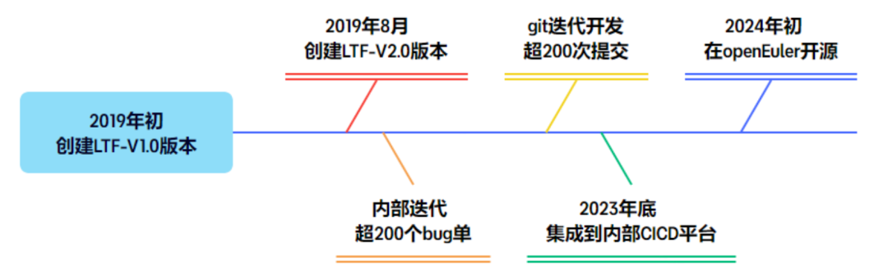
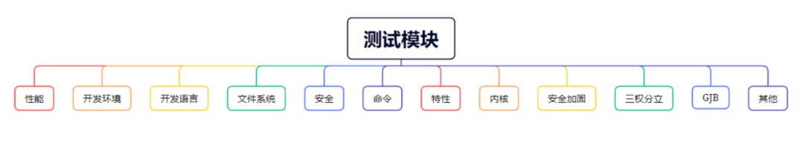
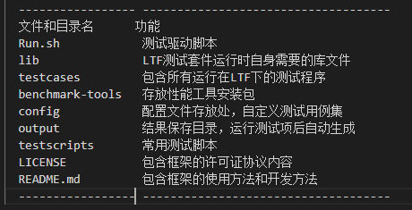
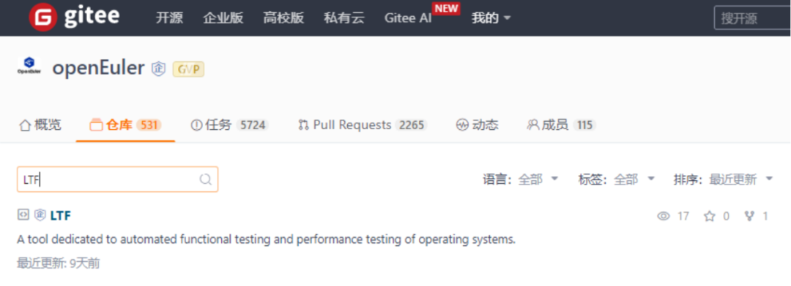

**LTF 介绍**

**LTF（Linux Test
Framework）是麒麟信安自动化组开发的一款面向Linux操作系统测试的自动化测试框架，目前已在openEuler社区开源**。LTF工具积极投入国内各评测项目和日常版本测试任务中，汲取了在Linux自动化测试领域的经验，**具有高覆盖、低耦合、轻量级三大特点**，能够全面满足不同场景的测试需求。

**高覆盖测试内容**
---

**●  全面自动化覆盖**

目前，LTF集成了共267条测试用例，覆盖12个测试模块，涉及命令、安全、性能、内核等方面。已有的自动化测试用例已基本覆盖国内各评测大纲测试项和Linux常用模块，同时LTF提供了丰富的API接口，方便开发者快速开发自动化用例。

**●  持续扩展覆盖**

LTF从创建V1.0版本开始，就不断在迭代更新中，紧跟Linux操作系统最新的测试动态，它能够深入覆盖关键测试模块，确保Linux操作系统在持续发展中保持稳定性。

**低耦合测试框架**

**● 低耦合灵活测试**

LTF的各个测试模块能够相互独立地运行，有效减少了模块之间的依赖关系。这不仅增强了测试的灵活性，使得测试人员可以根据需要灵活组合和选择测试模块，还提高了测试的可维护性，降低了测试代码的复杂性和出错率。

**● 低耦合源码易管理**

LTF的源码目录结构清晰明了，为开发者和测试人员提供了便捷的导航和访问方式。通过合理的目录划分和命名，LTF的源码能够被高效地组织和管理，使得开发人员能够快速地定位和理解代码的各个部分。

● 低耦合专注测试

LTF的测试用例被集中存放于testcases目录，此举实现了测试用例与代码其他部分的清晰隔离，有效降低了耦合度。这样，测试人员可以更加专注于测试工作本身，无需深入探究代码的实现细节。同时，这种设计也使得测试用例更易于移植和扩展，能够更便捷地集成到第三方测试平台或CICD平台中，提高了测试的灵活性和效率。

**轻量级特性**
---

**● 跨平台轻量测试**LTF使用Shell
进行开发，支持在bash或dash不同环境下测试，不依赖于特定的Python版本，无需任何环境配置即可在不同体系架构不同Linux版本上运行，真正做到开箱即用，为国内各评测项目和日常版本测试提供高效的测试手段。**● 跨界面轻量测试**LTF框架支持在Linux操作系统的图形和tty非图形界面进行测试以及查看结果。**● 无干扰轻量测试**1、测试前，不需要安装卸载任何额外软件包，即可立即测试2、测试过程中，不会删除或清空或者修改任何系统日志，不会安装卸载任何软件包3、测试过程中，异常中止，也会清空所有的测试项，避免后续测试问题4、测试完成后，会清空所有的测试项5、测试完成后，可以直接在本机查看结果，不需要图形或者安装额外软件

**后续规划**
---

LTF框架已在openEuler社区开源，为更多开发者和测试人员提供了便捷高效的测试手段。针对LTF的未来发展，我们制定了如下开发规划：\
**● 持续优化LTF的测试用例库**1、定期收集与整理需求2、开发新测试用例3、更新与维护**● 提升LTF的自动化测试能力**1、引入自动化测试技术，如持续集成/持续部署（CI/CD）2、增强与其他测试平台的集成**● 关注LTF的稳定性提升**1、代码优化与重构2、稳定性测试与验证通过以上具体实现路径，我们将逐步推进LTF的后续规划，不断提升其测试能力、自动化水平和稳定性，为openEuler社区及更广泛的开源生态贡献更多价值。欢迎您访问并使用LTF工具，点击文末阅读原文，或者复制链接到浏览器即可访问LTF
仓库：https://gitee.com/openeuler/LTF

