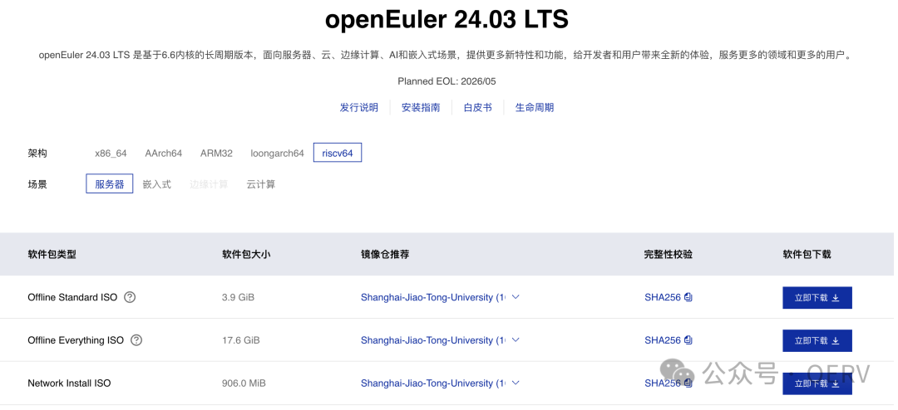
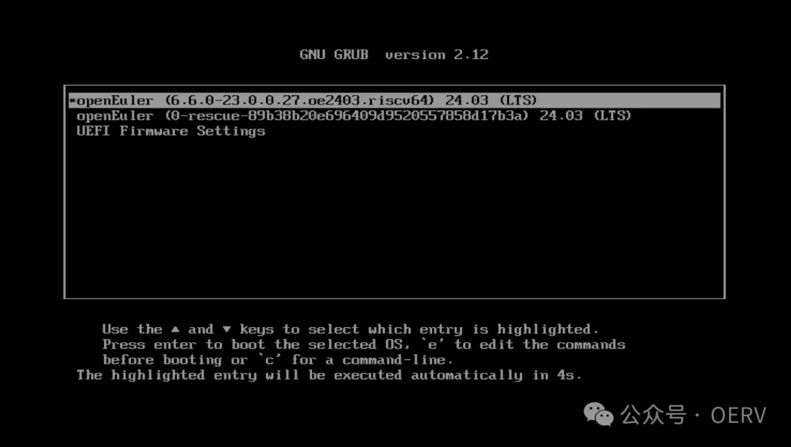
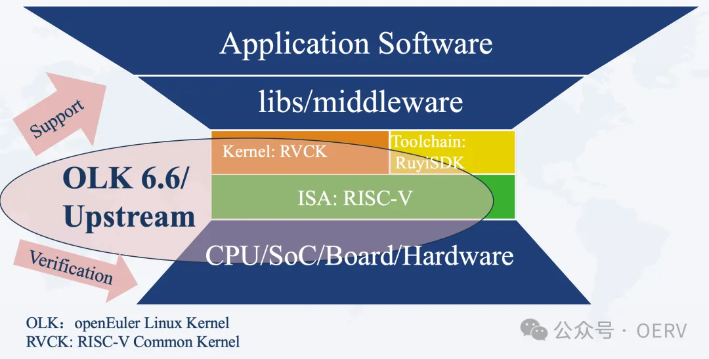
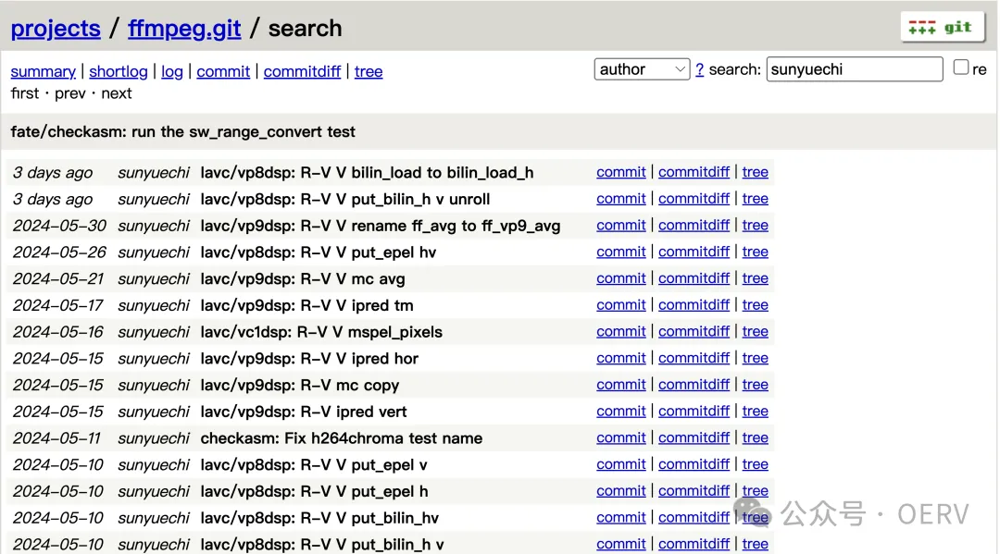

6 月6 日，openEuler 24.03 LTS 版本正式发布，首次实现 x86/ARM/RISC-V
版本的同源构建，成为全球首个支持 RISC-V 架构的长周期维护版本。在 24.03
版本中，RISC-V 首次追平 x86 与 ARM 发版范围，实现了官方软件仓"
Everything + Epol "的全量覆盖。自 2023 年底 openEuler 24.03 LTS
版本发布计划\[1\]公开以来，中国科学院软件研究所智能软件研究中心 OERV
团队结合当前 RISC-V
发展现状与生态需求，制定了"面向服务器场景，为开发者提供稳定的 RISC-V
本地编译构建环境，大幅提高 RISC-V 操作系统的编译构建速度"
的版本目标。并为此开展了大量协同与创新工作，包括设计基于 RISC-V
服务器、Docker 与 QEMU
的多级构建机调度器；优化多个大型软件包的构建内存与线程分配策略；并在
Infra、 OS-Builder 、QA 、Release 等 SIGs
的大力支持下，解决了版本研发过程中流水线、构建、测试等方面的诸多问题，打造了从编译构建到测试发布的完整能力体系。

下载链接：https://www.openeuler.org/zh/download/?version=openEuler%2024.03%20LTS

**持续创新，多项成果 RISC-V 架构首发**

openEuler 24.03 LTS 面向 RISC-V 架构实现了 UEFI、热补丁、可信执行环境
TEE 等新特性支持。

在 UEFI 支持方面，OERV 团队完成了 EDK2 的适配调优，使 openEuler 成为
RISC-V 架构领域中首个支持硬件 UEFI 标准的社区发行版，为进一步推进 RISC-V
系统引导加载标准化和实现安全启动等特性奠定基础。在热补丁支持方面，团队基于社区原生项目
sysCare 实现了对 RISC-V 架构的支持，使 openEuler
成为全球首个支持热补丁特性的社区发行版。在可信执行环境支持方面，团队与上海交通大学合作，将蓬莱
TEE 解决方案以正式特性整合到 24.03 LTS
版本中，使其成为首个合入操作系统发行版的 RISC-V TEE 框架。蓬莱 TEE 利用
RISC-V 架构下的硬件安全机制，可为 openEuler RISC-V
面向安全通信、密钥保护、代码鉴权等高安全性要求应用提供保障。

针对 RISC-V
生态固有的碎片化问题，中国科学院软件研究所依托 openEuler 社区于 2024
年初发起了" RISC-V
内核同源计划"，旨在维护一套统一的操作系统软件版本基线。首要任务为围绕
openEuler Kernel 6.6 对齐 RISC-V 厂商 SDK 版本，建设 Kernel CI
等公共基础设施，保证 RISC-V
基础软件生态的统一。内核同源计划分为两个阶段：第一阶段完成 sdk 对齐
kernel 6.6 的主线回合工作；第二阶段完成 基于 olk 的 RISC-V
多硬件兼容性工作，继而合入 openEuler 主线。目前，OERV
团队已与算能、达摩院玄铁团队、奕斯伟和跃昉等多家主流 RISC-V
厂商达成合作，在社区初步建立了 RISC-V 内核同源规范，并围绕 24.03 LTS
版本展开了前期验证。当前已联合算能和玄铁团队完成了 SG2042 和 TH1520
的两阶段工作，并且合入主线，初步验证了内核同源计划的可行性。相关镜像已在官方下载界面的嵌入式场景下推送，预计在年底发布的
24.03 LTS SP1 版本中会集成更多 Kernel
同源成果。

值得一提的是，内核同源的衍生项目------第三方镜像工程也于同期启动，旨在为厂商打造定制优化的镜像版本，充分发掘
RISC-V 碎片化特性带来的优势。\
**Upstream，共建 RISC-V 基础能力**

在 24.03 LTS 版本的开发工程中，OERV 加强了 RISC-V
软件上游贡献，在包括音视频和虚拟化领域都加大了对上游软件的投入力度，以促进整个
RISC-V 软件生态与基础能力的发展提升。

OERV 主要针对 ffmpeg 的关键编解码器（包括
h264、h265、vp8、vp9 和 vvc）进行了深入的优化。特别对 vp8 和 vp9
实现了性能提升（2-16倍），并对最新支持的 vvc 解码器提交了首个优化
patch。同时 OERV 积极推动和加速 RISC-V
架构在虚拟化领域软件生态的建设。目前团队成功在 QEMU
上实现和验证了对 StratoVirt 的完整支持， 并正在积极扩展对其他
Hypervisors 如  KataContainers  的支持和探索。至此 OERV 已经做好了迎接
SG2380 和 JH8110
的软硬件生态的准备，争取打造最早全量支持向量拓展和硬件虚拟化的 RISC-V
发行版。\
**结语**OERV 团队将持续探索推进 RISC-V
生态建设，欢迎从芯片到应用的上下游厂商，围绕 openEuler
社区，共同打造稳定可靠的 RISC-V 系统基座，建设充满活力与生机的 RISC-V
生态。对 openEuler 与 RISC-V 感兴趣的伙伴们可以添加下面的微信，加入 OERV
开发社区，一起加速 openEuler RISC-V 的生态发展。**中科院软件所
王经纬**

**申请时请备注OERV**

\[1\]:https://gitee.com/openeuler/release-management/blob/master/openEuler-24.03-LTS/release-plan.md
