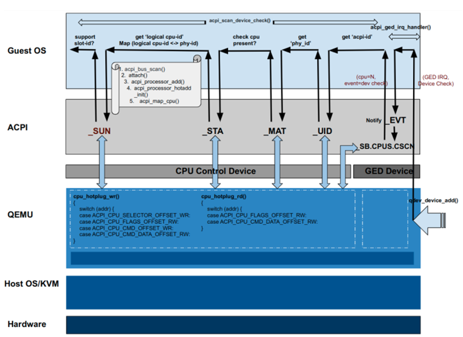

openEuler 社区引领技术浪潮，早在openEuler 20.09 创新版本就率先使能并对外开放了 AArch64 架构 vCPU 热插特性。时隔四年，openEuler 24.03 LTS 版本补充了 vCPU 热拔能力，vCPU 热插拔特性得到正式完整的支持，其更好地满足开发者对 vCPU 资源的弹性伸缩需求，进一步延伸了该特性的使用场景及价值。本文将带各位读者更深入了解 vCPU 热插拔技术的价值、AArch64 架构下 vCPU 热插拔特性演进历史及基本实现原理。

## 特性价值

vCPU 热插拔技术可以在虚拟机运行状态下增加或减少 vCPU 数量，实现不中断业务条件下动态调整vCPU 资源。

资源弹性是云计算的核心优势之一，而 vCPU 热插拔是实现 CPU 算力弹性的关键技术之一。其价值不限于：
1）加快虚拟机启动速度。特别对于轻量化场景收益较大。比如 Kata 安全容器初始只配置 1个 vCPU，等启动完成后热插更多 vCPU。
2）按需使用资源，从而优化业务成本。开发者根据业务负载需求，在线调整虚拟机 vCPU 数量。负载大时增加资源，负载小时减少资源。

## 来自AArch64架构的挑战

在 AArch64 架构下，支持 vCPU 热插拔面临来自架构规范、Guest 内核、KVM 各方面的挑战。

AArch64 体系结构缺乏对物理 CPU 热插拔的设计，使得虚拟化场景 CPU 热插拔的设计缺乏现实物理世界的依据。特别是中断控制器 GIC，其默认所有 CPU 在启动时都已存在，不能在系统启动后进行调整。

由于物理系统不支持 CPU 热插拔，ARM Linux 内核也一直缺乏对该能力的支持。如果要在虚拟化场景实现该特性，必须先完善 Linux 内核，使得当其作为 Guest 内核时能正常支持该特性。

另外还面临着来自 KVM 的挑战。KVM 不支持动态调整 vCPU 对象数量，即当虚拟机开始运行后，KVM 将拒绝操作目标虚拟机增加或减少 vCPU。

## 特性演进

面对以上挑战，虚拟化场景下 CPU 热插拔特性的进度较缓慢。最早的实现来自华为，于 2019 年和 2020 年分别向主线社区提交了 Guest 内核侧补丁[1]及 QEMU 侧补丁[2]，热插拔协议上参考了 x86 架构。但社区讨论认为 AArch64 架构暂时缺乏 CPU 热插拔相关规范，相关补丁不能先于规范合入主线。

此后华为和 ARM 公司深入合作，经过长期的努力，基本解决了不限于以上所述的挑战。2022 年，ACPI 6.5 规范发布，针对 AArch64 特殊的架构限制，在 MADT GICC 描述中加入了 ONLINE-CAPABLE 属性[3]，用于支持虚拟化场景下 CPU 热插拔。基于该最新规范，ARM 公司开发了 Guest 内核侧补丁[4]，华为开发了 QEMU 侧补丁[5]。相关补丁正在稳步推进，即将合入主线社区。

openEuler 社区完善并加固了以上补丁，在 openEuler 24.03 LTS 版本中提供了对该特性的稳定支持。

## 基本实现原理

**初始化流程：**为了应对来自体系结构和 KVM 架构的约束，QEMU 在创建具有热插能力的虚拟机时，必须为所有 vCPU 调用 KVM\_CREATE\_VCPU IOCTL 创建 KVM vCPU 对象，并为所有 vCPU 提前创建好 GIC irqs、GICR 和 GICC 等虚拟资源。但初始化时只需创建实际需要的 vCPU 线程，对于还未热插的 vCPU，其 vCPU 线程可以延迟到热插时再创建。

此外还涉及到两个关键的虚拟设备。CPU Control Device 负责管理整个vCPU热插拔的状态，GED Device 负责向 Guest 发送热插拔通知。Guest 内核通过虚拟 ACPI 表和 CPU Control Device 及GED 设备交互。相关的 ACPI 方法包括\_EVT、\_STA、\_MAT 等。

、
**图1** vCPU 热插流程

** 热插流程： **开发者通过 device\_add QMP 命令向 QEMU 发出 vCPU 热插请求。QEMU 解析命令，创建 vCPU 线程使之与初始化时提前创建的 KVM vCPU 对象相关联，然后调用 KVM 初始化vCPU 状态并运行。随后，QEMU 依照 ACPI 规范，修改当前热插 vCPU 的 \_STA 状态为 PRESENT 且 ENABLE ，操作 GED 设备发送中断给 Guest。Guest 响应中断，执行 ACPI 表中的 CSCN 方法获取到新插入的 vCPU 信息，最后通知内核 CPU 热插拔模块初始化该 CPU。

**图2** vCPU 热拔流程

**热拔流程：**开发者通过 device\_del QMP 命令向 QEMU 发出 vCPU 热拔请求。QEMU 解析QMP 命令，首先标记需要热拔 vCPU 为 removing 状态，然后通过 GED 设备向 Guest 发出中断。Guest 执行 ACPI CSCN 方法了解到需要拔出的 vCPU 编号，通知内核 CPU 热插拔模块清理下线该 CPU。完成之后，Guest 执行 \_EJ0 方法通知后端 QEMU 清理 vCPU 资源。QEMU 修改 vCPU 的 \_STA 状态为 PRESENT 且 DISABLE。

## 未来展望

如今资源在线伸缩已经成为了很多行业业务场景的关键需求，vCPU 热插拔特性将支撑 ARM 平台服务器打开更大云数据中心市场。未来 openEuler 社区将持续完善虚拟化技术生态，引领技术创新，打造高性能强安全轻量化虚拟化平台，为各行各业创造更大价值。

## 参考资料

[1] 2019 年华为公司提交的 AArch64 vCPU 热插拔 Guest 内核侧代码：https://lwn.net/Articles/792409/

[2] 2020 年华为公司提交的 AArch64 vCPU 热插拔 QEMU 侧代码：https://lore.kernel.org/qemu-devel/20200613213629.21984-2-salil.mehta@huawei.com/

[3] ACPI6.5 规范在 GICC flag 中新增“Online Capable”标志位：https://uefi.org/specs/ACPI/6.5/05_ACPI_Software_Programming_Model.html#gicc-cpu-interface-flags

[4] 2023 年 ARM 公司提交的 AArch64 vCPU 热插拔 Guest 内核侧代码：https://lore.kernel.org/lkml/20230203135043.409192-1-james.morse@arm.com/)

[5] 2023 年华为公司提交的 AArch64 vCPU 热插拔 QEMU 侧代码：https://lore.kernel.org/qemu-devel/20230926100436.28284-1-salil.mehta@huawei.com/

