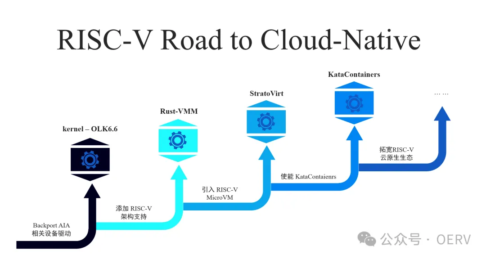

近日，OERV 的虚拟化小组(OERV-VIRT)与电信研究院联合完成了 RISC-V 架构对
StratoVirt 的支持与 Demo 演示，实现了一个以内核态 AIA
作为中断设备，挂载了块设备和串口设备的 RISC-V MicroVM。Stratovirt
相关工作标志着 Rust 虚拟化生态完成了支持 RISC-V
架构的基础组件工作，首次为 RISC-V 实现了使用 KVM 加速的 Rust
Hypervisor。

**基于 Stratovirt 的工作探索**

在对 StratoVirt 深入调研的基础上，虚拟化小组首先针对来自 rust-vmm
的关键依赖项 kvm-bindings 和 kvm-ioctls 引入了 RISC-V
的支持。这一步骤为相关工作提供了基础支持，使 RISC-V
环境下，StratoVirt 能够与 KVM 模块进行有效交互。接下来小组对 StratoVirt
的 20 个 Crate 中的 9 个主要模块进行了深入改进支持，以引入对 RISC-V
架构的支持，具体的支持包括了：

1.  为 util crate 补全了设备树生成过程中所需的 PHANDLE 常量定义，并针对
RISC-V 架构调整了 seccomp 的相应逻辑，为虚拟机的内核提供了安全屏障

1.  为machine\_manager crate 新增了支持 RISC-V MicroVM 主板和 StandardVM
Virt 主板的功能，使得用户可以根据需要选择不同的虚拟机板型

1.  migration crate 的改进包括为 RISC-V 特有的中断设备 AIA
添加了快照逻辑，使得这些设备在进行虚拟机迁移时能够保持状态一致性

1.  为 cpu crate 加入了管理 RISC-V vCPU
特性和状态所需的结构体和方法，提高了用户客制化 vCPU 的粒度

1.  为 acpi crate 加入了适用于 RISC-V 的 madt-subtable 定义，为 StandardVM
的工作提供了支撑

1.  在 devices crate 中加入和调整了适合 RISC-V 特有的 AIA
设备管理和操作接口，同时对 fwcfg 和 serial 等设备进行了必要的修改

1.  hypervisor crate 参考了 riscv64 平台上的 kvm.h 头文件定义，通过支持了
RISC-V 的 rust-vmm crates 实现了与 KVM 模块的交互接口

1.  为 bootloader crate 加入了根据 RISC-V image header
实现的内核快速加载逻辑，提高了启动效率

1.  为 machine crate 补全了 RISC-V MicroVM
的内存分布、设备树生成逻辑及其启动流程，这为虚拟机的运行提供了基本架构

1.  电信研究院基于用户态 PLIC 的工作为 StratoVirt 的 RISC-V
支持打下了基础，OERV 虚拟化小组进一步完成了基于 AIA
标准的相关工作，以支持性能更高，拓展性更强并且硬件资源利用率更高的
RISC-V 虚拟化场景，为即将到来的硬件虚拟化生态落地提供保障。相关改进在
StratoVirt v2.4.0 版本中得到实现，并最终构建了一个以内核态 AIA
作为中断设备、并挂载了块设备和串口设备的 RISC-V MicroVM。

系统成功在 StratoVirt 上构建并运行了 Linux 内核以及 busybox 构建的
rootfs，顺利实现了 MicroVM 的启动。此外，用户还可以通过访问 /proc
目录下的 cpuinfo 来查看 CPU 的扩展信息，并通过 device-tree/soc
目录验证虚拟机挂载的 AIA 中断设备的状态，确保其正确性和功能性。

**推动 Rust 虚拟化生态对 RISC-V 架构的支持**

完善 Rust 虚拟化生态对 RISC-V 架构的支持，无法绕开围绕 KataContainers
的相关工作，作为一个轻量级虚拟化容器解决方案，其运行依赖于底层虚拟机监控器的支持。StratoVirt
作为其中的一种 Hypervisor 实现，相关工作只是实现生态落地应用的一条路径。

目前市场缺乏带有 H 扩展和 AIA 的物理机，这使得构建 RISC-V
虚拟化设施的持续集成（CI）链路变得困难。这种环境的不足也影响了对
KataContainers 相关支持的验证工作。KataContainers 自带的 Dragonball
Hypervisor 面临类似问题，因为它依赖于尚未支持 RISC-V 的 kvm-bindings 和
kvm-ioctls。 

为了解决这些问题，OERV 虚拟化小组采取了多方面的措施。首先，小组为 
KataContainers 的 Go Runtime 提供了 RISC-V 架构的支持，使得
KataContainers 能够通过 QEMU 在 RISC-V 平台上启动容器。其次，小组拓展了
KataContainers 可选的 Hypervisor 选项，使得 StratoVirt
的相关工作可以利用  KataContainers 得以应用。同时，为了支持 Dragonball
Hypervisor，小组正在追踪和支持 rust-vmm 社区对 kvm-bindings 和
kvm-ioctls 对 RISC-V 架构的引入工作。此外，小组还在设计和验证 RISC-V
在虚拟化及云原生社区的 CI 链路的工作上投入了努力。

**下一步工作规划**

在上述工作的基础上，OERV 虚拟化小组为基于OpenAtom
openEuler（简称\"openEuler\"）社区，打造完善支持 RISC-V
虚拟化的云原生系统基座，将在未来加大投入 Rust 虚拟化生态在 RISC-V
方向的支持。之后的工作包括：

1.  为 OLK 6.6 Kernel 完全支持 RISC-V AIA 设备驱动

1.  继续使能 kym-bindings、kvm-ioctls 、acpi-tables 和 linux-loader对 RISC-V
架构的支持工作，完善 Rust 虚拟化的CI链路

1.  对标完成 StratoVirt 的 StandardVM 开发工作

1.  进一步对 Dragonball、Cloud-Hypervisor 和 Firecracker 等 Rust Hypervisors
引入 RISC-V 架构的支持，并且引入 openEuler 社区

**开发者说**

OERV-VIRT 小组由何若轻\[1\]组建，他对 Rust
虚拟化支持工作进行了方向性规划，并且是主要的代码贡献者。何若轻分享了他在
Rust 虚拟化生态与 RISC-V 建设的历程：

"我在 23 年的夏天加入中国科学院软件研究所举办的 OSPP
开源之夏，为 KataContainers 3.x
升级并调优了日志系统。课题导师用专业的指导把我领进了虚拟化的世界，也使我加强了对
Rust 语言的掌握。"

"起初 KataContainers 是用 Go
 语言实现的，顺应了云原生领域的语言趋势。但之后社区的精英们仍然决定不惜投入大量的时间和精力，用
Rust 语言重构 runtime；以及一众 Rust Hypervisors
 在开源社区中脱颖而出，无不说明了 Rust
 在虚拟化/云原生领域确有明显优势。Rust 优秀的生态加持（被广泛使用的
rust-vmm）库等，也为 Rust 在该领域的成功奠定了基础。"

"RISC-V 架构在指令集层面通过 H 扩展，Sxaia 扩展，以及 AIA
等，在不断地尝试为硬件辅助虚拟化提供更深层次的支持，以加速虚拟化软件栈的执行。我相信
 Stratovirt，Dragonball 等 Rust hypervisor，以及 KataContainers
一定能够在 RISC-V 架构上更大限度地挖掘自身的潜力和应用，RISC-V
 很快会在虚拟化/云原生领域拥有自己的一席之地。"

**结语**

OERV 将加大投入 Rust 虚拟化生态在 RISC-V 方向的支持，设计、验证、维护
RISC-V 在虚拟化/云原生社区的 CI 链路，进一步补全所有 Rust Hypervisors 对
RISC-V 架构的支持，增强 openEuler 在 RISC-V 与 虚拟化场景的基础能力。

我们预计随着 RISC-V 生态的发展，基于 Rust 的虚拟化项目会成为推动 RISC-V
硬件应用的关键因素。同时，即将到来的 RISC-V "H 时代" 也会成为 Rust
虚拟化生态发展的强大助力。对 openEuler RISC-V
生态建设感兴趣的伙伴们，可以添加下面的微信，加入我们 openEuler RISC-V
开发群聊做进一步了解。

**中科院软件所王经纬**

**申请时请备注 OERV**

\[1\]: 
何若轻，来自重庆理工大学，钢琴业余选手，沉迷计算机原著书籍，Rust
练习时长两年半，有自己的个人博客，技术宅星人，在虚拟化方向为 RISC-V
生态贡献中。
