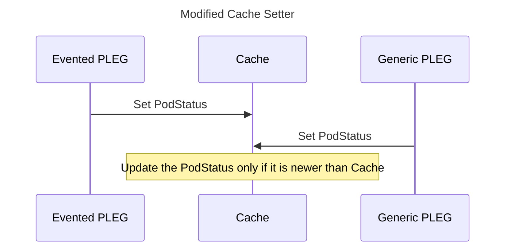
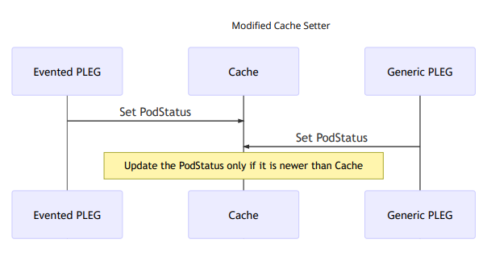
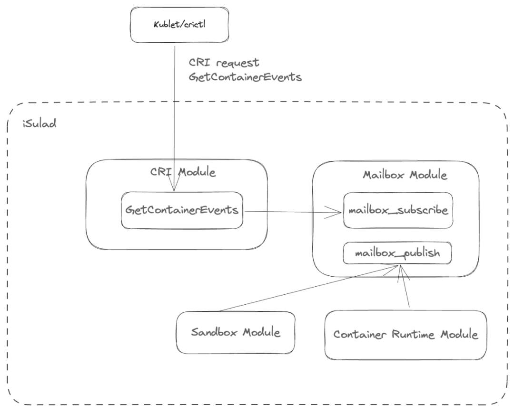

## 背景

容器技术在不断发展的过程中，已被广泛应用于多种场景。openEuler 社区容器引擎项目 [iSulad](https://gitee.com/openeuler/iSulad "iSulad")[1]面向 CT、IT 领域的不同需求而生，它具有轻量级、高性能的特点，可以在资源受限的环境中运行，如边缘计算和 IoT 场景，并始终在提高容器运行效率、降低容器运行底噪开销等问题上进行着不断地尝试与探索。

iSulad 向北支持 CRI 接口，对接 Kubernetes，并始终紧跟上游社区，提供最新的生态支持。

在 openEuler 23.09中，iSulad 引入[Sandbox语义](https://mp.weixin.qq.com/s?__biz=MzkyMjYzNjU0Ng==&mid=2247507591&idx=1&sn=267e5ec03dfbc311e76b882cd458ea29&source=41#wechat_redirect "iSulad Sandbox API：简化调用链，可靠性倍增")[2]用于支持Kuasar，用户能够使用 Sandbox API 管理沙箱，将沙箱管理与容器管理解耦，简化调用链，提高了容器引擎的性能和稳定性。

基于 Sandbox API，在 open Euler 24.03 LTS 中，iSulad开始提供对普通容器 CRI V1 接口的支持，并将 CRI 接口更新至[1.29](https://github.com/kubernetes/cri-api/tree/kubernetes-1.29.0 "CRI v1.29")[3]，为 iSulad 的性能提升提供了新的优化空间，而其中性能提升的关键特性就在于 EventedPLEG。

## Pod 生命周期管理事件

### 概述

Kubelet 作为每个节点的守护进程，在管理节点中的 Pod 时，需要获取所有容器的最新状态，PLEG(Pod Lifecycle Event Generator)负责为 Kubelet 生成容器运行时的 Pod 生命周期事件，从而执行相应控制逻辑并驱动Pod状态以匹配Pod规格。

### Generic PLEG

Kubelet 在1.26之前，会通过 Generic PLEG 定期查询容器运行时，调用 CRI 的 ListPodSandbox 和ListContainers 接口，获取 Pod 和容器的信息，更新到缓存中，并组装成事件发送至Kubelt的PLEG Channel。

然而随着 Pod 和容器数量的不断增加，轮询会产生不可忽略的开销，定期、并发、大量的请求会造成 CPU 利用率飙升，影响性能，并且可能会导致容器运行时不堪重负从而带来可靠性问题。

### Evented PLEG

为减少稳态状态下轮询造成的开销，[KEP-3386](https://github.com/kubernetes/enhancements/blob/master/keps/sig-node/3386-kubelet-evented-pleg/README.md "KEP-3386: Kubelet Evented PLEG for Better Performance")[4]提出 Evented PLEG，Kubelet 通过监听来自 CRI 实现的 gRPC 服务器流事件，试图减少容器在没有规格、状态变化时的不必要轮询工作。通过减少对容器状态的频繁轮询，降低 Kubelet、容器运行时稳态状态下的 CPU 利用率。

## Evented PLEG 解决方案

### 社区方案

```proto
service RuntimeService {
    ...
    // GetContainerEvents gets container events from the CRI runtime
    rpc GetContainerEvents(GetEventsRequest) returns (stream ContainerEventResponse) {}
}

message GetEventsRequest {}

message ContainerEventResponse {
    // ID of the container
    string container_id = 1;
    // Type of the container event
    ContainerEventType container_event_type = 2;
    // Creation timestamp of this event
    int64 created_at = 3;
    // Sandbox status
    PodSandboxStatus pod_sandbox_status = 4;
    // Container statuses
    repeated ContainerStatus containers_statuses = 5;
}

enum ContainerEventType {
    // Container created
    CONTAINER_CREATED_EVENT = 0;
    // Container started
    CONTAINER_STARTED_EVENT = 1;
    // Container stopped
    CONTAINER_STOPPED_EVENT = 2;
    // Container deleted
    CONTAINER_DELETED_EVENT = 3;
}
```

为减少稳态状态下轮询造成的开销，Kubernets 新增如上所述的 CRI 接口，通过 GetContainerEvents 作为与 CRI 运行时的长连接，Kubelet 能够监听来自 CRI 实现的 gRPC 服务器流事件，
CRI 运行时从而能够提供一种当容器状态发生改变时通知Kubelet的方式。

Kubelet 获取容器状态发生变化时的事件，对应 ContainerEventType 定义的四种类型：

- 容器创建
- 容器启动
- 容器停止
- 容器删除

生成的事件中包含了对应事件类型、容器 ID、事件发生时间戳、
容器所对应的 Pod 状态 PodSandboxStatus 和 Pod 中所包含所有的容器状态的 ContainerStatus。

### Kubelet Evented PLEG 机制

Evented PLEG 能够减少稳态情况(没有容器规格、状态变化)下的轮询频率，而不主张完全去除轮询，原因在于 gRPC 连接错误等异常情况可能造成事件的缺失。

Evented PLEG 开启后，Kubeltet 的 Pod 状态来源有两个，通过列举实现的 Generic PLEG 和通过事件流实现的Evented PLEG。

为防止 Generic PLEG 与 Evented PLEG 状态信息的竞争，开启 Evented PLEG 后，Generic PLEG 应该依赖 CRI 接口 PodSandboxStatus 直接获取Pod状态信息，Generic PLEG 和 Evented PLEG 获取的 Pod 状态的时间戳信息应该来自 CRI 运行时，从而能够更加接近实际的 Pod 状态的真实时间。

如图所示，Kubelet 从而能够根据时间戳信息确定最新的 Pod 状态并缓存，防止旧的 Pod 状态缓存覆盖新的状态信息。





**图1** Kubelet Modified Cache Setter

### iSulad 实现与效果

iSulad 的 Evented PLEG 实现采用了发布者-订阅者模式，每一次 CRI rpc 接口 GetContainerEvents 的调用作为一个订阅者，该接口调用可以来自 Kubelet 或者 crictl 调试工具，当 iSulad 监控到 Pod、容器生命周期的变化时，会生成对应的事件广播至所有的订阅者。




**图2** iSulad Evented PLEG 设计图

在实现上 iSulad 新增 mailbox 模块，提供发布者-订阅者模式支持。每一个 GetContainerEvents CRI rpc 接口调用会通过 mailbox_subscribe 函数进行事件订阅，在容器或者Pod生命周期状态发生变化时，iSulad的 sandbox 模块和容器运行时模块调用 maibox_publish，生成对应的 CRI Container Event，添加至 mailbox 模块中的消息队列中，最终由该消息队列广播至所有的订阅者，订阅者从而将收到的消息发送至 Kubelet 或 crictl 调试工具。

下表给出了开启 Evented PLEG 后 iSulad 和 Kubelet 在不同 busybox 容器数目下稳态 CPU 利用率所减少的值，可以看到稳态情况下为 iSulad 平均带来30%左右的性能提升，为 Kubelet 带来10%左右的性能提升。

| busybox 容器数 | iSulad | Kubelet |
| ------------- | ------ | ------- |
| 10            |   30.5%  | 11.0% |
| 50            |   27.5%  | 10.4% |
| 100          |   28.5%  | 10.1% |

**表1** iSulad、Kubelet Evented PLEG 性能提升

## 总结

此次 CRI V1 的升级为 iSulad 引进了上游社区最新的特性，同时还为 iSulad 稳态情况下带来了30%左右的性能提升。iSulad 在演进过程中始终紧跟上游生态，提供最新的社区支持，并且不断在提高容器运行效率、降低容器运行底噪开销等问题上探索新的方向。

文中所述的特性支持，由 iSulad SIG 参与，相关源码均已在 openEuler 社区开源。如果您对相关技术感兴趣，欢迎您的围观和加入。您可以添加小助手微信，加入对应 SIG 微信群。您可以添加小助手微信，加入对应 SIG 微信群。


## 参考

[1] iSulad，https://gitee.com/openeuler/iSulad

[2] iSulad Sandbox API：简化调用链，可靠性倍增， https://mp.weixin.qq.com/s?__biz=MzkyMjYzNjU0Ng==&mid=2247507591&idx=1&sn=267e5ec03dfbc311e76b882cd458ea29&source=41#wechat_redirect

[3] CRI v1.29，https://github.com/kubernetes/cri-api/tree/kubernetes-1.29.0

[4] KEP-3386: Kubelet Evented PLEG for Better Performance，https://github.com/kubernetes/enhancements/blob/master/keps/sig-node/3386-kubelet-evented-pleg/README.md

