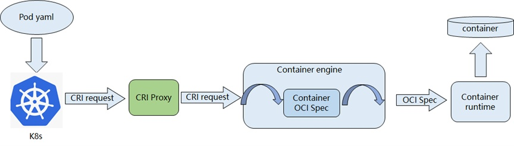
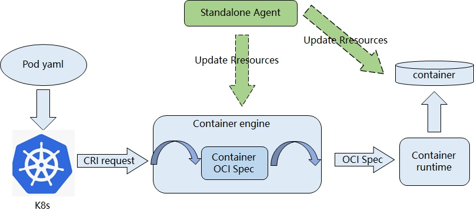
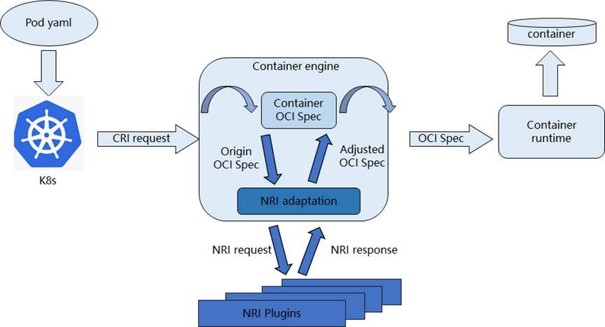
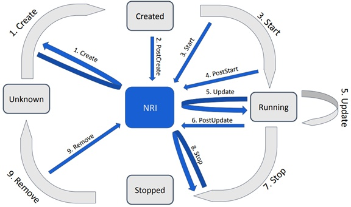
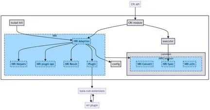

**背景与现状**
-----

**背景**

随着云计算技术的快速发展和业务需求的日益复杂，云原生架构已经成为构建和部署现代应用程序的主流方式。在这种架构下，应用程序被打包成容器，并在
Kubernetes
等容器编排平台管理的集群中运行，极大提升了系统的灵活性和可扩展性。然而，随着业务类型和计算资源的丰富，不同业务应用容器对不同的资源存在不同的使用需求，怎样在确保集群资源得到合理分配和有效利用的同时，实现对节点资源信息进行更细粒度、低时延的灵活调整，保障业务程序的QoS（Quality
of Service），成为了业界探索的重点。

**现状**

在过去，由于Kubernetes并没有提供一个统一完善的资源管理方案，不同的资源管理组件通过不同的部署方式进行资源管理，最常见的两种部署方式为：Proxy模式和Standalone模式。

**1.Proxy模式**：在每个节点中部署一个代理组件，在k8s与容器引擎之间劫持pod以及container的生命周期事件，根据节点资源的使用情况以及资源分配策略，修改pod以及container的spec配置。



图1 Proxy模式流程图

**2.Standalone模式**：在每个节点中创建一个Agent，当Agent监听到本节点的pod以及container生命周期事件后，根据Pod
Spec配置中的annotation，调用容器引擎接口实现对Pod的更新。



图2 Standalone模式流程图

以上两种部署方式存在一些共同的问题：

**1.额外组件开销**：需要额外的容器生命周期监控组件，增加系统复杂性的同时也会产生额外的性能开销；

**2.不兼容CRI流程**：与原有CRI流程不兼容，对Kubernetes原生调度器的侵入性修改；

**3.调度时延高**：资源管理插件的调度与pod管理流程之间存在时延，资源管理插件获得的容器资源信息与容器引擎层信息存在不一致，影响提升资源利用率；

**4.可移植性差**：不同资源管理组件的实现方式均存在差异，开发者使用时需根据资源管理组件不同实现进行适配。

**节点资源接口NRI**
-----

为了克服现有资源管理方案的局限性，提供一个更加统一和高效的解决方案，节点资源接口NRI(Node
Resource Interface)应运而生。

NRI是用于控制节点资源的公共接口，也是CRI兼容的容器运行时插件扩展的通用框架。它为扩展插件提供了跟踪容器状态，并对其配置进行有限修改的基本机制。

NRI允许将用户某些自定义的逻辑插入到OCI兼容的运行时中，自定义逻辑中可以对容器进行受控更改，或在容器生命周期的某些时间点执行
OCI 范围之外的额外操作。例如，用于改进设备和其他容器资源的分配和管理。

资源管理组件实现NRI插件化后，能有效的解决现有资源管理方案的问题：

**1.无需额外组件开销**：NRI接口中定义了插件可订阅的容器生命周期事件，资源管理插件只需订阅关心的事件即可在容器生命周期事件发生时收到请求进行处理，无需额外的组件开销；

**2.兼容CRI流程**：NRI插件流程的处理由容器引擎（如
iSulad）负责，上层调度器（如 Kubernetes）集成无感知；

**3.调度时延低**：调度器可以通过NRI
插件直接在容器引擎层面控制容器资源分配的细节，降低调度时延；

**4.可移植性强**：NRI提供了一个通用的接口，允许外部插件统一管理资源（如
CPU、内存、GPU
等），避免了不同插件对资源的不同管理方式造成的冲突，增强了可移植性；

**5.可扩展性强**：NRI
允许用户自定义插件来处理特定的资源管理需求，不需要更改容器引擎的核心代码，这使得定制化和扩展变得更为简单。

总的来说，NRI提供了一种优雅的云原生系统的资源管理标准化模式，有助于提升资源管理的灵活性和处理的时效性，实现资源的高效利用和性能的提升。

目前最新的NRI API 版本为0.6.1\[1\]。

**处理流程**
------------

如图3所示，NRI插件是一些可插拔的CRI运行时插件，这些插件之间相互独立，每个插件都能通过Unix-domain
socket来与容器引擎进行数据传输和通信。NRI
Adaptation为容器引擎中与NRI插件交互的模块，用于管理NRI插件，实现NRI插件的注册，启动、配置以及调用。



图3 NRI支持后CRI请求处理流程

**规范接口**
------------

NRI提供了一套插件API接口定义。当前版本的API中定义了两个服务: Runtime
Service和Plugin Service。

Runtime
Service是容器引擎需要实现的需暴露给NRI插件的服务接口，NRI插件可向容器引擎请求相应的服务来进行插件的注册以及容器资源信息的更新。

Plugin
Service是NRI插件需要暴露给容器引擎的服务接口，容器引擎在订阅生命周期事件发生时调用NRI插件的服务。

API中定义NRI插件可订阅的Pod 生命周期事件包括：creation、stopping 和
removal，可订阅的 Container 生命周期事件包括
creation、post-creation、starting、poststart、updating、post-update、stopping
和 removal。以下为NRI插件可订阅事件的生命流程图：



图4 NRI Plugin Events\[2\]

在插件订阅的生命周期中，插件中可自定义容器配置逻辑，获取和更新API中定义的不同容器资源，从而能够更精确、细粒度地控制容器资源使用。

**iSulad支持NRI实现**iSulad\[3\]在v2.1.5版本已支持NRI扩展式插件，在openeuler
24.09\[4\]创新版本中默认可用。

**架构**
--------

iSulad是一个由C/C++编写实现的轻量级容器引擎，由于NRI规范中规定插件与容器引擎之间的交互使用ttrpc，且目前C/C++未提供ttrpc接口，因此新增Rust实现的isula-rust-extensions
软件包，提供libnri.so动态链接库与NRI插件进行服务请求交互。

iSulad中新增了NRI模块，模块内通过NRI
Adaption模块管理所有的NRI插件，通过plugin模块与isula-rust-extension组件提供的libnri.so进行交互，从而实现与NRI插件的交互。实现架构如下图：



图5 iSulad 支持NRI实现设计图

**配置与使用**
--------------

开发者需根据NRI
API开发特定功能的NRI插件，或是使用NRI代码仓中已有的简单NRI插件\[5\]，编译为NRI
插件二进制，之后配置iSulad支持NRI，并选择一种NRI插件注册的方式进行相应的配置，建立NRI插件与iSulad的连接。

详细的使用方法可以参考iSulad支持NRI\[6\]的用户使用文档。

下面简要介绍配置iSulad支持NRI方式以及开发者开发的NRI插件注册的方式。

### **1. 配置iSulad支持NRI**

若使用默认的配置，仅需在iSulad配置文件（默认为/etc/isulad/daemon.json）中将以下选项打开：

```python

"nri-support\":true,
```
其他选项均为默认值。

若需要配置其他项，可参照：

```python

#  add support for NRI plugin.
"nri-support": true,
#  Allow connections from externally launched NRI plugins.
"disable-connections": true,
#  plugin-config-path is the directory to search for plugin-specific configuration.
"plugin-config-path": "/etc/nri/conf.d"
#  plugin-path is the directory to search for plugins to launch on startup.
"plugin-path": "/opt/nri/plugins"
#  plugin-registration-timeout is the timeout for a plugin to register after connection.
"plugin-registration-timeout": 5
#  plugin-request-timeout is the timeout for a plugin to handle an event/request.
"plugin-request-timeout": 2
```
修改iSulad配置文件后，需重启iSulad服务（systemctl restart isulad）。

### **2. 插件注册方式**

#### *pre-started NRI 插件*

pre-started NRI 插件的配置方式：\
（1）将插件二进制置于iSulad配置中设置的plugin\_path路径下；\
（2）将NRI插件的配置置于plugin\_config\_path路径下。\
配置完成后，iSulad启动时会去对应的目录根据插件配置启动NRI插件进程完成注册，插件进程为iSulad的子进程。

#### *external NRI插件*

external
NRI插件需要在iSulad启动后由用户自己启动，作为一个独立的进程。NRI插件进程通过Unix
Domain Socket（/var/run/nri/nri.sock）与iSulad进行通信，完成插件注册。

**rubik
NRI插件化实现**混合部署组件rubik\[7\]已实现支持通过NRI方式管理容器资源。使用时需将rubik配置文件(
/var/lib/rubik/config.json)中informerType字段修改为nri。

rubik通过Unix Domain
Socket与容器引擎通信，管理容器资源信息。若rubik运行在容器中，需将nri套接字挂载到容器中。详细配置详见rubik配置说明\[8\]。

相比apiserver方式需要大约21ms才能获取集群Pod和容器信息，NRI方式仅需要8ms
即可获取到信息，性能提升了大约2.6倍，时延降低62%。

**加入我们**
------------

文中所述的 iSulad组件与rubik组件，由 CloudNative SIG
参与，相关源码均已在OpenAtom
openEuler（简称openEuler）社区开源。如果您对相关技术感兴趣，可以添加小助手微信，加入对应
SIG 微信群，欢迎您的围观和加入。

**参考**
--------

\[1\] Node Resource Interface 0.6.1 API,
https://github.com/containerd/nri/blob/v0.6.1/pkg/api/api.proto\
\[2\] NRI Plugin Events,
https://static.sched.com/hosted\_files/kccncna2022/cc/KubeCon-NA-2022-NRI-presentation.pdf\
\[3\] iSulad, https://gitee.com/openeuler/iSulad\
\[4\] openeuler 24.09,
https://www.openeuler.org/zh/download/?version=openEuler%2024.09\
\[5\] NRI 简单插件示例,
https://github.com/containerd/nri/tree/main/plugins\
\[6\] iSulad支持NRI,
https://docs.openeuler.org/zh/docs/24.09/docs/Container/iSulad%E6%94%AF%E6%8C%81NRI.html\
\[7\] rubik, https://gitee.com/openeuler/rubik\
\[8\] rubik配置说明,
https://gitee.com/openeuler/rubik/blob/master/docs/config.md
