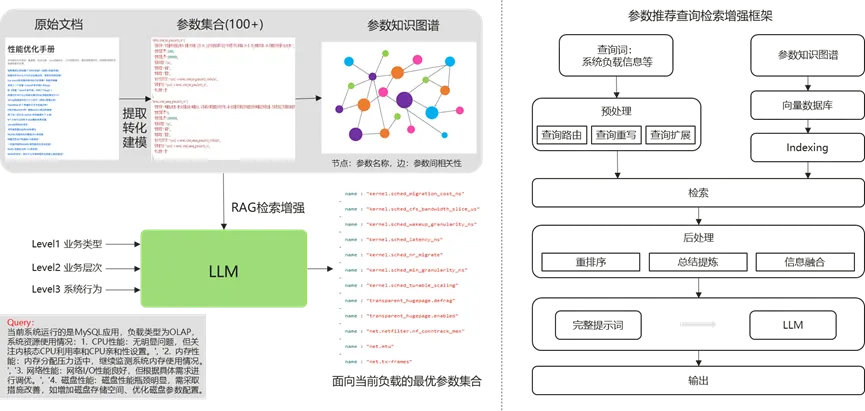

**背景**随着软件和系统的复杂程度不断增加，参数调优作为系统性能优化的关键环节，面临着前所未有的挑战与机遇。参数配置的复杂性日益增加，传统的手动配置方法已难以满足日益增长的性能需求。基于机器学习算法的智能调参技术虽然展现出巨大潜力，但在实际应用中仍面临调优效率、安全性和可靠性等挑战。

-   痛点1：软件规模剧增，当前系统软件可调参数已达13000+，远超出人工调优能力范围。

-   痛点2：系统复杂，经验难以固化，各领域专家投入时间多。

-   痛点3：性能优化自动化程度低，现有工具仍需大量人工参与，有一定使用门槛。在调优的各个流程中，包括性能测试，使用调优工具等环节需要大量人工参与，造成调优效率低下。

-   痛点4：现有算法、工具适用不同场景，缺乏通用性。

**方案设计**LLM凭借其强大的自然语言理解和生成能力，能够深入理解性能优化领域多模态数据，通过结合专业调优工具，一方面能够实现对负载更准确的分析和感知，另一方面还能快速给出相关优化建议，极大提升性能优化的效率与效果。结合现有技术方案存在的问题，通过构建系统级负载感知、AI大模型辅助调优等关键技术，实现系统调优效率从天到小时，具备从典型应用泛化到其他应用的能力。该方案能减少人工参与，有效提升整体调优流程的自动化程度。该方案设计图如下：通过轻量化资源采集和多Agent调度编排等核心组件实现智能优化。

构建了以下关键技术：

-   **轻量级资源采集**：通过ebpf、perf等手段，采集系cpu/memory/disk/network等多维度指标，采集底噪低于1%
    CPU, 内存20MB，网络10KB/s，并对采集指标进行数据处理。

-   **系统级负载感知**：对OS层多维度、细粒度资源的分析，使用聚类等机器学习算法结合LLM，识别系统关键性能瓶颈点，调优收敛效率提升：**天→小时**。

-   **LLM调优**：结合大模型自主学习历史调优经验知识，从典型应用调优到泛化应用调优，配置推荐准确率：60%→80%。提出了基于RAG检索增强的大模型调优参数推荐模块，在该模块中，输入来自于当前系统以及应用的负载、瓶颈点等信息，通过词嵌入模型向量化，从专家调优知识库中检索与当前场景匹配的可调参数，最后输出适合当前场景的调优参数，下发调优配置至小模型，利用小模型进行性能调优。

**方案实践**

该方案在MySQL等场景下进行了实践验证，整体方案架构图如下：

调优结果如下：

会生成系统负载的分析报告，使调优有据可依：

同时分析下述数据可知，该方案的调优效率优于人工专家；虽然绝对效果逊于专家，但两者协同可获得最大收益（图中数据为MySQL性能指标QPS）。

**加入我们**

欢迎感兴趣的朋友们参与到 OpenAtom
openEuler（简称\"openEuler\"） A-Tune SIG，探讨 AI /
智能调优领域技术，也可以添加小助手微信，加入 A-Tune SIG
交流微信群。欢迎您的围观和加入！

扫码添加小助手

