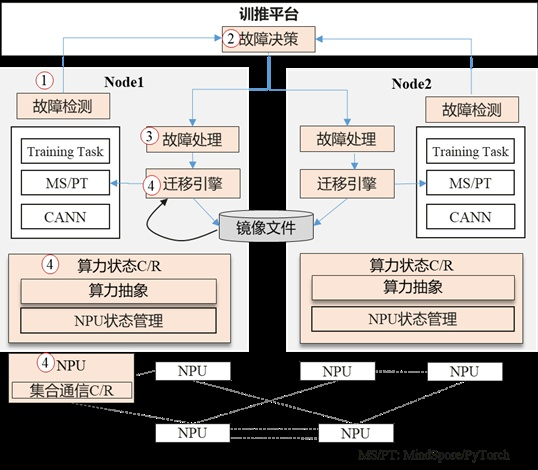
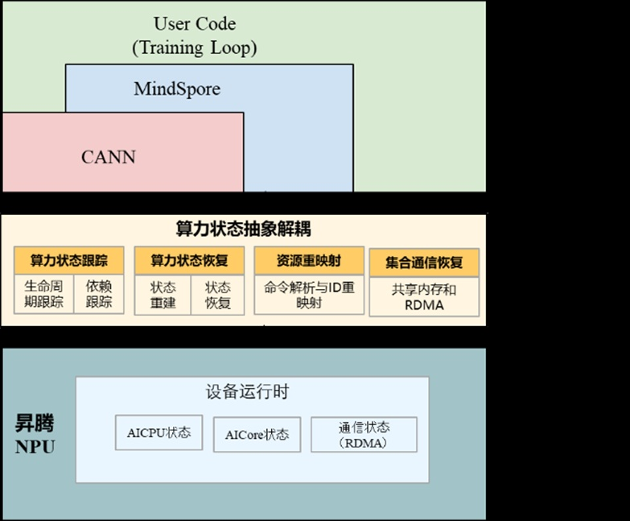

**背景介绍**

随着大模型技术的发展和其训练规模的不断扩大，集群的故障问题也日益凸显，严重影响模型训练的效率；例如，Meta
AI实验室发布的OPT模型，其中OPT-175B\[1\]的训练时长90天( 900多张GPU)，训练期间112次故障，故障恢复时间耗时长，最长一次甚至到80小时；OpenAI
GPT-4\[2\]的训练时长90\~100天(2万多张GPU)，算力利用率MFU仅32%到36%，而故障恢复涉及的高开销检查点则是低MFU的关键所在。因此，如何快速恢复模型续训提高集群训练的可靠性成为亟待解决的技术难题。

**大模型训练故障恢复整体流程**

大模型训练的故障恢复流程的主要步骤包括：

1)故障检测：检测系统中各种类型的故障，故障发生后，通知故障决策组件；

2)故障决策：收到通知后，针对不同的故障类型决策采取何种恢复机制，通知故障处理组件进行故障处理；

3)故障处理：收到故障决策组件的消息后，进行故障处理，如临终状态处理，数据修复等；

4)故障恢复：故障节点进程进行原地恢复或者迁移恢复等，正常节点任务需要回滚到指定的训练步骤，主要涉及关键技术有NPU设备和集合通信的状态保存与恢复。

**异构弹性恢复关键技术**

**1)关键技术一：NPU状态C/R技术**

大模型训练的运行状态主要分为两部分，一部分是训练任务相关的，包括大模型,
MindSpore, CANN ,
这些状态可以通过CRIU\[3\]恢复；另外一部分与NPU设备相关(包括NPU
driver和NPU
device)的。虽然用户态的CRIU机制可以恢复进程的状态，但不支持NPU设备相关状态恢复。由此，AMD\[5\]和Nvidia\[6\]积极推动各自的GPU驱动里实现状态保存和恢复的能力；微软
Singularity\[4\]则通过劫持技术，截获CPU与GPU之间的交互，通过一个独立的设备代理组件实现GPU设备状态恢复。与GPU不同的是，NPU的状态更加复杂，除了NPU
Driver状态之外，NPU设备内部还有复杂的管理机制，需要保存与恢复相关状态信息。为此，我们构建了算力状态抽象管理模块，用于跟踪、管理与恢复主机侧到NPU侧发送的命令与算子流，记录命令的生命周期、依赖关系等，并通过重算(例如算子)的方式构建NPU内部状态；同时通过适配Driver，提供Dump和Restore接口，保存和恢复必要的数据。

**2)关键技术二：集合通信免建链**

训练中除因硬件或网络故障导致整个训练任务的失败，每一次重新训练需要执行一遍集合通信组建链初始化耗时较长，字节跳动推出的万卡集群训练系统MegaScale\[7\]的研究表明：2048卡集群中这个过程需要1047s。为了优化这一过程，需要突破集合通信免建链技术，通过保存与恢复网络硬件与软件的状态，在网络拓扑不变的情况下，实现集合通信秒级恢复。在通信恢复过程中需要重建本端与对端对应的通信资源。重建的通信资源主要包括驱动侧和和NPU设备侧，驱动中资源信息包括共享内存关系，内存信息以及通道信息；NPU设备中的资源状态包括通信的MR、QP以及网卡寄存器等相关信息，统一通过dump和restore功能，进行信息保存和恢复。由于RDMA网卡的内部通信状态的变化，当本地和对端网卡分别处于不同的通信态，我们通过预置通道同步双方的通信状态，从而重新建立通信。值得注意的是，对于迁移恢复的场景，由于IP地址的变化，除了恢复NPU设备的通信状态，还需要同步构建两端主机之间的通信。

**原地恢复原型效果**

受限于现有的实验室环境，我们通过原地恢复场景实现异构弹性技术的验证。我们使用containerd的容器运行时，由两台ARM服务器(每台服务器配备8张NPU）互联，运行基于Mindspore的大模型训练llama2-7b；具体来说，训练任务在测试机1上的卡0训练任务执行完数个训练步骤后注入模拟故障，然后执行checkpoint保存训练状态，在测试机1的训练任务退出后，执行Restore重新拉起卡0完成训练中断续跑。结果表明，原地恢复从以前的X分钟缩短到1分钟内。后续会分享更多规模化集群训练场景的故障恢复效果，敬请期待！

**加入我们**

OpenAtom
openEuler（简称\"openEuler\"）社区异构融合SIG（SIG-Long）致力于构建智能基础设施异构融合计算框架，充分发挥不同硬件设备的优势，最大化满足不同应用负载的诉求，同时降低开发门槛和成本。

欢迎感兴趣的朋友加入到异构融合SIG，共同探讨最新技术，可以添加小助手微信或扫描微信群二维码，入群讨论。欢迎您的围观和加入！

添加小助手

**参考链接**

\[1\] OPT: Open
Pre-trained Transformer Language
Models.

\[2\]《GPT-4「炼丹」指南：MoE、参数量、训练成本和推理的秘密》

\[3\]
CRIU: Checkpoint Restore In UserSpace：https://criu.org/Main\_Page

\[4\]
Singularity: Planet-Scale, Preemptive and Elastic Scheduling of AI
Workloads：https://arxiv.org/abs/2202.07848

\[5\]
https://github.com/checkpoint-restore/criu/blob/criu-dev/plugins/amdgpu/README.md

\[6\]
https://github.com/NVIDIA/cuda-checkpoint

\[7\]MegaScale: Scaling Large
Language Model Training to More Than 10,000
GPUs：https://arxiv.org/abs/2402.15627
