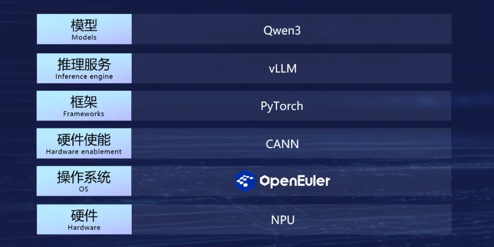
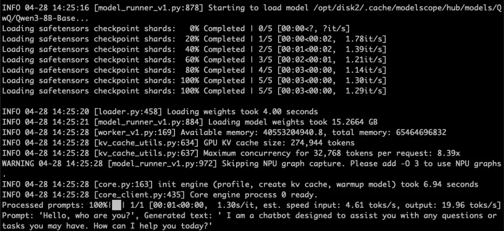

> 4月29日，阿里巴巴正式发布新一代Qwen大语言模型系列（Qwen3与Qwen3-MoE），在模型规模与性能上实现多方面升级。openEuler社区团队与vLLM社区通力合作，在第一时间完成Qwen3模型验证。目前，开发者可以基于OpenAtom openEuler（简称openEuler）和vLLM在昇腾设备上完成 Qwen3 推理。


新一代Qwen大语言模型主要包含2个版本：

- **Qwen3**，包括Qwen3-0.6B、Qwen3-1.7B、Qwen3-4B、Qwen3-8B
- **Qwen3-MoE**，包括Qwen3-MoE-15B-A2B、Qwen3-30B-A3B、Qwen3-235B-A22B

早在4月中旬，vLLM发布的v0.8.4版本中已经包括对Qwen3最新结构的支持。随即，vLLM社区的vLLM Ascend团队同步发布了v0.8.4rc1版本，并完成了跟进和适配。在该版本中，openEuler成为上游默认支持的操作系统之一，同步发布容器镜像。

Qwen3发布后，openEuler社区与vLLM社区通力合作，在第一时间完成Qwen3模型验证，这意味着开发者现在就可以一键拉起基于openEuler的vLLM-Ascend容器镜像在昇腾设备上实现Qwen3的推理。

## 快速体验 Qwen3

体验之前，您需确认固件/驱动已正确安装，可运行如下命令确认：

```shell
npu-smi info
```

您可以使用如下命令，一键拉起基于openEuler的vLLM-Ascend容器镜像：

```shell
# Update DEVICE according to your device (/dev/davinci[0-7])
export DEVICE=/dev/davinci0
# Update the openeuler-vllm-ascend image
export IMAGE=quay.io/ascend/vllm-ascend:v0.8.4rc2-openeuler
docker run --rm \
--name openeuler-vllm-ascend \
--device $DEVICE \
--device /dev/davinci_manager \
--device /dev/devmm_svm \
--device /dev/hisi_hdc \
-v /usr/local/dcmi:/usr/local/dcmi \
-v /usr/local/bin/npu-smi:/usr/local/bin/npu-smi \
-v /usr/local/Ascend/driver/lib64/:/usr/local/Ascend/driver/lib64/ \
-v /usr/local/Ascend/driver/version.info:/usr/local/Ascend/driver/version.info \
-v /etc/ascend_install.info:/etc/ascend_install.info \
-v /root/.cache:/root/.cache \
-p 8000:8000 \
-it $IMAGE bash
```

进入容器环境后，使用ModelScope平台进行下载加速：

```shell
export VLLM_USE_MODELSCOPE=true
```

### 在线推理

您可以使用vLLM和vLLM Ascend一键部署在线推理服务：

```shell
vllm serve Qwen/Qwen3-8B
```

服务启动后，您可以通过curl请求来进行内容生成：

```shell
curl http://localhost:8000/v1/completions \
-H "Content-Type: application/json" \
-d '{"model": "Qwen/Qwen3-8B", "prompt": "The future of AI is", "max_tokens": 5,  "temperature": 0}' | python3 -m json.tool
```

### 离线推理

您可以使用vLLM和vLLM Ascend进行离线推理。

以下是example.py的示例：

```shell
from vllm import LLM, SamplingParams
prompts = [
    "Hello, my name is",
    "The future of AI is",]
# Create a sampling params object.
sampling_params = SamplingParams(temperature=0.8, top_p=0.95)
# Create an LLM.
llm = LLM(model="Qwen/Qwen3-8B")
# Generate texts from the prompts.
outputs = llm.generate(prompts, sampling_params)
for output in outputs:
    prompt = output.prompt
    generated_text = output.outputs[0].text
    print(f"Prompt: {prompt!r}, Generated text: {generated_text!r}")
运行以上脚本即可使用vLLM和vLLM Ascend进行推理：
# export VLLM_USE_MODELSCOPE=true to speed up download if huggingface is not reachable.
python example.py
```

推理结果如下图所示：




## 问题反馈

若您在openEuler上部署与运行Qwen3时遇到任何问题，可在openEuler官方论坛【Qwen3 on openEuler】问题收集与讨论专帖下面进行反馈：https://forum.openeuler.org/t/topic/7559

## 相关链接

- vllm-ascend项目仓库：https://github.com/vllm-project/vllm-ascend
- vllm-ascend文档链接：https://vllm-ascend.readthedocs.io
