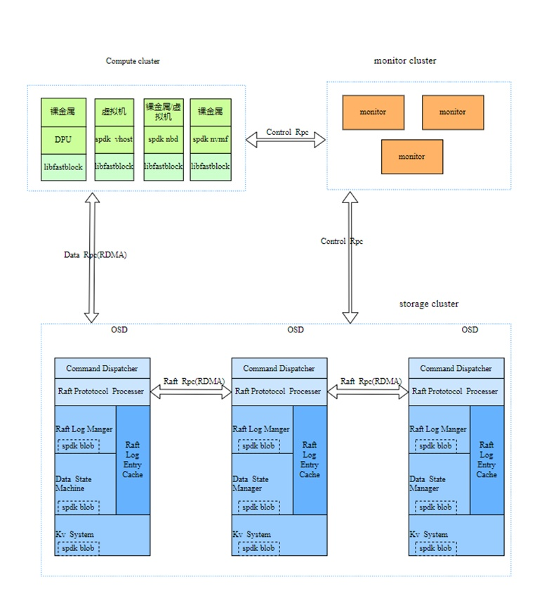
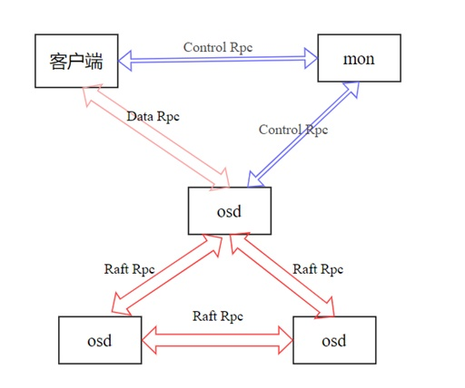
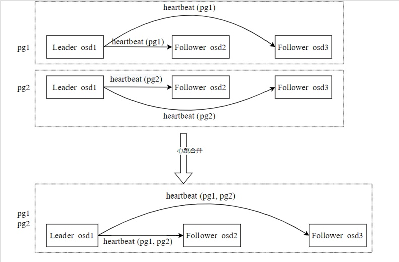
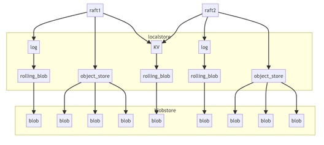

**fastblock 介绍**
------------------

fastblock 是一个高性能的分布式块存储系统，具备以下核心特点：

-   高可用性与一致性：通过 Raft 协议确保系统的一致性和高可用性。

-   低延迟 IO：采用 SPDK 用户态 NVMe 驱动和无锁队列等技术，降低 IO
路径的延迟。

-   高效网络通信：利用 RDMA 网卡实现零拷贝、内核旁路及无需 CPU
干预的网络通信。

fastblock
综合运用了这些先进技术，打造了一个高性能、低延迟的分布式存储解决方案。该项目目前已经在OpenAtom
openEuler（简称\"openEuler\"）社区开源。

仓库地址：https://gitee.com/openeuler/fastblock

**fastblock 架构**
------------------

fastblock 的架构与 Ceph 类似，包含了 monitor、OSD、PG
等概念，如下图所示：

**主要由以下六部分组成：**

**1.Monitor**

负责节点管理、卷管理、存储卷元数据、集群拓扑结构维护、pg分布管理等工作。Monitor
使用 etcd 进行多副本存储，是系统一致性的关键。它保证客户端和 OSD
看到相同的视图。客户端的 IO 操作只能在 PG 层面进行，而 OSD
和客户端会定期从 Monitor 获取 OSDMap 和 PGMap
信息，确保它们在启动后能同步查看到相同的 PG 状态变化。针对特定 PG
的写入操作，能够避免错误的写入位置。

 **2.RPC**

RPC 子系统是连接各模块的关键组件，支持两种通信方式：

 基于 Socket：经典的 Linux Socket，用于 Monitor 与 OSD 之间的通信。

基于 RDMA：利用异步 RDMA 语义进行通信，主要用于 OSD 之间以及 OSD
与客户端之间的通信。

上图是fastblock中各个模块之间的联系，其中使用了三种类型的rpc，分别是Control
Rpc、Data Rpc和Raft Rpc，其用途如下：

Control Rpc：用于客户端与 Monitor、OSD 与 Monitor 之间传递如
OSDMap、PGMap
和镜像信息等小数据量、低频率的操作。由于数据量不大，频率较低，可以使用基于
Socket 的实现。

Data Rpc：用于客户端与 OSD
之间传输对象数据操作和结果。这些数据量较大且频率较高，因此采用基于
RDMA 的通信方式，保证高效的数据传输。

Raft Rpc：用于 OSD 之间传输 Raft
协议内容，内部包含对象数据。这些数据量大、频率高，同样使用基于 RDMA
的方式进行高效传输。

**Data RPC**和**Raft RPC**都使用 Protobuf RPC
框架，网络交互部分的代码实现基于 RDMA，而 RPC 传输的数据序列化则使用
Protobuf 格式。

**3.OSD Raft**

fastblock 使用**Raft 协议**实现高可用的一致性。Raft
协议通过选举一个领导者（Leader）来管理日志条目（Log
Entry）的生成、存储和同步。具体流程包括：领导者接收客户端的数据生成日志条目，将日志写入磁盘并同步给其他副本，指示其他节点何时可以安全地将日志应用到状态机中。

我们自己实现了multi-raft，主要涉及以下几个任务：：

raft groups管理，包括raft的创建、修改和删除

raft选举以及选举超时处理

raft log处理，包括log缓存、log落盘和log复制到follower节点

数据state machine处理，既数据落盘

raft快照管理和raft数据恢复

raft成员变更管理

raft心跳合并

在**multi-raft**设计中，会有多个raft并存，每个 Raft 组的 Leader
都需要定期发送心跳包（heartbeat）到其 Follower。如果 Raft
过多，会导致心跳包数量过多，进而占用大量带宽和 CPU
资源。为了解决这一问题，我们对相同 Leader 和相同 Follower 的 Raft
组进行心跳包的合并。
心跳合并示例：假设有两个 PG（PG1 和 PG2），PG1 和 PG2 中都包含
OSD1、OSD2 和 OSD3，且 OSD1 为 Leader。OSD1 需要向 OSD2 和 OSD3
都发送两个心跳包（PG1的heartbeat和PG2的heartbeat）。

在**心跳合并**机制下，OSD1 只需要向OSD2 和 OSD3
分别发送一个合并后的心跳包，包含 PG1 和 PG2
的心跳，从而减少了不必要的心跳包数量，优化了带宽和 CPU 资源的使用。

**4.OSD KV**

用于存储raft协议元数据和存储系统本身的数据。因为数据量较小，可以将其全部存储在内存中，并定期将数据刷新到磁盘。

**5.OSD localstore**

本地存储使用 SPDK 的 Blobstore 访问 NVMe 磁盘，包含以下三个存储模块：

-   disk\_log：存储raft log的数据，一个pg对应一个spdk blob

-   object\_store: 存储对象数据，一个对象对应一个spdk blob

-   kv\_store: 每个cpu核有一个spdk blob，保存当前cpu核上需要保存到磁盘的所有kv数据。

**6.客户端**

客户端支持多种模式，具体包括：

-   使用spdk vhost提供给虚拟机

-   使用NBD提供给裸金属

-   使用spdk nvmf-tgt，通过操作系统内核导出磁盘

这些模式都通过调用libfastblock库，在 Image 访问和 Object
访问之间进行切换。然后，相关数据被封装为 Data RPC 消息，发送给 PG 的
Leader OSD，Leader OSD
处理后将响应返回给客户端，最终将结果返回给用户。fastblock实现了vhost
app和nvmf\_tgt
app，分别用来对接虚拟机和操作系统内核导出磁盘，使用spdk的rpc.py脚本来向vhost
app和nvmf\_tgt app发消息,执行如创建bdev等操作。

**应用场景**
------------

作为虚拟机的磁盘：使用 fastblock 的**vhost** 应用启动一个 SPDK vhost
进程。通过该进程，在 fastblock 的 image 上创建 BDEV 设备和 vhost
controller，并生成一个 socket 文件。使用 QEMU 启动虚拟机时，可以将该
BDEV 设备作为虚拟机的磁盘。作为裸金属：使用 FastBlock
的**fastblock-nvmf-tgt 应用**启动一个 SPDK nvmf-tgt 进程。在 FastBlock
的 image 上创建 BDEV 设备，并通过操作系统内核将该 BDEV 设备导出为磁盘。

**fastblock 技术特点**
----------------------

fastblock
的设计通过一系列优化技术提升了存储系统的性能和一致性，具体包括以下几个方面：

1. 每个OSD可以绑定多个cpu核，创建pg分配OSD列表时把cpu核考虑在内。相同的pg会落在它的所有OSD的同一个shard\_id上（shard\_id是OSD上绑定的cpu核的顺序，如一个OSD绑定cpu核为8、9、10、11，则这些核的shard\_id分别为0、1、2、3），这样设计可以避免
OSD 之间在通信时切换 CPU
核（两个OSD相同shard\_id的cpu核之间会建立网络连接），减少跨核开销。

2. 使用spdk编程框架，通过用户态 NVMe 驱动替代内核的 NVMe
驱动，减少了用户态与内核态之间的频繁切换；同时，使用轮询替代中断，提高了响应速度；采用无锁队列技术。显著降低了
IO 路径开销。

3. 使用SPDK Blobstore替代传统文件系统来存储 Raft
log、对象数据和 KV 数据。整个 I/O
流程从发起到落盘均在用户态处理，完全绕开内核。通过 SPDK
提供的异步、无锁化、Zero Copy、轮询等机制，大幅度减少了 IO 开销。

4. fastblock的OSD 在绑定的每个 CPU 核上都可以创建一个独立的 Blobstore，Blob
的管理和读写操作可以在各自的 CPU
核上完成，无需跨核操作，进一步减少了跨核开销。

5. OSD 之间，以及 OSD
与客户端之间，使用RDMA进行网络通信。RDMA 技术的零拷贝、内核旁路和无需
CPU 干预的特点显著提高了数据传输效率，减少了网络通信的延迟和 CPU
占用。

6. 使用Multi-Raft
协议来实现高可用的一致性，确保系统中的数据在多个节点之间保持一致，增强了系统的容错性和可靠性。

**开发进度**
------------

当前已经完成的功能：

1. multi-raft实现，包括raft
group管理、raft选举、raft
log处理、状态机处理、follower数据恢复、raft成员变更、raft心跳合并都已实现。

2. pg分布算法实现，实现算法确保OSD在每个核上均衡持有PG，提高集群效率和CPU利用率。

3. 支持prometheus exporter导出集群运行时状态，展示iops和带宽。

4. 实现了性能测试工具block\_bench和bdevperf。

5. 提供了一个快速部署工具脚本vstart.sh

6. 简化配置文件，monitor和OSD可以共用一个配置文件，方便部署。

7. 提供通过vhost为虚拟机挂载磁盘，通过nvmf为系统导出磁盘的方式来访问fastblock.

8. 实现了OSD、vhost和nvmf\_tgt绑定多核。

9. Monitor和OSD都适配了RPC避免跨核通信。

10. 已经具备做PoC的能力，且在AI场景在进行了对接测试

11. 三台服务器的配置三副本4K随机写IOPS能够超过100万，128K IO读写能够带宽能够跑满100Gb网络。

**后续规划**
------------

1. 实现卷快照、快照组等功能。

2. 实现卷Qos。

3. 支持DPU卸载vhost。

4. 支持卷加解密功能。

5. 支持卷共享。
