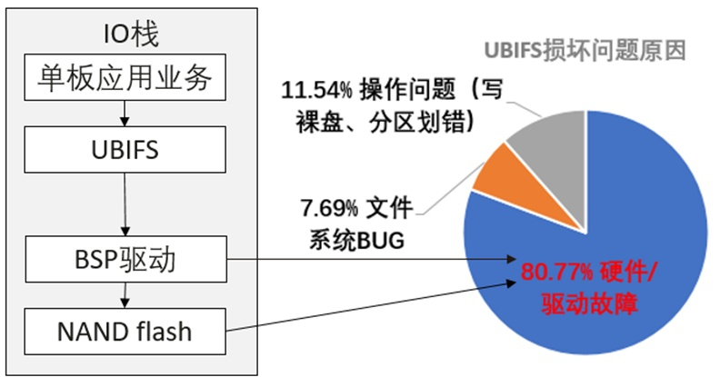

**fsck.ubifs：提供 UBIFS 唯一的检查&修复工具，修复
98%+损坏类型问题，有效解决行业痛点问题。**

数据存储稳定可靠始终为各行各业关键，OpenAtom
openEuler（简称"openEuler"）持续面相多行业多场景打造高可靠存储栈。通信领域常见文件系统中，UBIFS\[1\]（由诺基亚和塞格德大学联合开发并于
2008 年合入 Linux 主线）为首个综合考虑性能与 flash
介质特性的文件系统。从综合体验上，其相较于 yaffs2、jffs2
等有诸多好处（fast mount, high IO
performance，etc.），但从可靠性层面看，UBIFS 与 jffs2、yaffs2
并无太大区别，文件系统出现不一致后无法自动修复，只能返厂。

openEuler
内核团队在识别到该通信领域核心技术栈缺失后，做了相关的可靠性调研，归纳了文件系统损坏的根因类型（例如硬件&驱动不稳定、误操作等），总结了问题造成的影响，例如：**业务服务不可用，甚至可能让单板变砖，影响用户体验；暴力地格式化文件系统，丢失全部用户数据**。为此团队从文件系统磁盘结构和实现原理做了深层次技术分析，对整理的所有潜在故障点建模，并参考业界成熟工具（例如
fsck.ext4，fsck.f2fs 等）设计和实现了 fsck.ubifs。**最终达成
98%+故障修复率，预期单板恢复率可以提升
90%以上**。此外，工具还可以用于损坏镜像分析、故障巡检等场景，可以极大地节省人力成本。

**UBIFS 损坏原因统计（某厂商）**

该技术已经在 openEuler 开源\[2\]，并于 2024 年 11 月合入上游社区
mtd-utils 仓库\[3\], 具体用法&实现原理参考\[4\]。

数据存储的可靠性与产品服务质量紧密相关，openEuler
内核团队结合实际业务不断提升在该领域探索的深度和广度，并把高可靠技术推向上游社区，帮助更多厂商打造高可靠产品。

**文中链接**
------------

-   \[1\]. https://www.linux-mtd.infradead.org/doc/ubifs.html

-   \[2\].
    \https://gitee.com/src-openeuler/mtd-utils/pulls/22/files?skip\_mobile=true\

-   \[3\]. https://git.infradead.org/mtd-utils.git

-   \[4\].
    https://git.infradead.org/?p=mtd-utils.git;a=blob;f=ubifs-utils/fsck.ubifs/README.txt;hb=refs/heads/master
