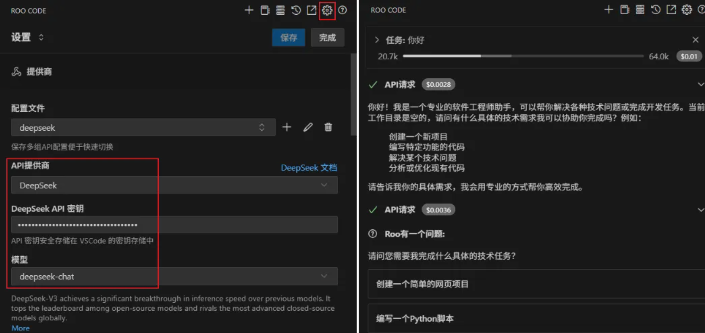
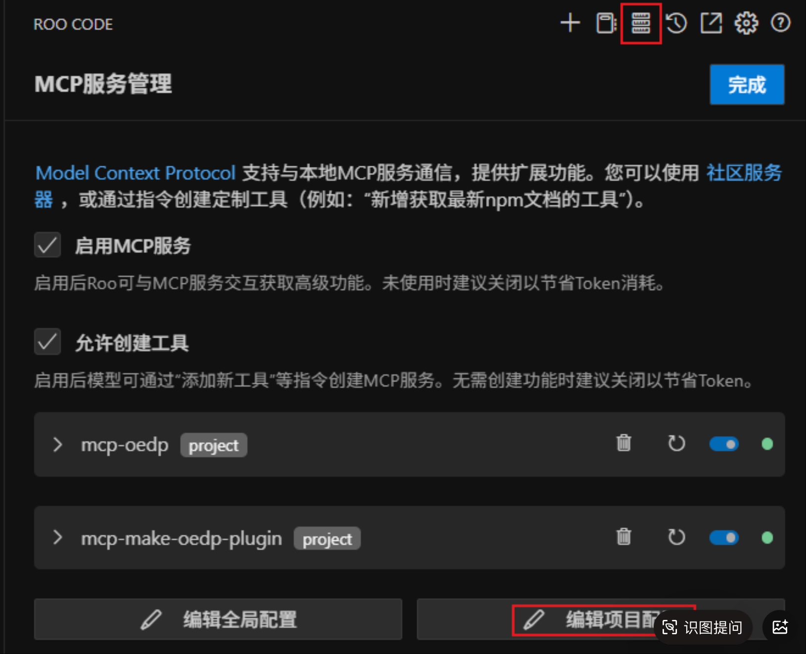
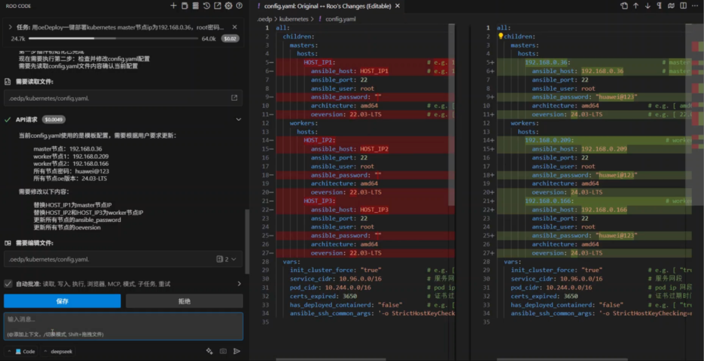
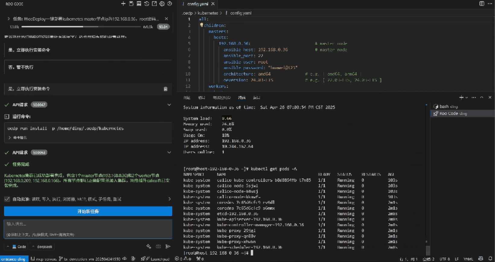
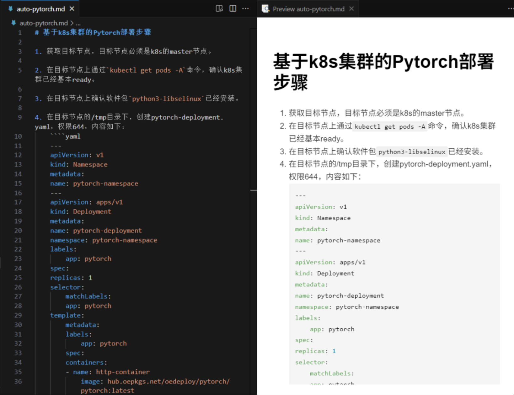
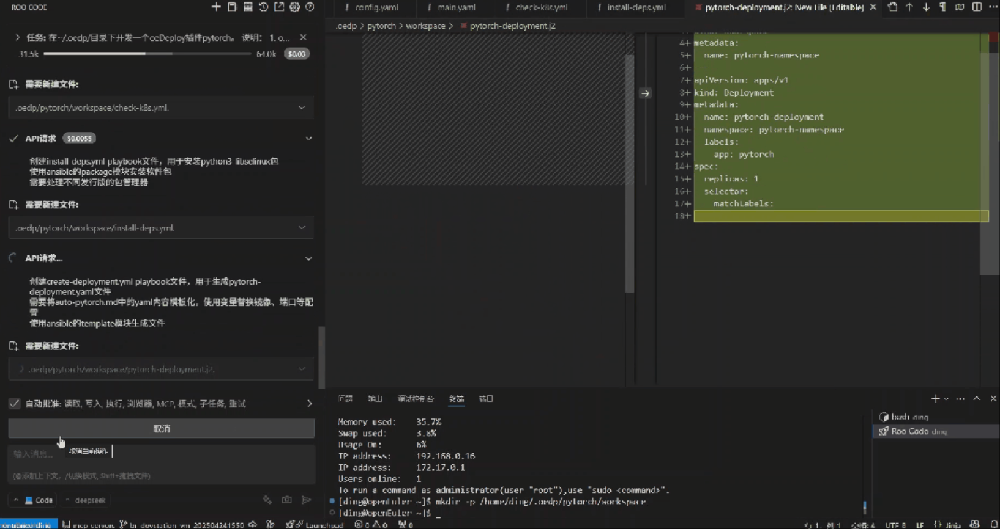
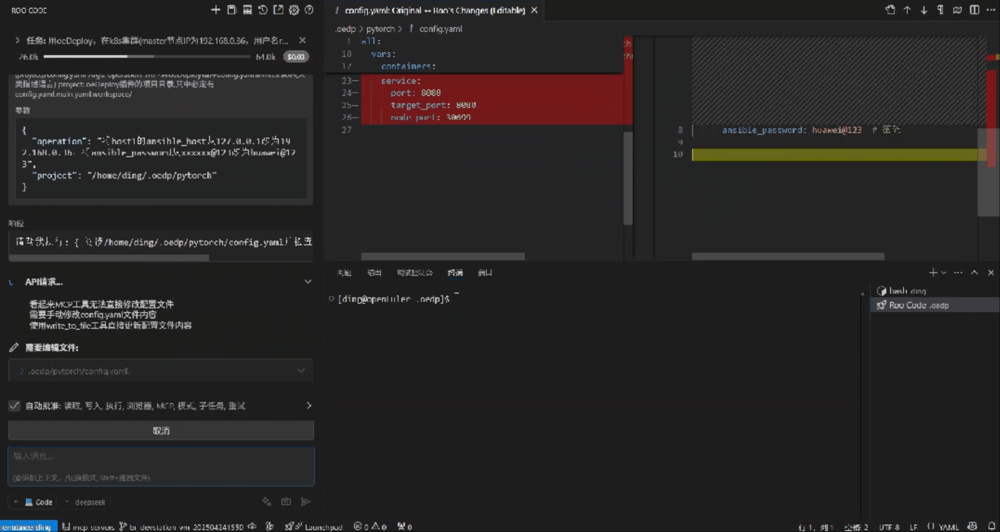

随着大模型的快速发展与近期 MCP 协议的火热，我们的开发模式正在快速转向自动化、智能化。

本期专题，我们将演示如何用 oeDeploy + MCP，进一步提升开发者的安装部署效率。

## 配置 oeDeploy MCP Server

MCP，全称模型上下文协议（Model Context Protocol，MCP），用于实现 LLM 与外部数据源和工具链的连接。

就好比是 LLM 这个聪明的大脑，拥有了 MCP 这双灵活的手，能处理更多复杂的工作。而 oeDeploy 就是这双手所拿的工具套件，从而让 LLM 帮助用户更高效地解决安装部署问题。

在当前示例中，我们使用 VS Code 上的开源工具 Roo Code 作为交互窗口，开发环境为 OpenAtom openEuler（简称 openEuler） 24.03 LTS。

### 步骤 1：配置大模型 API

从 DeepSeek 官网或者其他大模型服务提供商获取 API，配置到 Roo Code 的设置页面。配置完成后，可以用简单对话判断 API 是否生效。



### 步骤 2：oeDeploy MCP 环境准备

从 oeDeploy 代码仓下载 MCP Server 相关文件，并保存到自定义的路径，例如 `~/.oedp/mcp/`

```bash
mkdir -p ~/.oedp/mcp/
git clone https://gitee.com/openeuler/oeDeploy.git
cp oeDeploy/doc/DevelopGuide.md ~/.oedp/mcp/
cp oeDeploy/oedp-mcp/mcp-oedp.py ~/.oedp/mcp/
cp oeDeploy/oedp-mcp/mcp-make-oedp-plugin.py ~/.oedp/mcp/
```

安装 python 依赖。当前示例使用 `pip` 安装到系统的 python 目录，但更推荐用 `uv` 安装到虚环境。

```bash
pip install pydantic mcp --trusted-host mirrors.huaweicloud.com -i https://mirrors.huaweicloud.com/repository/pypi/simple
```

### 步骤 3：启动 MCP Server

在 Roo Code 的 MCP 配置页面中，点击【编辑项目配置】，添加如下 JSON 配置。

```json
{  
  "mcpServers": {  
    "mcp-oedp": {  
      "command": "python3",  
      "args": [  
        ".oedp/mcp/mcp-oedp.py"  
      ],  
      "disabled": false,  
      "alwaysAllow": []  
    },  
    "mcp-make-oedp-plugin": {  
      "command": "python3",  
      "args": [  
        ".oedp/mcp/mcp-make-oedp-plugin.py"  
      ],  
      "disabled": false,  
      "alwaysAllow": []  
    }  
  }  
}
```



如果配置成功，则可以在 MCP 的列表中看到两个新增的 MCP Server，且状态指示灯为绿色。

其中， `mcp-oedp` 提供 oeDeploy 基本命令的 MCP 调用能力， `mcp-make-oedp-plugin` 可以帮助用户自动开发一个自定义的 oeDeploy 插件。

> ★  
> 
> 请根据实际情况调整 python 源码的路径。如果 MCP Server 状态异常，请根据提示信息检查 python 依赖是否满足。 

## 用自然语言完成 k8s 集群部署

接下来，我们用对话的方式，让 LLM 借助 oeDeploy 插件的能力，快速完成 k8s 集群的部署。

在 Roo Code 对话窗口中，输入如下指令：

```
用oeDeploy一键部署kubernetes
master节点ip为192.168.0.36，root密码为xxxxxxx，架构为amd64，oe版本为24.03-LTS
第1个worker节点ip为192.168.0.209，root密码为xxxxxxx，架构为amd64，oe版本为24.03-LTS
第2个worker节点ip为192.168.0.166，root密码为xxxxxxx，架构为amd64，oe版本为24.03-LTS
```

LLM 会选择合适的 MCP Server，自动完成对应 oeDeploy 部署插件的下载、初始化、参数配置、一键部署。

根据用户描述，LLM 会自动修改 k8s 部署的相关配置参数。



随后，LLM 会自动生成 oeDeploy 部署命令行，用户同意后在本地执行，完成一键部署。



整个过程只用了 5 分钟，快速帮助用户在本地部署了一个 k8s 环境，而且用户几乎不需要对 oeDeploy 和 k8s 有很多的了解，使用门槛很低。

## 只需 3 分钟，将文档转换成一个新的安装部署插件

接下来，我们希望在 k8s 集群上部署一个 Pytorch 开发环境。

我们找到了一篇符合要求的步骤文档，它提供的方案是用 `kubectl apply` 的方式启动 Pytorch 镜像。



不同于以往的手工操作，我们直接将文档交给 LLM，输入如下指令，让 AI 替我们开发一个 oeDeploy 的部署插件。

```
在~/.oedp/目录下开发一个oeDeploy插件pytorch。
说明：
1. oeDeploy插件配置文件中仅配置单个节点，IP为127.0.0.1，用户名root，密码xxxxxx@123
2. 当用户执行install操作时，根据文档 @/auto-pytorch.md  执行部署操作
3. 端口号、镜像地址等参数在oeDeploy插件配置文件中可以配置
```

在 MCP Server 的指示下，LLM 会阅读 oeDeploy 开发文档，并根据用户要求完成开发。整个过程只需 3 分钟，用户可以在不了解 oeDeploy 规则的情况下，开发出自己的部署插件。



最后，我们再次用自然语言，完成 Pytorch 开发环境的快速部署。



## 结语

在上述示例中，MCP + oeDeploy 的组合进一步提升了软件部署效率，也让我们的开发过程更加高效、智能。

欢迎大家访问 oeDeploy 代码仓，探索更多有趣的用法。

oeDeploy 代码仓

https://gitee.com/openeuler/oeDeploy