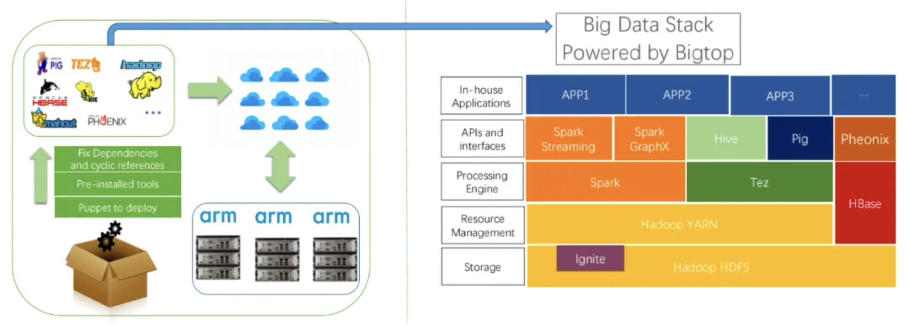
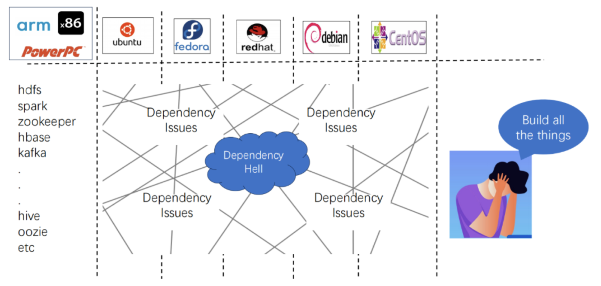
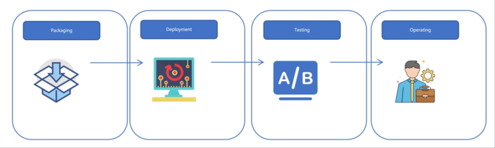
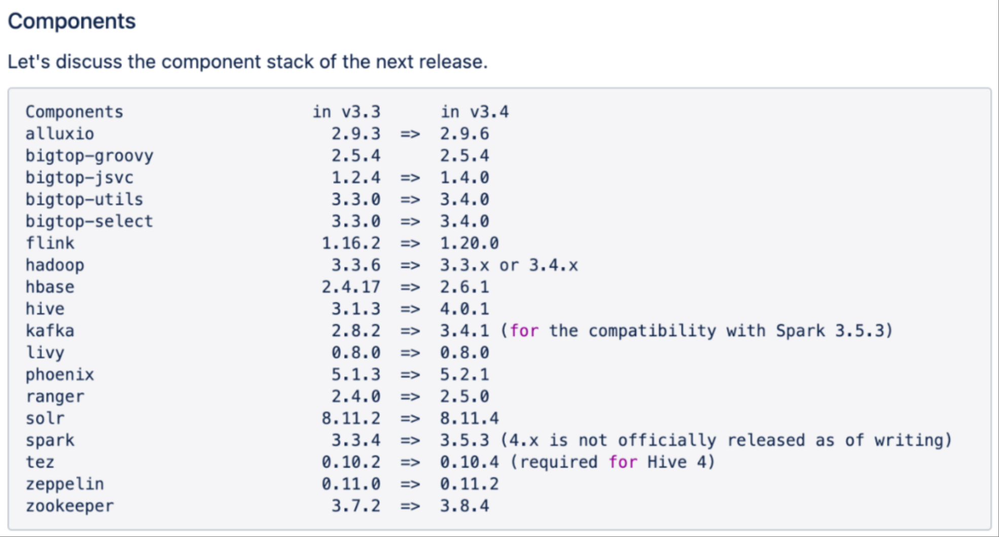
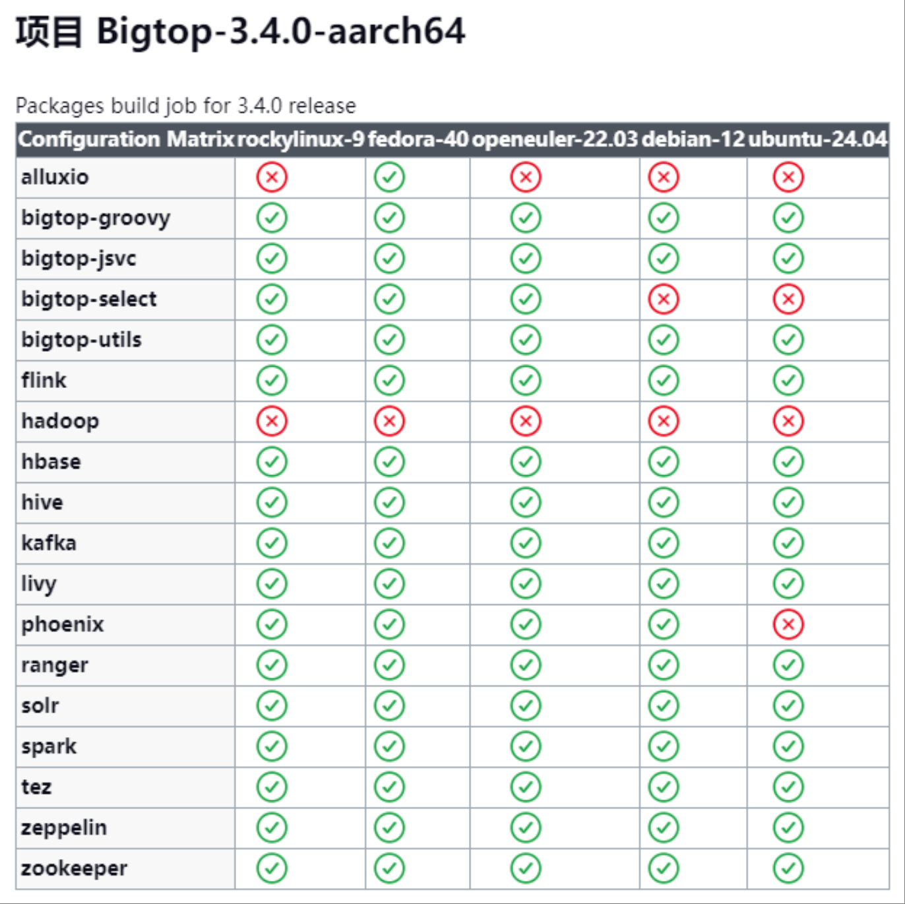
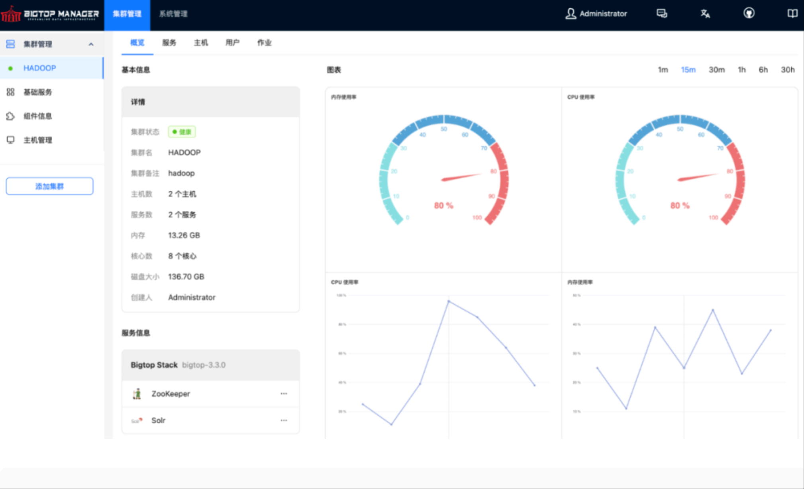

**摘要**

Bigtop Manager 是由 OpenAtom openEuler（简称 openEuler） Bigdata SIG 孵化，捐献给 Apache Bigtop 的子项目，致力于解决大数据组件（如 Hadoop、Spark、HBase）在多架构（x86/ARM）、多系统（openEuler/CentOS/Ubuntu）环境下的复杂部署与运维挑战。Bigtop Manager 通过深度集成 Apache Bigtop 的标准化构建与测试能力，构建了自动化管理平台：基于 Bigtop 的 Gradle 工具链和 Docker 环境实现跨平台二进制包一键生成；通过多层级测试框架（单元测试、冒烟测试）及版本矩阵验证，确保组件在异构环境中的稳定性；提供可视化集群编排、声明式配置管理，减少集群部署时间。未来将聚焦智能运维及国产化生态扩展，推动大数据基础设施向自动化、标准化和全场景覆盖演进，助力企业实现在不同环境下的一体化数据服务管理。

**引言**

在现如今大数据生态越来越繁荣，大数据组件越来越多的情况下，其生态系统面临的问题也越来越多，其中三大核心挑战为：

- 异构环境适配复杂化，跨架构和操作系统部署时，组件依赖（如 JDK 版本、底层库兼容性）需人工逐项适配，耗时且易引发运行时冲突
- 版本兼容性管理粗放，Hadoop 生态组件（如 HDFS、Spark、HBase）版本组合缺乏系统性验证，导致生产环境频繁出现接口不匹配、数据读写异常等问题
- 运维自动化程度不足，集群部署、配置更新、故障恢复依赖手工操作，尤其在混合云场景下，跨集群策略同步困难，资源利用效率低下。这些问题严重制约了大数据技术栈的快速落地与规模化扩展，亟需系统性解决方案。

**流程架构**

基于 Apache Bigtop 与 Bigtop Manager 的大数据集群全生命周期管理流程可划分为四步，形成从组件标准化到生产运维的完整闭环：

- Packaging: 基于 Apache Bigtop 工具链，将 Hadoop 生态组件编译为标准化二进制包，支持多架构（x86/ARM）适配及版本兼容性验证，并通过 Docker 隔离编译环境保障跨平台一致性。
- Deployment: 通过 Web UI 驱动的声明式配置，将 Apache Bigtop 生成的二进制包自动化部署为多节点的 Hadoop 集群，降低部署复杂度，并减少人工运维产生的错误。
- Testing: 通过自动化的单元测试、冒烟测试及集成测试框架验证组件基础功能及跨服务、跨操作系统、跨架构的兼容性，覆盖大部分核心场景，确保部署基线质量满足生产要求。
- Operating: 提供全生命周期运维能力，涵盖监控告警、弹性扩缩容、滚动升级及智能运维，保障集群高可用性。

**自动化构建验证体系**

- 支持最新操作系统版本: 深度适配 openEuler 22.03、Ubuntu 22.04 等主流OS最新发行版，并确保组件与 OS 内核、基础库无缝协同。
- 追踪上游版本及 BUG 修复: 团队及时跟进大数据组件漏洞及版本更新，为社区提供更加可靠的组件版本。
- Jenkins自动化验证兼容性: Jenkins 定期进行跨系统及架构的构建验证，修复失败的构建保证其兼容性。
- 原生多架构二进制包分发: 提供 x86_64/ARM64 架构的 RPM/DEB 原生包，用户可直接安装无需了解内部细节。

**Web 化的大数据管理平台**

作为 Bigtop 社区官方的部署管理平台，Bigtop Manager 填补了 Bigtop 组件栈没有一个用户友好的平台的缺陷，并新增两大能力：

- 多集群管理： 独立管理多个物理隔离的 Hadoop 集群（如开发/测试/生产环境），通过统一的 Web 页面进行运维，且提供基础服务进行监控告警等功能的全局管理。
- 多 Stack 混合部署
	- Bigtop Stack: 托管 Bigtop 官方构建的 Hadoop/Spark 等组件，为用户提供一批版本互相兼容的、多架构适配的、跨平台一致的组件。

	- Extra Stack: 支持集成非 Bigtop 构建的第三方服务，通常为与其他大数据组件版本依赖性不强的社区组件，或用户自研的组件。
    - Infra Stack：所有集群共享的服务，比如 Prometheus/Grafana 等，用于为每个集群提供指标监控、日志采集等能力。

