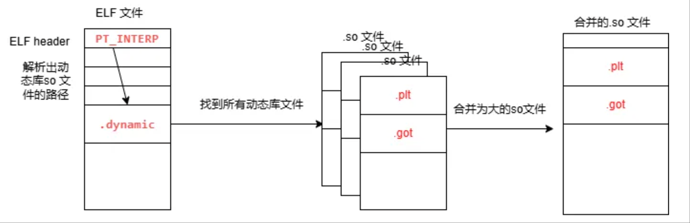
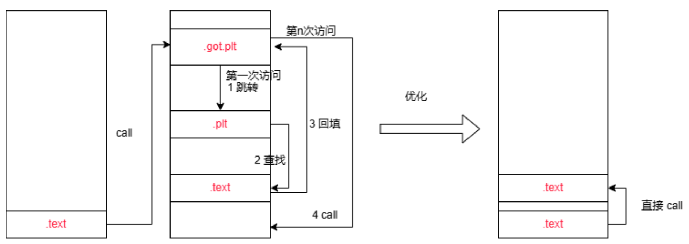
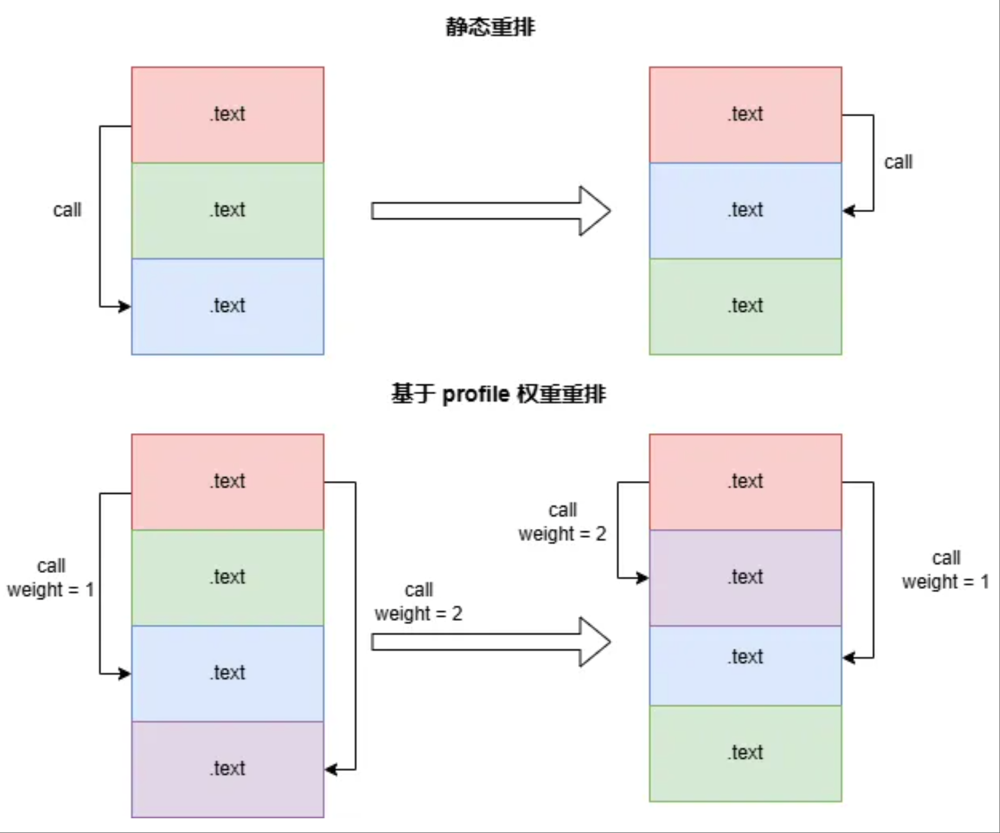
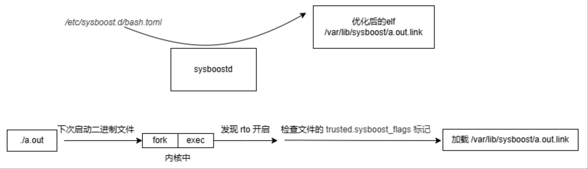

OpenAtom openEuler（简称"openEuler"）社区紧跟时代技术浪潮，在 openEuler 22.03 LTS 版本引入了 sysboost 性能优化技术，提供了优化性能的易用和泛化方案，助力数据库性能优化。本文将带各位读者更深入了解 sysboost 的基本实现原理。

## 特性价值

数据库性能与使用场景密切相关，除了在业务层面上可以通过创建存储索引、优化 sql 查询等方案来提升性能外，在二进制自身也需要适用场景的优化。

sysboost 在二进制层面提供了可针对业务场景的优化性能的能力，其价值不限于：

1. sysboost 优化了启动流程，在降低了启动时延的同时，降低了内存占用。
2. 通过全自动化反馈来提升特定场景的性能，解决了优化性能泛化性问题。

在 MySQL 数据库 TPCC 场景上性能提升 16.68%，除此之外，在 nginx、memcached 等非数据库场景也取得了不同程度的性能提升。

## 背景与挑战

业界数据库场景普遍存在FE Bound，GCC CFGO反馈优化针对此有较好优化效果，已得到广泛应用，但CFGO在实际使用过程中还存在一些局限性：

1. 用户需侵入式修改构建系统，使能步骤繁杂；
2. 优化过程收集/处理数据开销大，影响系统性能；
3. 应用运行场景发生剧烈变化时，无法及时调整和更新。

在二进制优化上，需要一种简单易用的优化手段，根据不同的使用场景动态完成优化和迭代，sysboost 技术应运而生。

## 基本实现原理

sysboost 是一种动态二进制反馈优化技术，通过代码重排技术对可执行文件和动态库文件在线重排操作，优化代码与运行环境的CPU微架构的适应性，从而提升程序性能。

### 关键技术1 动态库拼接

在应用程序加载动态库时，分散的动态库的代码段数据段映射到不同的地址范围，占用大量TLB 表项，sysboost 自动检测 ELF 文件依赖的动态库，将其拼接为大的 ELF 文件。在加载时使用大页内存映射，提升 iTLB 的命中率

### 关键技术2 消除 PLT 跳转

动态库加载过程需要索引 plt 和 got 表，造成指令跳转开销。在动态库拼接过程中，PIE 符号的位置可以直接计算出来，因而可以消除 plt 段。

### 关键技术3 bolt 算法优化

sysboost 采用 bolt 优化算法，分析编译单元的调用关系，重排编译单元，以实现调用的局部化，实现”大跳变小跳"的优化，减少 cache miss。

sysboost 还支持以 perf 收集的 profile 文件 （例如 `perf record -e cycles:u -o profile.data -p 8172 -- sleep 60`）为权重，生成更优布局的重排二进制。可以通过在 `/usr/lib/sysboost.d/profile/` 目录或二进制文件所在目录中添加 `<二进制文件名>.profile` 文件来启用基于权重的优化功能。

### 关键技术4 大页加载二进制文件

大页加载可以减少页表访问，减少时延，实现原理如下：

sysboost.service 会启动一个守护进程，每 10s 检查一次 `/etc/sysboost.d/bash.toml` 配置文件，当发现配置文件更新后，会依据配置将二进制文件与依赖的 ko 文件执行上述优化，并在文件上做一个 trusted.sysboost_flags 标记，并通过内核的 sys 接口将启用内核的 rto （real time optimize）开关，在重新加载二进制文件时，内核发现 rto 启用，就会检查文件的 xattr，发现 trusted.sysboost_flags 标记时，会自动以大页加载优化后的文件。

文中所述的特性支持，由 openEuler storage SIG 参与，相关源码均已在 openEuler 社区开源：

[https://gitee.com/openeuler/sysboost](https://gitee.com/openeuler/sysboost)