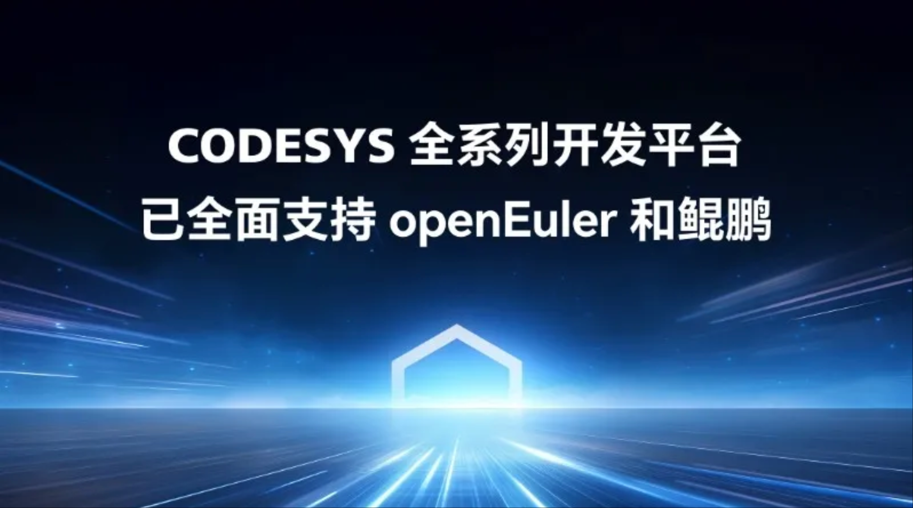
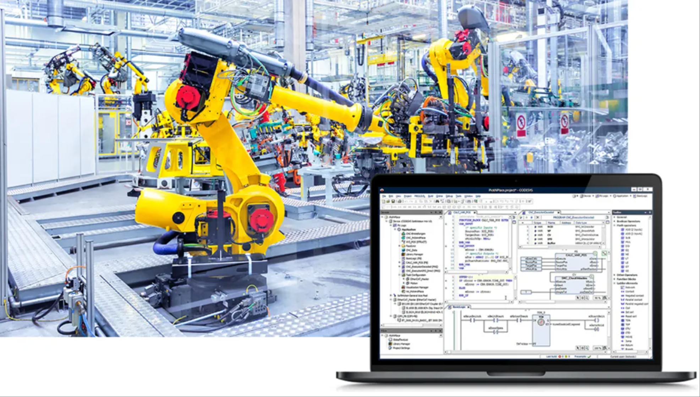
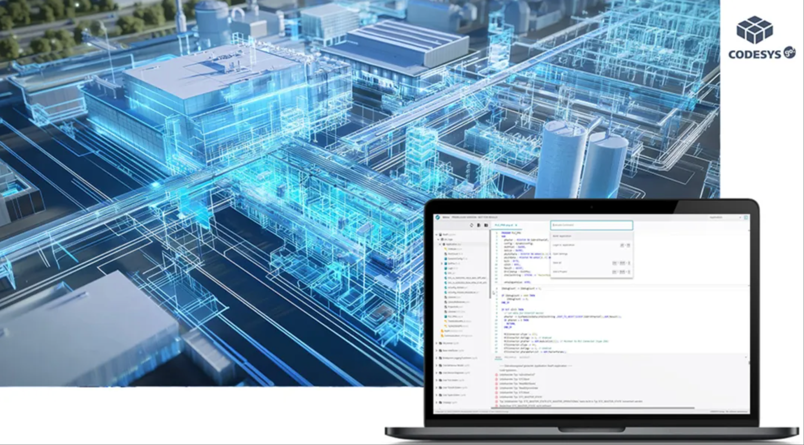
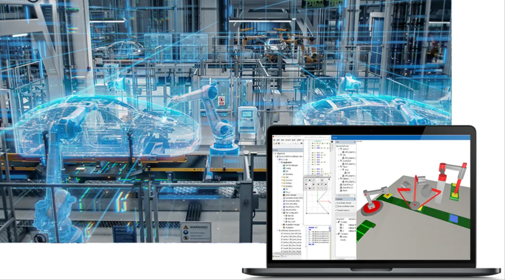

OpenAtom openEuler（简称“openEuler”）社区与工业自动化全球领军企业 CODESYS 集团联合宣布，经过深度技术合作，**CODESYS 全系列开发平台（含 CODESYS Runtime 核心运行平台、新一代低代码工具 CODESYS Go 及 CODESYS Virtual Control 平台）已全面支持 openEuler 和鲲鹏**！这一里程碑式合作，将为智能制造、工业物联网等领域提供「高实时性、跨平台兼容、低开发门槛」的解决方案，推动工业控制技术与开源生态的深度融合。

### 三大核心平台全面适配，重构工业控制技术底座

#### CODESYS Runtime：实时控制引擎的性能跃升

作为工业级实时控制内核，CODESYS Runtime 基于 openEuler 的**混合关键性部署框架（MICA）**，实现「软实时 + 硬实时」任务的精准调度：

- 实时性突破：在工业机器人场景中，控制任务周期抖动从 100μs 压缩至 10μs，设备运动精度提升 90%，满足精密加工、半导体检测等严苛场景需求；
- 算力释放：结合鲲鹏硬件加速，运算性能提升 10%，事件处理时间从 17.08ms 骤降至 1.01ms，边缘侧 AI 推理效率同步提升 30%；
- 支持多样性计算：无缝支持 ARM、x86、LoongArch 等主流芯片架构，适配 PLC、伺服控制器、工业 PC 等全形态设备，助力「一核多系统」混合部署落地。

#### CODESYS Go：低代码开发的跨平台革命

新一代编程平台 CODESYS Go 在 openEuler 上实现**全流程工业应用开发体验**：

- 效率倍增：通过拖拽式界面、IEC 61131-3 标准语言与 Python/C++ 混合编程，开发周期大幅缩短，零基础工程师也能快速构建工业控制逻辑；
- 安全强化：依托 openEuler 的安全容器方案，代码执行环境隔离度提升 80%，满足工业 4.0 对数据加密、漏洞防护的最高等级要求。

#### CODESYS Virtual Control：软件定义控制的革命性产品

CODESYS Virtual Control 作为工业级 PLC 虚拟控制平台，现已全面适配 openEuler ，实现「无硬件部署」的颠覆性体验：

- 支持多样性计算：支持 ARM、x86、LoongArch 等主流芯片架构，可在 openEuler 设备上直接运行，例如在工业 PC 或边缘网关中运行 PLC 程序，无需额外硬件投资；
- 实时性保障：基于 openEuler MICA 框架，结合鲲鹏硬件加速，任务周期抖动控制在微秒级，与物理 PLC 运行精度误差小于 1%，满足高精度设备调试需求；
- 生态融合：无缝对接 CODESYS Go，开发者可在 CODESYS Go 中完成对**Virtual Control 的**代码编写、仿真测试、一键部署到物理设备的全流程，开发效率大幅提升；
- 安全增强：集成 openEuler 的安全容器技术，虚拟控制运行环境与生产环境隔离度提升 80%，有效防止恶意代码注入，满足工业控制系统的安全等级要求。

### 三大核心价值，赋能千行百业智能化转型

#### 全场景覆盖，解锁工业控制新可能

- 智能制造：某企业基于该方案开发的机器人控制平台，任务周期抖动减少 50%，硬件成本降低 30%，推动高端工业机器人突破；半导体检测设备中，设备节拍与 AI 缺陷检出率同步提升 20%，助力芯片制造良率优化。
- 能源电力：通过 CODESYS Runtime 实时采集电网边缘数据，结合 AI 算法模块，实现配电网故障秒级定位与无人值守配电房管理，运维效率大大提升。
- 工业物联网：支持 OPC UA、ModBus 等 数十种工业协议，搭配 openEuler 的轻量化内核，可在传感器、网关、工业服务器等设备上灵活部署，构建端到端的工业物联网解决方案。

#### 生态协同，降低开发门槛

CODESYS 全面兼容 openEuler 软件生态，未来可通过 CODESYS 无缝调用 openEuler 社区超 800 + 工业级软件包，涵盖 HMI 开发、仿真测试、工业总线适配等全流程工具链。同时，支持与华为云工业互联网平台无缝对接，实现「开发 - 部署 - 运维」全链路。

#### 未来技术储备，布局工业 4.0 前沿

双方已启动深度优化合作，后续将重点突破港口自动化、矿山无人化、钢铁智能产线等重工业场景。

### 共建开源生态，开启工业软件新未来

此次合作是 openEuler 全场景生态在工业领域的重要落子。CODESYS 将依托 openEuler 社区开源能力，与华为共同孵化工业控制领域的开源组件与行业解决方案，降低中小企业技术投入门槛。
