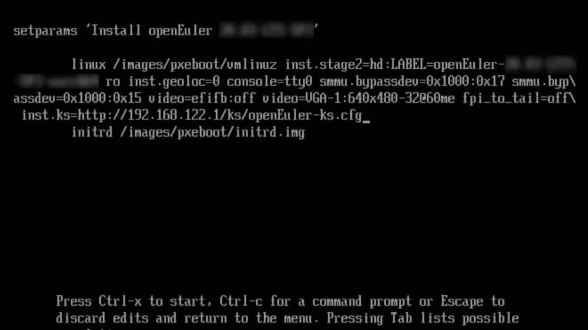
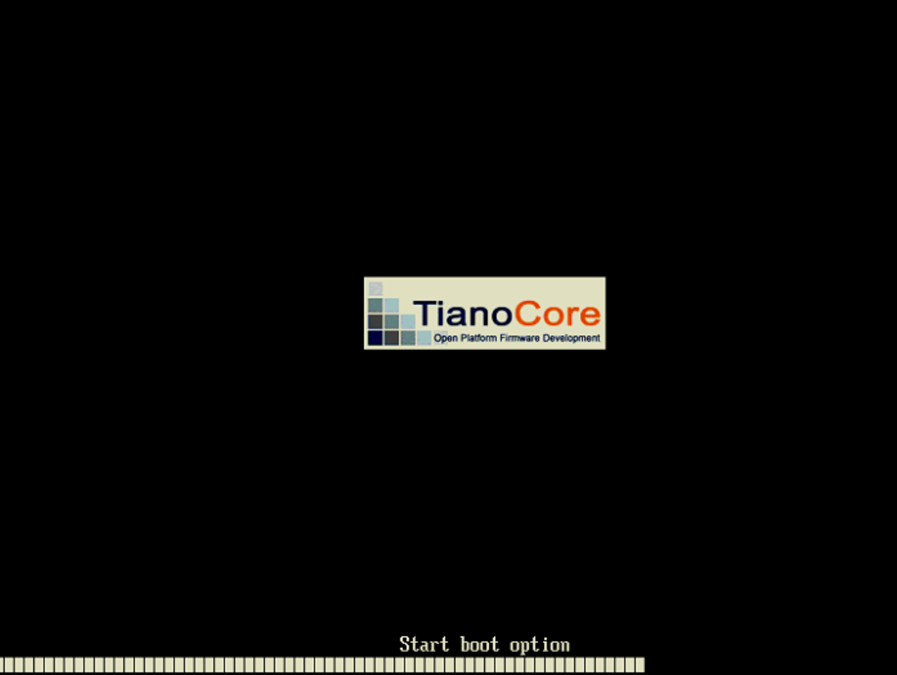
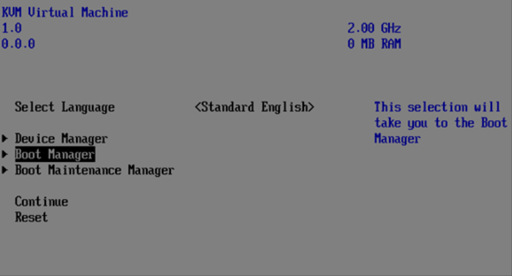
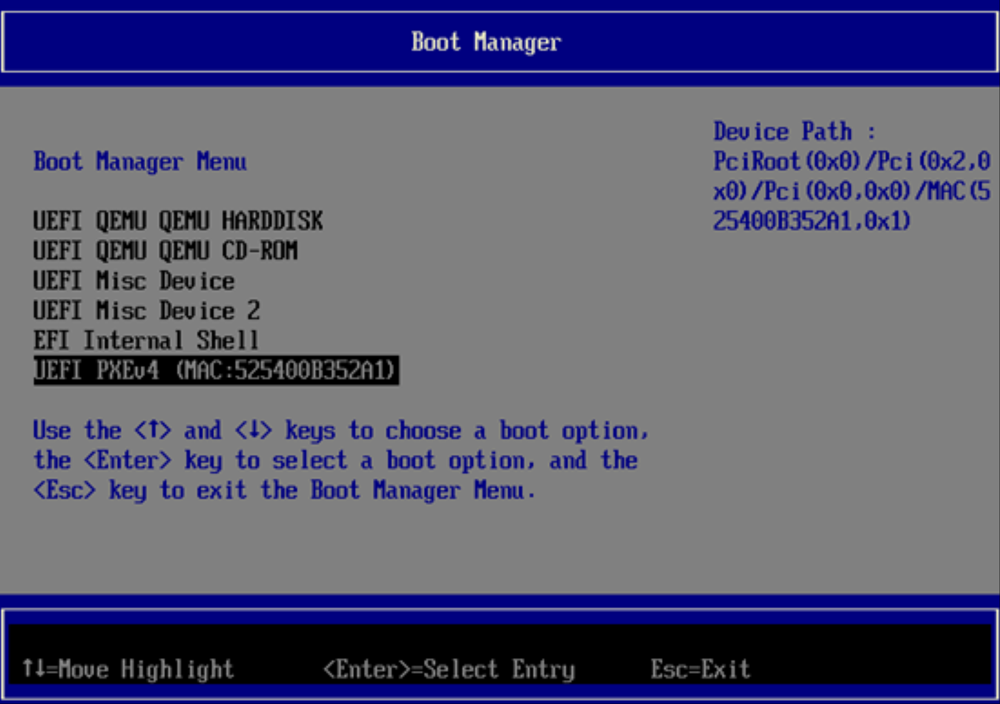

Kickstart 是一种用于自动化安装 Linux 操作系统的工具，它通过配置文件来定义安装过程中的所有参数和选项，从而实现无需人工干预的批量系统安装。这种工具在需要部署大量服务器或需要标准化系统安装的场景中尤为实用，可显著提高安装效率并确保安装的一致性。

用户可以使用 Kickstart 进行 OpenAtom openEuler（简称“openEuler”）系统的自动化安装，包括如下两种方式：

- **半自动化安装**：安装人员不需要手动设定操作系统的键盘、语言、分区等具体属性（通过 Kickstart 实现自动化），但是需要手动指定 Kickstart 文件的位置。
- **全自动化安装**：实现操作系统的安装过程全自动化。

本文将展示使用这两种方式安装 openEuler。整个安装过程需要两台设备，一个设备用于运行 httpd 服务，另外一台设备用于安装 openEuler。


## 半自动化安装

使用 Kickstart 进行 openEuler 系统的半自动化安装的环境要求如下：

- 物理机/虚拟机（虚拟机创建可参考对应厂商的资料）。包括使用 Kickstart 工具进行自动化安装的计算机和被安装的计算机。
- httpd：存放 Kickstart 文件。
- ISO： openEuler-25.03-aarch64-dvd.iso
- 使用 `iptables -F` 关闭 httpd 服务所在的操作系统防火墙。

### 安装步骤

在需要运行 httpd 服务的设备上，需要进行以下配置

- 安装 httpd。

  ```
  dnf install httpd -y
  systemctl start httpd
  systemctl enable httpd
  ```

- 准备 Kickstart 文件。

  ```
  mkdir /var/www/html/ks
  vim /var/www/html/ks/openEuler-ks.cfg ===>根据已安装openEuler系统自动生成的anaconda-ks.cfg修改得到
  ====================================
  ***以下内容需要根据实际需求进行修改***
  #version=DEVEL
  ignoredisk --only-use=sda
  autopart --type=lvm
  # Partition clearing information
  clearpart --none --initlabel
  # Use graphical install
  graphical
  # Use CDROM installation media （也可以选择NFS等网络安装，本教程使用 cdrom 安装作为示例）
  cdrom
  # Keyboard layouts
  keyboard --vckeymap=cn --xlayouts='cn'
  # System language
  lang zh_CN.UTF-8
  # Network information
  network  --bootproto=dhcp --device=enp4s0 --ipv6=auto --activate
  network  --hostname=openeuler.com
  # Root password
  rootpw --iscrypted $6$fQE83lxEZ48Or4zc$j7/PlUMHn29yTjCD4Fi44WTZL/RzVGxJ/7MGsZMl6QfE3KjIVT7M4UrhFXbafvRq2lUddAFcyWHd5WRmXfEK20
  # Run the Setup Agent on first boot
  firstboot --enable
  # Do not configure the X Window System
  skipx
  # System services
  services --disabled="chronyd"
  # System timezone
  timezone Asia/Shanghai --utc --nontp
  %packages
  @^minimal-environment
  @standard
  %end
  %anaconda
  pwpolicy root --minlen=8 --minquality=1 --notstrict --nochanges --notempty
  pwpolicy user --minlen=8 --minquality=1 --notstrict --nochanges --emptyok
  pwpolicy luks --minlen=8 --minquality=1 --notstrict --nochanges --notempty
  %end
  %post
  #enable kdump
  sed  -i "s/ ro / ro crashkernel=1024M,high /" /boot/efi/EFI/openEuler/grub.cfg
  %end
  =====================================
  ```

- 配置密码密文生成方式：

  ```
  # python3
  Python 3.7.0 (default, Apr  1 2019, 00:00:00)
  [GCC 7.3.0] on linux
  Type "help", "copyright", "credits" or "license" for more information.
  >>> import crypt
  >>> passwd = crypt.crypt("myPasswd")
  >>> print (passwd)
  $6$63c4tDmQGn5SDayV$mZoZC4pa9Jdt6/ALgaaDq6mIExiOO2EjzomB.Rf6V1BkEMJDcMddZeGdp17cMyc9l9ML9ldthytBEPVcnboR/0
  ```


在要安装 openEuler 的设备上，需要将 ISO 镜像文件挂载到光驱上，并进行如下操作：

- 在进入安装引导界面后，选择 `Install openEuler 25.03` ,并按下 e 键，配置启动参数。
- 在启动参数中追加 `inst.ks=<httpd server ip>/ks/openEuler-ks.cfg`



- 按 `Ctrl+x` ，系统开始自动安装。
- 系统安装完毕，如果 BIOS 设置优先从光驱启动，会再次进入到安装界面。建议安装完毕后关机，调整启动顺序开机。


## 全自动化安装

### 环境要求

使用 Kickstart 进行 openEuler 系统的全自动化安装的环境要求如下：

- 物理机/虚拟机（虚拟机创建可参考对应厂商的资料）。包括使用 Kickstart 工具进行自动化安装的计算机和被安装的计算机。
- httpd：存放 Kickstart 文件。
- tftp：提供 vmlinuz 和 initrd 文件。
- dhcpd/pxe：提供 DHCP 服务。
- ISO： openEuler-25.03-aarch64-dvd.iso
- 使用 `iptables -F` 关闭 httpd 服务所在的操作系统防火墙。

### 安装步骤

在需要运行 httpd 服务的设备上，需要进行以下配置

- httpd 的安装与服务启动。

  ```
  dnf install httpd -y
  systemctl start httpd
  systemctl enable httpd
  ```

- 安装配置 tftp。

  ```
  dnf install tftp-server -y
  vim /etc/xinetd.d/tftp
  service tftp
  {
      socket_type = dgram
      protocol = udp
      wait = yes
      user = root
      server = /usr/sbin/in.tftpd
      server_args = -s /var/lib/tftpboot
      disable = no
      per_source = 11
      cps = 100 2
      flags = IPv4
  }
  systemctl start tftp
  systemctl enable tftp
  systemctl start xinetd
  systemctl status xinetd
  systemctl enable xinetd
  ```

- 制作安装源。

  ```
  mount openEuler-21.09-aarch64-dvd.iso /mnt
  cp -r /mnt/* /var/www/html/openEuler/
  ```

- 设置和修改 Kickstart 配置文件 openEuler-ks.cfg，参考上一步安装源的目录，此处选择 http 安装源。

  ```
  vim  /var/www/html/ks/openEuler-ks.cfg
  ====================================
  ***以下内容根据实际需求进行修改***
  #version=DEVEL
  ignoredisk --only-use=sda
  autopart --type=lvm
  # Partition clearing information
  clearpart --none --initlabel
  # Use graphical install
  graphical
  # Keyboard layouts
  keyboard --vckeymap=cn --xlayouts='cn'
  # System language
  lang zh_CN.UTF-8
  #Use http installation source
  url --url=http://192.168.122.1/openEuler/
  %post
  #enable kdump
  sed  -i "s/ ro / ro crashkernel=1024M,high /" /boot/efi/EFI/openEuler/grub.cfg
  %end
  ...
  ```

- 修改 pxe 配置文件 grub.cfg， 可参考如下内容(openEuler 当前不支持 bls 格式的 cfg 文件)。

  ```
  cp -r /mnt/images/pxeboot/* /var/lib/tftpboot/
  cp /mnt/EFI/BOOT/grubaa64.efi /var/lib/tftpboot/
  cp /mnt/EFI/BOOT/grub.cfg /var/lib/tftpboot/
  ls /var/lib/tftpboot/
  grubaa64.efi  grub.cfg  initrd.img  TRANS.TBL  vmlinuz
  vim /var/lib/tftpboot/grub.cfg
  set default="1"
  function load_video {
  if [ x$feature_all_video_module = xy ]; then
      insmod all_video
  else
      insmod efi_gop
      insmod efi_uga
      insmod ieee1275_fb
      insmod vbe
      insmod vga
      insmod video_bochs
      insmod video_cirrus
  fi
  }
  load_video
  set gfxpayload=keep
  insmod gzio
  insmod part_gpt
  insmod ext2
  set timeout=60
  ### BEGIN /etc/grub.d/10_linux ###
  menuentry 'Install openEuler 25.03 ' --class red --class gnu-linux --class gnu --class os {
      set root=(tftp,192.168.1.1)
      linux /vmlinuz ro inst.geoloc=0 console=ttyAMA0 console=tty0 rd.iscsi.waitnet=0 inst.ks=http://192.168.122.1/ks/openEuler-ks.cfg
      initrd /initrd.img
  }
  ```

- DHCP 的配置（可以使用 dnsmasq 代替 ）。

  ```
  dnf install dhcp -y
  vim /etc/dhcp/dhcpd.conf
      ddns-update-style interim;
      ignore client-updates;
      filename "grubaa64.efi";    # pxelinux 启动文件位置;
      next-server 192.168.122.1;  # (重要)TFTP Server 的IP地址;
      subnet 192.168.122.0 netmask 255.255.255.0 {
      option routers 192.168.122.1; # 网关地址
      option subnet-mask 255.255.255.0; # 子网掩码
      range dynamic-bootp 192.168.122.50 192.168.122.200; # 动态ip范围
      default-lease-time 21600;
      max-lease-time 43200;
  systemctl start dhcpd
  systemctl enable dhcpd
  ```


在要安装 openEuler 的设备上，执行如下操作：

- 开机按F2进入 BIOS>BootManager 选择选择网络启动，开始自动化安装。







- 进入系统全自动化安装界面。
- 系统安装完毕。
