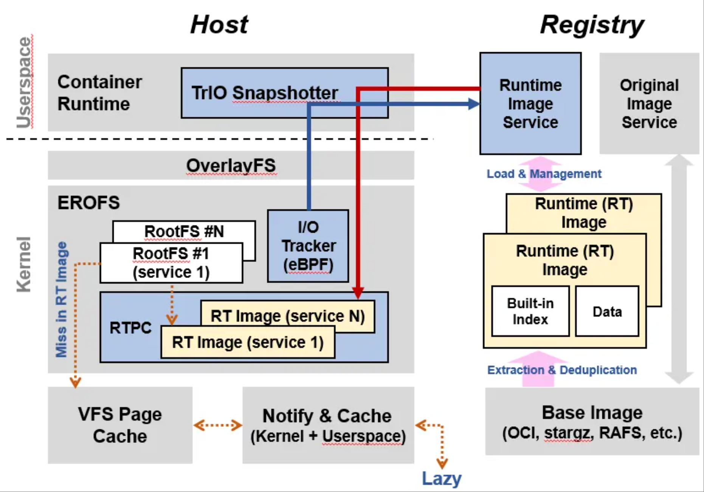
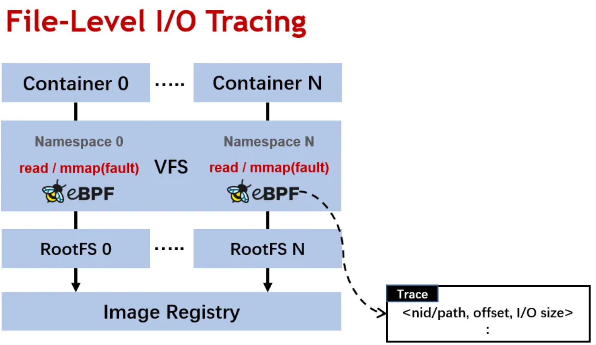
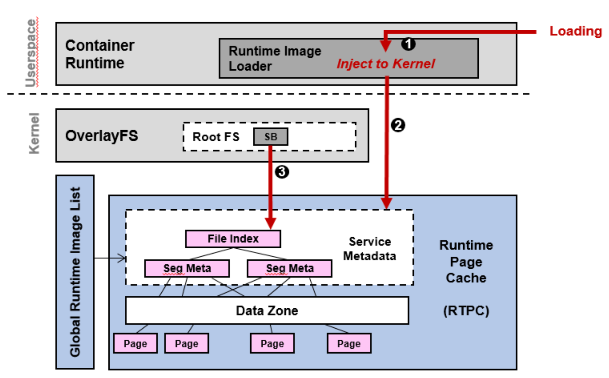

## TrIO：让容器启动性能最高提升21倍

容器已成为云计算重要的基础设施之一。容器启动性能是关键性能指标，在弹性扩容、故障恢复、热点消减等场景中尤为重要。由于容器镜像体积大、启动流程复杂，使得容器启动时间大幅变慢，例如基于 Pytorch 的 AI 容器启动需要好几分钟，已成为客户核心痛点。

当前产业界方案主要采用懒加载的优化策略，即在启动时只加载一小部分镜像，在运行时按需触发加载使用到的镜像。但现有懒加载存在 I/O 效率低、频繁网络传输、预取不精准等问题。

目前 TrIO 已经可以 在 OpenAtom openEuler（简称"openEuler"） 25.03 中 使用。

### TrIO：容器启动加速的技术

针对当前技术局限，openEuler 推出 TrIO 容器启动加速技术。TrIO 包括四个主要组件：

- **TrIO 驱动程序** ：在容器运行时内工作，起到控制平面作用。
- **I/O 跟踪器** ：在操作系统内核中工作，并在容器运行期间收集 I/O 行为。
- **运行时页面缓存** ：在文件系统中实现，它基于容器镜像和 I/O 特征高效构建容器的根文件系统。
- **运行时镜像管理服务** ：部署在镜像仓库后端用于服务于运行时镜像管理。

### 容器启动加速关键技术

#### 关键技术一：I/O 聚合

TrIO 的核心思想是聚合 I/O 操作。容器启动过程中会使用分散在不同文件中的不同部分，从而频繁触发网络 I/O 来读取不同文件内容，造成效率低下。TrIO 首先利用 eBPF 跟踪收集容器启动时读取镜像文件的所有 I/O 请求，然后将这些 I/O 请求编排为容器镜像中，并将它们推送到镜像仓库后端。在容器启动时，只需要一次大 I/O 将编排过的镜像一次性拉到本地容器节点，即可完成镜像读取，大幅降低了 I/O 次数，提升了 I/O 和网络效率。

#### 关键技术二：运行时页面缓存

经过 I/O 聚合后的镜像，在本地容器节点无法直接生成容器的根文件系统，而需要将聚合后的内容还原回每个文件对应的部分。TrIO 中的运行时页面缓存来解决这个问题。运行时页面缓存构建在 OverlayFS 层，将聚合镜像中的内容缓存在相应文件的区域并建立索引。进一步运行时页面缓存提供增量加载和去重的功能，不同聚合镜像中相同的页面会映射到同一个运行时页面缓存，减少了系统的内存占用。

### TrIO 原型效果和研究成果

我们用 pytorch 和 TensorFlow 容器做测试，TrIO 相比于默认容器加载，容器启动加速分别从从 127 秒和 35 秒提升到 6 秒和 8 秒，加速比达 21 倍和 4.3 倍。

TrIO 相关技术发表在计算机存储领域 A 类顶会 FAST’25 上，论文具体信息如下：

- 题目：FlacIO: Flat and Collective I/O for Container Image Service

- 作者：openEuler Kernel SIG：刘育擘、黎红波、刘明睿、郭寒军、任玉鑫、贾宁等

- 链接:https://www.usenix.org/conference/fast25/presentation/liu-yubo

TrIO 相关源码均已在 openEuler 社区开源，查看软件仓库了解更多。

TrIO 软件仓库址:https://gitee.com/openeuler/kernel/tree/openEuler-25.03/tools/trio

