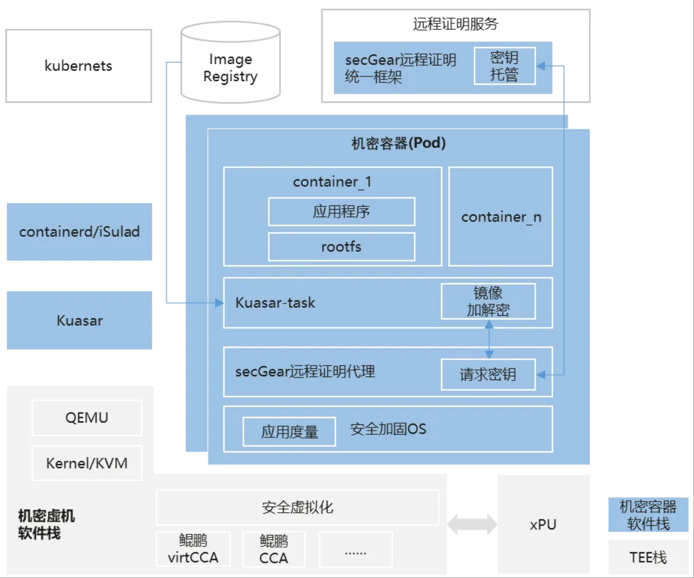

在数字化转型与全球数据治理的双重驱动下，数据安全正面临前所未有的挑战。一方面，以 GDPR、CCPA 为代表的隐私保护法规对数据处理提出了严格的合规要求[1]；另一方面，云计算、边缘计算等技术的普及使得数据流动与共享的边界持续扩展，传统安全机制（如存储加密、传输加密）已难以覆盖数据全生命周期，尤其是在运行环节数据的暴露风险日益凸显。在此背景下，**机密计算**（Confidential Computing）应势而生，通过硬件级可信执行环境（TEE，如 Intel TDX、ARM CCA 等）确保数据的“使用中安全”（Data in Use），成为隐私保护的关键技术趋势。

然而，在云原生架构主导的现代基础设施中，数据安全仍面临双重痛点：其一，容器化技术虽提升了资源利用率和敏捷性，但其共享内核、多租户共存的特性增加了敏感数据泄露的潜在风险；其二，机密计算依赖定制化硬件与复杂开发框架，技术门槛高、生态碎片化，难以无缝融入云原生的标准化工作流。**机密容器**（Confidential Containers）的创新正在于此——它将 TEE 能力封装为轻量化的容器运行时，使开发者无需重构应用即可在 Kubernetes 等原生平台上实现“零信任”安全，既降低了机密计算的使用成本，又为云原生负载提供了从启动、运行到销毁的全周期数据保护。

OpenAtom openEuler （简称“openEuler”或 “开源欧拉”） 社区本次探索 iSulad + Kuasar + secGear 的云原生机密容器方案，为 AI 大模型等高敏感场景提供兼顾隐私保护与算力弹性的新一代可信基础设施。

## iSulad+Kuasar：新一代统一容器运行时解决方案

2023 年，华为在 CNCF 峰会上重磅推出了 Kuasar—— 一款支持多种沙箱隔离技术的创新型容器运行时[2]。这一前沿技术具备独特的优势，它能够在单个节点上灵活运行多种不同类型的沙箱容器，为多样化的应用场景提供了强大的支持。

在容器进程管理方面，Kuasar 采用了别具一格的 1:N 容器进程管理模型。相较于当前普遍采用的 Shim 进程 1:1 设计，这一模型在容器并发运行时展现出了卓越的性能提升。经测试，Kuasar 可将容器启动速度提升 2 倍以上，同时大幅节省容器管理进程的内存增量，节省幅度高达 99%[2]，有效缓解了资源压力，显著提升了系统的整体运行效率。

此外，Kuasar 基于 Sandbox API [3]接口进行开发，与当前的 Shim v2 接口形成鲜明对比。这种独特的设计使得 Kuasar 在沙箱生命周期管理上具有显著优势，内存消耗更小，调用链更为简短，为容器的稳定运行和高效管理提供了有力保障。

因此使用 iSulad+Kuasar 作为机密容器解决方案的容器运行时，在性能和资源使用上具备强大优势。

## secGear 远程证明统一框架

远程证明统一框架[4][5]遵循 RFC9334 RATS 标准架构，兼容多 TEE 平台实现统一远程证明流程，简化证明服务的部署及证明代理的集成，并且支持快速扩展新的 TEE 平台插件，技术架构如图所示：


### 关键功能组件

- **报告校验插件框架**：支持运行时兼容 vritCCA/CCA 等不同 TEE 平台证明报告检验，支持扩展新的 TEE 报告检验插件。
- **证书基线管理**：支持对不同 TEE 类型的 TCB/TA 基线值管理及公钥证书管理，支持多版本基线管理，支持过期版本吊销等，集中部署到服务端。
- **策略引擎**：支持 OPA 策略引擎，并提供默认策略（易用），支持用户定制策略（灵活）。
- **身份令牌**：对不同 TEE 证明报告验证后，签发 JWT 格式身份令牌，由证明服务提供方签名背书，实现不同 TEE 之间通过身份令牌相互认证后，进行交互和协作。
- **资源托管**：支持用户资源注入，基于证明报告及验证策略鉴权通过后获取托管资源。支持本地存储或对接第三方资源如 KMS、OBS 等。在机密容器场景，可以将镜像加解密密钥作为一种资源，托管到远程证明服务中，远程证明验证通过后才可获取到托管的密钥。
- **证明代理**：兼容 TEE 报告获取，身份令牌验证等，对接远程证明服务，易集成，使用户聚焦业务。

## iSulad + Kuasar + secGear 机密容器解决方案

本方案基于轻量级沙箱容器和机密计算结合构建机密容器，保护容器镜像的机密性和完整性，保护工作负载的机密性，防止非授权实体的非法访问，同时兼容云原生生态，提高机密计算的易用性，整体方案如下图所示：



- **Kuasar**：对接 QEMU 实现机密虚机生命周期管理，向上屏蔽不同类型的机密虚机，如鲲鹏 virtCCA[6]、鲲鹏 CCA 等。
- **iSulad**：将拉取容器镜像动作卸载到机密容器内的 Kuasar-task，在机密容器内部拉取并解密容器镜像，保护容器镜像的机密性和完整性。
- **secGear**：屏蔽 TEE 硬件差异，提供统一的远程证明和镜像加解密密钥获取流程。

在兼容性方面，Kubernetes 选择机密容器运行时后，按照一般的拉起方式拉起 pod 即可，因此对于 Kubernetes 组件而言，无需改动现有的应用程序和工作流程即可使用机密容器。

### 工作流程解析

#### 创建机密虚机

相比于普通安全容器的虚机拉起，机密容器需要支持机密虚机的硬件环境及配套的 OS，如鲲鹏 virtCCA + openEuler 24.03 LTS SP2，满足环境条件后，配置好 Kuasar 所需参数，即可创建机密虚机。 在机密虚机启动后，虚机首进程 kuasar-task 将根据传入的参数，拉起 secGear 远程证明代理。


#### 远程拉取加密镜像拉起容器

当容器引擎启动容器时关键步骤如下：

1. kuasar-task 调用 image-rs 拉取镜像，根据加密镜像地址拉取镜像到机密虚机。
2. image-rs 请求 secGear 远程证明代理获取解密镜像的密钥。
3. secGear 远程证明代理获取当前机密虚机的实时度量报告 evidence，并携带 evidence 向 secGear 远程证明服务请求密钥。
4. secGear 远程证明服务验证 evidence 通过后，返回密钥。
5. image-rs 解密镜像成功后，Kuasar-task 在机密虚机内启动容器。


### 使用示例

拉起机密容器的步骤可以分为两个部分，第一部分是机密容器的前置准备，第二部分和普通安全容器的拉起相同，因此这里重点介绍前置准备工作。详细步骤可以参考 iSulad +Kuasar 机密容器部署指南[7]。

#### 打包镜像的 CA 证书

由于机密容器需要在沙箱内拉容器镜像，因此需要重新打包目标镜像网站的 CA 证书到机密虚机的 rootfs 镜像，方法示例如下：

1.在镜像仓服务器：如果是本地镜像仓，需要先将镜像仓证书写入镜像本地仓所在服务器根证书，如果 domain.crt 文件为镜像仓证书，执行如下命令：

```
$cat domain.crt >> /etc/pki/ca-trust/extracted/pem/tls-ca-bundle.pem$cat domain.crt >> /etc/pki/ca-trust/extracted/openssl/ca-bundle.trust.crt
```

2.在机密容器服务器：需要将访问远程镜像仓库所需的证书，打包到机密沙箱镜像：比如当机密容器服务器已经可以成功访问镜像仓服务器时，将机密容器服务器上的证书和镜像仓服务器证书 domain.crt 都打包到机密沙箱镜像：

```
$ls /var/lib/kuasar/cc-rootfs.img/var/lib/kuasar/cc-rootfs.img$mkdir cc-rootfs$mount /var/lib/kuasar/cc-rootfs.img ./cc-rootfs$cp -r /etc/pki/ca-trust ./cc-rootfs/etc/pki/ca-trust$cat domain.crt >> ./cc-rootfs/etc/pki/ca-trust/extracted/pem/tls-ca-bundle.pem$cat domain.crt >> ./cc-rootfs/etc/pki/ca-trust/extracted/openssl/ca-bundle.trust.crt$umount ./cc-rootfs
```

#### 远程证明代理与加密镜像配置

如果还需使用远程代理和加密镜像的功能，需要做如下配置：

1.上传加密镜像到远程镜像服务器时，需要为镜像的 manifest 添加注解，格式如下：

```
"org.opencontainers.image.enc.keys.provider.secgear": "<远程托管的密钥路径的base64编码>"
```

2.为远程证明服务节点预置远程证明根证书，如果该证书文件为 as_cert.pem，示例步骤如下：

```
$mount /var/lib/kuasar/cc-rootfs.img ./cc-rootfs$mkdir -p ./cc-rootfs/etc/attestation/attestation-agent$cp as_cert.pem ./cc-rootfs/etc/attestation/attestation-agent/as_cert.pem$umount ./cc-rootfs
```

3.为远程证明和镜像解密服务配置参数，示例如下：

```
$cat /var/lib/kuasar/cc-config.toml... ...kernel_params = "task.aa_kbc_params=127.0.0.1:8088 task.aa_kbc_key_provider=secgear task.aa_ser_url=xx.xx.xx.xx:8080: task.aa_cert=/etc/attestation/attestation-agent/as_cert.pem task.aa_proto=http ... ..."
```

当前 task.aa_kbc_key_provider 只支持"secgear"，task.aa_proto 只支持"http"，默认为"http"。

配置完毕上述参数后，重启 cc-kuasar-vmm.service 后配置生效，用于拉起之后的机密沙箱。 重新启动 iSulad 和 Kuasar 进程

```
$systemctl restart cc-kuasar-vmm.service
```

#### 启动机密容器

当上述的准备工作完成后，只需在容器配置文件中的镜像地址使用加密镜像地址，即下文 container.json 文件中的 image 参数，其他配置以及命令的使用方式与普通安全容器一致。

例如：启动机密容器

```
$crictl runp --runtime cc pod.json8d69fee1179c4b0626230c315f48daf5ae75fcd36f080c4547724cc9aa590db9$crictl create 8d container.json pod.jsone69888c21385facad647e51998c5406092734d73834f9b84842820f8aef9d408$crictl start e6e6
```

## 技术应用前景

| 容器类别 | 安全容器 | 机密容器 |
| --- | --- | --- |
| 信任假设 | 容器内业务不可信，管理平台可信 | 管理平台不可信，容器内业务可信 |
| 威胁模型 | 防止容器逃逸、资源滥用、危害其他租户和平台 | 防止基础设施特权程序或管理面，非法访问容器内隐私数据 |

相较于传统容器与普通安全容器，机密容器解决方案凭借其独特的安全优势，在对数据安全有着极高要求的领域展现出巨大的应用潜力。

以金融行业为例，该领域涉及资金交易、账户信息、客户信用记录等核心数据，这些数据直接关系到个人财产安全与金融机构的稳健运营。正因如此，世界各国均针对金融数据安全制定了严苛的法规与标准，旨在确保金融体系的稳定运行和客户权益的有效保护。

在医疗健康领域，患者的身份信息、健康状况、疾病诊断和治疗记录等数据不仅包含高度敏感的个人隐私，更与患者的生命健康息息相关。无论是从法律合规层面，还是伦理道德角度，对这些数据实施严格的安全保护都至关重要。

在此背景下，机密容器能够提供的硬件级隔离、数据加密和完整性验证等特性，使其成为守护金融与医疗领域数据安全的理想选择，有望为这类行业的数据安全防护带来全新突破。

## 展望

随着数据驱动时代的加速演进，机密容器技术正从“技术试验”迈向“规模化落地”阶段。其未来发展将围绕技术突破、场景深化、生态与标准展开，成为重塑云原生安全范式的重要力量。以下是关键方向的展望：

1. **异构机密容器**：突破机密容器异构机密直通，支持 GPU、NPU 等异构算力，满足 AI 大模型等高算力、高性能场景需求。
2. **机密 Serverless 容器**：突破超轻量级的机密容器，满足 Serverless 场景更高的弹性效率和数据安全的诉求。
3. **开发者体验提升**：提供更友好的调试、监控能力，避免安全性与开发效率的割裂。
4. **标准**：推动制定机密容器及工具链的标准，推动 TEE 认证、容器镜像加解密/签名等机制的互认。

## 参考

1. 《云原生人工智能白皮书》：https://docs.daocloud.io/blogs/2024/240410-cnai-wp
2. [多沙箱容器运行时 Kuasar 技术揭晓！100% 启动速度提升，99% 内存开销优化](https://mp.weixin.qq.com/s?__biz=MzIzNzU5NTYzMA==&mid=2247518477&idx=1&sn=beaf9206fb0de63a7535354edb158146&scene=21&poc_token=HEUvnWijgriO1F1HNtwQINCEjDewf9yTtvn5qDeN)
3. Sandbox API : https://github.com/containerd/containerd/issues/4131
4. 远程证明统一框架源码：https://gitee.com/openeuler/secGear/tree/master/service/attestation
5. [远程证明统一框架介绍](https://mp.weixin.qq.com/s/FXKaMrTeZq_DfpJCzDIljg)
6. 鲲鹏 virtCCA：https://www.hikunpeng.com/document/detail/zh/kunpengcctrustzone/tee/fg/kunpengtee_16_0003.html
7. isulad+Kuasar 机密容器部署指南：https://gitee.com/openeuler/cloudnative-docs/blob/openEuler-24.03-LTS-SP2/docs/zh/docs/container_runtime/kuasar/isulad%2Bkuasar-confidential-containers-deployment-guide.md