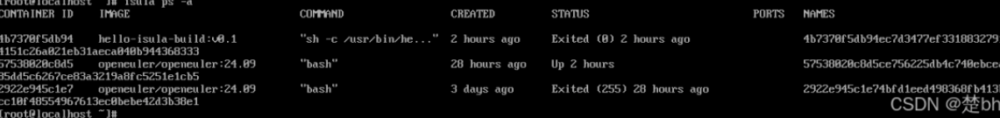
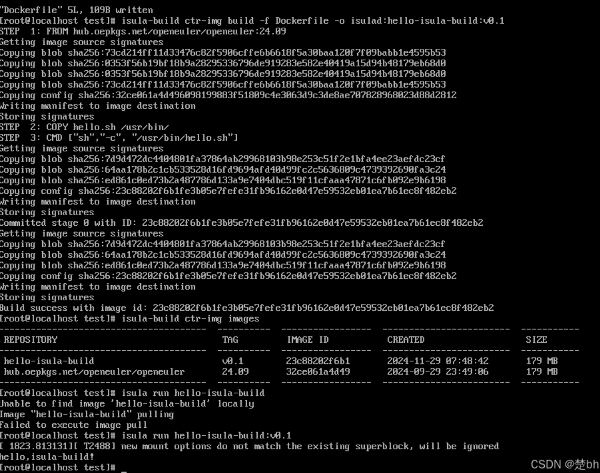

原文链接：https://blog.csdn.net/a555809067/article/details/144157583


#### 安装并配置 iSulad

输入以下命令，安装 iSulad：

```bash
[root@localhost ~]# yum install -y iSulad
```

安装完 iSulad 后，输入启动 iSulad：

```bash
[root@localhost ~]# systemctl start isulad
```

然后修改配置文件（这样才能在后续创建镜像时拉取到镜像）：

```bash
cp /etc/isulad/daemon.json /etc/isulad/daemon.json.origin
```

```bash
vim /etc/isulad/daemon.json
```

打开 json 配置，将 registry-mirrors 项添加镜像库 `"hub.oepkgs.net"` ，具体如下（不要忘记最后的逗号）：

```json
"registry-mirrors": ["hub.oepkgs.net"],
```

修改完后，先按 Esc 退出编辑模式，再输入 :wq 保存。

输入以下重新启动 iSulad：

```bash
systemctl restart isulad
```

以上操作不需要专门设置文件，也就是不需要在自创的目录中使用，直接在 localhost 操作即可。后面如果没有特意声明，也都是在 localhost 下即可使用。


测试可否拉取镜像：

```bash
[root@localhost ~]# isula pull openeuler/openeuler:24.09
```

24.09 是我下载的版本，诸位可根据自己下载的版本修改。


输入以下，查看已经拉取的镜像：

```bash
[root@localhost]# isula images
REPOSITORY                      TAG        IMAGE ID            CREATED              SIZE
openeuler/openeuler             24.09      34f56f4bfb72        2024-11-30 12:27:37  506.641MB
```


#### 创建容器

输入以下，创建 openEuler 容器：

```bash
[root@localhost ~]#  isula create -it openeuler/openeuler:24.09
```

输入以上代码后，会出现该容器的 id（也就是下图的 name）：




启动容器（这里的数字可以缩小到两位，系统会自动匹配容器 id）：

```bash
isula start 5753
```


进入容器：

```bash
[root@localhost ~]# isula  exec -it 5753  /bin/bash
```


查看容器相关数据：

```bash
[root@57538020c8d5 /]# cat /etc/os-release
```


#### 安装 isula-build

输入以下：

```bash
yum --enablerepo update install -y isula-build
```


查看状态：

```bash
# systemctl status isula-build.service
```


#### 安装 docker-runc

在 24.09 版本中，安装 docker-runc 不需要带 docker-，如下。输入 docker-runc 会显示没有 docker-runc 的匹配项，在 20.09 版本应该可以输入 docker-runc。runc 将保障后面的.sh 文件的运行：

```bash
yum install -y runc
```


#### 构建自己的镜像

首先需要创造构建目录：

```bash
# mkdir –p /home/test/ && cd /home/test/
```

以下操作均需要在 test 目录中完成。


构建 Dockerfile 文件：

```bash
[root@localhost test]# vim Dockerfile
```

进入 insert 状态后输入以下（在这一步注意，如果你之前拉取镜像的时候出错，后面构建镜像时会在 step2 出错，而且注意在镜像名前加上 hub.oepkgs.net，否则也会报错）：

```dockerfile
FROM hub.oepkgs.net/openeuler/openeuler:24.09
COPY hello.sh /usr/bin/
CMD ["sh", "-c", "/usr/bin/hello.sh"]
```

按 Esc 退出编辑模式，再输入：wq 保存。


构建 hello.sh 脚本：

```bash
[root@localhost test]# vim hello.sh
```

输入以下：

```bash
#!/bin/bash
echo
echo "hello, isula-build!"
```


退出后修改 hello.sh 的属性：

```bash
[root@localhost test]# chmod +x hello.sh
```


查看是否完成文件的构建：

```bash
[root@localhost test]# ls -l
```


输入，构建镜像，结果如下：

```bash
[root@localhost test]# isula-build ctr-img build -f ./Dockerfile -o isulad:hello-isula-build:v0.1
```




输入以下，查看创建的镜像如上：

```bash
[root@localhost test]# isula-build ctr-img images
```


构建完成，下面运行构建好的镜像。结果如上：

```bash
[root@localhost test]# isula run hello-isula-build:v0.1
```