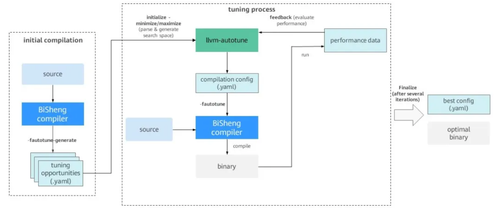

BiSheng-Autotuner 是一个基于 BiSheng-opentuner 的命令行工具，与支持调优的编译器（如 LLVM for openEuler、GCC for openEuler）配合使用。它负责生成搜索空间、操作参数并驱动整个调优过程。

仓库地址

https://gitee.com/openeuler/BiSheng-Autotuner

本文主要介绍基于 LLVM for openEuler 的自动调优编译流程。

### BiSheng-Autotuner 调优流程

调优流程（如图 1 所示）由两个阶段组成：初始编译阶段（initial compilation）和调优阶段（tuning process）。



图 1 BiSheng-Autotuner 调优流程

#### 初始编译阶段

初始编译阶段发生在调优开始之前，BiSheng-Autotuner 首先会让编译器对目标程序代码做一次编译，在编译的过程中，编译器会生成一些包含所有可调优结构的 YAML 文件，告诉开发者在这个目标程序中哪些结构可以用来调优，比如模块（module）、函数（function）、循环（loop）。例如，循环展开是编译器中最常见的优化方法之一，它通过多次复制循环体代码，达到增大指令调度空间、减少循环分支指令开销的优化效果。若以循环展开次数（unroll factor）为对象进行调优，编译器会在 YAML 文件中生成所有可被循环展开的循环作为可调优结构。

#### 调优阶段

当可调优结构顺利生成之后，调优阶段便会开始：

1. BiSheng-Autotuner 首先读取生成好的可调优结构的 YAML 文件，从而产生对应的搜索空间，也就是生成针对每个可调优代码结构的具体的参数和范围。
2. 调优阶段会根据设定的搜索算法尝试一组参数的值，生成一个 YAML 格式的编译配置文件（compilation config），从而让编译器编译目标程序代码产生二进制文件。
3. 最后 BiSheng-Autotuner 将编译好的文件以开发者定义的方式运行并取得性能信息作为反馈。
4. 经过一定数量的迭代之后，BiSheng-Autotuner 将找出最终的最优配置，生成最优编译配置文件，以 YAML 的形式储存。

### BiSheng-Autotuner 使用

#### 环境要求

必选：

- 操作系统 ：openEuler 24.03 LTS 系列、openEuler 25.03 及高于 openEuler 25.03 的版本
- 架构  ：AArch64、x86_64
- Python 3.11.x
- SQLite 3.0

可选：

- LibYAML：推荐安装，可提升 BiSheng-Autotuner 文件解析速度

#### BiSheng-Autotuner 获取

若开发者使用的 openEuler 系统，可以直接安装 `BiSheng-Autotuner` 和 `clang` 软件包。

```
yum install -y BiSheng-Autotuneryum install -y clang
```

若需源码构建 `BiSheng-Autotuner` ，可以参考以下步骤。

1. 安装 BiSheng-opentuner

	```
	yum install -y BiSheng-opentuner
	```
2. 克隆并安装 BiSheng-Autotuner

	```
	cd BiSheng-Autotuner./dev_install.sh
	```

#### BiSheng-Autotuner 运行

本文将以 coremark 为示例展示如何运行自动调优, coremark 源码请从获取。更多 llvm-autotune 的详细用法，请参阅帮助信息章节。以下为以 20 次迭代调优 coremark 的脚本示例：

coremark仓库地址 https://github.com/eembc/coremark

```
export AUTOTUNE_DATADIR=/tmp/autotuner_data/CompileCommand="clang -O2 -o coremark core_list_join.c core_main.c core_matrix.c core_state.c core_util.c posix/core_portme.c -DPERFORMANCE_RUN=1 -DITERATIONS=300000 -I. -Iposix -g -DFLAGS_STR=\"\""$CompileCommand -fautotune-generate;llvm-autotune minimize;for i in $(seq 20)do$CompileCommand -fautotune ;  time=`{ /usr/bin/time -p ./coremark  0x0 0x0 0x66 300000; } 2>&1 | grep  "real" | awk '{print $2}'`;echo"iteration: "$i"cost time:"$time;  llvm-autotune feedback $time;donellvm-autotune finalize;
```

以下为分步说明：

1. 配置环境变量

	使用环境变量 `AUTOTUNE_DATADIR` 指定调优相关的数据的存放位置（指定目录需要为空）。

	```
	export AUTOTUNE_DATADIR=/tmp/autotuner_data/
	```
2. 初始编译步骤

	添加编译器选项 `-fautotune-generate` ，编译生成可调优代码结构。

	```
	cd  examples/coremark/clang -O2 -o coremark core_list_join.c core_main.c core_matrix.c core_state.c core_util.c posix/core_portme.c -DPERFORMANCE_RUN=1 -DITERATIONS=300000 -I. -Iposix -g -DFLAGS_STR=\"\" -fautotune-generate
	```

	> 注意：建议仅将此选项应用于需要重点调优的热点代码文件。若应用的代码文件过多（超过 500 个文件），则会生成数量庞大的可调优代码结构的文件，进而可能导致步骤 3 的初始化时间长（可长达数分钟），以及巨大的搜索空间导致的调优效果不显著、收敛时间长等问题。 
3. 初始化调优

	运行 `llvm-autotune` 命令，初始化调优任务。生成最初的编译配置供下一次编译使用。

	```
	llvm-autotune minimize
	```

	`minimize` 表示调优目标，旨在最小化指标（例如程序运行时间）。也可使用 `maximize` ，旨在最大化指标（例如程序吞吐量）。
4. 调优编译步骤

	添加毕昇编译器选项 `-fautotune` ，读取当前 `AUTOTUNE_DATADIR` 配置并编译。

	```
	clang -O2 -o coremark core_list_join.c core_main.c core_matrix.c core_state.c core_util.c posix/core_portme.c -DPERFORMANCE_RUN=1 -DITERATIONS=300000 -I. -Iposix -g -DFLAGS_STR=\"\" -fautotune
	```
5. 性能反馈

	开发者运行程序，并根据自身需求获取性能数字，使用 `llvm-autotune feedback` 反馈。如果开发者想以 coremark 运行时间为指标进行调优，可以采用如下方式：

	```
	time -p ./coremark  0x0 0x0 0x66 300000  2>&1 1>/dev/null | grep real | awk '{print $2}'# 返回实际执行时间 31.09
	```

	```
	llvm-autotune feedback 31.09
	```

	> 注意：建议在使用 `llvm-autotune feedback` 之前， 先验证步骤 4 编译是否正常以及编译好的程序是否运行正确。若出现编译或者运行异常的情况，请输入相应调优目标的最差值（例如，调优目标为 minimize ，可输入 `llvm-autotune feedback 9999` ；maximize 可输入 0 或者 -9999）。 
	> 
	> 若输入的性能反馈不正确，可能会影响最终调优的结果。 
6. 调优迭代

	根据开发者设定的迭代次数，重复 4 和 5 进行调优迭代。
7. 结束调优

	进行多次迭代后，开发者可选择终止调优，并保存最优的配置文件。配置文件会被保存在环境变量 `AUTOTUNE_DATADIR` 指定的目录下。

	```
	llvm-autotune finalize
	```
8. 最终编译

	使用步骤 7 得到最优配置文件，进行最后编译。在环境变量未改变的情况下，可直接使用 `-fautotune` 选项：

	```
	clang -O2 -o coremark core_list_join.c core_main.c core_matrix.c core_state.c core_util.c posix/core_portme.c -DPERFORMANCE_RUN=1 -DITERATIONS=300000 -I. -Iposix -g -DFLAGS_STR=\"\" -fautotune
	```

	或者使用 `-mllvm -auto-tuning-input=` 直接指向配置文件。

	```
	clang -O2 -o coremark core_list_join.c core_main.c core_matrix.c core_state.c core_util.c posix/core_portme.c -DPERFORMANCE_RUN=1 -DITERATIONS=300000 -I. -Iposix -g -DFLAGS_STR=\"\" -mllvm -auto-tuning-input=/tmp/autotuner_data/config.yaml
	```

#### 帮助信息

llvm-autotune 执行格式如下所示：

```
llvm-autotune [-h] {minimize,maximize,feedback,dump,finalize}
```

可选指令：

- `minimize` ：初始化调优并生成初始的编译器配置文件，旨在最小化指标（例如运行时间）。
- `maximize` ：初始化调优并生成初始的编译器配置文件，旨在最大程度地提高指标（例如吞吐量）。
- `feedback` ：反馈性能调优结果并生成新的编译器配置。
- `dump` ：生成当前的最优配置，而不终止调优（可继续执行 `feedback` ）。
- `finalize` : 终止调优，并生成最佳的编译器配置（不可再执行 `feedback` ）。

#### 编译器相关选项

llvm-autotune 需要与 LLVM 编译器选项 `-fautotune-generate` 和 `-fautotune` 配合使用。

- `-fautotune-generate` ：

- 在 `autotune_datadir` 目录下生成可调优的代码结构列表，此默认目录可由环境变量 `AUTOTUNE_DATADIR` 改写。
- 作为调优准备工作的第一步，通常需要在 `llvm-autotune minimize/maximize` 命令执行前使用。
- 此选项还可以赋值来改变调优的颗粒度（可选值为 `Other` 、 `Function` 、 `Loop` 、 `CallSite` 、 `MachineBasicBlock` 、 `Switch` 、 `LLVMParam` 、 `ProgramParam` ，其中 `LLVMParam` 和 `ProgramParam` 对应粗粒度选项调优）。例如 `-fautotune-generate=Loop` 会开启类型仅为循环的可调优代码结构，每个循环在调优过程中会被赋予不同的参数值；而 `Other` 表示全局，生成的可调优代码结构对应每个编译单元（代码文件）。
- `-fautotune-generate` 默认等效于 `-fautotune-generate=Function,Loop,CallSite` 。通常建议使用默认值。
- 若要启用选项调优（ `LLVMParam` 和 `ProgramParam` ），需要为 llvm-autotune 指定拓展搜索空间，默认的搜索空间不包含预设调优选项。

	```
	llvm-autotune minimize --search-space /usr/lib64/python<version>/site-packages/autotuner/search_space_config/extended_search_space.yaml
	```

	`site-packages` 目录可以通过 `pip show autotuner` 指令找到。

- `-fautotune` ：

- 使用 `autotune_datadir` 下的编译器配置进行调优编译（此默认目录可由环境变量 `AUTOTUNE_DATADIR` 改写）。
- 通常在调优迭代过程中， `llvm-autotune minimize/maximize/feedback` 命令之后使用。