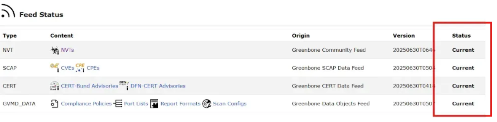

近日， OpenAtom openEuler（简称：openEuler或开源欧拉） 社区 与Greenbone通力合作，顺利完成Greenbone软件在openEuler的适配。Greenbone是一家全球领先的开源漏洞管理解决方案供应商，提供开源领域占主导地位的漏洞评估解决方案，旨在帮助组织识别、评估和修复其 IT 基础设施中的安全漏洞。本次适配完成将进一步丰富 openEuler在安全领域的应用解决方案，为企业的数字化转型提供了更多安全解决方案。

目前Greenbone的社区版（OpenVAS）和企业版（GSM）已经完成对所有已经发布的 LTS版本（包括SP版本）的系统支持，欢迎大家参考下面的安装指南使用。

## 源码编译 Greenbone

使用这种方式可以体验到最新的 Greenbone 软件特性 ， Greenbone 社区版在 Github 上提供了源代码，并且在文档中提供了非常详细的上手步骤， 具体安装方式请查看 Github 和安装文档。

项目仓库：  
https://github.com/greenbone/openvas-scanner

文档链接：  
https://greenbone.github.io/docs/latest/22.4/source-build/index.html

## 容器安装 Greenbone

Greenbone 推荐使用 Docker 容器 安装 OpenVAS ，具体安装方式请查看文档。

文档链接：  
https://greenbone.github.io/docs/latest/22.4/container/index.html

## WSL 安装 Greenbone

使用 WSL 安装 Greenbone 的软硬件要求如下：

- Windows 10/11 启用 WSL2功能
- 内存最低4G，建议8G
- 磁盘空间最少20G，建议60G

### 步骤1：安装docker并启用WSL集成

从 Docker 官网下载 Docker Desktop 并安装，安装好后在设置中查看 “ Use the WSL 2 based engine” 是否已经勾选（ Docker 默认勾选）


### 步骤2：启用与你的 WSL发行版集成

选择Resources → WSL Integration，启用与你的 WSL发行版集成.


### 步骤三：打开 WSL终端，检查 docker 版本

```bash
docker--versiondnf install ca-certificates curl gnupg
```

### 步骤四：下载WSL提供配置脚本

```bash
cd /home/YOUR_USER_NAME
git clone https://github.com/kirigiricloud/OpenVAS-openEuler-wsl-scripts.git
cd OpenVAS-openEuler-wsl-scripts/scripts
chmod +x setup-greenbone-windows-wsl.sh
./setup-greenbone-windows-wsl.sh
```

这个脚本会完成以下工作：

- 下载最新的 Greenbone docker compose文件
- 配置 WSL
- 下载镜像（2-5G）
- 运行容器
- 设置 Greenbone管理员密码
- 设置网页访问端口

### 步骤五：设置 Windows的端口转发

打开 Windows PowerShell （管理员模式）运行

```bash
.\setup-windows-port-forwarding.ps1
```

### 步骤六：访问 Greenbone并创建扫描任务

打开浏览器访问 http://localhost:9392， 输入之前设置的用户名和密码进入 Greenbone 。


在 http://localhost:9392/feedstatus 页面确保所有的 feeds 状态都已经是 “Current” （大概需要 30-60 分钟），在此之前不要开启扫描任务。



在 WSL 中 , 运行 hostname -I 获得系统 IP 地址

在 Greenbone 中选择 Scans → Task ，点击如图所示的图标后，在弹出的页面输入 IP 地址，点击开始扫描。


等待扫描完成后，获取系统报告。


