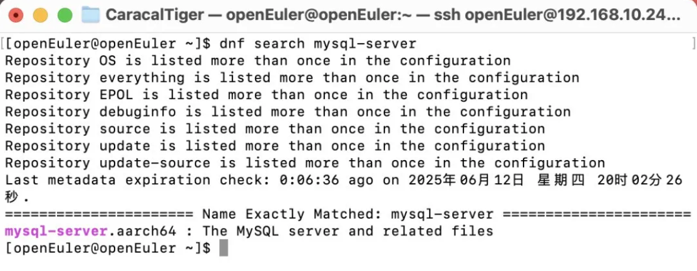
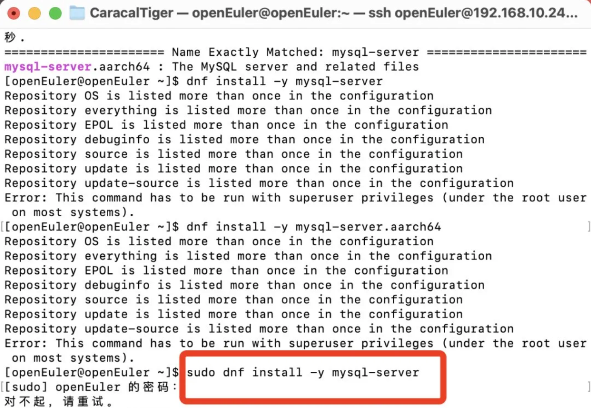
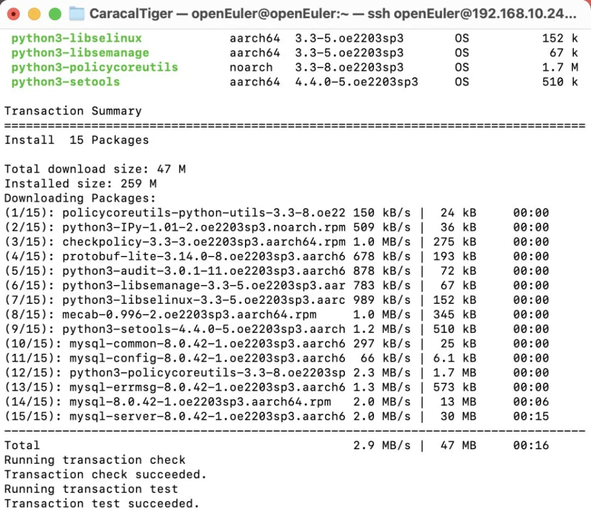
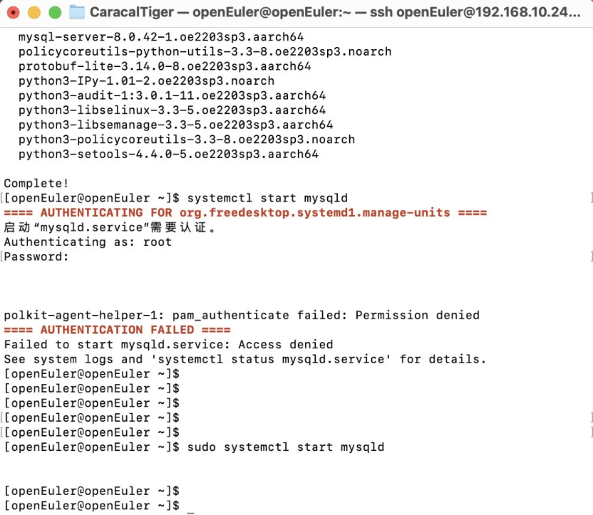
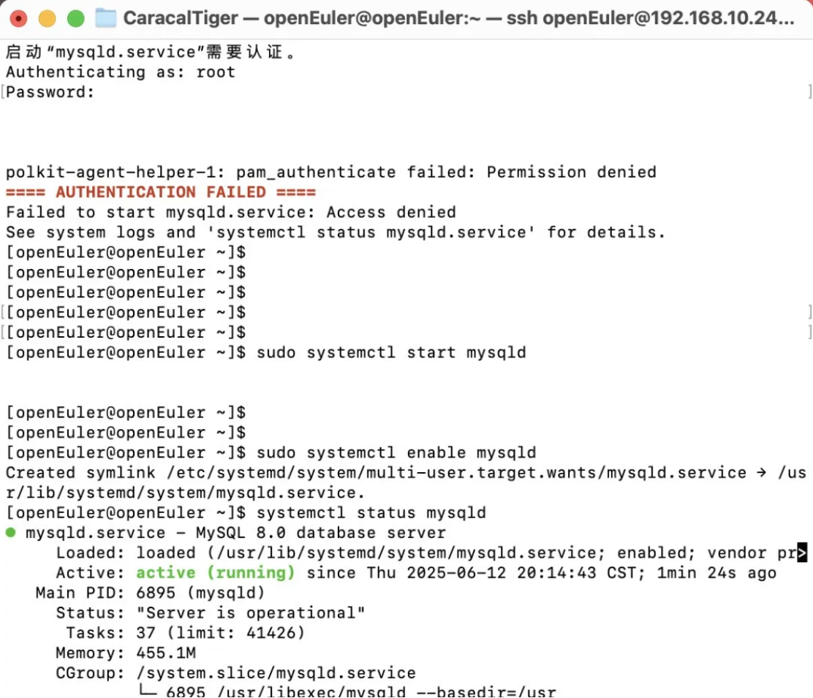
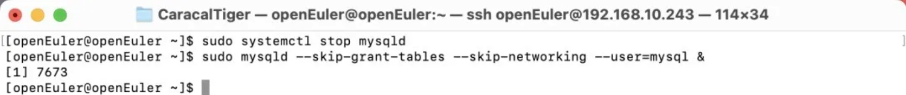
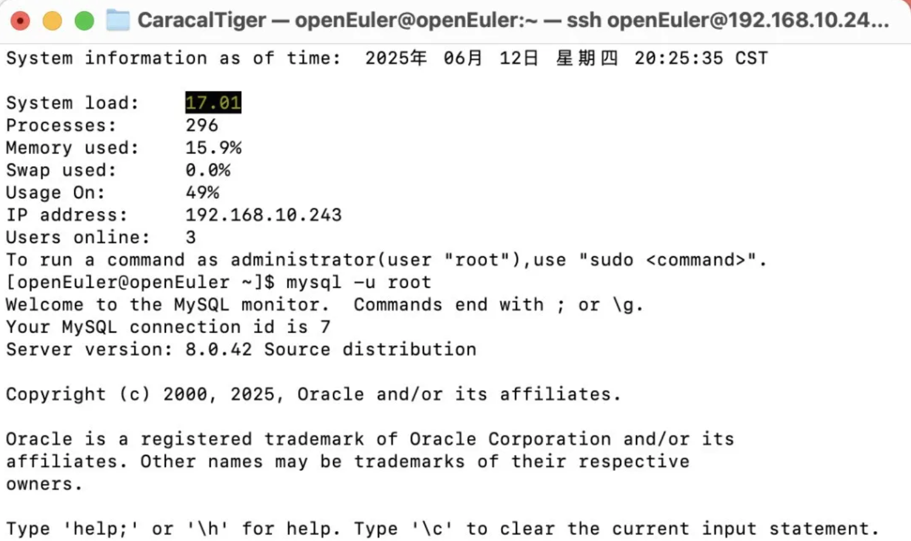
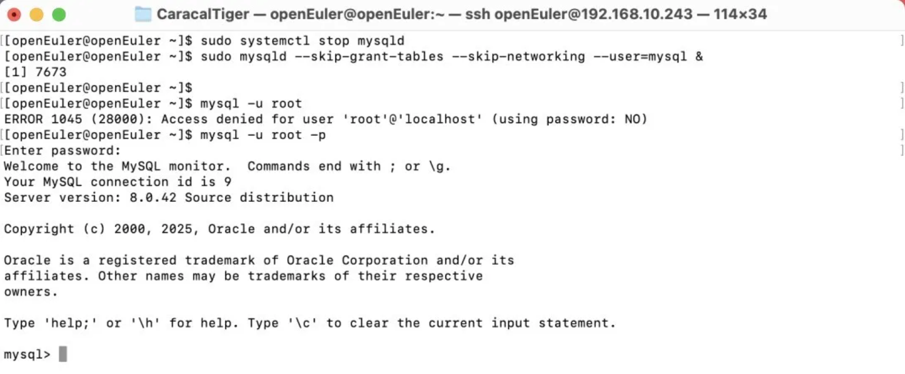
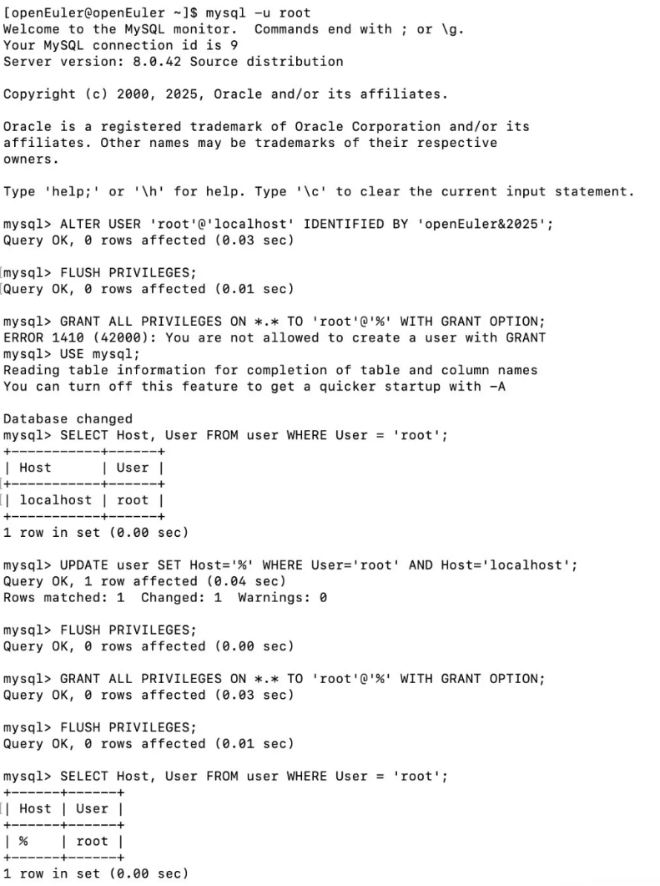

来源：猫头虎技术团队  
原文链接：https://blog.csdn.net/qq_44866828/article/details/148617642

## 环境准备

- 操作系统：OpenAtom openEuler（简称：openEuler或开源欧拉）22.03 LTS-SP2 或更新版本
- 用户权限：需要 root 权限
- 网络连接：确保能连接 openEuler 源或配好本地 repo

> 提示：如果你是全新环境，可先执行 `dnf makecache` 构建本地缓存 


## 查看官方源中 MySQL 支持情况


使用以下命令查看是否有 MySQL 相关包：

```
dnf search mysql-server
```

如果显示有 `mysql-server` 等包，说明已经支持




## 安装 MySQL


```
sudo dnf install -y mysql-server
```





等待安装完成后，启动 MySQL 服务：

```
sudo systemctl start mysqld
```



设置开机自启：

```
sudo systemctl enable mysqld
```

查看服务状态：

```
systemctl status mysqld
```



> 提示：如果出现 “Active: active (running)” 则说明安装成功 


## 初始化密码和安全配置


###### 停止 mysqld 服务

```
sudo systemctl stop mysqld
```

使用“跳过授权表”模式启动 MySQL（临时无密码）

```
sudo mysqld --skip-grant-tables --skip-networking --user=mysql &
```

> 注意：此命令将在前台运行，终端会被占用。建议 **开另一个终端窗口或使用 SSH 登录新会话** 继续后续操作。 



###### 无密码登录 MySQL

在另一个终端输入：

```
mysql -u root
```



进入 MySQL shell 后执行：

```
FLUSH PRIVILEGES;ALTER USER 'root'@'localhost' IDENTIFIED BY 'openEuler&2025';FLUSH PRIVILEGES;EXIT;
```

或者某些 MySQL 8 版本需要用下面的语法：

```
ALTER USER 'root'@'localhost' IDENTIFIED WITH mysql_native_password BY 'NewSecurePwd8!';
```

完成后输入：

```
EXIT;
```

###### 恢复正常启动服务

回到原终端，按 `Ctrl + C` 停止前台 `mysqld_safe` ，然后：

```
sudo systemctl start mysqld
```

现在你可以正常使用新密码登录：

```
mysql -u root -p
```



## 设置远程访问权限

```
ERROR 1410 (42000): You are not allowed to create a user with GRANT
```

###### 登录 MySQL（已登录可跳过）

```
mysql -u root
```

###### 切换到mysql系统库

```
USE mysql;
```

###### 查看当前 root 用户定义

```
SELECT Host,User FROM user WHERE User='root';
```

你应该会看到：

```
+-----------+------+
| Host      | User |
+-----------+------+
| localhost | root |
+-----------+------+
```

###### 修改 root 的 host 为 `%`

```
UPDATE user SET Host='%' WHERE User='root' AND Host='localhost'; FLUSH PRIVILEGES;
```

###### 重新授予权限（现在是合法的）

```
GRANT ALL PRIVILEGES ON *.* TO 'root'@'%' WITH GRANT OPTION;FLUSH PRIVILEGES;
```

###### 验证

```
SELECT Host, User FROM user WHERE User = 'root';
```

应该输出：

```
+------+------+
| Host | User |
+------+------+
| %    | root |
+------+------+
```



服务器建议（更安全做法）：

- **保留 root@localhost** （仅供本地登录）
- 新建远程用户，而不是扩展 root 权限，例如：

```
CREATE USER 'devadmin'@'%' IDENTIFIED BY 'StrongDev#2025';GRANT ALL PRIVILEGES ON *.* TO 'devadmin'@'%' WITH GRANT OPTION;
```


## 添加防火墙规则


如果需让外网或同网段的服务器连接 MySQL，需打开 3306 端口：

```
firewall-cmd --permanent --add-port=3306/tcp
firewall-cmd --reload
```


## 进入 MySQL 命令行管理器


```
mysql -u root -p
```

输入新密码后即可进入 MySQL 管理界面

> 提示：可使用 `SHOW DATABASES;` 查看数据库列表，或创建新数据库、用户 


## 可选：配置 MySQL 远程连接


修改配置文件 `/etc/my.cnf` ：

```
[mysqld]
bind-address=0.0.0.0
```

重启 MySQL 服务：

```
systemctl restart mysqld
```

授权远程用户：

```
CREATE USER'admin'@'%'IDENTIFIEDBY'yourpassword';GRANTALLPRIVILEGESON *.* TO'admin'@'%'WITHGRANTOPTION;FLUSHPRIVILEGES;
```

> 提示：生产环境不建议接受全网段连接，请配合防火墙或 VPN 系统保障 


## 总结


通过上述步骤，你已经成功在 openEuler 系统上安装并启用 MySQL，同时可选配置防火墙和远程连接。


END


