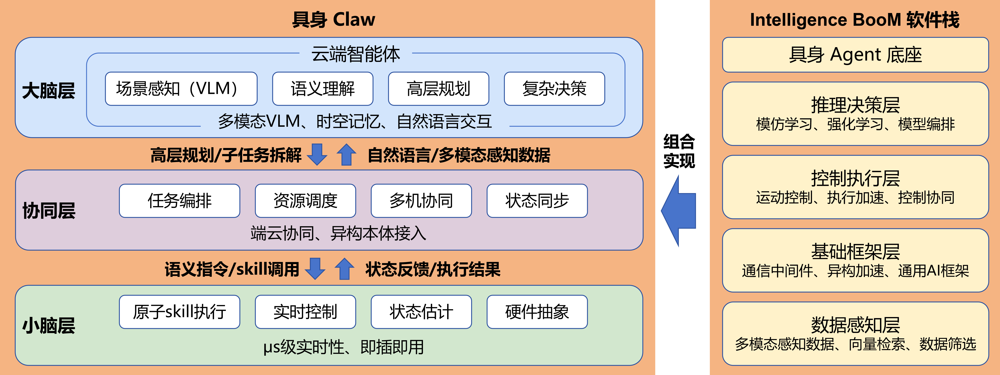
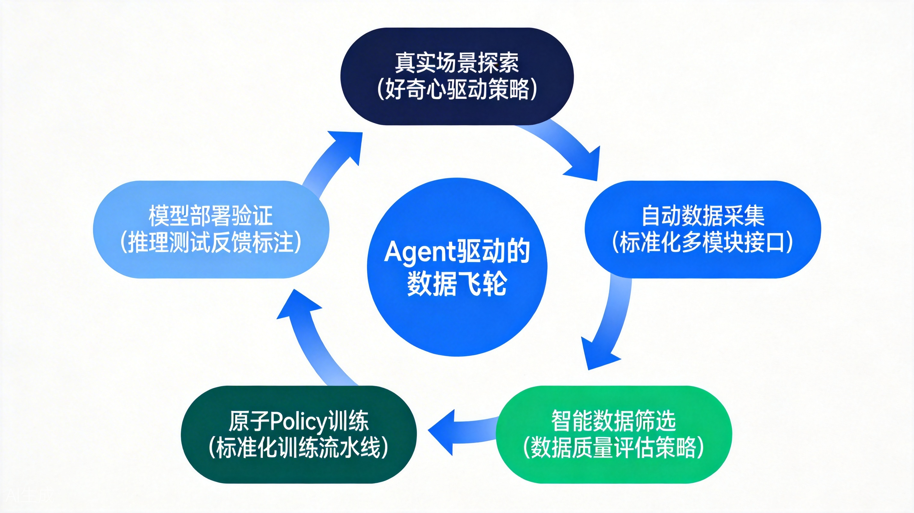
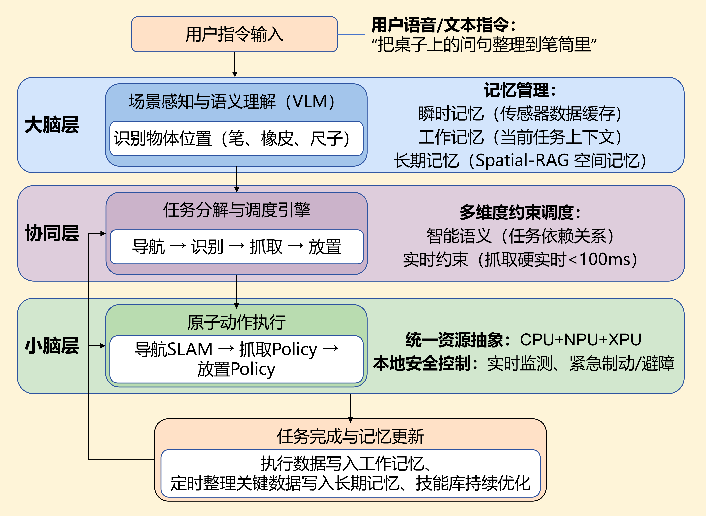

## 一、背景

2025年，具身智能首次被写入中国《政府工作报告》，成为国家重点培育的未来产业。然而，具身机器人从实验室到产业化的跨越并非坦途。机器人行业长期面临 **"系统割裂、实时性不足、开发门槛高"** 三大困局——感知决策与运动控制分属不同芯片或系统，造成系统割裂；通信协作过程中产生系统级延迟，难以满足实时性要求；开发者需掌握 ROS/ROS2、运动控制、深度学习等多领域知识，环境搭建复杂、调试周期长，形成高开发门槛。

**具身智能OS应运而生。**

在OpenAtom openEuler（简称 “openEuler” 或 “开源欧拉”）社区刚刚发布的 **openEuler Embedded 26.03** 新版本中，成功孵化了 **具身智能OS全栈技术 —— IB-Robot**，为开发者、行业伙伴提供从底层硬件到上层算法的**全链路端到端解决方案**。作为面向具身智能场景深度优化的操作系统，openEuler 构建了完整的**具身智能OS**技术底座，实现感知、决策、控制的深度融合与高效协同。

**具身Claw** 作为 **具身智能OS**（IB-Robot 框架）成功打造的**大小脑协同具身智能体**，通过"大脑-协同层-小脑"三层异构计算架构，实现从高层认知到低层控制的端到端贯通，为具身智能的产业化落地提供可复用的技术范式。。

## 二、现状与挑战

构建面向具身智能场景的深度优化操作系统，需要直面机器人产业化过程中的核心难题。当前，具身智能OS的发展主要面临以下三大挑战：

### 2.1 易用性挑战

**开发者门槛高：** 传统机器人开发需要开发者同时掌握 ROS/ROS2、运动控制、深度学习、嵌入式系统等多领域知识。环境搭建复杂，涉及数十个依赖库的版本兼容问题；调试周期长，从代码修改到真机验证往往需要数小时甚至数天；算法迭代效率低，每次调整都需要重新编译、部署、测试。

> 更关键的是，不同机器人硬件平台（机械臂、人形、四足、AGV）的接口差异巨大，开发者需要为每种平台重复开发适配代码，造成严重的资源浪费。

**用户上手难：** 机器人产品往往需要专业工程师进行现场部署和参数调优，普通用户难以直接使用。即使完成部署，机器人的任务泛化能力极差——换一个场景、换一个物体，就需要重新编程或大量人工示教。用户期望的"开箱即用"体验与现实的"专业调试"需求之间存在巨大鸿沟。

### 2.2 数据采集挑战：高质量数据是模型训练的"燃料"

具身机器人的数据采集是公认的行业难题。目前主流的数据采集方式包括：

- **人工示教**：操作员手把手引导机器人完成动作，每小时仅能采集数百条数据，成本高昂且效率极低
- **遥控操作**：通过手柄或VR设备远程控制机器人，虽然可以采集更多数据，但操作员疲劳度高，数据质量参差不齐
- **仿真生成**：在虚拟环境中生成数据，但仿真与真实世界存在"域差异"，直接迁移效果不佳

**核心挑战体现在三个层面：**

| 挑战维度 | 具体问题 |
|---------|---------|
| **采集效率** | 人工示教占研发总成本 40% 以上，数据产出速度远低于模型训练需求 |
| **数据质量** | 如何筛选冗余数据、剔除无效样本、保证数据分布的多样性 |
| **规模构建** | 如何自动化构建大规模数据集，并实现有侧重的训练优化 |

以抓取任务为例，训练一个泛化能力良好的抓取模型通常需要数万条不同物体、不同姿态、不同光照条件下的数据，传统方式下完成这一数据采集需要数周甚至数月时间。

### 2.3 长程任务挑战：从"单点技能"到"复杂协作"

**技术难点剖析：**

真实场景中的任务往往是长程、多步骤的。以"整理房间"为例，机器人需要依次完成：识别散落物品 → 分类判断 → 导航移动 → 精准抓取 → 搬运至指定位置 → 正确放置。这对机器人的综合能力提出了极高要求。

**长程任务的核心挑战包括：**

- **场景感知与语义理解**：如何基于多模态传感器融合，准确识别环境中的物体类别、理解空间拓扑关系、追踪动态状态变化

- **任务分解与高层规划**：如何将抽象的自然语言指令转化为可执行的行为原语序列，处理任务间的依赖关系与约束条件

- **任务调度与资源分配**：如何根据任务优先级、计算资源占用、机器人实时状态进行动态调度，实现多目标优化

- **多智能体协同与分布式协调**：多机器人场景下，如何实现跨本体的状态同步、意图共享与智能协作，避免冲突与死锁

- **技能抽象与行为原语组合**：如何设计通用的原子技能库，定义标准接口与组合规则，实现技能间的无缝衔接与复用

- **运动控制与执行稳定性**：如何在长程执行过程中保持动作的连贯性，处理外部扰动与不确定性，实现平滑稳定的轨迹跟踪

更困难的是，长程任务执行过程中随时可能出现意外情况——物体滑落、路径被阻挡、传感器噪声——机器人需要具备实时感知、动态重规划、自主纠偏的能力，这对系统的实时性和鲁棒性提出了严苛要求。

## 三、具身Claw架构概述

为应对上述三大挑战，具身智能OS融合 **Intelligence BooM 软件栈** 的全链路能力，以 **具身Claw** 为载体构建"大脑-协同层-小脑"三层异构计算架构，具体融合设计方案如下：

*图：具身 Claw 三层架构*

具身claw **各层间数据流转与能力调用** 方式如下：
- **下行链路**：大脑层调用推理决策层完成高层规划，将子任务拆解结果传递至协同层；协同层依托基础框架层转换为语义指令与 Skill 调用，下发至小脑层；小脑层借助控制执行层完成精准控制
- **上行链路**：小脑层将状态反馈与执行结果回传协同层，数据感知层实时采集多模态数据；协同层整合自然语言与感知数据上报大脑层，形成闭环

为此，具身智能OS进一步提供完整的 Intelligence BooM 软件栈支撑，包括**具身 Agent 底座**（AI 机器人框架支撑多模型编排）、**推理决策层**（具身模仿学习/强化学习框架）、**控制执行层**（运动控制、执行加速、控制协同）、**基础框架层**（通信中间件、异构加速、通用 AI 框架）及**数据感知层**（多模态感知数据、向量数据库、数据筛选），形成从底层到上层的全链路能力覆盖。**具身Claw**作为这一融合架构的典型实现，通过组合调用 Intelligence BooM 软件栈的各层能力，构建完整的具身智能体功能。

**核心特性**：一站式开发工具链覆盖全生命周期、Sim2Real 无缝切换、支持机械臂/人形/四足/AGV 等多本体兼容、深度融合 ROS2/LeRobot 开源生态。

## 四、具身Claw关键技术与应用

具身Claw 作为具身智能OS的大小脑协同具身智能体，为底层OS构建自然语言交互、自动化数据飞轮、长程任务执行等上层应用能力。两者协同形成"底层OS底座 + 上层智能体应用"的完整技术栈，共同应对具身智能产业化过程中的易用性、数据采集与长程任务三大核心挑战。

### 4.1 易用性提升：自然语言驱动的低代码开发

具身Claw 基于具身智能OS的底层能力，深度集成 Coding Agent，开发者可通过自然语言描述需求，系统自动完成代码生成、编译运行、代码评审与策略迭代，构建完善的 Harness Engineering 体系。

**关键能力：**

| 能力 | 说明 | 效果 |
|-----|------|------|
| **自然语言交互** | 开发者用日常语言描述需求，系统自动解析并生成代码框架 | 开发效率提升 **10 倍** |
| **即插即用驱动** | 预装主流传感器与执行器驱动，南向硬件零配置接入 | 硬件适配时间从数天缩短至数分钟 |
| **可视化运维** | 提供图形化仿真界面，零代码完成机器人配置、状态监控、任务管理 | 用户上手门槛大幅降低 |
| **全算力覆盖** | 支持高算力中央控制器与资源受限边缘平台 | 一套代码多端部署 |

**价值：**
- **开发者**：无需掌握 ROS/ROS2、运动控制等底层知识，专注算法与业务创新
- **用户**：开箱即用，任务泛化性与自主性显著提升，换一个场景无需重新编程

### 4.2 数据采集优化：基于 Tool/Skill 的自动化数据飞轮

具身Claw 依托具身智能OS的数据管理能力，构建**基于大模型 Agent 的 Skill/Tool 体系**，实现自动化数据采集闭环。

> 在大模型 Agent 架构中，**Skill** 与 **Tool** 是两个核心概念：
> - **Skill（技能）**：Agent 的"能力/策略"，是 Agent 内置的决策逻辑和行为模式，可以以此规范数据飞轮中的行为。
> - **Tool（工具）**：Agent 可调用的"外部工具/接口"，是 Agent 与外部控制的桥梁。

具身Claw 的数据飞轮通过 Agent 调用 **Skill** 进行决策、调用 **Tool** 执行操作来实现自动化数据采集闭环。

*图：具身Claw 基于 Agent Skill/Tool 的数据飞轮闭环*

**数据飞轮运转流程：**

| 环节 | 技术实现 | 效果 |
|-----|---------|------|
| **真实场景探索** |  基于好奇心/目标驱动在真实环境中自主探索 | 发现新物体与新任务场景 |
| **自动化数据采集** | 标准化接口同步记录视觉、力觉、关节状态等多模态数据 | 人工时间成本降低 |
| **智能数据筛选** |  基于世界模型预测与离线 GRPO 后训练，自动评估数据质量 | 冗余数据减少 |
| **原子策略训练** | 将复杂任务拆解为原子动作，独立训练 Policy 模型 | 数据复用率提升 |
| **模型部署验证** | 部署至真实机器人，收集执行反馈持续优化 | 数据飞轮闭环 |

**关键技术细节：**
- **自主探索机制**：Agent 基于好奇心驱动，优先探索未知区域与新物体，最大化信息增益
- **在线学习优化**：通过强化学习机制，从执行反馈中持续优化策略，采集更高质量数据
- **多模态同步**：RGB 图像、点云、关节角度、力觉反馈、语音指令多通道同步记录

### 4.3 长程任务执行：记忆管理与多维度调度

具身Claw 基于具身智能OS构建**长程任务执行架构**，在完整的任务执行流程中融入**记忆管理系统**、**多维度约束调度**、**统一资源抽象**三大核心能力，实现复杂长程任务的持续执行与动态纠偏。

*图：具身Claw 长程任务执行架构*

如上图所示，具身Claw 的任务执行流程分为三层：

**大脑层**：接收用户指令后，通过 VLM 进行场景感知与语义理解，调用 GPU 进行视觉推理，识别物体位置。此过程中，**记忆管理系统**发挥作用——瞬时记忆缓存传感器数据，工作记忆维护当前任务上下文。

**协同层**：任务分解与调度引擎将长程指令拆解为原子动作序列（导航→识别→抓取→放置）。此过程中，**多维度约束调度**综合考虑：
- **智能语义约束**：任务间的依赖关系与优先级
- **实时约束**：抓取动作设定硬实时 deadline（如100ms）

**小脑层**：原子技能执行阶段，通过 **统一资源抽象** 调用异构计算资源——导航SLAM（CPU）、抓取Policy（NPU）、控制执行（CPU），开发者无需关心底层硬件差异。

**记忆更新**：任务完成后，执行数据写入长期记忆，技能库持续优化，支持下次任务复用。

**关键技术支撑：**

| 能力 | 说明 |
|-----|------|
| **记忆管理** | 瞬时记忆（传感器缓存）→ 工作记忆（任务上下文）→ 长期记忆（SpatialRAG空间记忆） |
| **多维度调度** | 智能语义 + 实时约束的多维调度优化 |
| **资源抽象** | CPU/GPU/NPU 统一接口，自动异构调度与负载均衡 |
| **本地安全机制** | 小脑实时监测执行状态，遇紧急情况立即触发制动或避障 |
| **技能持续优化** | 执行数据回传至小脑训练模块，实现原子技能的本地迭代升级 |
| **多机协同记忆** | 通过共享大脑层部分记忆，在协同层进行多机记忆交互，实现跨本体状态同步与智能协作 |

## 五、具身Claw典型应用场景

### 5.1 桌面整理场景

**场景描述**：用户通过自然语言指令让机器人完成桌面整理任务——识别散落物品、分类归纳、精准抓取并放置到指定收纳区域。

**应用方案**：
- **大脑**：接收自然语言指令（"把桌上的文具整理到笔筒里"），通过 VLM 识别桌面物品（笔、橡皮、尺子）和空间位置，拆解为识别→分类→抓取→放置序列
- **协同层**：具身智能OS根据物品优先级和桌面空间状态，动态规划抓取顺序
- **小脑层**：具身智能OS控制机械臂实现精准抓取，实时调整姿态避免碰倒其他物品
- **数据采集**：自动化采集桌面场景下的抓取数据，训练桌面整理专用 Policy
- **应用效果**：桌面整理任务成功率达 **90%**，平均完成时间 **3 分钟**

### 5.2 服务场景：Lekivi 小车+机械臂抓取物体

**场景描述**：Lekivi 移动机器人平台搭载机械臂，完成指定区域内的物体识别与抓取任务。

**应用方案**：
- **跨本体协作**：具身智能OS实现"1 大脑 + N 小脑"架构，云端统一规划，端侧各机器人并行执行
- **动态调度**：具身智能OS根据任务优先级、机器人状态实时调整任务分配
- **应用效果**：全流程成功率超 **90%**，指令响应延迟低于 **10ms**

## 六、未来展望：迈向群体智能的新纪元

### 6.1 技术演进路线

具身Claw 依托具身智能OS的发展分为三个递进阶段，与各关键技术模块紧密呼应：

| 阶段 | 状态 | 核心内容 |
|-----|------|---------|
| **阶段一：基础框架与易用性建设** | ✅ **已实现** | 完成大小脑协同架构、运行时调度、资源管理、通信中间件等核心模块开发；实现自然语言驱动的低代码开发、即插即用驱动、可视化运维；支持 ROS2/LeRobot 生态融合；验证机械臂、AGV 等多本体可移植性 |
| **阶段二：数据采集与智能引擎完善** | 🔄 **进行中** | 构建基于 Tool/Skill 的自动化数据采集体系；持续优化 VLA、V-JEPA 等主流模型接入能力；提升低延迟资源调度性能；完善 Sim2Real 迁移工具链；实现数据飞轮闭环运转 |
| **阶段三：长程任务能力与生态建设** | 📋 **规划中** | 完善记忆管理系统（瞬时/工作/长期记忆）；深化多维度约束调度（智能语义、算力资源、实时约束）；强化统一资源抽象（CPU/GPU/NPU）；上线技能商店，支持原子技能组合与版本管理；构建开发者社区 |

### 6.2 生态共建愿景

具身智能OS秉承开源开放理念，诚邀产业伙伴共建生态：

- **硬件厂商**：接入更多传感器、执行器、机器人本体，实现"即插即用"
- **算法开发者**：贡献原子技能、VLA 模型、仿真环境，丰富技能库
- **行业用户**：提供真实场景需求与数据反馈，推动技术迭代

### 6.3 终极目标：让机器人真正"理解"世界

我们相信，具身智能的终极形态不是单一技能的堆砌，而是**具备通用认知能力、能够自主学习与进化、可与人类自然协作的智能体**。

具身Claw 依托具身智能OS构建的大小脑协同架构，正是通向这一愿景的关键路径：

> **"大脑"负责理解世界，"小脑"负责精准执行，协同让机器人从"能动"走向"能想"，最终"边思考边干活"。**

具身智能OS将持续演进，为具身智能产业提供坚实的技术底座，推动机器人从实验室走向千行百业，真正服务于人类社会。

## 七、相关链接

**开源代码仓库**：

<https://gitcode.com/openeuler/IB_Robot.git>

**文档与教程**：

<https://pages.openeuler.openatom.cn/embedded/docs/build/html/master/features/embodied_ai/introduction/ib-robot_overview.html>

