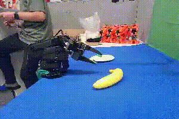

在前一篇[《IB-Robot系列 | 具身Claw：具身智能OS的大小脑协同具身智能体》](https://mp.weixin.qq.com/s/mbEnuKrUCTdH65IP9xyaKA)关于系统级融合思路的探讨之后，本文将聚焦一个更为底层的工程痛点：**具身模型输出的动作，如何在真实的机器人硬件上连续、稳定、无顿挫地执行？**

这背后发挥核心作用的，正是我们系统中的关键组件：**Action Dispatcher**。

它在整体架构中处于承上启下的特殊位置：上游对接具身模型，下游连接控制器与硬件。向上看，模型通常在离散的时间域内工作，一次推理输出一段动作块（`action chunk`）；向下看，机械臂的物理控制则是连续的时间流，需要以固定的高频率稳定下发控制指令。**Action Dispatcher 的核心使命，就是将"离散的动作规划"无缝转译为"连续的实时执行"。**

▲Action Dispatcher 在整体链路中的位置示意图

## 1. 核心挑战：从离散推理到连续执行的实时平滑过渡

若仅将模型输出的动作直接下发给机械臂，系统固然能够运转，但在真实的物理环境中会立刻面临以下矛盾：

1. **推理存在非零延迟**：模型在计算下一段动作时，物理世界的机器人并不会停下来等待。
2. **底层控制是高频连续的**：我们的 Action Dispatcher 必须维持固定频率的控制循环（默认 **100Hz**）。
3. **模型输出具有分块特性**：单次推理的结果通常不是"下一个时间点的状态"，而是一整段轨迹序列（Chunk）。

这就带来了一个天然的工程冲突：当第二次推理结果返回时，第一次推理生成的动作往往已经执行了一部分。此时如果简单粗暴地清空旧队列、直接覆盖新结果，机器人在动作衔接处极易出现阶跃突变，物理表现就是明显的顿挫、抖动，甚至产生指令冲突的迟滞感。

执行策略上，行业内容易走向两个不够理想的极端：

- **单步高频推理（Step-by-step）**：每执行一个动作帧就触发一次推理。此方案闭环最紧密、理论响应最灵敏，但对于端到端大模型而言，推理频率过高会导致算力开销难以承受，在工程落地中缺乏长期可行性。
- **串行分块执行（Chunk-by-chunk）**：等待当前 action chunk 队列完全清空后，再请求下一次推理。此方案实现最简单，但代价是机器人会在动作块之间产生明显的物理停顿，系统响应呈现出显著的迟钝感。

真正具备工程化价值的方案，必然是在两者之间寻找最优解：**一边维持当前动作块的执行，一边异步触发下一段动作的推理，并在时间轴上将新旧两段动作平滑衔接。**

面对这个"衔接"难题，**当前业界演进出了截然不同的两种解决哲学**：一种是深入算法内部，让具身模型在生成动作时就考虑时间延迟（即当前备受瞩目的 **RTC 实时分块机制**）；另一种则是我们在本文中要重点探讨的——通过构建一个强大的独立系统组件（**Action Dispatcher**），在系统控制层完成时序对齐。

我们关注的核心不仅是"何时获取下一段动作"，而是：**当离散的新动作序列到达时，系统如何自然且精准地将其缝合进连续的物理执行流。**

## 2. 实时保障：维持控制流的绝对连续

在具体实现上，Action Dispatcher 内部维护着一个待执行的动作指令队列，并运行着一个高频的控制循环。该循环每次主要处理两项关键任务：

- 监控当前剩余动作序列长度是否低于预设水位线；
- 提取队列头部的下一帧动作并下发至控制器。

比如说，队列容量上限为 `100`，低水位触发阈值为 `20`。这意味着系统并不会等到动作耗尽才请求推理，而是采用了**预取（Prefetch）机制**。其目的非常明确：将模型的推理延迟"隐藏"在尚未执行完的既有计划中，从而保障底层控制环路始终不断流。

▲低水位触发机制示意图

然而，即便做到了指令不断流，缺乏后处理的新旧轨迹硬切换依然会引发执行断层。这就引出了系统设计的重头戏——跨帧平滑（Cross-frame Smoothing）。

## 3. 平滑衔接：精准的时间轴对齐

如果说实时性解决的是"不断流"，那么平滑机制解决的就是"不断裂"。为了直观呈现这一"缝合"过程，我们梳理了极简的时间轴拆解图：

▲跨帧平滑示意图

在系统中，计算图示中 `a1~a3` 偏移量的核心指标称为 `actions_executed_during_inference`。它绝非经验估算，而是通过严格的"推理发起时的队列长度"减去"结果返回时的队列长度"计算得出。换言之，**系统能够精准获悉在等待新推理结果的这段时间窗口内，物理执行流实际向前推进了多少步**，从而实现新旧 chunk 之间的完美时间轴对齐。

- 未启用跨帧平滑  

- 启用跨帧平滑 

> **跨帧平滑效果对比**：左侧未启用跨帧平滑，机器人动作出现明显反应迟缓，控制频率受限于模型推理延迟；右侧启用 Action Dispatcher 跨帧平滑后，动作连贯流畅、控制频率较高，同时闭环控制及时。

## 4. 路线对比：系统级融合 vs. 算法级RTC

进入到新旧轨迹的重叠区（Overlap，即图中的 T4 阶段），在 Action Dispatcher 的机制下，我们采用的是一种纯系统工程的解法——**时序集成（Temporal Ensembling）**。

我们并非做生硬的二选一切换，而是通过一组指数加权公式，在时间轴上进行平滑过渡：

$$\text{weight}[k] = \exp(-\text{coeff} \cdot k)$$

$$\text{blended}[i] = \frac{\text{old}[i] \cdot \text{cumsum}[\text{count}-1] + \text{new}[i] \cdot \text{weight}[\text{count}]}{\text{cumsum}[\text{count}]}$$

这种做法的本质，是**将动作的"生成"与动作的"缝合"彻底解耦**。模型只管输出纯粹的动作意图，而平滑过渡的任务交由系统层的平滑公式去承担。

与之形成鲜明对比的，是当前学术界备受追捧的另一条演进路线：**算法级的 RTC（Real-Time Chunking，实时分块）机制**。

RTC 的核心理念是 **"让模型自己解决衔接问题"**。它强行要求模型在生成下一段动作时，必须将"已经执行的动作前缀"和"预估的推理延迟"作为先验条件输入进去，使得新生成的轨迹天然就与旧轨迹对齐。围绕这一理念，RTC 目前又分化出两条路径：

| RTC 的两条路径 | 典型机制 | 核心特性 | 潜在的系统级局限 |
| --- | --- | --- | --- |
| **推理期 RTC** | 在运行时冻结已执行前缀，通过 In-painting 或软掩码技术强行引导模型续写后续动作。（如 Pi 的方案） | 无需重训模型，对运行时的实际 delay 感知敏锐。 | **推高算力负担**：推理过程伴随额外的梯度引导或掩码计算开销。 |
| **训练期 RTC** | 在训练阶段显式模拟各种推理延迟分布，迫使模型原生具备"基于前缀顺滑续写"的能力。 | 连续性内化入模型权重，释放了推理算力。 | **环境泛化受限**：强依赖预设的 delay 先验，面对未覆盖的物理波动时灵活性变弱。 |

可以看出，不论是训练期还是推理期，**RTC 路线的本质都是将底层的物理延迟（Delay）和执行约束深度耦合到了大模型的认知和生成过程中。**

这在算力充沛、网络极佳的实验室单机环境（Robot-in-the-lab）中表现非常惊艳。但在真正的工程落地视角下，这种"将算法与物理执行紧耦合"的设计，却为系统的泛化埋下了隐患。这就自然引出了我们要讨论的下一个核心话题：当系统走向真实复杂的物理世界时，我们究竟需要怎样的架构？

▲Action Dispatcher 内部结构示意图

## 5. 云边端协同演进：从静态平滑到动态系统级调度

当我们将视角延伸至未来的云边端协同计算架构时，问题就不再局限于"是否应用 RTC"，而是：**现有的延迟自适应机制，能不能进一步升维，演化为全局视角的系统级动态调度？**

当前学术界探讨的 RTC 机制，大多仍是围绕**模型推理延迟本身**展开的单维度适配。然而，一旦引入云边端协同场景，系统链路中将不可避免地叠加网络抖动、带宽限制、端侧算力降频、云端请求拥塞等多元复杂因素。此时，系统面对的物理挑战不再是单纯的"推理耗时"，而是**整条链路的综合动态波动**。

从这个维度审视，系统级方案的护城河恰恰在于，它具备向 **动态间隔调度（Dynamic Horizon Scheduling）** 演进的天然优势：

- 当遭遇网络抖动时，系统可自适应下调水位线，提前触发推理预取；
- 当链路延迟显著拉长时，系统可动态展宽 overlap 区域，为新旧计划提供更充裕的缓冲带；
- 当算力与网络恢复极佳状态时，系统则收紧调度节拍，大幅提升微观响应灵敏度。

这意味着，**动作策略更新的时机无需被模型内部的静态 delay 所束缚，而应由系统综合当下的实时负载与链路状态进行全局统筹。** 这种机制赋予了整条执行链路在复杂云边端架构下极强的抗干扰能力，也是具身智能迈向规模化部署的关键支撑。

我们可以这样理解三种方案的灵活度演进：

- **训练期 RTC**：能力边界在训练阶段确立，运行时算力极省，但对超纲波动的抵御能力有限；
- **推理期 RTC**：基于运行时真实延迟按 Chunk 动态调节，具备实时的单维自适应能力；
- **系统级动态调度（我们的演进方向）**：将网络状态、端侧负载、算力排队与控制队列冗余度全盘纳入决策空间，实现真正意义上的多维抗扰动调度。

因此，我们当前在 Action Dispatcher 中构建的跨帧平滑机制，绝不仅是一个局部的工程 Trick，而是为未来高并发云边端协同打下底座。只有先确保"指令无缝接力"，未来系统才能拥有"按需动态调节控制节奏"的自由度。

## 6. IB Robot的架构选择：具身模型与系统调度的深度解耦

探讨至此，我们回到最核心的问题：面对业界花样百出的算法方案，我们的具身系统究竟笃定了怎样的架构演进路线？

我们的答案非常明确：**坚定选择一条"模型深度解耦的系统级调度架构"。**

业内有部分观点倾向于在模型层大包大揽，试图让单一的神经网络解决所有问题——既要理解复杂语义、规划三维轨迹，又要精准对齐硬件毫秒级的时间轴。我们认为，这在系统工程上是一个具有高风险的设计误区。

真实的物理世界充满混沌：网络通信会瞬时丢包，云侧集群会产生拥塞，边缘计算单元会因散热降频，甚至底层控制器的下发周期都会受实时操作系统的微小抖动干扰。**如果将应对这些物理波动的逻辑全都耦合进具身模型，不仅会成倍推高训练成本，更会极大削弱系统在不同部署环境下的鲁棒性。**

这正是我们选择独立设计 Action Dispatcher 这套系统层架构的底气所在：

1. **极致的即插即用（Plug-and-Play）**：我们无需干涉上游接入的是基于 Diffusion 的 $\pi_0$系列、自回归 Transformer，亦或是任何开源 VLA 大模型。开发者无需为了适配硬件环境而去魔改损失函数，或在推理期引入高昂的附加算力。只要模型能输出动作序列，我们的 Dispatcher 就能精准接管、平滑缝合。
2. **强劲的"物理避震器"**：当前缓冲队列余量几何？端到端闭环究竟耗时多少毫秒？物理链路是否存在抖动？这些全局状态只有系统层能够洞察。当环境恶化时，Dispatcher 自动预取；当算力充沛时，动态收敛融合区。我们通过独立于算法的系统机制，把所有物理扰动有效地隔离在了底层控制环路之外。
3. **拥抱规模化落地的终极解法**：在实验室跑通单一 Demo 并非难事，但当具身智能走向真实的商业化部署，必然要面对"云端大模型 + 边缘小模型 + 端侧高频控制"的复杂异步拓扑。我们的架构提前锁定了这一未来场景，原生提供了一整套"系统执行策略旋钮"（包括 temporal_ensemble_coeff、动态水位线、Overlap 自适应调节等）。

**简而言之：** 具身模型专注于"接下来该做什么"的语义规划与认知决策；而我们的系统级架构，则负责解决"如何在充满波动的真实物理环境中，将这些决策顺滑、稳定地执行落地"。

我们攻克的，从来不是某项单一算法的跑分上限，而是端到端具身智能系统真正走向泛化部署时，那道最难跨越的工程壁垒。

## 相关链接

**开源代码仓库：**

<https://gitcode.com/openeuler/IB_Robot.git>

**文档与教程：**

<https://pages.openeuler.openatom.cn/embedded/docs/build/html/master/features/embodied_ai/introduction/ib-robot_overview.html>