在前一篇[《IB-Robot系列 | Action Dispatcher：机器人动作实时与平滑的系统级解法》](https://mp.weixin.qq.com/s/9fRPe7fDvx93vRC1zOXKuQ)，Action Dispatcher 有效解决了具身模型离散动作块到机器人连续控制流的实时平滑执行问题。然而，单点动作执行优化仍难以满足复杂物理环境下全链路确定性、异构硬件适配与规模化部署需求。为此，本文面向具身智能系统底层支撑挑战，提出软件定义实时中间件 IBMW (Intelligence Boom Middleware / IB-Robot Middleware)，以软调度、零拷贝与可插拔传输为核心，在通用异构 SoC 上实现硬件确定性的软件化重构，为IB-Robot高效通信和执行提供全栈系统支撑。

文中引用的实验数据来自OpenAtom openEuler（简称 “openEuler” 或 “开源欧拉”） Embedded SIG & IB-Robot 团队在 Ascend 310P 平台打通的 PoC 验证与参考实现单机基准；10 ms 时间轴依据高频 VLA 控制周期工程预算给出。DSF（确定性调度框架）基于 openEuler Embedded MICA 已具备的双形态部署能力，是IBMW的工程化部署方案。

## 01 源起｜机器人真正先失守的，从来不是平均时延，而是那根没人盯着的尾巴

在 **团队完成的 PoC 验证（Ascend 310P 平台，可复核）** 上，150 并发时硬件 **FCFS**（先来先服务）的 **P99 从 228 μs 拉高到 ~3 ms，劣化约 13 倍**；而 **同台软调度参考实现仍稳定在 210-232 μs**，高优先级按时完成率 **100%**。反直觉之处在于：具身智能里真正稀缺的，不是更快的队列，而是**谁能改调度策略**。

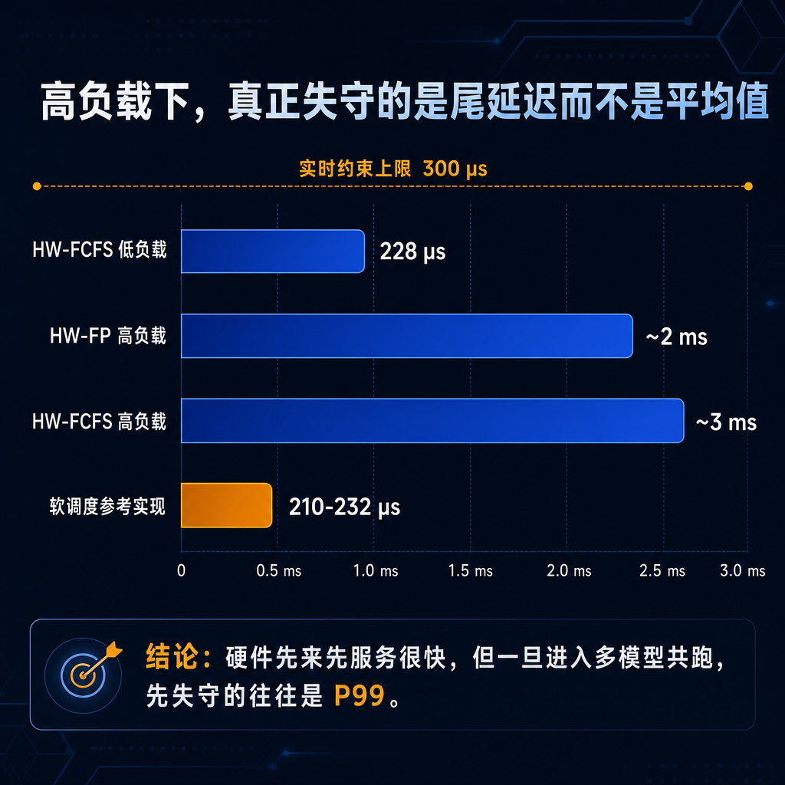
▲ 图1 · 高负载下，真正失守的是「尾延迟」而不是「平均值」

这正是 IBMW 想回答的问题：当 VLA 进入控制回路，系统既要把抖动压在硬实时边界以内，又不能把调度图、通信路径、异构资源绑死成无法演进的常量。**只能证明自己「平均更快」的中间件，没资格碰控制回路。IBMW 要争的，是把「确定性」从硬件特权改写成软件能力——可编排、可演进、可被重新组合。**

## 02 时代命题｜VLA 进入控制回路之后，中间件为什么必须重做

如果说 IB-Robot 把「具身智能 OS」做成了一条贯通的底座，那么 IBMW 想回答的是再上一层的问题——**当 VLA 真正进入控制回路，中间件这一层应该长成什么样**。

机器人软件栈过去的默认前提是：中间件把消息送到、线程唤醒、QoS 做到「够用」就行。但 VLA、多模态编码器、策略头一旦进入本体闭环，中间件就同时面临两组互相拉扯的目标：**一边是硬实时**——不接受偶发 2 ms、3 ms 级尾抖动；**另一边是高灵活**——调度、传输、异构映射都要能改。传统路径为了确定性把调度图固化进专用硬件队列，为了灵活性又把关键路径交回通用软件栈，最后让确定性在负载上来时悄悄丢失。**这不是「性能不够」的问题，而是「调度面放错了位置」的问题。**

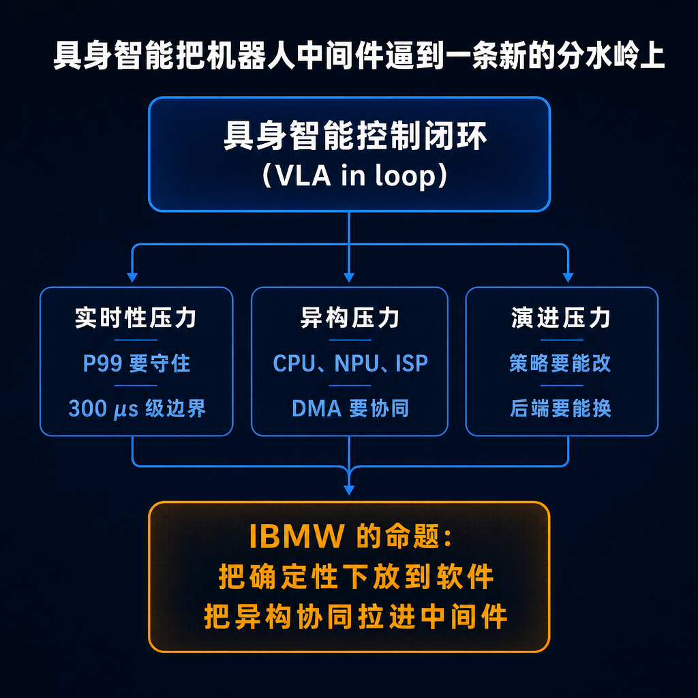
▲ 图 2 · 具身智能把机器人中间件逼到一条新的分水岭上

IBMW 的出发点因此非常明确：**它不是给现有中间件补一个优化项，而是重写「调度—数据—传输」三件事之间的边界。** 对外提供 Node / Pub-Sub / Service / Executor 这类开发者熟悉的接口；对内把 esched / topic_sched / aicore-sched 三件套软调度、DSF 双形态硬实时框架、SHM 与 Loaned Message 零拷贝、RTPS 兼容、异构 DMA 直通等能力，组织成一张统一的实时语义网（详见 03、04章节）。

在具身智能场景里，真正的尾延迟从来不只发生在一个环节——消息可以在传输层被序列化拖慢、线程可以在调度层被后台任务顶掉、张量也可以在进入 NPU 之前被重复搬运。IBMW 把「消息语义」和「执行语义」接上：控制系统声明的**时限预算（Timing Budget）**不应在进入异构运行时那一刻失真，消息优先级也不应在跨进程或跨 NPU 边界时被降格为普通 metadata。**中间件不再只是搬运层，而是具身智能时代的调度面入口。**

## 03 IBMW 框架总览｜一套为具身智能而生的软件定义实时中间件

IBMW 的定位一句话：**面向具身智能的软件定义实时中间件——在通用异构 SoC 上，用软硬协同把过去由专用硬件队列独占的确定性重新做出来。**

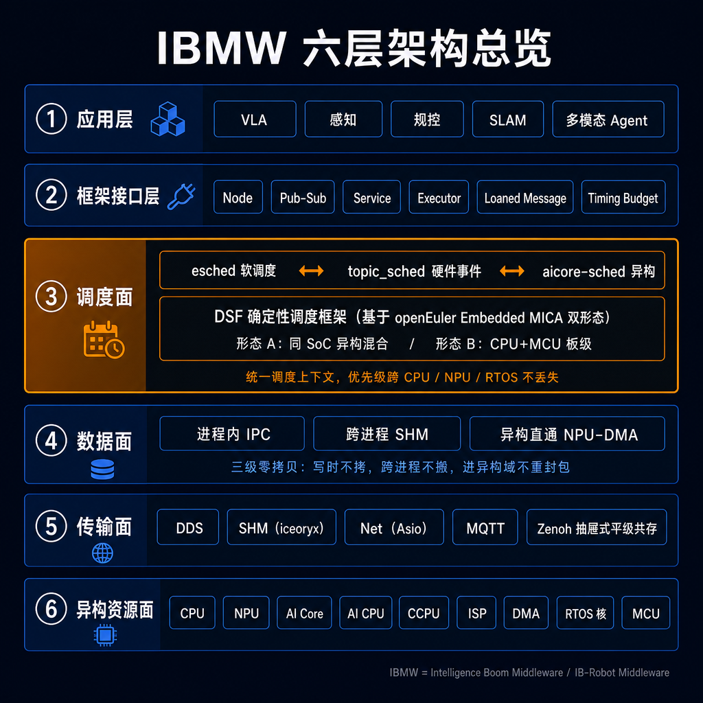
▲ 图 3 · IBMW 六层架构总览

它的核心不是「又一层抽象」，而是把三件以前分开处理的事绑定成一个整体：

1. **软件即调度面**：用户态时间窗与可插拔策略，叠加 DSF 承接硬实时小脑，不再是硬件调度的补丁；
2. **零拷贝是一等公民**：从 Loaned Message 到 IPC / SHM / NPU-DMA，消息生命周期被重新定义；
3. **传输面抽屉化**：DDS、SHM(iceoryx)、Net(Asio TCP/UDP)、MQTT、Zenoh 是平级后端，不是「唯一正统」；
4. **协同优于替代**：IBMW 不否认硬件调度，而是让软调度接住硬件队列覆盖不到的那 90% 系统语义；
5. **生态兼容而非绑架**：RTPS 兼容，能与 ROS 2 线协议互通，但避免把非必要运行时开销带入关键实时路径。

最容易被低估的是第三层「调度面」。IBMW 的方法是：**先统一调度上下文，再定义数据与传输如何服从这份上下文。**——在具身智能混战期，极限快未必关键；能改、敢改、改完不失控，才是关键。

## 04 三大支柱｜IBMW 为什么能把“软件定义实时”说成工程事实

### 4.1 软硬协同的双层确定性调度｜让硬实时从硬件特权，落到可演进的软件层

IBMW 的第一根支柱，是把调度拆成两层但语义打通：**上半层是 esched + topic_sched + aicore-sched 三件套构成的软调度协同**（分别负责用户态时间窗、硬件事件唤醒、异构算力面可插拔策略）；**下半层是 DSF 依托 openEuler Embedded MICA 双形态部署，把硬实时下放到通用 SoC**。两层共享同一份调度上下文。

#### 4.1.1 三层软调度协同：esched + topic_sched + aicore-sched

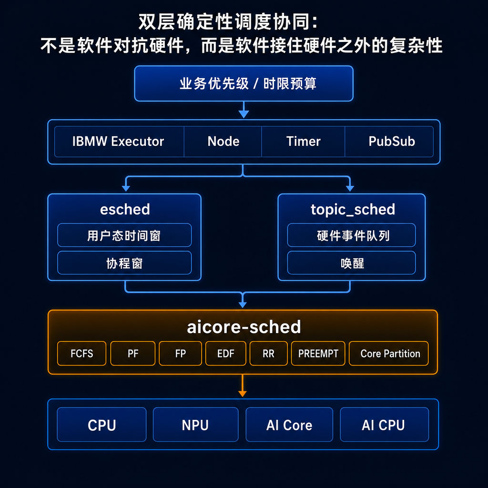
▲ 图 4 · 双层确定性调度协同(DSF + 软调度)

**团队在 Ascend 310P 平台的 PoC 验证**给出了一个反直觉结论：多模型共跑时，软调度不仅没有「灵活但不稳」，反而比 FCFS / FP 两种固定硬件策略更稳。

| 数据点 | 数值 | 说明 |
|---|---:|---|
| HW-FCFS P99 低负载 | 228 μs | 硬件先来先服务，基线 |
| HW-FCFS P99 高负载（150 并发） | ~3 ms | 劣化约 13 倍 |
| HW-FP P99 高负载 | ~2 ms | 硬件固定优先级，劣化约 9 倍 |
| 实时约束上限 | 300 μs | 高负载下硬件调度无法稳定保证 |
| 软调度参考实现 P99 全程 | 210-232 μs 稳定 | 0 到 150 并发，波幅约 22 μs |
| 软调度参考实现 高优先级按时完成率 | 100% | 该实验下始终维持 |

软调度参考实现支持 **FCFS / FP / EDF / PF / RR / PREEMPT / Core Partitioning** 7 种策略，以 `.so` 动态形式承载，可插拔、可在线比较。

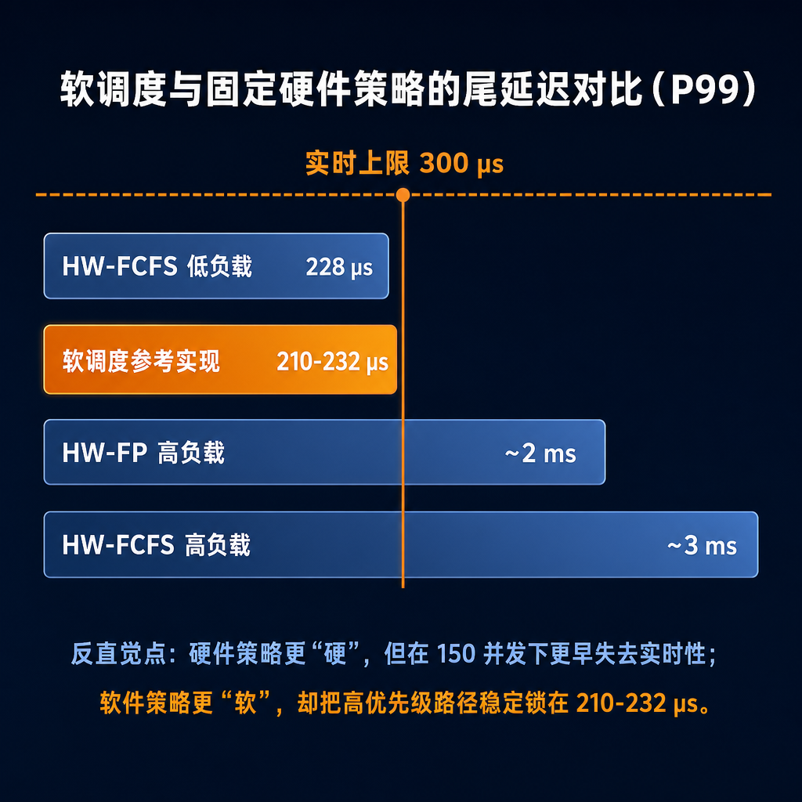
▲ 图 5 · 软调度与固定硬件策略的尾延迟对比(P99)

真正值得行业重新思考的，不是 FCFS、FP、EDF 谁更先进，而是**调度策略应该固定在硬件里，还是暴露为软件变量**。**IBMW 不否认硬件调度的价值，它只是拒绝把机器人的未来三年写死在一条不可修改的硬件队列里。** 当实时上限是 300 μs 时，「能否按时完成」比「平均有多快」更关键。

> 「RT-Infer 能够在多模型共跑场景下实现微秒级响应、实时抢占，即使后台任务负载增加，也能让关键推理路径不受干扰地执行；它不只是提升平均性能，而是把尾延迟稳定住，让多模型协同运行的可预测性大幅提升。」

#### 4.1.2 确定性调度框架 DSF：基于 openEuler Embedded MICA 的双形态落地

软调度三件套解决的是「通用 Linux 用户态怎么把 P99 压住」；但还有一段路径是连用户态都不敢承担的——**关节控制线程的硬实时小脑**。IBMW 给这段路径定义了独立平面：**DSF（Deterministic Scheduling Framework，确定性调度框架）**，依托 **openEuler Embedded MICA(Mixed Criticality)框架**（其 OpenAMP / rpmsg / remoteproc 提供 Linux 与 RTOS 之间的核间通信），给出两种部署形态。

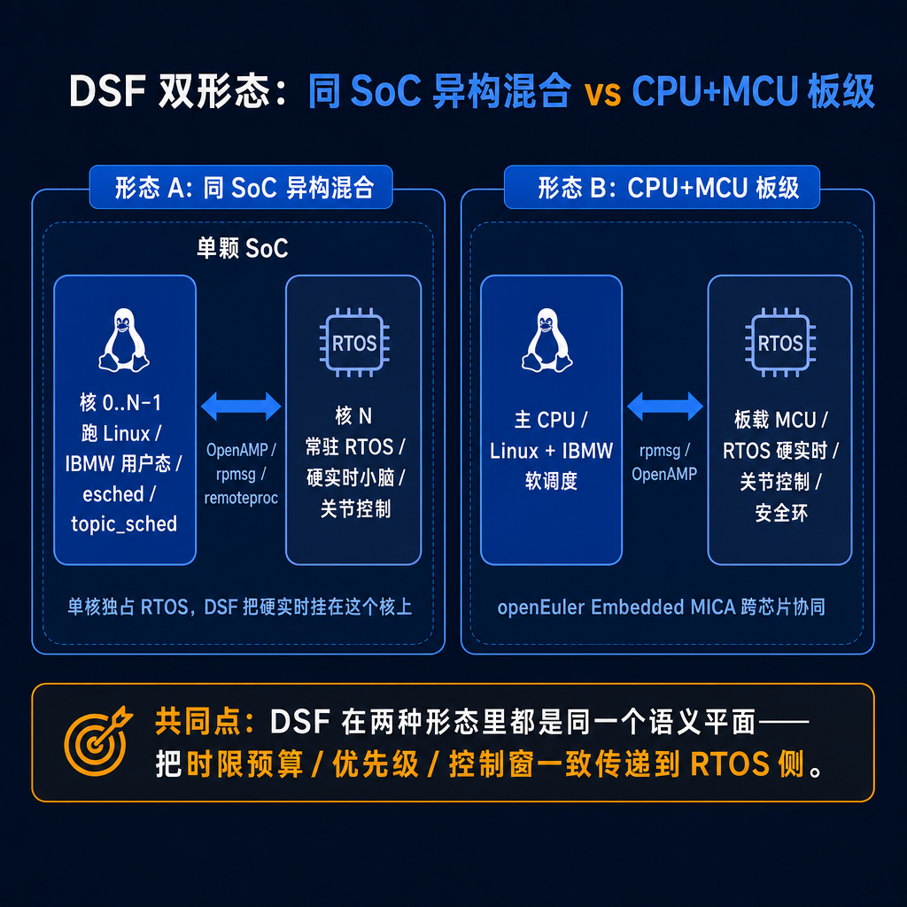
▲ 图 6 · DSF 双形态：同 SoC 异构混合 vs CPU+MCU 板级

形态 A 适合高度集成的本体（单 SoC 一核常驻 RTOS，功耗/面积/BOM 友好）；形态 B 适合需要严格安全分区或既有 MCU 资产的产品。IBMW 把两种形态抽象到同一 DSF 平面，对外暴露同一套时限预算 / 优先级 / 控制窗语义。软调度三件套接 P99 与按时完成率，DSF 接硬实时节拍与抖动下限，两者共享统一调度上下文，优先级跨 CPU / NPU / RTOS 核不丢失。

### 4.2 贯穿应用—框架—异构硬件的全栈零拷贝｜真正决定系统响应感的，常常不是带宽，而是尾延迟

第二根支柱，是把零拷贝从「局部优化」升级为「系统语义」。IBMW 的消息不是默认序列化再传，而是在接口层就允许 Loaned Message，随后沿着 **进程内 IPC / 跨进程 SHM / 异构直通 NPU-DMA** 三层路径持续保持「数据不重落」。

> **数据来源**：以下数据来自参考实现 PoC 的单机横向延迟基准（共享内存 + loopback TCP），覆盖 `iceoryx_loaned` / `dds_loaned` / `dds_send_shm` / `dds_send_tcp` / `net_send_tcp` 五种路径。

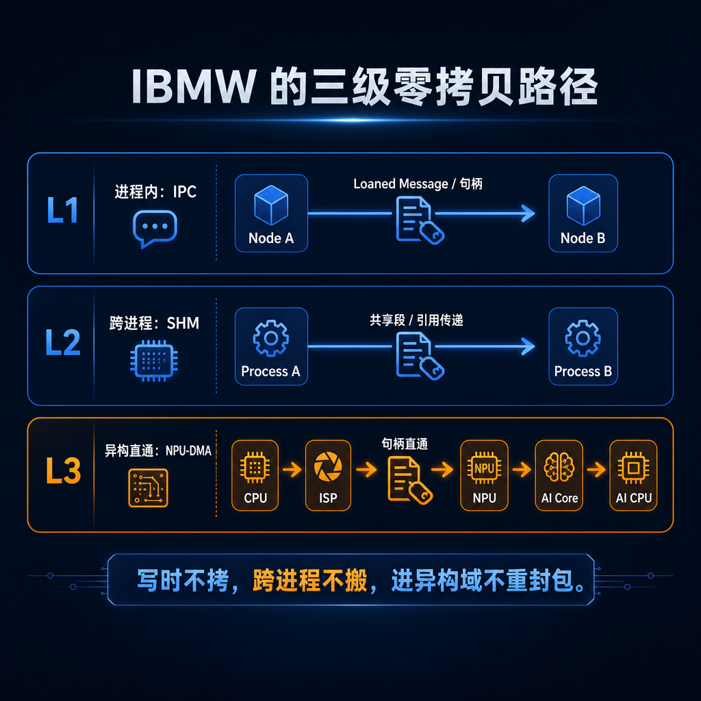
▲ 图 7 · IBMW 的三级零拷贝路径

来自 **参考实现 PoC 横向延迟基准** 的实测数据，覆盖 **5 种传输方案 × 6 档负载**，暴露不同路径的尾延迟性格。表中格式为 **avg / P99 (μs)**：

| Payload | iceoryx_loaned | dds_loaned | dds_send_shm | dds_send_tcp | net_send_tcp |
|---|---|---|---|---|---|
| 1 KB | 72 / 137 | 173 / 253 | 231 / 317 | 13162 / 38188 | 402 / 496 |
| 4 KB | 67 / 122 | 126 / 192 | 169 / 252 | 11391 / 32121 | 297 / 485 |
| 16 KB | 85 / 137 | 173 / 236 | 205 / 240 | 5413 / 10506 | 350 / 531 |
| 64 KB | 79 / 137 | 91 / 208 | 297 / 353 | 885 / 1006 | 497 / 637 |
| 256 KB | 117 / 180 | 216 / 263 | 333 / 503 | 1405 / 10481 | 673 / 874 |
| 1 MB | 204 / 273 | 346 / 456 | 1732 / 11458 | 3957 / 10688 | 1526 / 1962 |

四个数字锚点足以读懂这张表：**1 MB 下零拷贝 vs 序列化+SHM，平均降低约 8.5 倍、P99 降低约 42 倍**；**1 KB 下零拷贝 vs DDS-over-TCP 差距约 183 倍**；**零拷贝 1 KB → 64 KB 平均时延稳定在 67-85 μs 区间**；**DDS-over-TCP 在 1 KB 的 P99 高达 38188 μs**。

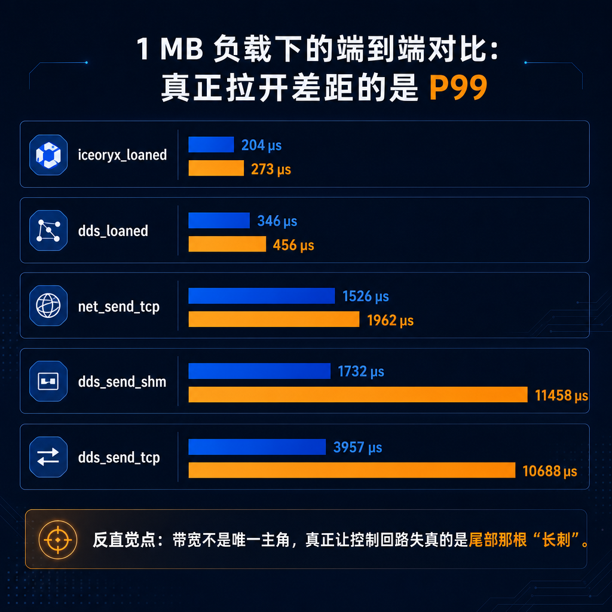
▲ 图 8 · 1 MB 负载下的端到端对比：真正拉开差距的是 P99

这组数据不是为了「证明零拷贝重要」，而在指出：**决定系统响应感的不是带宽，而是 P99 尾延迟**。1 KB 的 **72/137 μs** vs **13162/38188 μs** 说明小包一旦落入不合适的协议路径，P99 同样会被拉到毫秒级。IBMW 因此把零拷贝理解为「消息生命周期的可控对象」：Loaned Message 是起点，IPC/SHM 保持句柄语义，NPU-DMA 把这份语义延续到异构执行面——**一条消息要想真稳定，从发布那一刻就要知道自己接下来会以哪种形态穿过系统。**

### 4.3 抽屉式传输面 + RTPS 兼容｜兼容生态，但避免把非必要运行时开销带入实时路径

第三根支柱是传输面。IBMW 不把某一个传输后端视作唯一答案，而是把 **DDS / SHM(iceoryx) / Net(Asio TCP/UDP) / MQTT / Zenoh** 做成平级抽屉：同一套 Node / Pub-Sub / Service / Executor 接口，按部署拓扑与消息类型选择不同后端。

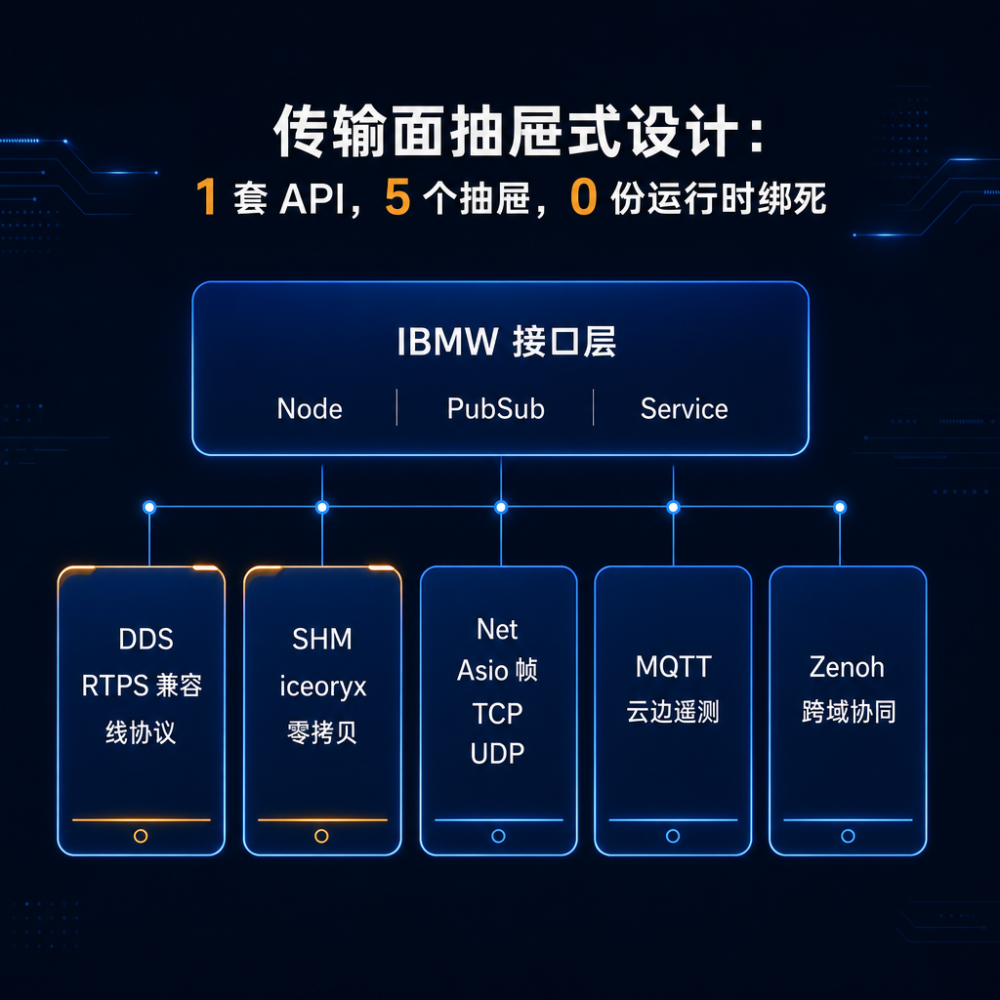
▲ 图 9 · 抽屉式传输面：1 套 API，5 个抽屉，0 份运行时绑死

这里的关键不只是「可插拔」，而是 IBMW 对生态的态度：**兼容 ROS 2 线协议，但不依赖 rclcpp / rcl 运行时。** 已有 RTPS 生态可继续沟通，但整套外部运行时的非必要开销不会被带入控制回路的实时路径。

> **传输面定位**：IBMW 的 IPC、SHM、Loaned Message 路径承担**单机 / 同机箱内**的高确定性传输；跨主机协同由 DDS / Net / Zenoh / MQTT 等抽屉承接，把「单机零拷贝」和「跨网兼容」清晰分层。其中 Net 抽屉是基于 Asio 的原生 TCP/UDP 二进制帧路径，用于绕开 DDS 协议栈直接走 kernel socket 的轻量场景。

具身智能的中间件竞争，最后往往不是 API 谁更优雅，而是谁能在 **1 套接口、5 个传输抽屉、0 份运行时绑定** 下把控制流、模型流、云边流同时组织起来。**IBMW 的答案是：线协议兼容，运行时解耦；生态互通，但调度主权留在自己手里。**

## 05 核心场景：VLA 实时推理调度｜10 ms 内，到底发生了什么

如果前面的三根支柱还显得抽象，那么 VLA 进入控制回路，就是 IBMW 最值得被拿到台前的核心场景。设想一条最具代表性的指令——**「把桌上的杯子递给我」**——这不是单一推理，而是跨语音、视觉、VLA 编码、决策头、后处理、关节控制的连续实时链路。IBMW 想做的，是让它在 **10 ms 内**既快又稳，而且可预测。

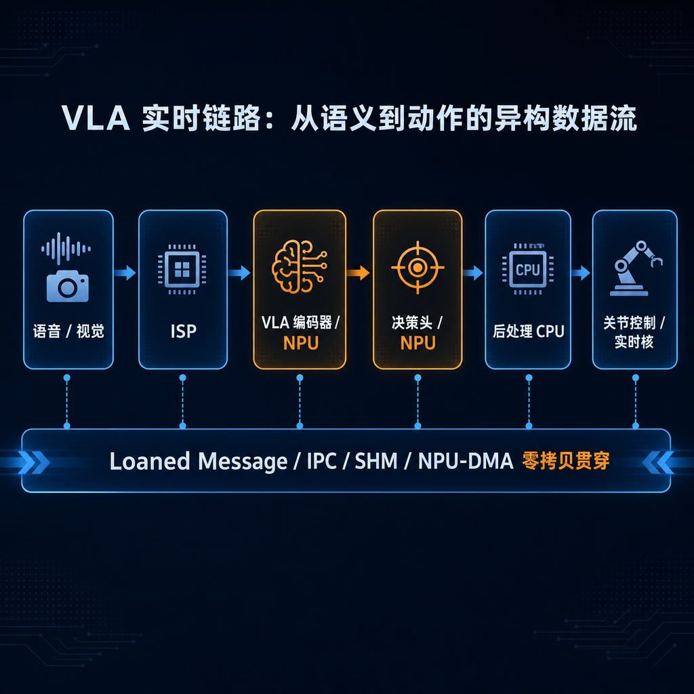
▲ 图 10 · VLA 实时链路：从语义到动作的异构数据流

把这个过程压缩成一条 10 ms 时间轴，各段职责切分如下（预算分账模型，非端到端实测）：

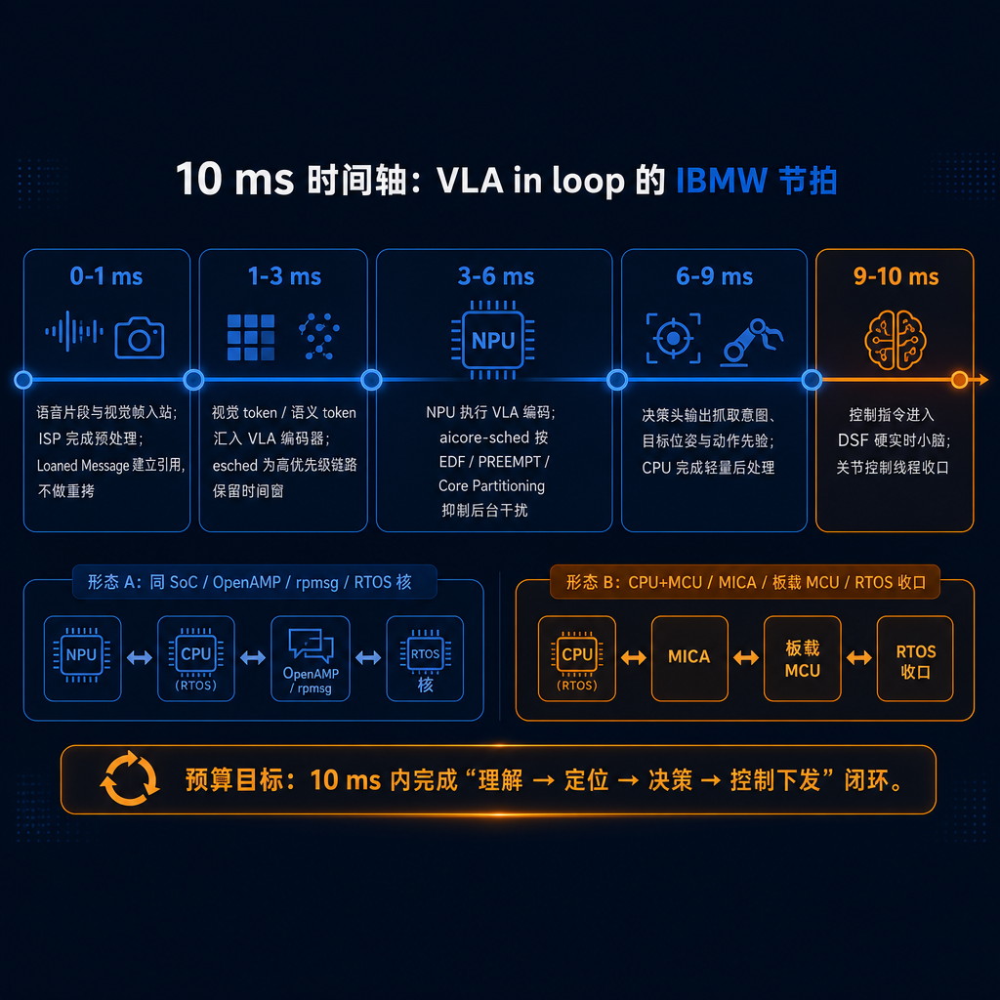
▲ 图 11 · 10 ms 时间轴：VLA in loop 的 IBMW 节拍

这条链路同时讲了调度、零拷贝、确定性三件事：上半层 esched + aicore-sched 把多模型共跑压在 P99 之内；下半层 DSF 通过 MICA 双形态把关节控制线程从 Linux 独立出来，以 SCHED_DEADLINE / RTOS 兜住硬实时收口；Loaned Message / IPC / SHM / NPU-DMA 把搬运成本压到最低。IBMW 实际上在为三类预算同时争取空间（数字来自相应实验或参考实现 PoC 局部证据，非整机闭环）：

- **调度预算**：高优先级异构任务在 **210-232 μs** 内收敛，不越 **300 μs** 线；
- **数据预算**：典型 1-64 KB 消息维持在 **60-85 μs** 区间，而不是随机跌入 **13162 / 38188 μs**；
- **闭环预算**：「理解 → 定位 → 决策 → 控制下发」收敛在 **10 ms** 内，窗口职责清晰。

具身智能时代真正把系统拉垮的不是显眼大 bug，而是无数小回退——多一次 copy、多一次反序列化、多一次线程错位唤醒、多一次后台任务插队。**IBMW 的价值不在选边站，而在让软实时大脑与硬实时小脑在同一中间件里各得其所——把模型稳定塞进控制回路，才是平台分水岭。**

## 06 我们关注的不是极限快，而是可改的确定性

IBMW 与某些专用硬件队列方案的分歧不在「是否重视硬件」，而在**对未来变化的假设不同**：把调度图与执行顺序固化在底层，稳定场景下能做到极高效率，但模型结构、控制周期、机体配比一旦变化，可调空间会迅速收窄。IBMW 反过来——策略可插拔、SoC 可换、软调度接住硬件看不见的系统语义。

最昂贵的不是 10% 的峰值性能差异，而是系统无法快速重排、重配、重试。**前者把「快」做到极致，IBMW 把「可改」做到决定性。中间件不是算力时代的附庸，而是具身智能时代的编排器；谁拥有编排器，谁就拥有平台层的定义权。**

## 07 共建愿景｜把中间件从“看不见的胶水”，做成具身智能的平台能力

IBMW 不只是一个框架名字，更是一个行业提议：**在具身智能时代，中间件不该只负责连接模块，更应该负责定义「确定性如何被生产出来」。** 如果你关心 P99 应该如何被设计而不是被祈祷、多模型协同下 FCFS 之外的策略主权、零拷贝能否成为中间件默认语义、RTPS 兼容与运行时解耦能否同时成立、DSF 双形态能否提供多种本体共用的契约——IBMW 值得被认真讨论。

IBMW 的共建，希望与产业一起把下面四件事推到能被多方使用：

1. **可插拔策略接口(Scheduler Plugin ABI)**：定义 FCFS / FP / EDF / PREEMPT / Core Partitioning 等策略与运行时的稳定边界，让不同团队贡献新策略而不动框架核；
2. **跨后端时限预算与优先级语义**：让时限预算、消息优先级、异构核绑定，在 DDS / SHM / Net / MQTT / Zenoh 多个抽屉之间保持一致，不在边界处被默默降级；
3. **零拷贝对象生命周期模型**：把 Loaned Message 在 IPC / SHM / NPU-DMA 三段路径上的所有权、复用、回收，做成一份可共识、可验证的规范；
4. **DSF 双形态语义契约**：基于 MICA 的「同 SoC 单核常驻 RTOS」与「CPU+MCU 板级」两种形态，定义时限预算、优先级、控制窗在 OpenAMP / rpmsg / remoteproc 边界上如何无损传递。

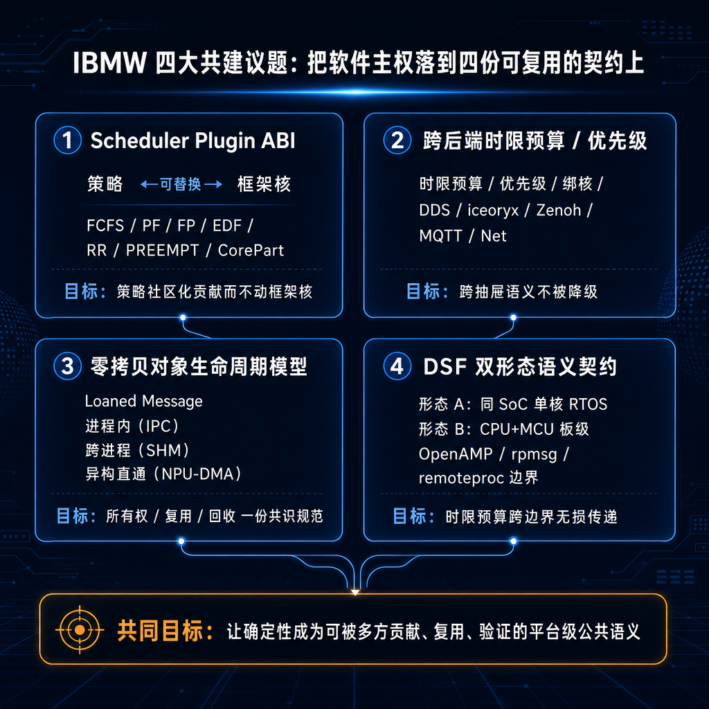
▲ 图 12 · IBMW 四大共建议题：把「软件主权」落到四份可复用的契约上

**确定性应该由谁来生产。** 谁能把「调度、零拷贝、异构协同、生态兼容」重新编成一套统一语义，谁就有机会定义下一代机器人平台的基础设施。

### 附：数据来源说明

- **软调度数据来源**：团队在 Ascend 310P 平台打通的 PoC 验证（同台对比 FCFS / FP 等固定硬件策略，多组复跑可复核）。  
- **零拷贝横向数据来源**：参考实现 PoC 横向延迟基准。  
- **框架术语来源**：DSF / SHM / esched / topic_sched / aicore-sched / Loaned Message / SCHED_DEADLINE / RTPS / openEuler Embedded / MICA / OpenAMP / rpmsg / remoteproc 等组件与接口定义。
