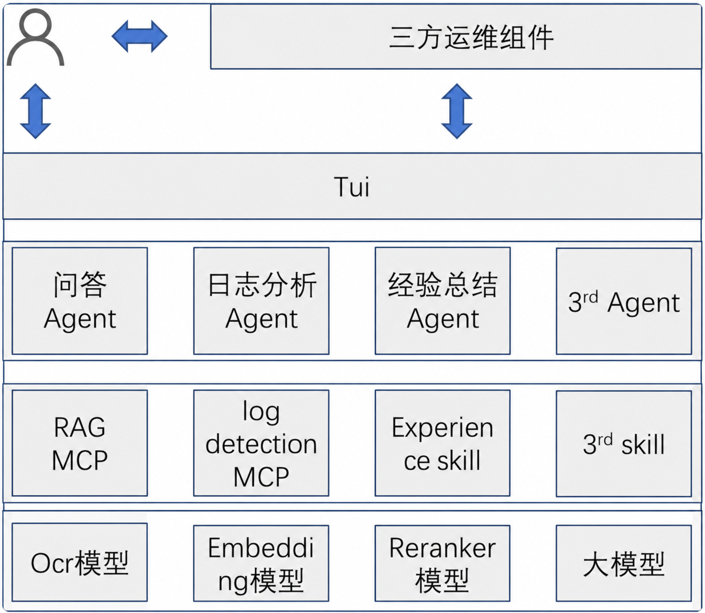
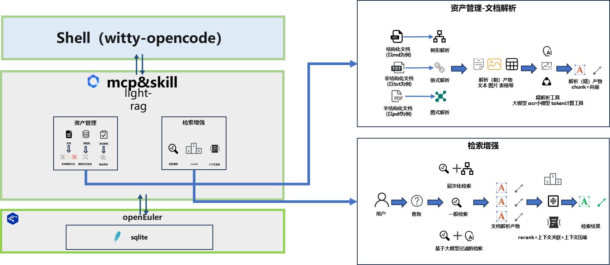
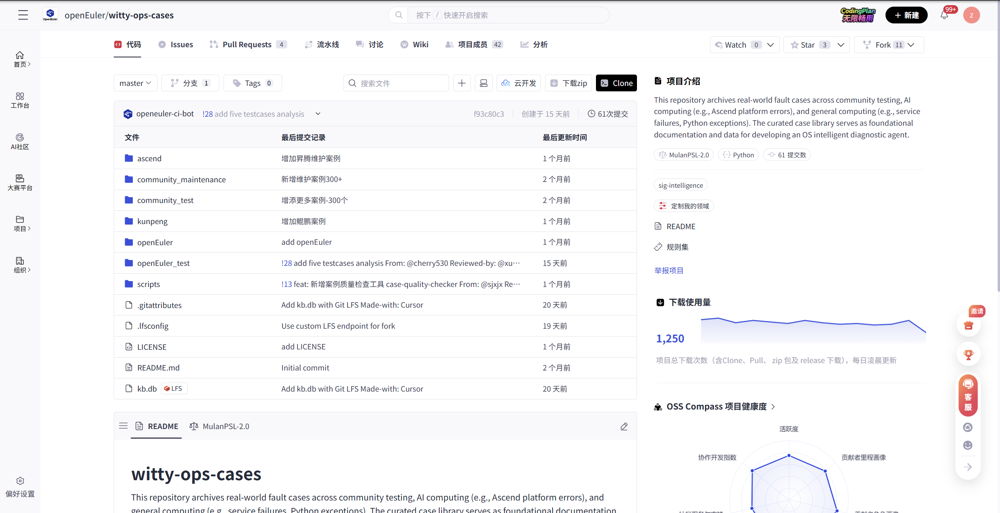
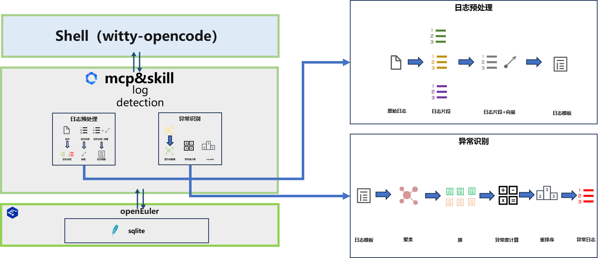
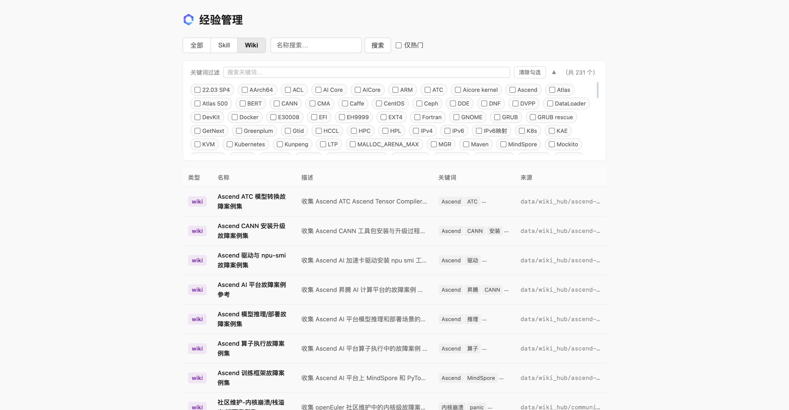
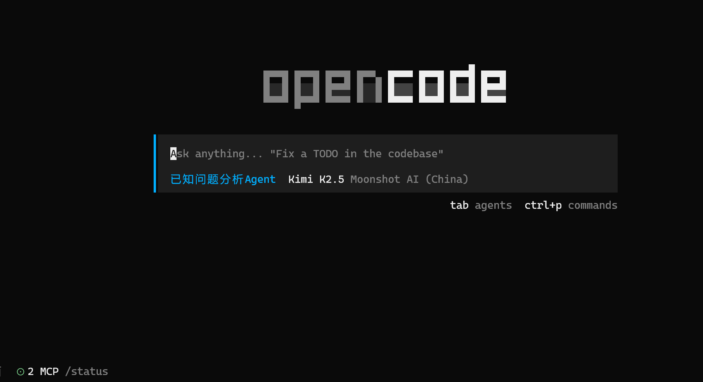
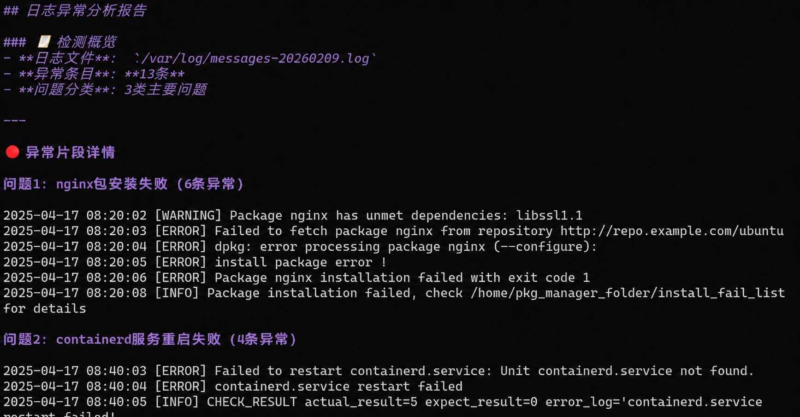
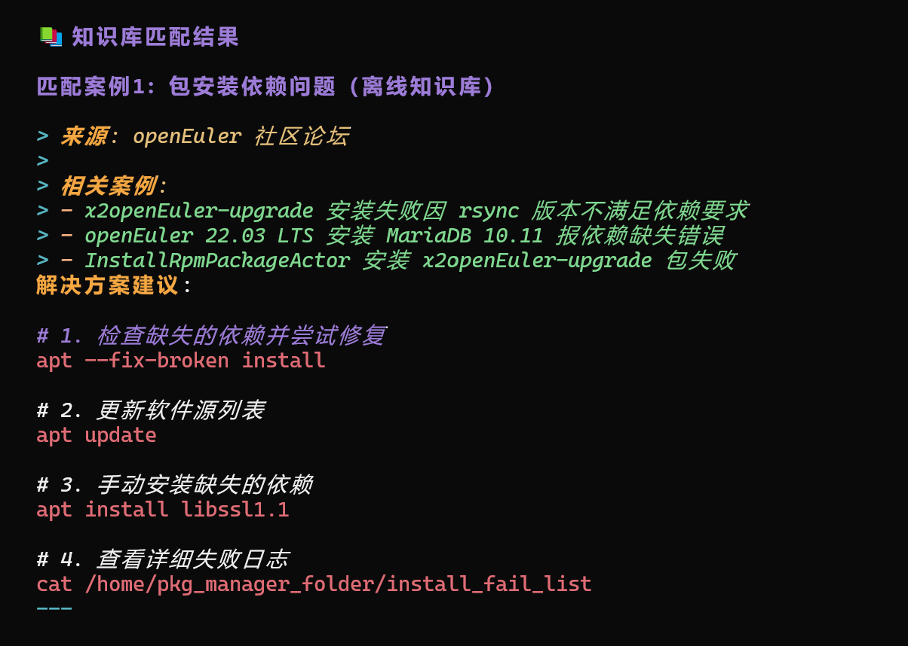
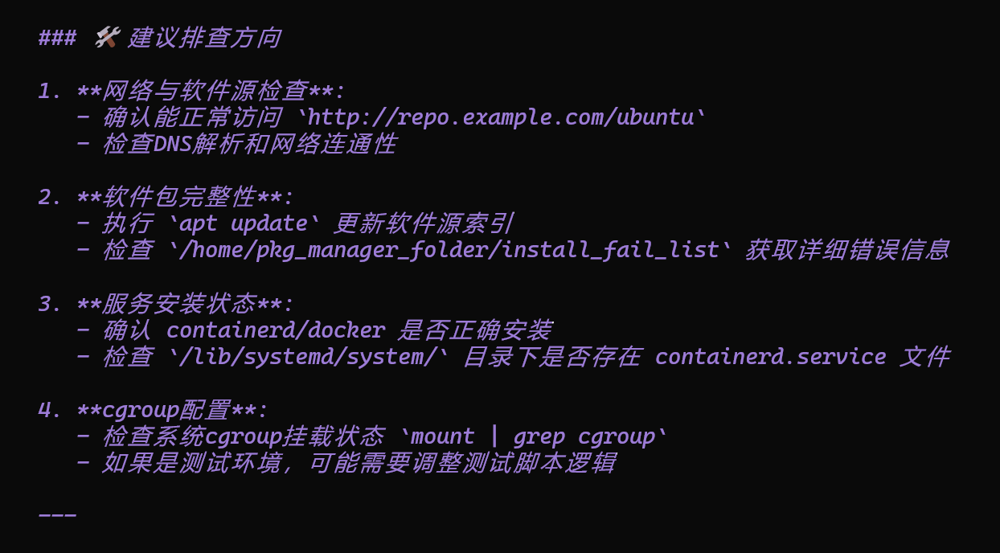
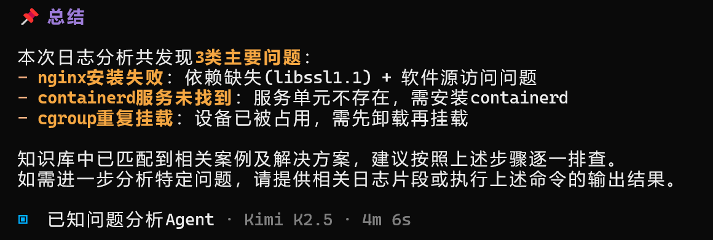

## 背景

在企业操作系统规模化落地应用中，运维工作普遍存在两大突出痛点，直接制约运维效率与价值释放：

1. **日志分析效率偏低**：运维日志品类繁杂、体量庞大，传统依赖人工逐条梳理分析的模式耗时耗力；且传统分析手段适配性弱，难以应对复杂多变的现场运维场景，无法形成可复用、可泛化的标准化分析能力。

2. **运维知识难以沉淀复用**：随着业务持续迭代，运维经验与故障案例不断累积，但人工整理沉淀成本高、周期长；后续同类故障发生时，经验检索耗时繁琐，极易出现重复排障、重复踩坑，人力资源浪费严重。

当前，大模型、智能体框架、语义日志分析、RAG 检索增强、LLM 知识库等技术日趋成熟，为**日志智能解析与故障案例精准关联**奠定了技术基础。基于此，OpenAtom openEuler（简称 “openEuler” 或 “开源欧拉”）社区联合麒麟软件，依托 OpenCode 平台，融合日志异常识别、轻量化 RAG、LLM 知识库能力，正式将**已知问题分析 Agent**落地生产环境，直击运维核心痛点，助力运维能力跨越式升级。

## 技术架构&功能实现

已知问题分析 Agent 以 **RAG MCP、Log Detection MCP、Experience Skill** 三大核心模块为底座，通过三类子 Agent 分别承接各模块能力，有效压降大模型调用成本、提升响应效率。各核心模块能力与价值如下：

### 1. RAG MCP 检索增强生成模块

模块基于 SQLite 构建底层存储，支持十余种主流文档格式智能解析；采用**关键词+向量混合检索**架构，实现运维知识秒级精准定位。

openEuler 社区已沉淀 **3000+ 优质运维案例**，为 Agent 提供扎实知识底座，并配套开放向量数据集，支持用户快速接入复用。

官方运维案例仓库：[openEuler 运维案例官方仓库](https://atomgit.com/openeuler/witty-ops-cases)

仓库全面覆盖 openEuler 社区测试运维、鲲鹏、昇腾等主流软硬件适配场景，scripts 目录内置案例检测工具链，便于研发与运维人员快速复用历史排障经验，显著降低运维排查成本。

### 2. Log Detection MCP 日志检测模块

整合聚类分析、关键词匹配、大模型语义理解、向量检索等多维度检测能力，打破传统日志检测模式单一、误判率高的短板，精准捕获异常日志、快速锁定故障根因，为运维排障提供高效切入点。

### 3. Experience Skill 经验技能模块

支持运维 Wiki 与技能库的创建、迭代、合并、检索与全生命周期管理，是运维经验沉淀、Agent 场景适配能力持续优化的核心载体。

模块配套轻量化可视化 Web 界面，可直观展示已沉淀故障经验，实现运维知识可视化、可管、可查、可用。

## 落地案例：面向麒麟操作系统智能运维的已知问题分析

麒麟软件作为参与 openEuler 社区建设的先行厂商之一，始终致力于社区的建设和维护，积极参与并推动了包括 AI、智能运维等多个领域发展。目前在 openEuler 社区的整体贡献排名中位居第二，是社区中重要的贡献者之一。

作为该方案的落地应用案例之一，麒麟软件用实践证明 AI 作为运维得力助手的必要性和可能性，让普通运维、开发人员也能高效应对复杂 OS 故障。期待更多伙伴加入智能运维社区贡献中，探索 openEuler 与 AI 结合的更多创新可能，共建高效、智能的运维生态！

当前方案基于自研智能运维 SDK 以及 OpenCode SDK 开展集成与场景验证，围绕服务器和客户运维环境中常见的系统异常、服务异常、资源异常、安装升级异常、软硬件适配问题等，复用 Witty 中的 **RAG MCP** 和 **Log Detection MCP**，形成“日志片段发现 - 异常定位 - 知识检索 - 解答生成 - 经验沉淀”的闭环。已知问题分析智能体是智能运维多智能体体系中的重要组成部分。

### 1. 场景背景

在操作系统交付、适配、测试和客户支持过程中，常见故障往往不是单一报错，而是涉及日志片段分散、上下文缺失、环境信息复杂等问题，人工排查需要工程师在系统日志、服务日志、安装日志和历史案例中反复比对，效率高度依赖个人经验。

该方案从真实服务器异常和实际运维场景出发，将客户现场和内部测试中反复出现的问题沉淀为可检索、可复用的知识资产，并通过日志检测能力优先定位关键日志片段，再结合知识库判断问题原因和处理路径，从而提升排查效率。

### 2. 分析流程

在该方案中，自研智能运维 SDK 以及 OpenCode SDK 负责智能体流程组织和工具接入，Log Detection MCP 负责日志检测，RAG MCP 负责知识检索。方案设计时重点考虑响应时间、运行资源消耗、部署复杂度和客户现场可用性，不追求把所有日志都交给大模型“从头读到尾”，而是采用关键词规则与 LLM 语义判断结合的方式，提高日志分析效率和可控性。

1. 客户或工程师提交故障描述、日志文件、系统版本、硬件平台、部署环境和现场操作信息；
2. Log Detection MCP 结合关键词规则和 LLM 语义能力，对日志进行异常识别，提取关键报错、异常上下文、疑似组件和高价值日志片段；
3. RAG MCP 接入麒麟侧自建知识库，检索各类操作系统常见运维问题、openEuler 相关案例、麒麟历史客户问题、适配测试经验和疑难问题处理记录；
4. 当前知识库规模约上万条，覆盖系统服务、安装升级、软件包依赖、内核与驱动、硬件适配、资源异常、配置错误和客户现场典型问题；
5. 大模型结合日志异常片段和检索结果，生成问题定位结论、可能原因、排查步骤、处置建议、相关案例依据和风险提示；
6. 工程师或客户侧运维人员验证建议后，将有效结论沉淀为新的知识条目、检测规则或客户案例，持续增强后续问题的命中率。

该流程的重点不是让 Agent 替代工程师直接下结论，而是让客户和工程师不再在海量日志里盲查。Agent 提供的是“关键日志片段 + 相似知识条目 + 定位依据 + 处置建议”，由工程师结合现场环境进行确认；对于低风险、标准化、可回滚的操作，未来可逐步扩展为受控的半自动处置和有限自愈能力。

### 3. 案例实践

为验证已知问题分析 Agent 在日志场景中的可用性，本次选取服务器运维日志 `/var/log/messages-20260209.log` 作为输入，在 OpenCode 交互界面中启动“已知问题分析 Agent”。本次验证不要求工程师预先标注故障类型，而是由 Agent 自动完成日志检测、异常归类、知识库匹配和排查建议生成。

Agent 首先调用 Log Detection MCP 对日志进行异常扫描，从原始日志中提取高价值异常片段，并将零散报错归并为可处理的问题项。本次检测共识别出 **13 条异常日志**，并归纳为 **3 类主要问题**：nginx 软件包安装失败、containerd 服务重启失败以及 cgroup 重复挂载。相比直接把整份日志交给大模型通读，这一步先完成日志降噪和异常聚合，把工程师真正需要关注的内容提前暴露出来。

从检测结果看，nginx 安装失败主要集中在 `libssl1.1` 依赖缺失、软件源访问失败以及 `dpkg --configure` 处理异常；containerd 问题指向服务单元不存在或未正确安装；cgroup 问题则表现为设备已被占用，疑似存在重复挂载。Agent 输出的不只是“有异常”，而是把异常按照组件、现象和影响范围拆成问题清单，便于后续分派、复核和闭环处理。

在完成异常识别后，Agent 进一步调用 RAG MCP 进行知识库匹配。以“包安装依赖问题”为例，系统从离线知识库中匹配到 openEuler 社区论坛及相关安装升级案例，包括 x2openEuler-upgrade 安装失败、openEuler 22.03 LTS 安装 MariaDB 依赖缺失、InstallRpmPackageActor 安装 x2openEuler-upgrade 包失败等相似问题。知识库匹配的意义不是简单罗列标题，而是把当前日志中的异常现象与历史案例、处理路径和可复用经验关联起来。

结合异常日志和匹配案例，Agent 生成了分层排查建议。针对软件包安装失败，建议先检查网络连通性和软件源可访问性，再检查软件包完整性、依赖修复状态和安装失败明细；针对 containerd 服务问题，建议确认 containerd 或 Docker 是否已正确安装，并检查 systemd 服务单元文件是否存在；针对 cgroup 重复挂载问题，建议检查当前挂载状态，避免测试脚本或初始化流程重复挂载同一资源。

最终，Agent 将本次日志分析结果汇总为可交付的排查报告：明确列出 3 类主要问题，给出每类问题的可能原因、关联知识库案例和后续排查方向。工程师拿到的不是一段泛泛的自然语言回答，而是一份可以继续验证、补充和流转的问题分析材料。

该案例表明，已知问题分析 Agent 可通过日志检测、问题归类、知识匹配、处置建议生成四个环节，将分散日志转化为可分析、可流转的排查结果。面向安装升级、软件源访问、服务启动、系统挂载等高频问题，该流程能够减少人工翻日志和重复查案例的时间，并将处理结果沉淀为后续可复用的知识条目或检测规则。

### 4. 落地价值

该方案的核心价值在于把分散在工单、测试记录、工程师经验和内部文档中的历史问题，转化为可检索、可调用、可持续复用的运维能力。对于客户侧运维人员来说，智能体可以先给出异常位置、关联案例和参考处理方向，降低初步排查门槛，减少无效沟通；对内部支持流程来说，异常摘要、排查路径和参考案例可以作为问题流转的统一材料，减少重复描述、重复检索和重复判断。后续随着权限控制、风险分级和操作审计机制完善，该能力还可进一步延伸到巡检、告警研判、风险提示、变更前检查、标准化处置建议和低风险半自动执行等场景，逐步支撑智能运维平台向辅助定位、经验沉淀和受控自愈方向演进。

## 部署&安装方式

该 Agent 支持在 openEuler 系统通过 repo 源快速部署，适配 **openEuler 24.03 LTS SP3 及以上**或麒麟V11版本。

- 详细部署步骤：[Witty OpenCode 官方安装指南](https://docs.openeuler.openatom.cn/zh/docs/24.03_LTS_SP3/tools/ai/euler-copilot-framework/witty_assistant/witty_shell/deploy_guide/deployment.html)
- 快速上手操作教程：[快速上手使用指南](https://docs.openeuler.openatom.cn/zh/docs/24.03_LTS_SP3/tools/ai/euler-copilot-framework/witty_assistant/witty_shell/deploy_guide/deployment.html#快速开始)
- 飞书社交软件对接配置：[OpenCode Bridge 桥接器官方指南](https://docs.openeuler.openatom.cn/zh/docs/24.03_LTS_SP3/tools/ai/euler-copilot-framework/witty_assistant/witty_shell/social_software_guide/bridge_introduce.html)

## 未来展望

后续已知问题分析 Agent 将持续迭代演进，从三大维度深化能力升级：

1. **拓宽知识场景边界**：补充 Docker、K8s、Spark 等主流中间件在 openEuler 环境的运维案例，丰富智能运维覆盖场景；
2. **强化日志检测能力**：引入前沿智能检测算法，新增二进制文件、时序数据分析能力，提升异常识别泛化性与准确率；
3. **升级知识管理体系**：优化 Experience Skill 模块，内置轻量化知识图谱能力，实现运维知识结构化沉淀、关联检索与高效复用，持续放大智能运维落地价值。

欢迎加入 sig-intelligence 交流社区，分享使用心得、反馈问题或贡献代码，与生态伙伴共同探索 openEuler 与 AI 的更多创新可能！

🔹代码仓：<<https://atomgit.com/openeuler/euler-copilot-rag>

🔹开发小组：sig-intelligence

🔹交流社区：<https://www.openeuler.openatom.cn/zh/sig/sig-intelligence>