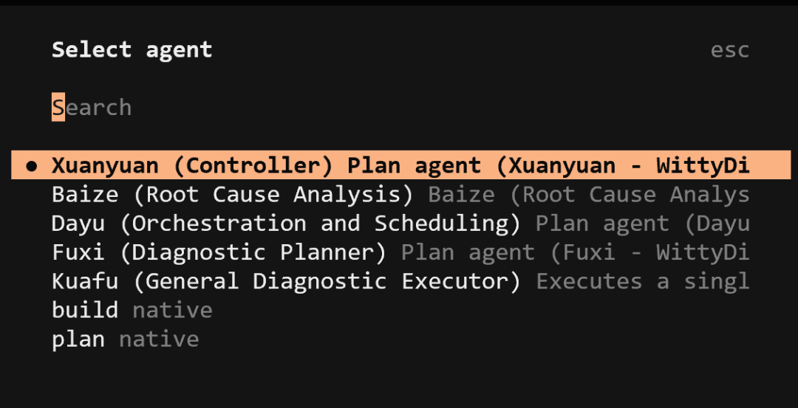
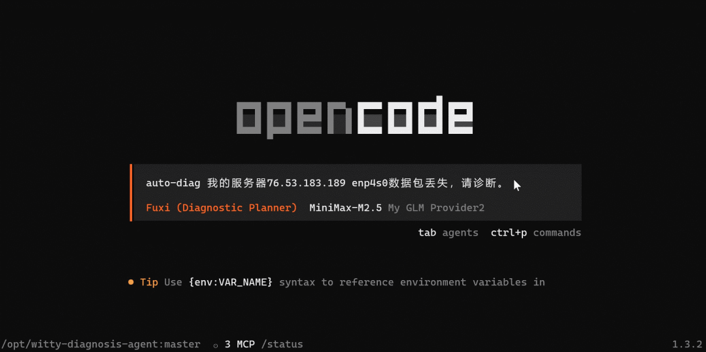
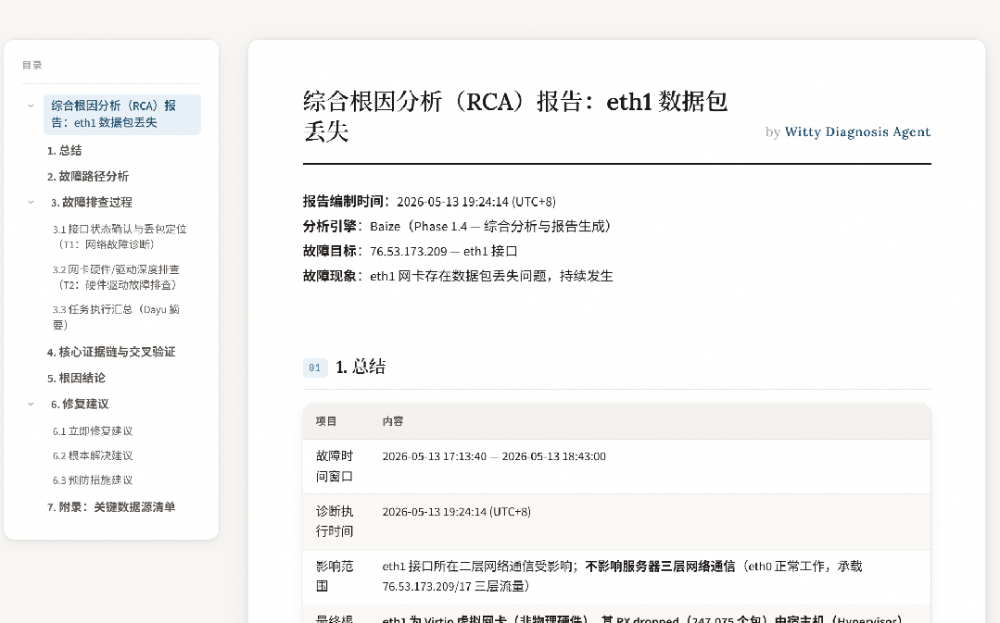

## 背景：网络故障排查的“效率困局”

在现代 IT 运维体系中，网络是业务正常运行的“生命线”，而 IP 不通、网口丢包、服务器网络异常等问题，更是运维人员日常面临的高频难题。无论是业务反馈的端口不可用、网段访问异常，还是服务器间歇性断网，每一次网络故障都可能导致业务中断、用户体验下降，甚至造成直接的经济损失。

当前，运维人员排查网络故障时，往往陷入“数据零散、流程混乱、依赖经验”的困境：监控工具能采集到大量网络数据，但如何从繁杂的日志、接口信息、路由配置中提取有效线索，成为难题；不同故障场景下的排查逻辑不统一，易出现跳过关键步骤、偏离排查重点的情况；各类诊断脚本零散分布，缺乏标准化调用规范，不仅增加了操作成本，更易因脚本误用导致诊断结果失真。

为破解这一困局，OpenAtom openEuler（简称 “openEuler” 或 “开源欧拉”）团队面向智能诊断 Agent 打造网络故障诊断技能，以流程标准化、采集自动化、分析精准化重构网络故障排查范式，将运维人员从繁重、重复的人工操作中彻底解放，实现故障根因的高效定位。

## 问题与挑战：网络故障排查的四大核心痛点

### 1.诊断边界模糊，排查范围易发散

用户反馈 “网络不通” 时，通常无法清晰界定影响范围：是单网卡异常、整机失联，还是仅特定 IP / 网段不可达。传统排查缺少场景化收敛机制，工程师极易陷入 “全网式体检”，盲目遍历所有网卡、路由与防火墙规则。不仅排查效率极低，还容易因信息过载偏离用户核心诉求，导致根因定位严重滞后。

### 2.数据采集散乱无序，证据链难以闭环

网络诊断依赖接口、路由、ARP、防火墙、内核日志等多类异构数据，传统采集多为随机零散式操作，常出现边采边判、时序错位、关键信息缺失等问题。例如仅凭历史日志告警就草率定因，未校验是否落在真实故障时间窗内；仅凭接口状态就判定物理故障，忽略策略路由、流量转发等真实路径影响，最终因数据不全、证据不闭环造成大量误判。

### 3.排查标准不统一，结果复用性差

网络故障排查缺乏统一的操作标准和结果规范，不同运维人员因排查习惯、使用工具不同，对同一故障的排查路径、数据采集范围、分析逻辑存在差异，导致排查结果无法复用、交叉验证。部分人员采集的数据不完整、日志过滤条件不一致，不仅会出现“同一故障不同结论”的情况，还会导致后续故障复盘、经验沉淀困难，无法形成可复用的排查体系，重复解决同类故障，大幅增加运维成本。

### 4.人工依赖度高，误判与故障扩大风险突出

网络故障涉及多层协议与复杂配置关联，高度依赖专家经验，人工分析易出现因果误读：如错判防火墙命中、忽略 ARP 表满与网口丢包的关联等。轻则延长排障周期，重则因错误修复操作（误删路由、误关接口等）引发次生故障，进一步扩大业务中断范围与损失。

## 智能诊断 Agent：网络故障排查的“智能解决方案”

针对网络故障排查的核心痛点，智能诊断 Agent 的网络故障诊断技能，全程遵循“标准化流程、自动化执行、精准化定位”的核心逻辑，依托内置的脚本工具和诊断规范，无需用户手动执行命令、编写脚本，即可完成从快照采集到根因定位的全流程诊断，彻底破解传统排查困境。

### 1. 标准化流程闭环，杜绝关键步骤遗漏

智能诊断 Agent 严格遵循“快照采集 → 综合分析 → 分支收敛 → 根因定位”的四步排查流程，并强制执行顺序，禁止跳过任何阶段，确保诊断过程的系统性和严谨性。例如，它要求在完成所有快照文件采集和读取前，不得进行任何分析，避免了“边采边分析”导致的误判。

### 2. 统一脚本工具，实现自动化数据采集

智能诊断 Agent 通过内置的标准化脚本工具集，自动化采集服务器网络与系统的完整状态快照，涵盖18种关键文件，确保数据全面性。同时，Agent 能够智能识别用户描述的故障场景（如“指定网口问题”或“整机网络异常”），并根据场景类型调整诊断范围，例如，当用户明确指定某个网口有问题时，Agent 会严格聚焦该网口进行排查，避免“非焦点转移”和“假设用户搞错”的误区，确保诊断的精准性。

### 3. 分层级分支收敛，快速锁定故障层级

智能诊断 Agent 会根据综合分析中识别的异常信号，智能选择L1-L2（物理链路/MAC/ARP/VLAN）、L3（路由/多出口）、DNS、L4（端口/防火墙/conntrack）或MTU/性能等相应网络层级分支进行深入排查。这种“按需深入”的方式，避免了“全网体检”的低效，能够快速将故障范围收敛到特定的网络层级。

### 4. 标准化故障报告与风险分级修复建议

智能诊断 Agent 会自动生成标准化故障报告，包含故障时间窗口、影响范围、根因结论、故障路径分析、排查过程及修复建议等内容。报告中明确区分修复操作的风险等级，提供详细的操作命令、风险提示和回滚方案，尤其针对高危操作，明确要求提供回滚方案和执行前提，让运维人员既能快速掌握故障来龙去脉，也能安全高效地执行修复操作。

## 使用流程

智能诊断 Agent 网络故障诊断操作简单，无需复杂配置，运维人员仅需一步即可完成故障诊断：

- 启动**OpenCode**。

- 执行` /agents` 命令选择` Xuanyuan `Agent。

- 输入故障问题描述，示例如下：

      我的服务器76.53.183.189 enp4s0数据包丢失，请诊断。

- 系统将自动执行智能诊断流程。

- 诊断完成后，根据终端输出的报告路径，查看完整的诊断分析报告。

## 总结

智能诊断 Agent 的网络故障诊断技能，将资深运维专家的诊断经验转化为标准化的流程和可执行的数字资产，实现了网络故障排查的“自动化、标准化、精准化”。它无需用户具备高深的专业知识，无需手动编写脚本、梳理流程，即可快速还原故障现场、锁定根因、提供安全可行的修复建议，成为运维团队的“虚拟网络专家”。

从“人工繁琐排查”到“智能一键诊断”，从“经验依赖”到“规范驱动”，智能诊断Agent正在重构网络故障排查模式，帮助企业降低运维成本、提升故障修复效率，为业务连续性保驾护航。

欢迎加入 sig-intelligence 交流社区，分享智能诊断 Agent 网络故障诊断技能的使用心得、反馈问题或贡献代码，与生态伙伴共同探索 openEuler 与 AI 的更多创新可能！

🔹代码仓：<https://atomgit.com/openeuler/witty-diagnosis-agent>

🔹开发小组：sig-intelligence

🔹交流社区：<https://www.openeuler.openatom.cn/zh/sig/sig-intelligence>