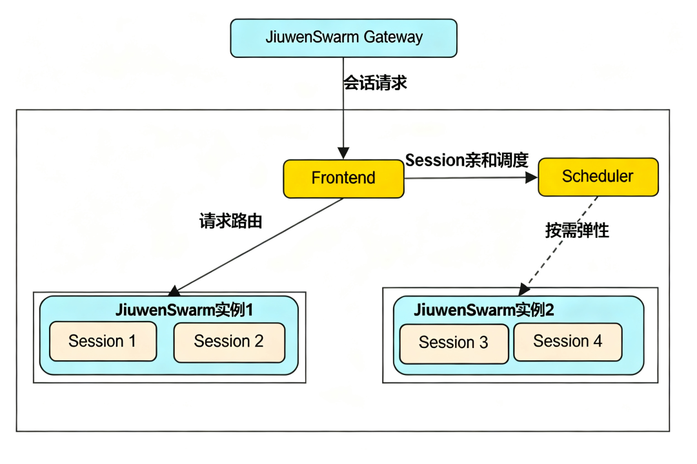
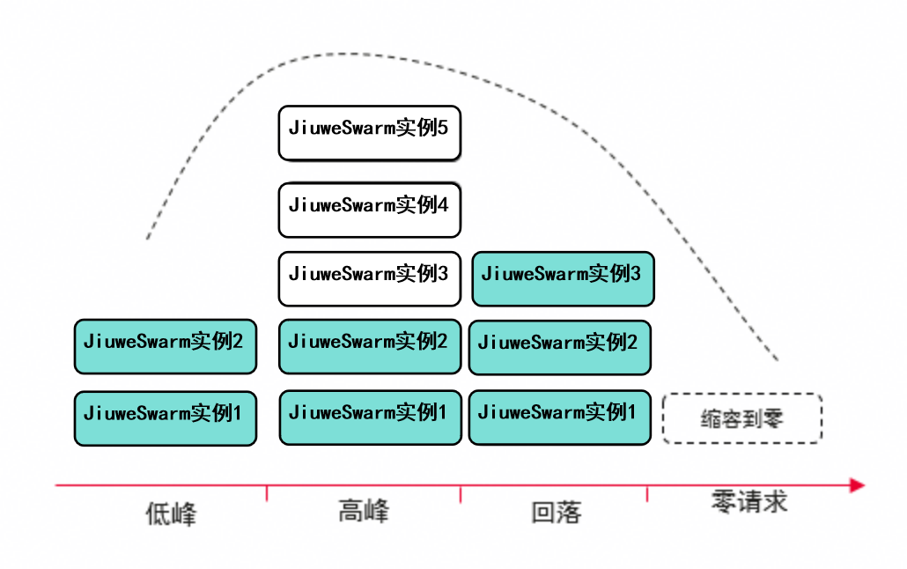
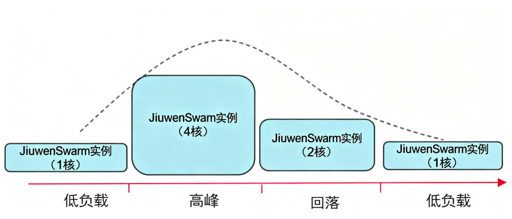
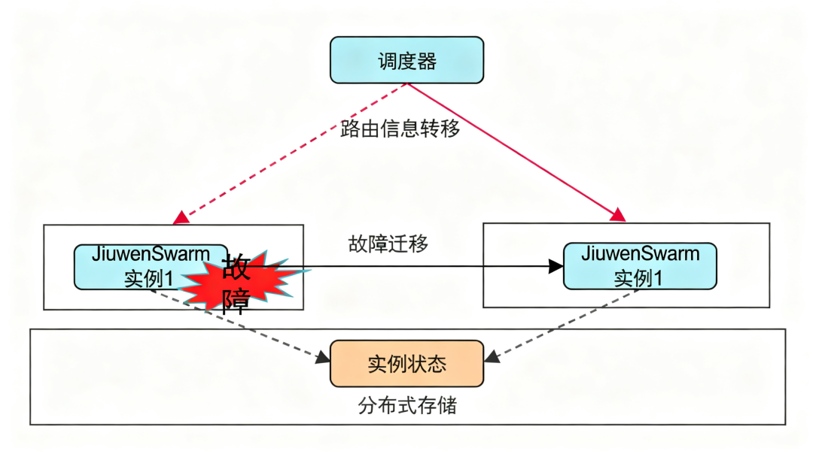
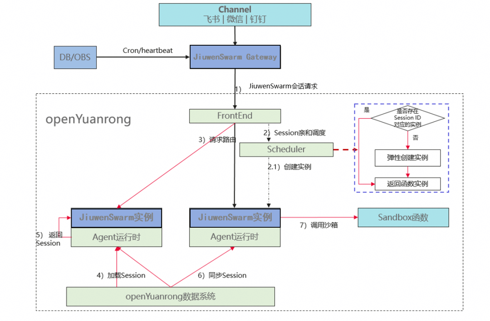
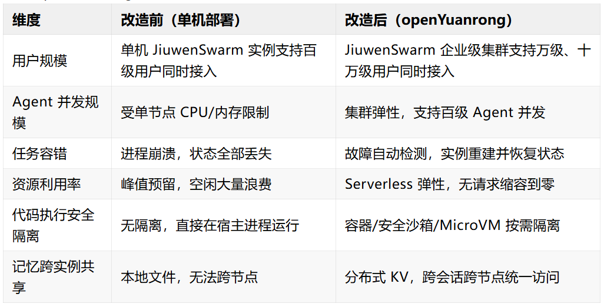

## 背景

JiuwenSwarm 是 openJiuwen 社区开源的 AI Agent 框架，随着 AI Agent 应用从个人助理走向企业级生产部署，单一用户、单台机器的运行模式已无法满足大规模、高并发、长时运行的业务诉求。如何让 JiuwenSwarm 在保持现有编程体验的前提下，突破单机限制、具备企业级的弹性与可靠性，是 openYuanrong 要解决的核心工程问题。 

openYuanrong 是华为在OpenAtom openEuler（简称：“openEuler”或“开源欧拉”）社区开源的通用 Serverless 分布式计算引擎，提出"将集群变成大单机"的分布式内核理念，致力于以单机编程体验支撑各类分布式应用的高性能运行。本文将探讨如何基于 openYuanrong 对 JiuwenSwarm 进行分布式化改造，实现 AI Agent 从单机部署向集群化运行的平滑演进。

## 一、JiuwenSwarm 单机架构的挑战

JiuwenSwarm 当前以单机进程方式运行，在个人与小团队场景下表现出色。然而在企业级部署中，以下四类问题逐渐成为规模化落地的瓶颈。

### 1.1 多租安全隔离

企业多租场景下，多租户/用户共享同一个 jiuwenSwarm 的 agent 资源，但是用户自己的空间和记忆需要进行隔离。单进程的 jiuwenSwarm 实例无法满足多租场景的规模诉求，需要支持百级或千级用户共享集群内的 jiuwenSwarm 实例，同时满足企业低成本和用户数据隔离的诉求。

### 1.2 Agent 实例扩展瓶颈

JiuwenSwarm 的所有 Agent 实例（包括 Gateway、Agent Runner 及工具执行进程）均运行在单一节点上，受制于该节点的 CPU 核数与内存容量。当并发用户数增加、任务复杂度提升时，单机资源迅速成为瓶颈，整体吞吐无法线性扩展。与此同时，为应对业务峰值，运维侧往往不得不按峰值流量预留资源，导致非峰值时段大量算力闲置浪费。传统扩容方式（手动增加机器、静态分配资源）不仅运维成本高，也难以跟上 AI Agent 任务负载的动态变化特征。

### 1.3 长任务容错能力不足

AI Agent 在处理复杂任务时，单次任务的执行时间可能长达数十分钟乃至数小时。在单机部署模式下，进程崩溃、节点重启或 OOM 等异常均会导致任务状态完全丢失，用户不得不从头重跑。JiuwenSwarm 当前缺乏面向长时任务的分布式容错机制：无节点级故障检测、无实例自动重拉、无任务状态的持久化与恢复。一旦出现节点级故障，对用户体验和业务交付均会造成直接影响。

### 1.4 代码执行缺乏安全隔离

JiuwenSwarm 具备代码执行能力，支持运行用户编写的脚本以及大模型动态生成的代码片段。在单机部署模式下，这些代码直接在宿主进程或宿主环境中执行，存在以下安全风险：

- **宿主环境污染：** 大模型生成的代码可能产生预期外的文件操作、网络访问或进程行为，直接影响宿主系统稳定性；

- **租户间干扰：** 多用户场景下，不同用户触发的代码执行任务共享同一进程环境，存在数据泄露与资源抢占风险；

- **权限失控：** 缺乏沙箱边界约束，恶意或异常代码可能突破 Agent 逻辑层，访问不应触及的系统资源。企业级部署中，对 AI 生成代码的安全可控执行是不可回避的基础要求。

## 二、openYuanrong 支持企业级 Agent 运行

针对上述四类挑战，openYuanrong 提供了直接对应的技术能力。openYuanrong 以分布式方式实现函数调度、调用和弹性伸缩等相关能力，解决大规模并发调度、函数高性能互调、高资源利用、分布式容错和安全隔离等关键问题。

### 2.1 Session亲和调度

Session 亲和调度以及按需弹性： 外部用户的诉求由 Frontend 组件进行路由并交由 Scheduler 组件进行调度， Scheduler 支持 Session 亲和调度。Scheduler 实例会保存 SessionID 和实例 Id 的映射关系，当 SessionID 没有关联到实例时，Scheduler 会弹性创建实例并返回给 Frontend；当 SessionID 有关联到实例时，会直接将实例信息返回给 Frontend 进行路由。从而确保同一个 Session 内的请求会路由到同一个 JiuwenSwarm 实例进行处理，JiuwenSwarm 实例会按照 Session 信息对用户的会话以及记忆进行会话级隔离，从而实现企业场景下的多租/多用户安全隔离。

### 2.2 分布式分级调度

openYuanrong 采用 Domain-local 分层调度设计：函数优先在本节点内的 Local Scheduler 调度，减少调度开销与数据跨节点传递；仅当本节点资源不足时，才将函数提交至上层 Domain Scheduler，实现全局资源负载均衡。当集群规模较大时，Domain Scheduler 本身也可通过父子级联方式管理集群，每个 Domain Scheduler 管理 500～1000 个节点，分而治之，彻底规避中心化调度的单点瓶颈。 这一能力使 JiuwenSwarm 的 Agent 实例可以按需分布在集群的任意节点上运行，集群整体作为一个统一的资源池对上层 Agent 逻辑透明呈现。

### 2.3 水平/垂直弹性

**水平弹性：** openYuanrong 依据请求流量进行弹性决策——通过估算请求队列等待时延与函数历史执行时延，预判处理压力，按需自动扩缩函数实例数量。当请求队列为空时，实例可自动缩容至零，彻底消除资源闲置。同时，Scheduler 可集成预测算法，基于历史调用规律提前完成资源调配，实现预热式弹性。

**垂直弹性：** 传统部署方式按峰值流量固定预留资源（如 4 核 8G），低负载时大量资源被闲置。openYuanrong 支持根据服务请求处理时延动态调整单个实例的资源配额，将空闲资源让渡给其他有需要的函数，进一步提升整体集群资源利用率。当节点负载过高或过低时，实例可自动迁移至更合适的节点，持续保障服务 SLA。

### 2.4 分布式容错

openYuanrong 内置分布式容错机制，支持故障自动检测，并在故障发生时自动重新拉起函数实例，恢复其最近备份的状态，将节点故障对业务的影响降至最低。同时支持函数调用过程中的分布式异常处理，确保调用链路的可靠性。对于 JiuwenSwarm 的长时 Agent 任务而言，这意味着单节点故障不再导致任务全量丢失，系统可在后台静默恢复，对用户透明。

### 2.5 安全沙箱调度

openYuanrong 原生支持多级实例安全隔离，可通过配置为函数实例选择不同的隔离模式：

- **进程隔离：** 隔离要求不高、追求极致资源利用率的场景，函数实例以独立进程运行，与其他实例逻辑隔离；

- **容器隔离（单 Pod 多函数 / 单 Pod 单函数）：** 需要租户间稳定隔离、避免干扰时，每个函数实例运行在独立的容器内，通过 cgroup 与 namespace 实现资源与权限边界；

- **MicroVM / 安全沙箱隔离：** 针对高风险场景（如执行 AI 生成代码、用户提供的 UDF 脚本），函数实例运行在轻量级虚拟机或安全沙箱内，提供硬件级隔离，从根本上阻断异常代码对宿主环境的访问。

对于 JiuwenSwarm 的代码执行 Skill，改造后可将每次代码执行任务封装为一个 openYuanrong 函数，由 openYuanrong 按配置的隔离级别在独立的容器或安全沙箱中调度运行。执行完毕后实例自动回收，彻底消除跨任务的环境污染风险。无论是用户编写的脚本还是大模型动态生成的代码，均在严格的边界内受控执行，宿主环境与其他用户的任务完全不受影响。

## 三、JiuwenSwarm 分布式化改造方案

### 3.1 架构总览

1）JiuwenSwarm Gateway 负责对接外部 Channel，并将请求按照 Session的方式调用到 openYuanrong 的 Frontend 组件；同时也负责对 Agent 进行心跳检查； 

2）Frontend 组件负责向 Scheduler 发起调度请求，Scheduler 组件根据SessionID 进行 Session 亲和调度；JiuwenSwarm 实例以函数的形式部署到 openYuanrong 集群上，支持按照 Session 的维度进行会话和记忆的隔离，同时支持按需弹性； 

3）JiuwenSwarm 将 Session 的状态信息存储到 openYuanrong 的数据系统，以支持故障场景下的迁移和恢复；

4）JiuwenSwarm 通过沙箱函数的方式执行代码/工具，实现多租场景下的高风险代码的安全隔离；

## 四、改造收益

基于 openYuanrong 完成 JiuwenSwarm 分布式化改造后带来以下收益：

## 五、总结

本文探讨了基于 openYuanrong 对 JiuwenSwarm 进行分布式化改造的整体方案。其核心思路是：充分利用 openYuanrong 通用函数抽象以及对 Python 的原生函数编程支持，将 JiuwenSwarm 作为 openYuanrong 的函数托管，由 openYuanrong 统一承担分布式调度、流量分发、弹性伸缩、容错恢复、安全隔离等各类复杂的分布式实现，使 JiuwenSwarm 可以专注于 Agent 自身逻辑。openYuanrong 的这些能力同样可用于快速支持其它 Agent 框架实现企业化分布式运行。

**相关链接：**

[1] 官网地址：<https://docs.openyuanrong.org/>

[2] 源码地址：<https://atomgit.com/openeuler/yuanrong>

[3] 技术论文：<https://dl.acm.org/doi/10.1145/3651890.3672216>

[4] 问题反馈：<https://atomgit.com/openeuler/yuanrong/issues>

欢迎添加 openYuanrong 小助手微信，由小助手拉您进我们的官方群获得最新资讯~

