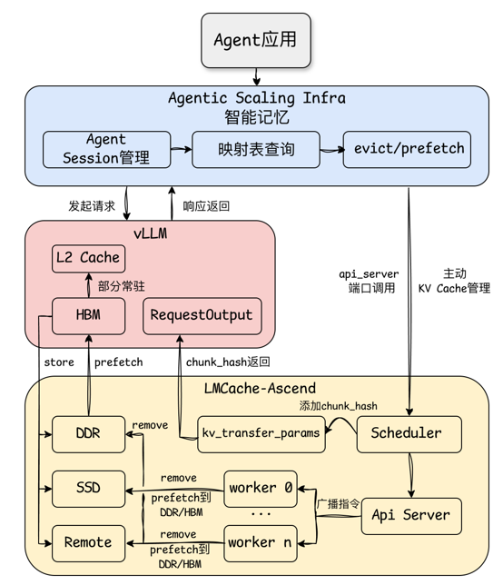
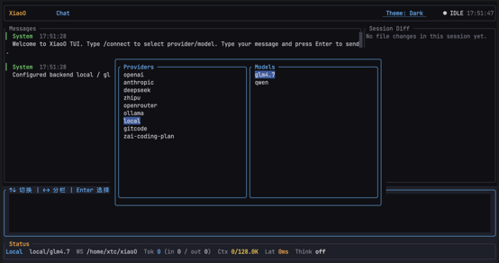

## 1、背景介绍：当AI Agent遇上“记忆-推理断层”

AI Agent 正从概念迈向大规模落地，以 OpenClaw、Hermes Agent、OpenCode 为代表的优秀开源项目掀起了新一轮热潮。Agent 不再局限于单轮对话，而是逐步演进为具备多轮交互、工具调用与记忆感知能力的复杂系统，能够为用户提供代码开发、个人助手、企业服务等高阶能力。

以典型的 Agent Loop 工作流为例：

- 用户输入：提出一个复杂任务或问题。

- 内部多步推理与记忆：Agent 会多次调用大模型连续推演（例如逐步细化方案），每一步都必须记住前序推理出的约束条件、中间结论，并据此调整后续思路。

- 工具调用与反馈整合：Agent 调用工具执行如查天气、查数据库、写代码等操作，获得外部反馈后，将结果融入当前上下文，由大模型理解并决定下一步行动。

Agent 任务有一个共同特征：同一个用户任务，需要多次调用大模型，上下文内容以增量的形式迅速增加，且后续调用高度依赖前序计算的中间结果。

然而，当前缓存系统（如 LMCache-Ascend）的设计，在Agent场景下存在一个根本性的矛盾：**推理引擎本身并不理解"用户到底在聊什么"**。每一次请求，vLLM 只是机械地计算 KV Cache，LMCache-Ascend 只是被动地存取。

**LMCache-Ascend 是"仓库管理员"——它被动存取，缺乏主动调度能力。**

- LMCache-Ascend 可以缓存 KV Cache，但无法预知哪些缓存会被复用，哪些已不再需要。只有当请求到来后，它才会在缓存空间中“尽力”查找。

- LMCache-Ascend 仅能依据 LRU（最近最少使用）等通用策略对所有 KV Cache 进行一视同仁的驱逐和管理，**无法感知语义相关性与重要性**。

- 当同一 Agent 任务的后续请求到来时，由于其他任务的挤占，LMCache-Ascend 可能已将前序请求生成的 KV Cache 降级到较慢的存储介质。此时只能被动触发 KV Cache 的搬运，导致 **TTFT（首 Token 生成时间）被动增加**。

- 当 Agent 的上下文内容发生变更时（如 subagent 执行完成、上下文压缩、工具结果清理等），其对应的 KV Cache 已不再需要，而 LMCache-Ascend 仍将其保留在珍贵的存储空间中，导致其他有用的 KV Cache 被挤出，从而**降低 KV Cache 的有效率**。

### 解决方案：语义感知的KV Cache协同调度

问题的本质在于：LMCache-Ascend 等缓存系统缺乏对“用户意图”和“语义结构”的理解。它只能被动存取，无法感知哪些内容将被复用、哪些已经失效。

为了解决这一矛盾，OpenAtom openEuler（简称“openEuler”或“开源欧拉”）团队**构建了一个感知语义、预判复用、主动调度的上层大脑——Agentic Scaling Infra 智能记忆。**

**核心思路**

1. **语义感知：打通 KV Cache 与 Agent 的语义鸿沟**

在记忆系统层，实现 KV Cache Chunk 与 Agent 上下文内容的分段映射。每一段上下文对应哪一段 KV Cache Chunk，一目了然。这样一来，缓存系统不再“盲人摸象”，而是能够理解“这段缓存对应的是哪部分推理过程”，为后续的精准调度奠定基础。

2. **主动调度：基于 Agent 执行行为的动态缓存管理**

根据 Agent 的执行行为特点，主动对上下文对应的 KV Cache 进行动态预取、驱逐或降级。具体而言：

- 预取：在 Agent 即将进入下一步推理前，提前将所需 KV Cache 加载到高速存储中；
- 驱逐：及时清理已失效或不再需要的 KV Cache，释放存储空间；
- 降级：将短期内复用概率较低的 KV Cache 迁移到低速存储，避免挤占高速缓存资源。

通过主动调度，显著降低 KV Cache 的加载时间，从而有效降低请求的首 Token 时延（TTFT）。

3. **优先级标识：基于上下文重要性的分级缓存策略（实现中）**

根据上下文的重要性，对对应的 KV Cache 进行优先级标识：

- 高优先级：对复用率高的 KV Cache（如 System Prompt、Tools 描述等）进行高优先级标注，实现长期驻留；
- 低优先级：对临时性、一次性使用的 KV Cache（如单次工具调用的返回结果）进行低优先级标注，优先驱逐。

通过分级管理，在有限的存储资源下，最大化缓存命中率，保障关键任务的推理效率。

## 2、Agentic Scaling Infra智能记忆：专为Agent应用打造的智能记忆管理服务

Agentic Scaling Infra 智能记忆相当于一个“上层大脑”——它能够感知语义、预判复用、主动调度缓存。在用户 Prompt 到达推理引擎之前，它便根据语义预判哪些 KV Cache 会被复用、哪些已经过时，并主动指挥 LMCache-Ascend 完成驱逐与预取。最终，将 TTFT 从秒级压缩到毫秒级。



LMCache-Ascend 已经构建了 NPU HBM → CPU DDR → Local SSD 的多级 KV Cache 存储体系，上层记忆系统掌握语义，直接指挥 LMCache-Ascend 的存储操作；vLLM 作为推理引擎居中调度，并在请求结束时将新产生的 chunk_hash 回传给记忆系统。

**chunk_hash：KV Cache 的全局身份证**

chunk_hash 是整个协同框架的通信基石。LMCache-Ascend 通过 ChunkedTokenDatabase 将 token 序列按 chunksize（默认 256 tokens）切块，对每个 chunk 执行滚动前缀哈希。

相同 token 序列、相同 PYTHONHASHSEED 永远产出相同 hash，天然支持跨请求复用。hash[i] 依赖 hash[i-1]，形成不可篡改的链式结构，保证 chunk 顺序。

vLLM 的非流式响应中预留了 kv_transfer_params 字段，可在请求完成返回时将 chunk_hash 添加进去，通过请求响应返回给上层应用，记忆系统再根据请求上下文内容和 chunk_hash 建立映射表。

**LMCache-Ascend语义感知管理**

Internal API Server 提供了一条独立于 vLLM 请求链路，基于 FastAPI 的轻量级微服务，承载所有 KV Cache 管控接口。Internal API Server 为 vLLM v1 多进程模式下 Scheduler、TP Worker 0、TP Worker 1 等进程分配唯一端口，构建一个可寻址的管控网络，这使得外部调用方无需感知进程拓扑，只需知道起始端口和 TP 数量即可定位所有实例。

在分布式TP场景下，每个 worker 各自持有 KV Cache 的一部分分片，实例实现驱逐/预取覆盖所有分片，由 scheduler 进程接收请求，在将请求 body 转发到所有 worker 的 API Server。整个转发链路对上层应用完全透明，上层调用只需向 scheduler 端口发送请求，LMCache-Ascend 内部负责广播到所有 worker、收集结果、合并返回。

**/memory/evict：语义驱动的精细化驱逐**

当 Agentic Scaling Infra 智能记忆判定某个话题的 KV Cache 不再需要时，直接调用 LMCache-Ascend 的驱逐接口，释放 DDR 或 SSD 空间。在 vLLM 多进程模式（TP 多卡）下，Scheduler 进程收到请求后会自动通过广播到所有 Worker 进程，确保每个 TP Rank 的 KV 分片都被清理，不留残留。

**/memory/prefetch：工作流感知预取加载**

当 Agentic Scaling Infra 智能记忆预判某个历史会话即将被复用时，在推理发起前调用预取接口，将 KV Cache 从 SSD 异步加载到 DDR/HBM。数据在后台从 SSD 传输到 DDR/HBM，不阻塞主流程。如多轮连续会话、长上下文 Agent 持续交互场景：用户连续多轮提问、Agent 链式工具调用、长对话（几十/上百轮）。上一轮 KV Cache 存在 SSD，Agent Planner 预判用户会继续追问、继续调用同一批 Skill，提前把本轮 + 历史热点 KV Cache 预取到 DRAM/HBM，避免每轮推理都触发 SSD 随机读，消除 IO 等待。

**/memory/L2Cache：L2 Cache预取和持久化管理（实现中）**

加载 Skill 元数据时，预取对应 skill.md 核心规则、输入输出模板到 L2 Cache并进行持久化管理，避免推理时再从HBM 内存拉取；基于 Agent 规划链预取，Agent 输出下一步工具调用计划时，提前把对应工具定义、鉴权信息、示例预取到 L2；KV Cache 热点预取，多轮对话热点 KV Cache 分片预取到 L2，按需进行持久化管理和淘汰，减少重建、拉取耗时。

## 3、使用案例：Agentic Scaling Infra智能记忆的实战表现

### 使用方式

为了让大家直观感受 Agentic Scaling Infra 智能记忆的实际效果，本章节将重点展示基于 Agentic Scaling Infra 智能记忆 KVCache 协同调度对 Agent 应用的提升效果。环境安装部署流程如下：

智慧中枢系统（面向服务器的系统智能体）：语义感知 KV Cache 协同调度特性已合入主线分支（后续将逐步增加对其他 Agent 框架的支持）

```bash
git clone https://gitcode.com/openeuler/xiaoO.git
cd xiaoO
cargo build --release
cargo install --path apps/xiaoo-app
xiaoo-tui
```

LMCache-Ascend：语义感知 KV Cache 协同调度特性已合入主线分支（后续将逐步增加对其他 KV Cache 管理框架的支持）

```
源码仓：<https://github.com/LMCache-Ascend/LMCache-Ascend>

参考 xiaoO/docs/kvcache-coordination-design.md 进行 vllm + LMCache-Ascend 本地环境搭建
```

在智慧中枢系统中输入 /connect 连接通过 vllm+LMCache-Ascend 本地运行的模型服务



### Agent应用性能提升效果

**效果总结：** 在多租场景，相比传统 KV Cache 调度方式 TTFT 时间节省 20%~40%

**执行任务：** terminal-bench2.0 评测集任务

**评测方式：** 对比实验基于相同的上下文内容（通过加载同一个 session 快照实现），由于多租造成请求之间存在其他用户/Agent/Session的推理交互，导致前一轮请求的KV Cache从DDR被驱逐到SSD，并继续完成下一轮请求交互

**数据说明：**

平均TTFT（首Token延迟）时间如下（单位：ms），数据取五轮测试平均值

| 场景 | git-leak-recovery (8K) | crack-7z-hash (15k) | cobol-modernization (33k) |
|------|------------------------|---------------------|----------------------------|
| Agentic Scaling Infra 智能记忆 | 370 | 400 | 455 |
| 传统KV Cache调度（存在Page Cache缓存） | 460 | 510 | 729 |
| 传统KV Cache调度（无Page Cache缓存） | 15420 | 29051 | 65199 |

## 4、总结与展望：从“机械缓存”到“语义大脑”

**过去：推理引擎是“盲人”，缓存系统是“仓库管理员”**

- vLLM 机械计算，不理解“用户到底在聊什么”
- LMCache-Ascend 被动存取，不知道“哪些缓存会被复用”
- 结果：多租情况下，KV Cache 被频繁挤出高速缓存，TTFT 从毫秒级飙升到秒级，Agent 体验断崖式下降

**现在：Agentic Scaling Infra 智能记忆成为“语义大脑”**

- 管理 Agent 应用的上下文内容，将上下文文本和 KV Cache 进行精准映射
- 预判哪些 KV Cache会被复用、哪些未来长时间不再使用、哪些已经失效
- 主动指挥 LMCache-Ascend 完成预取、降级和驱逐
- 结果：TTFT 从秒级压缩到毫秒级

AI Agent 正在从“单轮问答”走向“多轮协作”，从“工具”走向“伙伴”。在这一演进过程中，记忆能力是决定Agent智能水平的关键瓶颈之一。Agentic Scaling Infra 智能记忆的核心洞察是：**缓存不是存储问题，而是理解问题**。只有让缓存系统“理解”用户意图，才能真正实现高效的缓存复用。

### 仓库链接

- <https://gitcode.com/openeuler/xiaoO>
- <https://github.com/LMCache/LMCache-Ascend>