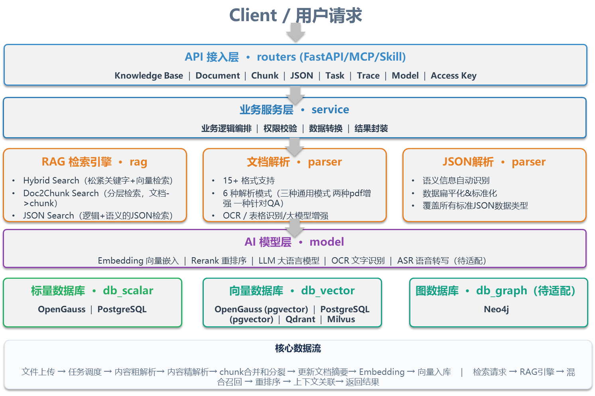
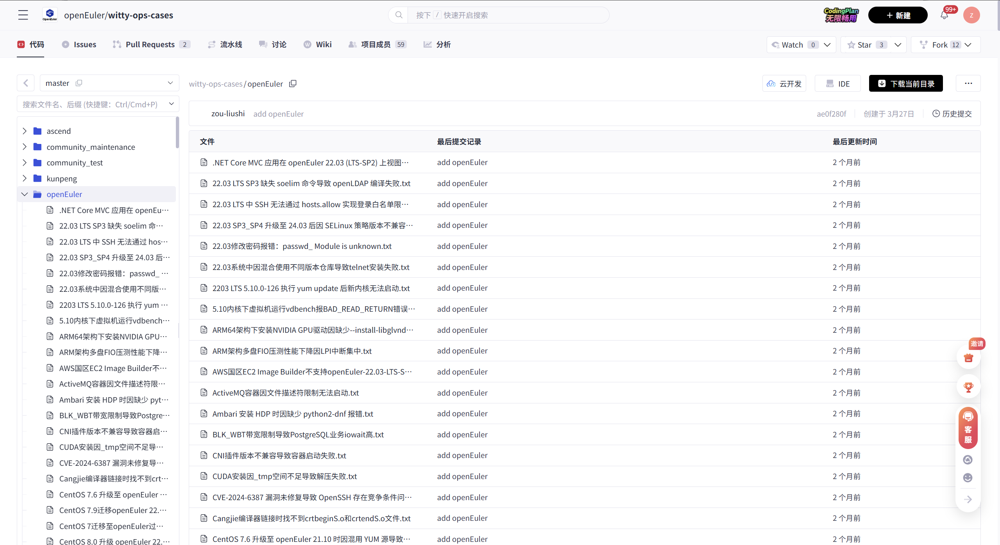
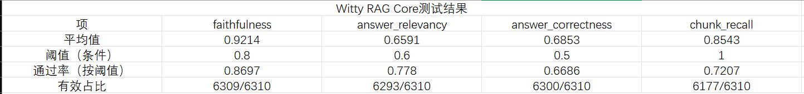
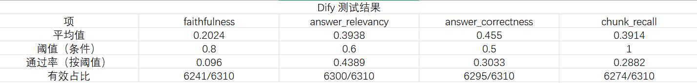

在 OpenAtom openEuler（简称 “openEuler” 或 “开源欧拉”）开源生态中，海量运维日志、故障手册、配置文档、版本更迭资料持续沉淀。散落的优质运维知识难以高效复用，成为众多运维工程师、企业技术团队的共同痛点。为破解运维知识碎片化、检索低效、落地困难等行业难题，openEuler 社区正式推出**Witty RAG Core**——一款面向企业级运维场景、分层解耦、高可扩展、支持全链路自定义开发的工业级 RAG 引擎底座。

---

## 一、运维行业核心痛点：知识海量可用，却难以高效活用

openEuler 操作系统广泛落地于服务器、云计算、边缘计算等核心数字基础设施场景，生态规模持续壮大，但配套运维知识体系的应用短板愈发突出，传统运维模式面临多重困境：

- **知识载体极度分散**：安装手册、故障排查指南、CVE 安全通告、内核参数说明、版本适配文档散落于 Wiki、Git 仓库、PDF 文件、社区邮件列表等多渠道，统一检索难度大。

- **日志数据价值难挖掘**：系统日志、服务运行日志、审计日志呈 TB 级增长，海量冗余数据掩盖关键报错信息，人工筛选排查效率极低。

- **多版本适配成本高昂**：20\.03 LTS、22\.03 LTS、24\.03 LTS 等多个长期支持版本并存，配置规则、运维命令、软件包命名差异较大，极易造成运维失误。

- **资深经验难以沉淀复用**：核心排障经验、场景化运维技巧多留存于工程师个人笔记，新人上手只能重复踩坑，团队知识传承效率低下。

传统关键词检索模式存在天然缺陷，仅能实现字面匹配，无法理解语义场景，经常出现“检索内容相关度低、有效信息缺失、无关内容冗余”等问题，完全无法适配精细化运维需求。

RAG（检索增强生成）技术的核心价值，是让大模型应答前精准定位、调取匹配的权威知识片段。但业界多数通用 RAG 方案存在链路不完善、工程化能力弱、场景适配性差、二次开发困难等问题。

openEuler 社区自研的 **Witty RAG Core**，聚焦运维全场景痛点，打通文档解析、智能检索、质量评估、工程落地全链路。该底座经过多轮复杂真实文档测试打磨，PDF 场景召回率领先业界同类方案 40%，是适配企业生产环境的成熟工业级知识底座，而非轻量化演示工具。

---

## 二、分层解耦架构：六层模块化设计，灵活适配各类业务

Witty RAG Core 采用标准化六层分层解耦架构，各层级职责单一、边界清晰、支持独立插拔替换，彻底规避传统 RAG 架构耦合度高、改造成本大的问题，适配快速迭代的业务场景。

模块化分层设计带来极低的改造与集成成本，适配不同角色的开发运维需求：

- 业务开发者可直接调用路由层（routers）REST API，5 分钟快速完成运维平台集成；

- 算法工程师聚焦检索层（rag），可针对性优化运维日志、故障文档的检索权重与策略；

- 运维/数据库管理员可在数据层（database）对接 OpenGauss、Milvus 等集群，无需改动核心业务代码；

- 文档维护者可在解析层（parser）拓展文件解析规则，适配各类运维专属配置文件。

依托社区持续迭代优化，项目已完成 JSON 混合检索、多数据库适配、PDF 解析功能的演进，同时完善 Prompt 机制、开发文档与测试体系，架构稳定性与实用性持续升级，是可随业务需求持续演进的开放式 RAG 底座。

---

## 三、核心能力闭环：解析、检索、评估三位一体

区别于业界多数仅聚焦检索召回的单一能力 RAG 方案，Witty RAG Core 构建了**文档解析、智能检索、质量评估**全链路能力闭环，从知识入库、智能召回到效果核验全程可控、可优化。

|核心能力|解决核心问题|核心优势|
|---|---|---|
|**文档解析**|多格式、复杂场景文档自适应精准解析|泛化能力突出，对比主流工具 Dify 解析精度提升 15%|
|**检索增强**|复杂文档、结构化数据的高精度智能召回|拓展 Doc2Chunk 检索、JSON 逻辑表达式混合检索，复杂 PDF 场景召回率领先业界 40%|
|**准确率评估**|量化衡量知识库质量，解决优化无依据难题|覆盖 4 项 RAG 核心指标\+3 项关键字指标，支持自研及第三方平台产物统一评估|

完整的能力闭环实现了**解析高质量产出、检索高精度召回、效果数据化评估**，彻底摆脱传统 RAG 方案“凭经验调优、效果不可控”的短板。

---

## 四、超强文档解析能力：15\+格式全覆盖，适配复杂运维文档

运维知识载体繁杂多样，涵盖 PDF 手册、规范文档、日志文件、配置文件、表格、图文教程等。Witty RAG Core 解析层支持 **15 余种主流文档格式**，内置 6 种差异化解析模式，覆盖从快速批量入库到高精度深度解析的全场景需求。

|解析模式|技术特点|典型运维场景|
|---|---|---|
|**GENERAL 通用模式**|标准提取标题、正文、表格、代码、链接、JSON 等基础内容|快速批量导入 openEuler 官方安装、配置指南|
|**PRO 增强模式**|通用能力基础上，保留图片资源并支持 OCR 文字提取|提取运维手册、架构文档中的示意图、流程图文字信息|
|**EXPERT 专业模式**|增强能力叠加 LLM 智能图文理解，解析图片逻辑信息|拆解故障排查流程图、运维规范示意图的核心判断逻辑|
|**DEEP 深度模式**|PDF 专项优化，页面渲染\+OpenCV 表格检测\+精准 OCR|解析扫描版、破损老旧运维日志、历史归档 PDF 文档|
|**FINE 高精度模式**|依托 Marker 高精度渲染，适配极致排版精度需求（支持 AVX\-512）|精读内核源码文档、安全通告、高精度运维规范文件|
|**QA 问答模式**|直接将文档内容解析为标准化问答对|批量导入运维 FAQ、故障题库、培训考核资料|

DEEP、FINE 两大 PDF 专项优化模式为核心技术亮点，针对性解决老旧扫描文档、高精度技术文档的解析难题。平台基于 2400\+ 复杂格式文档完成实测打磨，**对比主流工具 Dify，文档解析精度提升 15%，复杂 PDF 场景召回率领先 40%**。

平台搭载全自动解析流水线，实现文件上传、解析、拆分、过滤、向量化、批量入库全流程自动化，大幅降低运维知识库搭建成本。同时社区已完成 parser 层 deep 方法优化迭代，解析稳定性与精准度持续升级。

---

## 五、全场景智能检索：三级融合策略，兼顾精准与语义

结合运维场景结构化日志、非结构化文档混杂的特点，Witty RAG Core 打造**双分块检索\+JSON 混合检索**的多层级融合召回方案，同时优化 JSON 检索逻辑、修复多数据库检索 bug，适配 OpenGauss、PostgreSQL、Milvus、Qdrant 多环境稳定运行，全面覆盖各类运维检索需求。

### 5\.1 Hybrid Search 混合检索

融合 BM25 全文关键词检索与语义向量检索双重能力，互补单一检索模式短板：关键词检索精准匹配专业术语、固定配置参数，语义向量检索理解上下文、同义表达与场景含义，实现“字面不遗漏、语义不缺失”的精准召回。

### 5\.2 Doc2Chunk Search 文档到块检索

业界创新扩充检索策略，采用“文档级粗排\+块级精排”二级检索逻辑。先定位目标文档范围，再精准抽取文档内核心片段，完美适配“已知文档范围、未知具体内容”的运维查询场景，大幅提升大文档检索效率。

### 5\.3 JSON 逻辑语义混合检索

针对运维日志、监控指标、CVE 漏洞库、RPM 包元数据等结构化数据，独创**Json\+JsonValue 双表设计**，实现三级递进检索，社区已针对性修复逻辑表达式检索漏洞，适配多数据库统一检索。

|检索层级|核心策略|场景作用|
|---|---|---|
|第一层|逻辑表达式精准过滤|通过字段条件快速缩小检索范围，如筛选 ERROR 级别 Nginx 服务报错日志|
|第二层|BM25 关键词稀疏检索|对展平的 JSON 键值对进行精准字面匹配，锁定核心字段内容|
|第三层|ANN 向量语义检索|识别同义报错、近似场景，匹配语义关联内容，规避字面检索盲区|

该能力实现结构化精准查询与自然语言语义搜索无缝兼容，同时支持嵌套 JSON 数据入库解析，全面适配运维结构化数据检索场景。

### 5\.4 结果重排与上下文补全

通过 Embedding 模型对初筛结果进行精细化重排序，优化内容优先级；自动拼接相邻文本块，补全上下文信息，彻底解决检索内容断章取义、信息不完整的问题。

---

## 六、量化质量评估：七维指标体系，让知识库优化有据可依

为解决 RAG 知识库效果无法量化、优化盲目化的行业难题，Witty RAG Core 内置全维度质量评估体系，支持自研及第三方平台解析产物的统一评测，让知识库迭代全程数据化、标准化。

### 6\.1 自动化问答对生成

内置专属 Skill 能力与 CMD 工具，可基于任意文档自动生成标准化问答测试集，适配多平台知识库数据导入评测需求，快速构建量化评估基准。

### 6\.2 七维全方位评估指标

|评估维度|细分指标|评估价值|
|---|---|---|
|**RAG AS 四大核心指标**|上下文相关性、答案忠实度、答案相关性、检索召回率|全面衡量 RAG 全链路语义理解与应答质量|
|**三大关键字指标**|关键词命中、关键词覆盖、关键词排序|精准校验检索精准度，适配运维专业术语匹配场景|

依托该评估体系，开发者可通过 A/B 测试对比分块规则、Embedding 模型、检索策略的优劣，快速沉淀最优配置，实现知识库质量持续迭代升级。

---

## 七、全适配数据库体系：解耦设计，杜绝技术绑定

针对企业多数据库迭代、集群统一适配的核心需求，Witty RAG Core 采用**标量库与向量库彻底解耦**的架构设计，依托基类抽象\+子类实现\+运行时反射绑定机制，支持数据库自由组合适配，无需大规模改造业务代码。社区已完成 OpenGauss、PostgreSQL、Milvus、Qdrant 全适配优化，修复多数据库 JSON 检索兼容 bug。

### 7\.1 数据分层隔离设计

将业务数据精准拆分：标量数据（文档元信息、任务状态、权限数据等）、向量数据（文本块、语义向量、JSON 展平数据等）分层存储，通过独立基类实现完全隔离，支持任意组合搭配。

### 7\.2 已适配数据库矩阵

|数据类型|OpenGauss|PostgreSQL|Milvus|Qdrant|
|---|---|---|---|---|
|标量库|✅ 完全适配|✅ 完全适配|—|—|
|向量库|✅ 适配 pgvector|✅ 适配 pgvector|✅ 完全适配|✅ 完全适配|

### 7\.3 未来演进规划

后续将持续拓展更多向量库适配能力，新增图数据库支持，依托图遍历检索能力，提升千万级知识库场景的检索精度与效率，适配超大规模企业知识中台建设需求。

---

## 八、多形态接入方式：全生态兼容，低门槛集成

Witty RAG Core 不止是独立后端服务，更是开放的 AI 能力组件，支持三种主流接入方式，适配不同开发与落地场景，社区持续优化路由接口与测试指导，降低集成成本。

|接入方式|适用场景|核心优势|
|---|---|---|
|**FastAPI**|自有业务系统、运维平台集成|标准 REST API，自动生成 Swagger 文档，接入简单、调试便捷|
|**MCP**|AI Agent 生态联动|通过 Model Context Protocol 标准化暴露检索能力，支持外部智能 Agent 灵活调用|
|**Skill**|低代码/无代码可视化平台|封装为可复用组件，支持拖拽式快速落地，零代码实现知识库问答能力|

---

## 九、六大插拔式扩展点：极致开放，自定义适配所有场景

Witty RAG Core 核心优势在于**高可扩展性**，全链路预留插拔式扩展接口，无需修改核心源码，即可快速适配企业个性化需求，真正实现“按需定制、随业务演进”。

- **自定义数据库**：继承通用数据库基类，即可快速适配自研、商用各类数据库，兼容企业统一数据存储规范。

- **自定义文档解析器**：支持拓展适配 \.spec、\.service、\.repo 等 openEuler 生态专属配置文件解析，适配运维特色文件场景。

- **自定义检索策略**：可基于业务需求定制日志专属检索、版本对比检索等个性化策略，适配差异化运维场景。

- **自定义模型 Provider**：兼容 OpenAI 通用协议，可快速对接企业内部大模型、国产化推理平台，配置驱动、低代码接入。

- **自定义任务 Worker**：支持自定义定时同步、数据清洗、漏洞库更新等任务，自带完整生命周期管理能力。

- **自定义知识库类型**：支持拓展时序日志、命令图谱等新型知识库，突破传统文档、结构化数据存储局限。

---

## 十、项目总结与开源展望

Witty RAG Core 是 openEuler sig\-intelligence 小组打磨的**工业级、高解耦、可演进** RAG 知识底座。区别于市面演示级开源项目，该项目经过社区持续迭代优化，修复多项检索、解析、适配类 bug，完善文档、测试、配置体系，从解析、检索、评估到集成、扩展、运维，形成完整的工程化落地闭环。

项目核心定位：**打造操作系统生态最懂运维场景的 RAG 引擎，构建企业级知识管理最易二次开发的开放底座**。

|核心维度|能力汇总|
|---|---|
|接入能力|FastAPI / MCP / Skill 三端全覆盖，适配各类集成场景|
|文档解析|15\+格式、6种解析模式，复杂 PDF 召回率领先业界40%|
|检索策略|混合检索、Doc2Chunk、JSON 混合检索三级融合，全场景覆盖|
|质量评估|七维量化指标体系，支持多平台产物统一评测|
|数据库适配|兼容主流国产化、开源数据库，自由组合无绑定|
|二次开发|六大插拔式扩展点，全链路支持个性化定制|
|运维场景|故障排查、日志分析、CVE 问答、配置指导、知识库优化全覆盖|

优质的 RAG 底座从不是功能堆砌，而是极致的开放性与场景适配性。Witty RAG Core 持续迭代，期待社区开发者共同拓展，打造更贴合运维生态的开源知识底座！

目前项目已开源迭代，持续优化性能、适配更多场景、完善生态能力，欢迎广大开发者、运维工程师、架构师参与共建。

---

**项目地址**：[https://atomgit\.com/openeuler/euler\-copilot\-rag/tree/dev/rag\_core](https://atomgit.com/openeuler/euler-copilot-rag/tree/dev/rag_core)（Witty RAG Core）

**所属SIG组**：sig\-intelligence

**联系方式**：intelligence@openeuler\.org

**技术栈**：FastAPI / MCP / SQLAlchemy / pgvector / Milvus / Qdrant / APScheduler / OpenAI\-compatible API

**设计理念**：分层解耦、配置驱动、反射扩展、场景优先

