>openEulerAI漏洞修复平台：<https://gitcode.com/openeuler/nvwa-cve-fixer>，是openEuler社区使用AI修复内核CVE和外围包CVE平台，本篇着重介绍内核CVE漏洞修复

在  OpenAtom openEuler（简称 “openEuler” 或 “开源欧拉”）社区持续推进内核安全维护与工程效率提升的过程中，面向 CVE 修复场景构建的智能体工具 PatchFlow Agent 已在 openEuler 内核仓完成落地应用，并支撑 **将近250 个 PR 成功合入**，正逐步进入真实社区维护流程。

围绕 CVE 补丁处理这一任务，PatchFlow Agent 以问题分析为起点，贯通修复提交获取、受影响分支分析、补丁应用、冲突回移植、拉取请求创建等关键环节，形成了一条面向实际维护场景的可执行、可复用、可扩展流程闭环，也为多分支维护、批量回移植等任务提供了更加高效的支撑方式。

## 一、问题切入：CVE 补丁处理面临哪些现实挑战

在实际维护过程中，CVE 补丁处理通常面临以下几类共性问题。

### 1. 处理链路长，任务协同复杂

开发者往往需要先理解问题背景，再定位修复提交，分析哪些分支可能受影响，随后尝试应用补丁；一旦出现冲突，还需要继续完成回移植、验证和结果提交。整个过程涉及的信息多、步骤长，各环节之间依赖关系也较强。

### 2. 多分支适配成本高，人工判断负担重

对于长期维护版本而言，即使已经定位到上游修复提交，也往往无法直接应用到目标分支。代码路径变化、上下文差异、函数重构等因素，都可能导致补丁无法直接套用，后续仍需开发者进行较多人工分析和调整。

### 3. 批量处理压力大，流程难以统一

当多个修复任务需要并行推进时，逐条人工处理不仅耗时耗力，也不利于流程沉淀、结果复用和统一管理。

PatchFlow Agent 的设计重点，正是针对这些高频、重复且依赖经验的关键环节，提供更加标准化、流程化的支撑能力。

---

## 二、能力构建：PatchFlow Agent 如何组织补丁处理流程

从能力形态上看，PatchFlow Agent 当前主要覆盖两类场景。

### 1. 面向单个问题的 CVE 补丁处理流程

这一流程主要用于单个 CVE 的分析、修复与提交。底层通过 **MCP 协议**统一接入 parse-issue、setup-env、get-commits、analyze-branches、backport、apply-patch、create-pr 等工具能力，再由 Agent 根据任务状态自动完成工具选择、流程编排与后续决策。

这意味着，PatchFlow Agent 并不是对若干脚本的简单串联，而是围绕单个任务构建了一条由 Agent 统一组织的处理链路。它能够在不同阶段调用合适工具，并根据中间结果继续推进后续步骤，从而提升整体执行效率与流程连贯性。

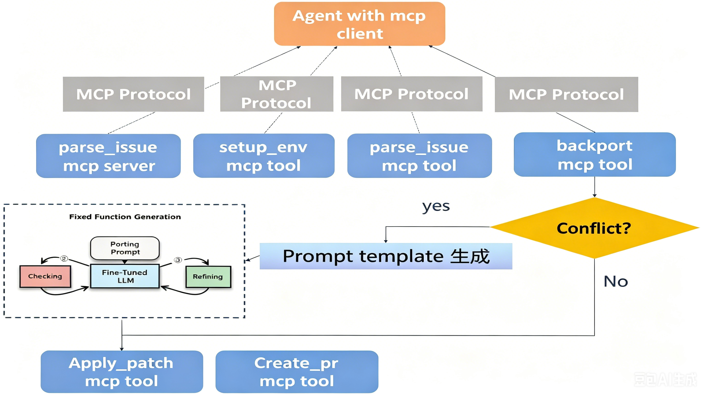

### 2. 面向批量任务的 CVE 回移植流程

另一类场景面向批量补丁回移植，通过动作 backport-batch 实现。当前该能力还不是 MCP 工具形态，更适合对多条提交进行统一配置、批量分析和交互式执行。

结合实际场景来看，这一流程不仅适用于批量 CVE 修复任务，也可用于 OS 特性使能等需要批量迁移提交的工程任务。其重点不在单任务自动闭环，而在于通过统一配置和批量执行，提升大规模处理场景下的组织效率与可操作性。

**概括而言，PatchFlow Agent 当前的两类能力可以总结为：**

**单任务流程强调 “MCP 工具接入 + Agent 自动编排”
批量流程强调 “统一配置 + 批量执行”**

---

## 三、场景落地：PatchFlow Agent 如何进入实际维护流程

围绕不同使用需求，PatchFlow Agent 当前已经形成三种较为清晰的应用方式：服务化部署、命令行使用和界面化接入。

### 1. 服务化部署：面向 openEuler 内核仓维护场景

PatchFlow Agent 已在 openEuler 内核仓的 CVE 修复场景中以服务化方式落地，能够围绕问题分析、补丁获取、回移植处理与结果提交等关键环节提供持续支撑，更适合纳入社区或企业的日常维护流程。

依托 devstation-robot 对 PatchFlow Agent 的调用能力，用户只需在对应 CVE issue 下发表评论，即可一键触发自动分析与修复流程，显著降低人工介入成本，提升问题响应效率。

截至目前，由该服务提交已成功合入 openEuler 内核仓的 PR 数量已达到 250 个。

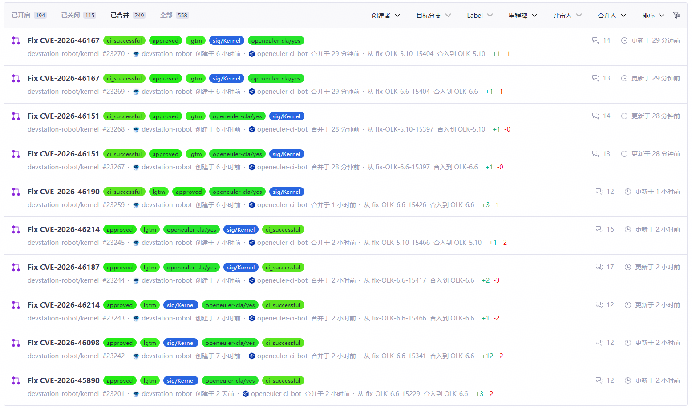

下图展示从服务触发到补丁修复完成的完整流程。

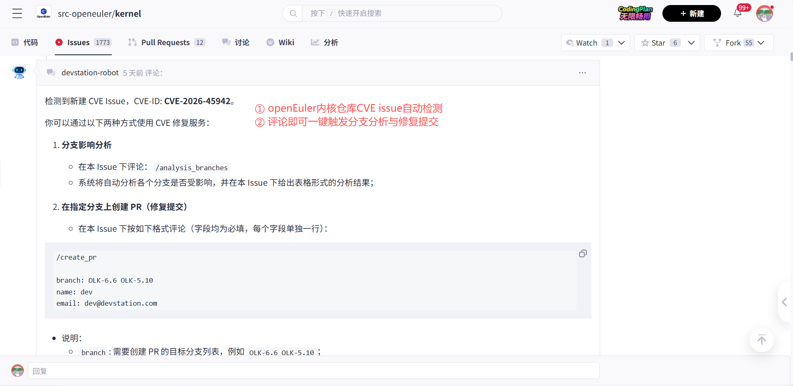

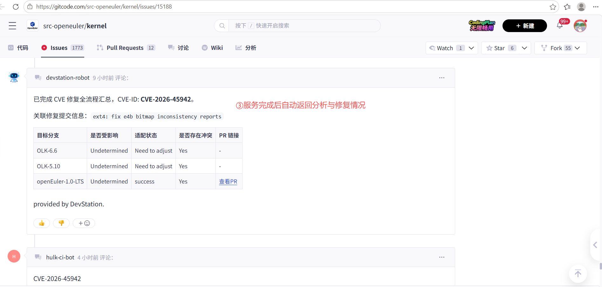

### 2. 命令行使用：便于开发者定位与调试

除服务化部署外，PatchFlow Agent 也提供命令行使用方式。对于开发者而言，CLI 形式更便于按步骤执行流程、单独验证环节结果，适用于问题定位、流程调试和能力验证等场景。

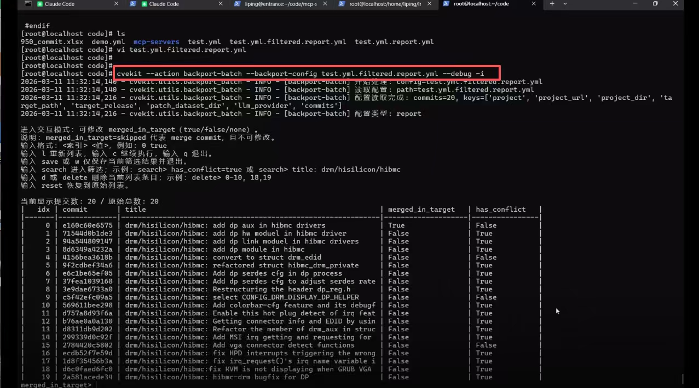

具体来看，该动作可基于 YAML 或 JSON 配置文件，对提交进行批量检查与回移植，并输出 `*.report.yml` 报告文件，便于后续复跑与人工确认。同时，工具还支持从 Excel 文件生成配置文件，以及直接完成补丁应用与签名等操作，进一步提升批量处理效率。

### 3. 界面化接入：支持前端交互式调用

除了服务化和命令行两种方式，PatchFlow Agent 还支持以前端界面集成的方式进行调用。通过图形化交互，用户可以更直观地完成参数配置与流程触发，从而降低使用门槛，提升试用、演示与协作效率。

目前，我们已在 **DevStation 智能助手 PolyMind** 中内置两个页面，分别用于**内核 CVE 修复**和**批量补丁回移植**。

**在内核 CVE 修复界面中**，PolyMind 作为外部 Agent 接入 PatchFlow Agent。前端会展示当前 openEuler 尚未修复的内核 CVE 列表。进入对应 issue 页面后，用户只需点击右上角的 “开始分析” 按钮，PolyMind 即可调用 MCP 工具，完成问题分析、修复提交获取、受影响分支分析、补丁应用等一系列操作；当补丁应用成功后，再由人工点击确认提交 PR 按钮完成最终提交。

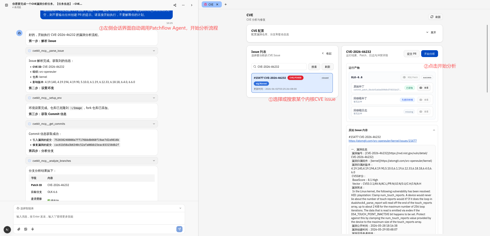

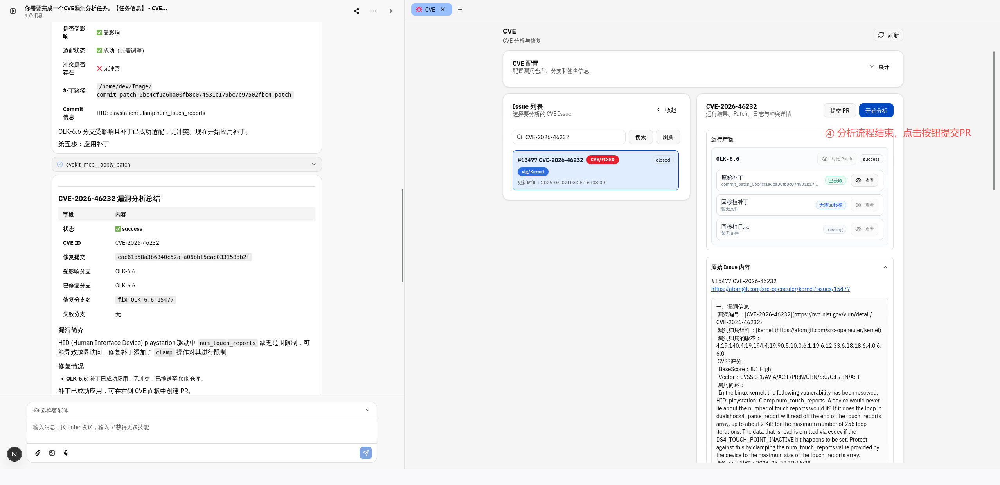

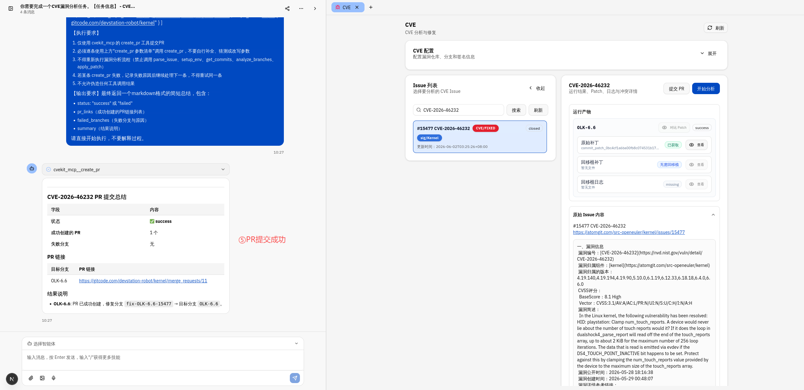

**在批量补丁回移植界面中**，PolyMind 已对统一配置、commit 表格上传等操作进行了适配。用户只需通过界面按钮，即可逐步完成配置生成、报告生成、commit 筛选和冲突处理等操作；同时，界面还提供命令执行日志跟踪和目标仓 Git 状态展示，便于实时观察执行进展与结果。

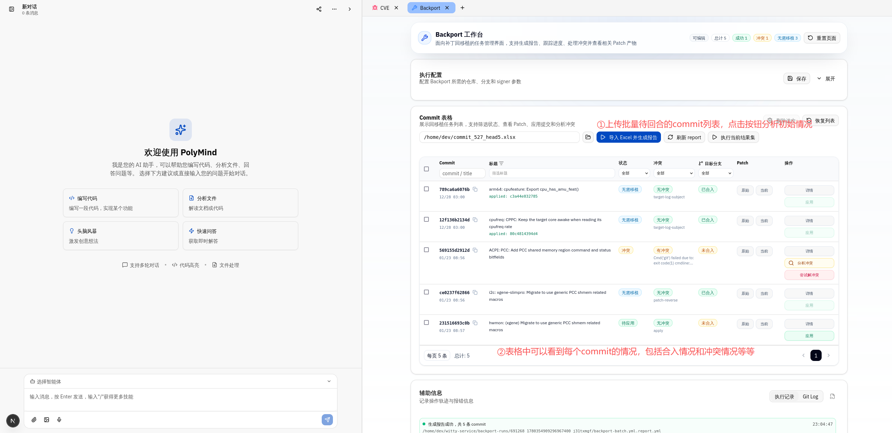

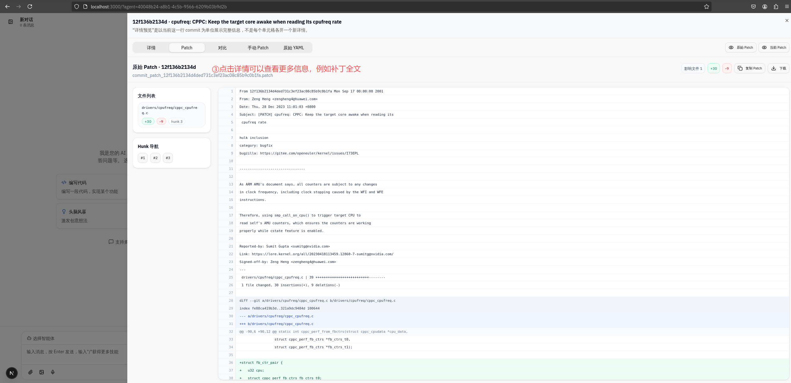

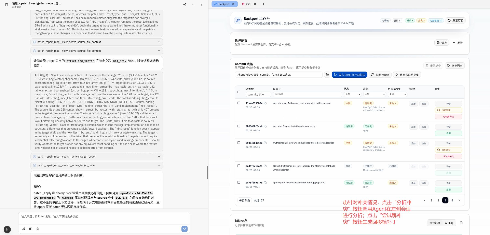

---

## 四、开源部署：如何获取并使用 PatchFlow Agent

目前，PatchFlow Agent 与 PolyMind 均已开源。开发者可结合用户指南，快速了解工具能力、部署方式与使用流程，并基于开源代码进行二次试用和扩展。

### 相关链接

- **PatchFlow Agent 用户指南**

  <https://docs.openeuler.org/zh/docs/24.03_LTS_SP3/devstation/cvekit_mcp/description.html>

- **PatchFlow Agent 开源仓库**

  <https://gitcode.com/openeuler/nvwa-cve-fixer>

- **PolyMind 开源仓库**

  前端：<https://gitcode.com/openeuler/polymind>

  后端：<https://gitcode.com/openeuler/witty-service>

## 五、PatchFlow Agent，助力补丁处理提质增效

面向 openEuler 社区内核 CVE 修复与补丁迁移场景，PatchFlow Agent 以**更高效、更规范、更易复用**的方式，将问题分析、补丁获取、分支分析、补丁应用、冲突回移植和 PR 提交串联为一条完整处理链路。

无论是**单个 CVE 修复，还是批量回移植**，PatchFlow Agent 都能够发挥作用，尤其适合多分支维护、复杂补丁适配和批量任务处理等场景。欢迎大家结合实际需求体验使用、持续关注，也期待更多开发者参与共建。

## 六、致谢

**特别致谢复旦大学软件工程实验室 CodeWisdom 团队。** Mystique 在漏洞补丁迁移与代码语义分析方面提供了重要参考。

- 论文链接：[https://doi.org/10.1145/3715718](https://doi.org/10.1145/3715718)

**特别致谢华中科技大学开源软件技术团队OS3Lab。** patch-backporting 及相关 PortGPT 工作为复杂补丁回移植提供了重要借鉴。

- 论文链接：[https://arxiv.org/abs/2510.22396](https://arxiv.org/abs/2510.22396)

## 加入社区，获取支持与反馈

独行快，众行远。为了给大家提供一个便捷的交流平台，及时解答使用中的疑问并收集反馈，我们特地开设了 **openEuler DevStation 官方交流群**。

**进群你能获得**：

* **实时技术交流**：与众多开发者和爱好者共同探讨；
* **安装使用帮助**：遇到问题快速获得社区支持；
* **最新动态速递**：第一时间获取版本更新和活动信息；
* **反馈产品建议**：你的声音能直接帮助改进 DevStation。

**添加openEuler小助手，进入DevStation交流群：**

