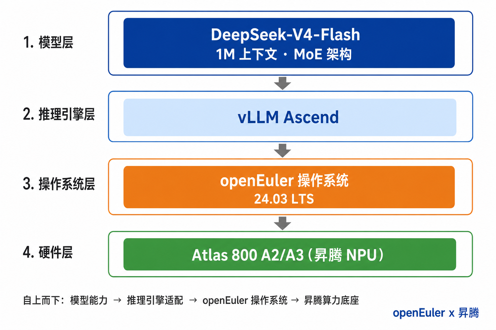

 ---
 	 title: openEuler 生态：DeepSeek-V4-Flash 部署实践
 	 category: blog 
 	 date: 2026-06-08
 	 tags:
 	     - openEuler
 	     - vLLM Ascend
 	     - DeepSeek-V4
 	 archives: 2026-06-08
 	 author:  openEuler
 	 summary: 本文记录在 openEuler 24.03 LTS SP3 环境下，基于 昇腾 Atlas 800 A3（8 卡） 部署 DeepSeek-V4-Flash-w8a8-mtp 量化模型的完整实践，涵盖 openEuler 生态中的 vLLM Ascend 推理引擎、官方容器镜像与 ModelScope 模型托管等组件的协同使用，并给出可复现的启动命令与测试数据。
 	 ---

# openEuler 生态：DeepSeek-V4-Flash 部署实践

## 一、背景

2026 年 4 月 24 日，DeepSeek 正式发布并开源 DeepSeek-V4 系列模型，在百万级上下文、Agent 能力与推理性能上实现显著跃升。该系列按规模分为两个版本：

| 模型 | 总参数量 | 激活参数量 | 上下文长度 | 定位 |
| --- | --- | --- | --- | --- |
| DeepSeek-V4-Pro | 1.6T | 49B | 1M | 旗舰性能版，面向复杂推理与 Agent 场景 |
| DeepSeek-V4-Flash | 284B | 13B | 1M | 高效经济版，兼顾推理能力与部署成本 |

架构层面，V4 系列引入了混合注意力机制（Compress-4-Attention / Compress-128-Attention）与 KV Cache 滑窗压缩，将上下文窗口从 128K 扩展至 **100 万 token**，大幅降低长序列场景的计算与访存开销；配合 mHC（Manifold-Constrained Hyper-Connections）与 DeepSeekMoE 设计，对 Agent、Coding 等任务做了针对性优化。模型同时提供 API 服务，兼容 OpenAI ChatCompletions 与 Anthropic 接口——开发者只需将 `model` 参数改为 `deepseek-v4-flash`，即可接入现有应用。

模型能力要真正落地，离不开 openEuler 生态与底层算力的协同支撑。openEuler（开源欧拉）作为面向数字基础设施的全场景开源操作系统，已在昇腾 Atlas 800 A2/A3 等平台上完成与 DeepSeek-V4-Flash 的深度适配；配合 **vLLM Ascend** 推理引擎，用户可在 openEuler 上完成从权重加载、量化推理到 API 服务暴露的全链路部署。下文以 **DeepSeek-V4-Flash-w8a8-mtp**（昇腾 W8A8 量化版）为例，分享具体的部署实践。

### 全栈架构

这一部署方案覆盖了从芯片到应用的完整技术栈，而非简单的"模型 + 操作系统"组合。各层组件分工明确、紧密衔接，如下图所示：

| 层级 | 组件 | 作用 |
| --- | --- | --- |
| 硬件层 | 昇腾 Atlas 800 A2/A3 | 提供 NPU 算力，单节点 8 卡即可部署 Flash 量化模型 |
| 驱动层 | Ascend 驱动 + CANN | 管理 NPU 设备，提供算子编译与运行时支持 |
| 操作系统层 | openEuler 24.03 LTS | 提供稳定运行环境，官方容器镜像已预集成依赖 |
| 推理引擎层 | vLLM Ascend | 适配昇腾算力，支持 TP/EP 并行、MTP 投机解码等特性 |
| 模型层 | DeepSeek-V4-Flash-w8a8-mtp | W8A8 量化权重，A2/A3 单节点即可运行 |
| 服务层 | OpenAI 兼容 API | 通过 `/v1/chat/completions` 对外提供标准推理接口 |

其中，vLLM Ascend 官方容器镜像（如 `quay.io/ascend/vllm-ascend:deepseekv4-a3-openeuler`）基于 **openEuler 24.03 LTS** 构建，支持 ARM 与 x86 架构，用户挂载 NPU 设备与驱动目录后即可启动服务，无需从零拼装依赖。

### 生态配套

在上述全栈基础上，openEuler 与昇腾生态还提供了一系列开箱即用的配套能力，进一步降低部署门槛：

- **模型托管**：量化权重已发布至 [ModelScope](https://modelscope.cn/models/Eco-Tech/DeepSeek-V4-Flash-w8a8-mtp)（`Eco-Tech/DeepSeek-V4-Flash-w8a8-mtp`），支持离线下载与缓存挂载。
- **容器化交付**：基于官方 Docker 镜像一键拉起推理服务，免去编译框架与环境配置的繁琐步骤。
- **接口兼容**：服务暴露标准 OpenAI Chat Completions 接口，Claude Code、OpenCode 等 Agent 工具可无缝切换后端。

综上，openEuler 上的 DeepSeek-V4-Flash 部署方案，在硬件侧获得昇腾 NPU 的原生算力，在软件侧沿用 vLLM 生态与 OpenAI 接口规范，兼顾了性能、易用与兼容性。

## 二、部署实践

### 环境准备

宿主机需安装 **openEuler 24.03 LTS SP3** 及以上版本，并预先安装 Docker 及昇腾 NPU 驱动。可通过 `cat /etc/os-release` 确认系统版本，通过 `npu-smi info` 确认 NPU 驱动与设备状态正常。

| 需求类型 | 具体要求 |
| --- | --- |
| 系统版本 | openEuler 24.03 LTS SP3 及以上 |
| 硬件平台 | 昇腾 Atlas 800 A3，8 卡（本文实测环境） |
| 硬件资源 | NPU 显存 ≥ 400GB，可用磁盘空间 ≥ 400GB |
| 权限要求 | 具备 sudo 权限 |
### 安装驱动和CANN
直接根据自己的设备情况按照[昇腾官网](https://www.hiascend.com/cann/download)的流程安装即可。

### 下载模型
目前昇腾支持Deepseek量化后的模型，下载方式见[官网](https://www.modelscope.cn/models/Eco-Tech/DeepSeek-V4-Flash-w8a8-mtp)。

### 下载镜像
这里建议用最新版的 `quay.io/ascend/vllm-ascend:deepseekv4-a3-openeuler`，如果下载 `0.13.0`需要添加补丁才能运行一些缺失的功能。
```
docker pull quay.io/ascend/vllm-ascend:deepseekv4-a3-openeuler
```
注意：这里的`A3`是因为这里演示机器的`NPU`卡为`A3`系列，`A2`系列下载的镜像为`quay.io/ascend/vllm-ascend:deepseekv4-openeuler`。

### 创建容器
```
docker run \
  --name vllm-ascend-dsv4 \
  --shm-size=256g \
  --privileged \
  --device /dev/davinci0 \
  --device /dev/davinci1 \
  --device /dev/davinci2 \
  --device /dev/davinci3 \
  --device /dev/davinci4 \
  --device /dev/davinci5 \
  --device /dev/davinci6 \
  --device /dev/davinci7 \
  --device /dev/davinci_manager \
  --device /dev/devmm_svm \
  --device /dev/hisi_hdc \
  -v /usr/local/dcmi:/usr/local/dcmi \
  -v /usr/local/Ascend/driver/tools/hccn_tool:/usr/local/Ascend/driver/tools/hccn_tool \
  -v /usr/local/bin/npu-smi:/usr/local/bin/npu-smi \
  -v /usr/local/Ascend/driver/lib64/:/usr/local/Ascend/driver/lib64/ \
  -v /usr/local/Ascend/driver/version.info:/usr/local/Ascend/driver/version.info \
  -v /etc/ascend_install.info:/etc/ascend_install.info \
  -v /etc/hccn.conf:/etc/hccn.conf \
  -v /mnt/sfs_turbo/.cache:/root/.cache \
  -v /home/models/:/home/models \
  -p 8000:8000 \
  -it quay.io/ascend/vllm-ascend:deepseekv4-a3-openeuler bash
```
注意：该模型大小为`300G`，要运行的话最好有`400G`以上的显存空间，上面的`/dev/davinci*`根据设备情况而定。

### 启动服务
下面的服务指令对应的卡是`A3`系列的，`A2`系列的可以参考[官方文档](https://docs.vllm.ai/projects/ascend/en/v0.18.0/tutorials/models/DeepSeek-V4-Flash.html)。
```
export OMP_PROC_BIND=false
export OMP_NUM_THREADS=10
export PYTORCH_NPU_ALLOC_CONF=expandable_segments:True
export ACL_OP_INIT_MODE=1
export ASCEND_A3_ENABLE=1
export USE_MULTI_GROUPS_KV_CACHE=1
export USE_MULTI_BLOCK_POOL=1
export HCCL_BUFFSIZE=1024
export VLLM_ASCEND_ENABLE_FUSED_MC2=1
export VLLM_ASCEND_ENABLE_FLASHCOMM1=1

vllm serve /home/models/DeepSeek-V4-Flash-w8a8-mtp \
    --enable-prefix-caching \
    --max_model_len 1024000 \
    --max-num-batched-tokens 8192 \
    --served-model-name dsv4 \
    --gpu-memory-utilization 0.9 \
    --api-server-count 1 \
    --max-num-seqs 16 \
    --data-parallel-size 4 \
    --tensor-parallel-size 4 \
    --enable-expert-parallel \
    --tokenizer-mode deepseek_v4 \
    --tool-call-parser deepseek_v4 \
    --enable-auto-tool-choice \
    --reasoning-parser deepseek_v4 \
    --safetensors-load-strategy 'prefetch' \
    --quantization ascend \
    --speculative-config '{"num_speculative_tokens": 1,"method": "deepseek_mtp"}' \
    --port 8000 \
    --block-size 128 \
    --compilation-config '{"cudagraph_mode": "FULL_DECODE_ONLY"}'\
    --async-scheduling \
    --additional-config '
    {"ascend_compilation_config":{
        "enable_npugraph_ex":true,
        "enable_static_kernel":false
        },
    "enable_cpu_binding": "true",
    "multistream_overlap_shared_expert":false,
    "multistream_dsa_preprocess":false}'
```

### 访问与测试
访问可以用`curl`指令进行验证。
```
curl http://0.0.0.0:8000/v1/chat/completions \
  -H "Content-Type: application/json" \
  -d '{
    "model": "dsv4",
    "messages": [
        {
            "role": "user",
            "content": "介绍一下openEuler。"
        }
    ],
    "stream": false,
    "max_tokens": 1024,
    "temperature": 0
  }'
```

测试一般采用`vllm`自带的`benchmark`工具。
```
vllm bench serve \
  --model "dsv4" \
  --tokenizer "/home/models/DeepSeek-V4-Flash-w8a8-mtp" \
  --dataset-name random \
  --random-input-len 8192 \
  --random-output-len 4096 \
  --num-prompts 1 \
  --host 127.0.0.1 \
  --port 8000 \
  --endpoint /v1/completions
```
### 性能数据
| 输入长度 | 输出长度 | 请求数量 | 平均推理时延（ms） | 平均推理速度（tokens/s） |
| :---: | :---: | :---: | :---: | :---: |
| 8192 | 4096 | 1 | 22.79 | 43.29 |
| 8192 | 4096 | 4 | 31.71 | 96.17 |
| 8192 | 4096 | 10 | 34.51 | 216.64 |
| 65536 | 32768 | 1 | 22.01 | 44.75 |
| 65536 | 32768 | 4 | 25.41 | 148.32 |
| 65536 | 32768 | 10 | 43.25 | 212.24 |

## 三、未来与展望

DeepSeek-V4-Flash 在 openEuler 上跑通，只是起点。后续随着模型、算力与软件栈持续演进，openEuler 生态在性能、易用性与部署成本上仍有较大提升空间。

**XPU-Turbo：CPU + XPU 异构推理**

在 PD 分离 之外，业界还在探索更细粒度的 **AF 分离** ：将有状态、KV Cache 主导的 Attention 与无状态、计算密集的 FFN/MoE 专家拆分到不同实例，层间信息来回传递。对 DeepSeek-V4-Flash 这类 MoE 模型，传统 8 卡齐套 TP/EP 部署往往面临 Attention 访存瓶颈与 FFN 计算密度不足的双重压力；AF 分离可解耦两类资源的扩缩需求，在更少加速器卡数下完成全模型加载与推理。

我们团队正在 openEuler 生态内推进 **XPU-Turbo** 项目，面向 CPU + XPU 算力组合探索上述 AF 分离方案。**当前实现的方案是将 MoE 全部专家部署在 CPU 上，专家权重存放与对应计算均在 CPU 完成**，以释放加速器显存、缓解整节点 NPU 的刚性约束。需要明确的是，CPU 参与专家计算后，推理性能的**上限必然低于纯 NPU 部署**；XPU-Turbo 现阶段更侧重在有限加速器条件下**先完成全模型加载与推理**，以可接受的吞吐换取更低卡数与显存占用。配合 openEuler 的 GMEM 统一编址等能力，可在 KV Cache 管理、层间通信等环节让 CPU 与加速器协同；后续将通过算子优化与异构调度，在既定架构下持续优化吞吐表现。

后续将与本文 8 卡基线方案对比验证，在 CPU + XPU 异构环境下测试最低卡数需求、吞吐与时延，沉淀可复现的部署配置。需要说明的是，**本文第二节为当前可落地的基线方案；DeepSeek-V4 模型还在适配阶段**，验证通过后有望为 DeepSeek-V4-Flash 乃至更大规模模型的普惠部署提供新路径。

综上，本文给出了 openEuler 生态下 DeepSeek-V4-Flash 的可复现部署实践。第二节的全 NPU 方案面向追求峰值吞吐的生产场景；XPU-Turbo 作为后续探索方向，以 CPU 承担 MoE 专家计算，在更少加速器条件下争取先跑通全模型——性能上限虽不及纯 NPU，但有望显著降低卡数与显存门槛。二者分别对应「跑得好」与「用得起」。也欢迎社区参与验证与反馈，共同完善上述部署路径。
