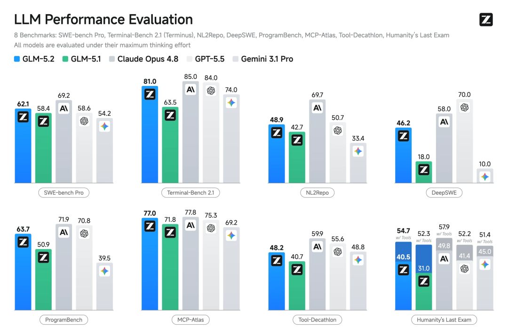
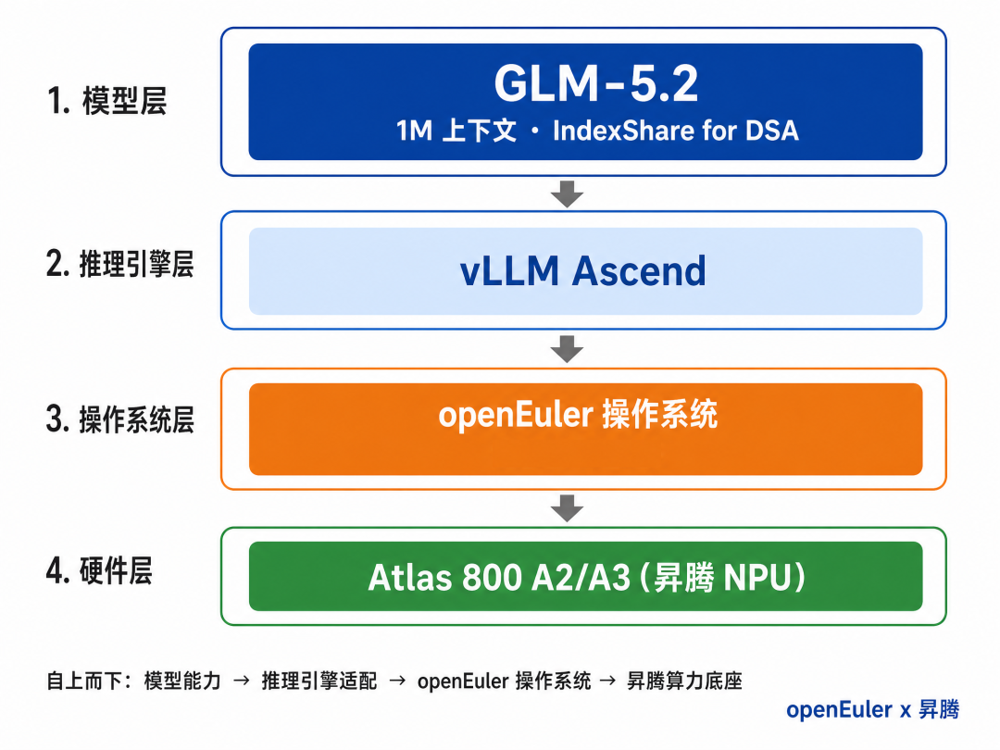

2026年6月17日，智谱新一代旗舰基础模型GLM-5.2正式上线并开源。作为GLM系列迭代升级的重磅基座模型，GLM-5.2在上下文长度、代码能力、长程任务、智能体任务等领域实现全方位突破，从“答得好”走向“干得久”。 GLM-5.2 在前端开发、后端架构及长程任务等核心场景的成功率上，相比前一代 GLM-5.1 实现了全面提升，在处理复杂系统工程与深度调试时展现出更高的稳定性。在主流编程基准测试中，GLM-5.2 持续保持开源模型 SOTA（最优）地位，其综合能力已与海外顶尖模型 Claude Opus 4.8 处于同一可比区间。



vLLM 是 PyTorch Foundation 下的开源 LLM 推理引擎，为用户和开发者提供快速、易用的 LLM 推理能力，vLLM-Ascend 提供了 vLLM 对昇腾的支持。本指南将帮助你使用 OpenAtom openEuler（简称：“openEuler”或“开源欧拉”）和 vLLM Ascend 在昇腾上运行GLM-5.2。

本指南将采用 vLLM Ascend 的容器镜像启动方式，在昇腾 Atlas 800 A3 (128G × 8) 节点上运行GLM-5.2。



## 步骤一：确保昇腾驱动正常安装

在拉起容器前，请先确保昇腾驱动已经正常安装，可使用 npu-smi info 命令进行查看。

## 步骤二：下载模型权重

GLM-5.2-w8a8(Quantized version)：

<https://modelers.cn/models/Eco-Tech/GLM-5.2-w8a8>

## 步骤三：拉起vLLM Ascend容器运行环境

使用如下命令拉起 vLLM Ascend 容器运行环境：

```
# Update --device according to your device (Atlas A3:/dev/davinci[0-15]).# Update the vllm-ascend image according to your environment.
# Note you should download the weight to /root/.cache in advance.
export IMAGE=quay.io/ascend/vllm-ascend:glm52-a3-openeuler
export NAME=vllm-ascend
# Run the container using the defined variables
# Note: If you are running bridge network with docker, please expose available ports for multiple nodes communication in advance
docker run --rm \
--privileged \
--name $NAME \
--net=host \
--shm-size=1g \
--device /dev/davinci0 \
--device /dev/davinci1 \
--device /dev/davinci2 \
--device /dev/davinci3 \
--device /dev/davinci4 \
--device /dev/davinci5 \
--device /dev/davinci6 \
--device /dev/davinci7 \
--device /dev/davinci8 \
--device /dev/davinci9 \
--device /dev/davinci10 \
--device /dev/davinci11 \
--device /dev/davinci12 \
--device /dev/davinci13 \
--device /dev/davinci14 \
--device /dev/davinci15 \
--device /dev/davinci_manager \
--device /dev/devmm_svm \
--device /dev/hisi_hdc \
-v /usr/local/dcmi:/usr/local/dcmi \
-v /usr/local/Ascend/driver/tools/hccn_tool:/usr/local/Ascend/driver/tools/hccn_tool \
-v /usr/local/bin/npu-smi:/usr/local/bin/npu-smi \
-v /usr/local/Ascend/driver/lib64/:/usr/local/Ascend/driver/lib64/ \
-v /usr/local/Ascend/driver/version.info:/usr/local/Ascend/driver/version.info \
-v /etc/ascend_install.info:/etc/ascend_install.info \
-v /root/.cache:/root/.cache \
-it $IMAGE bash
```

## 步骤四：在容器环境内部署推理服务

```
# 将通信算子展开到AI Vector Core
export HCCL_OP_EXPANSION_MODE="AIV"
# 设置 HCCL 通信缓冲区大小
export HCCL_BUFFSIZE=200
# 禁用OpenMP线程绑定
export OMP_PROC_BIND=false
# 将OpenMP线程数设置为1
export OMP_NUM_THREADS=1
# 启用torch-npu动态内存段扩展export PYTORCH_NPU_ALLOC_CONF=expandable_segments:True
# 启用PD阶段负载均衡
export VLLM_ASCEND_BALANCE_SCHEDULING=1
# 启用MLAPO优化
export VLLM_ASCEND_ENABLE_MLAPO=1
# 显式指定vLLM版本
export VLLM_VERSION=0.21.0vllm serve /root/.cache/modelscope/hub/models/vllm-ascend/GLM-5.2-w8a8 \
--host 0.0.0.0 \
--port 8077 \--data-parallel-size 2 \
--tensor-parallel-size 8 \
--enable-expert-parallel \
--seed 1024 \
--served-model-name glm-52 \
--max-num-seqs 48 \
--max-model-len 20480 \
--max-num-batched-tokens 4096 \
--trust-remote-code \
--gpu-memory-utilization 0.95 \
--quantization ascend \
--async-scheduling \
--additional-config '{"enable_npugraph_ex": true,"fuse_muls_add":true,"multistream_overlap_shared_expert":true}' \
--compilation-config '{"cudagraph_mode": "FULL_DECODE_ONLY"}' \
--speculative-config '{"num_speculative_tokens": 3, "method": "deepseek_mtp"}'

```

## 步骤五：验证

待服务启动后，通过curl命令发送请求来验证是否部署成功。
```
curl http://127.0.0.1:8077/v1/chat/completions \    
     -H "Content-Type: application/json" \    
     -d '{       
        "model": "glm-52",       
        "messages": [           
            {              
                "role": "user",              
                "content": "Who are you?"            
            }        
        ],        
        "max_completion_tokens": 256,        
        "temperature": 0     
    }'

```