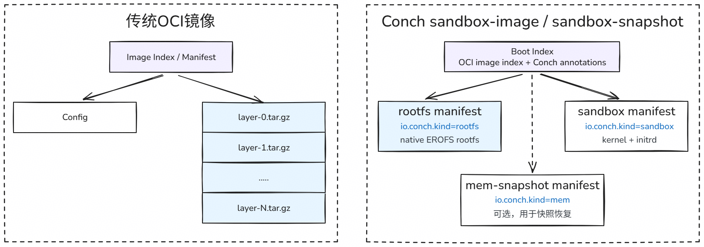
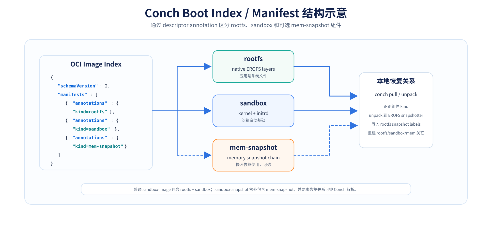
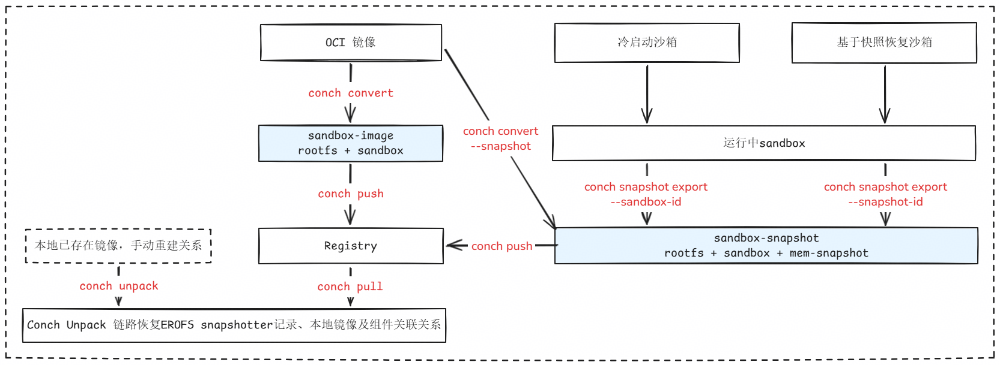
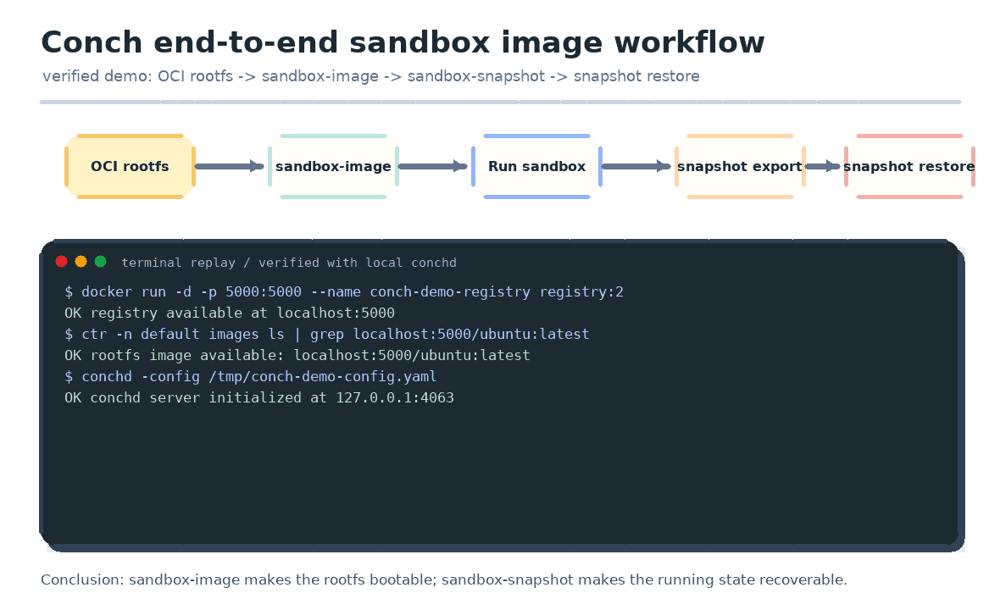

## **导语：**

AI Agent 作为具备独立思考与自主执行能力的智能体，其运行形态正从无状态容器演变为需要高频修改配置、安装动态依赖的有状态沙箱。当 Agent 需要在沙箱内修改系统配置、安装工具链、长时间执行复杂任务，并需要频繁在多节点间进行**现场恢复（Resume）**时，传统的容器镜像分发机制遇到了瓶颈。

OpenAtom openEuler（简称 “openEuler” 或 “开源欧拉”）推出的 Conch 正是针对这一场景设计的沙箱引擎。在上一篇文章[《openEuler Conch沙箱引擎：如何用毫秒级速度给“闯祸”的小龙虾套上“海螺”壳》](https://mp.weixin.qq.com/s/cpSrWvow71tzlNr6rziOCg)已针对 Conch 进行了详细介绍。本文将深入其背后的架构设计，围绕以下核心问题展开介绍：

1. 传统的 OCI 镜像为什么在 AI Agent 沙箱场景行不通？
2. 业界做了什么，还缺什么？
3. 针对业界的技术空白，Conch采取怎样的解法？用户如何使用Conch？

## 01 传统 OCI 镜像在 AI Agent 沙箱场景中的不足

AI Agent 沙箱已经从简单的进程运行载体，升级为可隔离、可动态修改、支持断点现场恢复的完整系统运行环境，镜像除了需要交付应用 `rootfs`，还必须承载沙箱启动依赖、多组件关联规则与任务运行现场恢复能力。传统 OCI 镜像虽然实现了 `rootfs` 的标准化打包、寻址与仓库分发，但落地到强隔离类 AI Agent 沙箱场景时，存在两大核心短板。

### 1.1 镜像覆盖范围有限，无法描述完整可启动沙箱

OCI 镜像仅以应用根文件系统为核心承载对象，只能打包业务程序、系统依赖、配置文件及分层元数据，仅能满足常规无状态容器部署场景。面向基于 MicroVM 的强隔离 Agent 沙箱时，仅依靠 `rootfs` 无法直接拉起完整运行环境：

* 沙箱启动必需的 Kernel、Initrd 等虚拟化引导组件，只能依托宿主机运行时单独配置维护，无法与业务镜像统一版本管理、同步分发与回滚；
* 缺少对任务运行现场的标准化描述能力，不能定义文件系统变更、虚拟机状态、内存上下文三者之间的绑定恢复关系，Agent 长任务中断后无法跨节点断点续跑、环境回滚。

>简言之，传统 OCI 仅能说明应用包含哪些文件，却无法定义沙箱的启动方式、现场恢复规则以及各类依赖组件的配套关联逻辑。

### 1.2 沙箱多组件缺乏统一编排能力，分发与存储效率难以规模化优化

当前容器生态已具备成熟的 `rootfs` 数据面加速方案，eStargz、SOCI、Nydus 等工具依托索引预取、旁路元数据、块级存储优化、跨镜像去重等能力，实现了镜像按需拉取、快速启动，大幅优化了单一根文件系统的部署效率。

但这类优化方案的作用边界仅局限于 `rootfs`，并未对沙箱多组件做统一的标准化组织，一旦涉及内核、虚拟机快照、内存运行态等扩展资产，存在以下技术空白：

1. 各类组件依赖关系没有显式索引定义，目标节点只能依靠外部脚本、人工约定重建关联，极易出现环境不一致问题；
2. 只有 `rootfs` 支持镜像仓库标准化分发，内核、快照链、内存状态等资产需要单独传输配置，无法实现整套沙箱环境一键跨节点流转；
3. 基础系统环境、启动组件、运行态快照混合管理，组件复用边界模糊，不利于环境灵活替换、资源复用以及后续精细化存储去重优化。

基于以上现状，Conch 在镜像语义层补齐完整沙箱的标准化资产表达能力，将 `rootfs`、`sandbox` 启动组件、可选 `mem-snapshot` 运行快照封装为可统一发布、拉取、解包、异地恢复的镜像制品。

现阶段 Conch 已完成存量 OCI 镜像向 native EROFS 格式的转换，依托 `boot index` 元数据实现多组件结构化编排管理；后续将持续落地块级按需加载、跨镜像块粒度去重、多类型存储后端适配等能力，进一步提升大规模 Agent 集群下沙箱镜像的流转与存储效率。



图1 OCI 镜像与 Conch 完整沙箱镜像格式对比图

对比传统 OCI 镜像与 Conch 完整沙箱镜像的表达范围：OCI 镜像主要覆盖应用 rootfs，而 Conch 通过 boot index 将 rootfs、sandbox 组件和可选 mem-snapshot 组织为可启动、可恢复的沙箱镜像资产。

## 02 Conch 的解法——完整沙箱镜像（Full-Sandbox-Image）

Conch 通过统一的镜像语义，将散落的组件打包成​**一个完整的、可分发的沙箱运行单元**​。

### 什么是完整沙箱？

> ​**完整沙箱（Complete Sandbox）定义**​：指一个 AI Agent 任务运行、迁移、恢复所需的​**最小闭环要素集合**​。它不仅包含传统的文件系统（rootfs），还显式包含使其能运转的虚拟化边界组件（Kernel/Initrd）以及可选的运行现场（Memory State），并由统一的元数据索引（Boot Index）表达它们之间的强绑定恢复关系。

为适配**完整沙箱**的定义，Conch 在架构上定义两个​**核心对象**​：

1. sandbox-image (冷启动镜像)
2. sandbox-snapshot (热启动快照镜像)

### 核心名词定义与技术边界

| 对象 | 解决的问题 | 不能直接解决的问题 |
| --- | --- | --- |
| 传统 OCI 镜像 | 应用 rootfs 与 layer 元数据 | 应用内容标准化分发 | 不描述 sandbox 启动基础，也不表达运行态恢复关系 |
| sandbox-image | 把已有 rootfs 变成可启动沙箱镜像 | 不包含某次运行后的内存现场 |
| sandbox-snapshot | 把运行现场变成可恢复、可分发镜像 | 需要在稳定时机 pause 并导出，不能代替所有运行时调度能力 |



图2 Conch Boot Index 与 Manifest 结构示意图

展示 Conch 如何基于 OCI Image Index，通过 io.conch.kind 等 annotation 区分 rootfs、sandbox、mem-snapshot 组件，并在 conch pull / unpack 后恢复本地 snapshotter 与组件关联关系。

## 03 核心工作流：镜像的制作与流转

Conch 当前的工作流围绕五个命令展开：

- `conch convert`
- `conch push`
- `conch snapshot export`
- `conch pull`
- `conch unpack`

这套流程要解决的是端到端问题：从已有 OCI rootfs 出发，生成 Conch 原生镜像，发布到 registry，再在目标机拉取并恢复成本地可运行对象。



图3 Conch镜像工作流总览图

展示 Conch 从已有 OCI rootfs 出发，经过 conch convert 生成 sandbox-image，并通过 conch push / pull / unpack 完成分发与本地恢复；同时展示 conch convert --snapshot 和 conch snapshot export 生成 sandbox-snapshot 的两类快照路径。

### 3.1 从 OCI 镜像 转成 sandbox-image

用户拥有一个普通的传统 OCI 镜像（如包含大量 Python AI 工具链的镜像），需要将其转换为 Conch 可直接拉起的完整沙箱镜像。第一步是执行：

```bash
conch convert --source docker.io/library/ubuntu:latest \
  --kernel ./vmlinux-5.10 \
  --initrd ./conch.initrd \
  --tag localhost/conch/ai-agent-sandbox:v1
```

**内部转换（Convert）细节：**

1. ​**Rootfs 转换**​：Conch 提取原 OCI 镜像的各层 Layer，将其扁平化并直接转换为 **Native EROFS（Enhanced Read-Only File System）** 格式。rootfs layer 被转换为 native EROFS rootfs，用于更适配沙箱场景的只读挂载、压缩存储，同时为后续块级懒加载、精细化去重能力预留扩展底座。
2. ​**Sandbox 封装**​：将传入的 `--kernel` 和 `--initrd` 归档为沙箱特有的元数据组件。
3. ​**元数据生成**​：创建描述两者绑定关系的 `boot index`，统一写入本地本地存储中，并形成可管理的镜像记录。

### 3.2 一步生成基础 sandbox-snapshot：conch convert --snapshot

除了生成普通 `sandbox-image`，`conch convert` 也支持通过 `--snapshot` 参数直接生成带基础运行现场的 `sandbox-snapshot`：

```bash
conch convert --source docker.io/library/ubuntu:latest \
  --kernel ./bzImage \
  --initrd ./conch.initrd \
  --snapshot \
  -t localhost/conch/ubuntu-snapshot:latest
```

该执行路径会在完成 rootfs 格式转换、sandbox 组件封装后，自动创建沙箱实例并执行暂停操作，将生成的 mem-snapshot 与 rootfs、sandbox 的关联关系一同写入全新 boot index。该方式适合用于制作系统初始化完成后的基础启动态快照，可作为标准化环境复用的基准恢复点。

如果需要产出业务预热类快照，比如沙箱内完成依赖安装、工具链加载、Agent 初始化配置后的运行现场，更推荐先基于 `sandbox-image` 启动沙箱并完成环境预热，再通过 `conch snapshot export --sandbox-id` 方式导出快照镜像。

### 3.3 打快照时机 与 sandbox-snapshot 制作

**打快照的关键时机：** 快照不能凭空构建，必须在沙箱运行到**确定性的、高价值的稳定状态**时触发。

此时可以通过Conch SDK 对正在运行的 sandbox 进行pause来生成快照，由于本文核心点在于沙箱镜像构建，所以仅针对快照镜像部分进行展开。

从业务使用场景来看，`sandbox-snapshot` 可分为两类典型应用场景：

- 一类是环境预热后的 `warmup-snapshot`，多用于复用依赖部署、工具链初始化后的标准化环境；
- 另一类是任务执行节点的 `stage-snapshot`，用于长周期 Agent 任务的断点保存、异常回滚与跨机续跑。

两类仅作为场景化命名，核心镜像资产仍统一为 `sandbox-snapshot`。

生成 `sandbox-snapshot` 共有三类常用入口：

- `conch convert --snapshot`：基于存量 OCI rootfs 镜像，一键生成系统初始化后的基础启动态快照镜像。
- `conch snapshot export --sandbox-id`：对正在运行的沙箱实例导出快照，命令内部会自动执行 pause 保证文件、虚拟机、内存三态一致性，生成可跨节点分发的快照镜像。
- `conch snapshot export --snapshot-id`：依托已存在的稳定 rootfs 快照进行导出，无需执行 pause 操作，仅会解析现有元数据与快照依赖链，适合复用已固化的环境基线。

`conch snapshot export` 就是一个单独的cli指令，来对运行中的sandbox构建快照镜像，执行该命令时，会先对当前沙箱进行pause，再对快照镜像进行导出。

```bash
conch snapshot export \
  --sandbox-id <running-sandbox-id> \
  -t localhost/conch/ai-agent-snapshot:v1
```

如果用户已经有一个 rootfs snapshot id，也可以从它出发导出：

```bash
conch snapshot export \
  --snapshot-id <rootfs-snapshot-id> \
  -t localhost/conch/ai-agent-snapshot:v1
```

导出过程中，Conch 会解析 rootfs snapshot 记录的 mem/sandbox 快照关系，找到对应快照链，再生成新的 boot index。最终得到的 `sandbox-snapshot` 可以理解为“带恢复现场的完整沙箱镜像”。

### 3.4 发布、拉取与恢复

标准 Registry 依靠 OCI 规范虽然能够利用 OCI Artifacts 存储任意扩展类型的描述文件与二进制 Blob，但它本身属于纯静态的内容寻址存储（Content-Addressable Storage），完全无法感知和处理  `sandbox-image`和`sandbox-snapshot` 内部组件以及沙箱启动时的内核解耦组装语义。

​**Conch 的闭环解法**​：基于 OCI descriptor 自定义 annotation 做能力扩展，完全遵循 OCI 兼容制品规范，无需对现有镜像仓库做任何改造。

* **Push 阶段**：`conch push` 分发的是 Conch `boot index` 及其引用的组件内容，包括 `native EROFS rootfs`、`sandbox` 组件（`kernel/initrd`）以及可选的 `mem-snapshot` 相关快照链。Conch 会通过 `boot index` 描述这些组件的类型、引用和恢复关系，而不是把它们当作普通容器 `rootfs` 处理。
* **Registry 视角**：Registry 仍然看到的是可存储、可分发的 OCI artifact / manifest 与 blob 数据，因此可以按现有 registry 机制完成接收、保存和传输，但它并不会理解这些组件如何组成一个可启动或可恢复的沙箱。
* **Pull & Unpack 阶段**：在另一台机器执行 `conch pull` 后，Conch 会解析 `boot index` 和组件 annotation，识别 `rootfs`、`sandbox`、`mem-snapshot` 等对象，并进入 Conch 专属 unpack 链路，在目标宿主机恢复 `EROFS snapshotter`、本地镜像记录以及快照关联关系，最终交给 Conch 运行时按冷启动或快照恢复路径拉起沙箱。

具体使用方式如下：

`conch push`支持直接传入本地镜像引用与远端镜像地址，无需提前执行 conch tag，可一次性完成远端仓库的版本推送。

```bash
conch push localhost/conch/ai-agent-sandbox:v1 hub.oepkgs.net/conch/ai-agent-sandbox:v1
```

`conch pull` 会把 Conch 原生镜像拉回本地，并自动完成 unpack。

```bash
conch pull hub.oepkgs.net/conch/ai-agent-sandbox:v1
```

对于本地已经存在的镜像，也可以单独执行`conch unpack`：

```bash
conch unpack hub.oepkgs.net/conch/ai-agent-sandbox:v1
```

unpack 会把 boot index 中描述的组件关系恢复到本地 snapshotter：rootfs 进入 EROFS snapshotter，sandbox 和 mem-snapshot 的关联关系也被重建。这样，运行时拿到的就会是一组可以被 Conch 消费的本地对象。

## 04 原型示例

面向想使用 Conch 的开发者，最小验证可以沿着一条端到端链路完成：从已有 OCI rootfs 生成 `sandbox-image`，启动沙箱完成初始化，再导出 `sandbox-snapshot`，最后在目标机恢复。

这条链路主要验证三个问题：
* 已有 OCI rootfs 能否被转换成可启动的 `sandbox-image`
* `sandbox-image` 经 registry 流转后，目标机能否自动 unpack 并恢复本地运行关系
* 运行中的沙箱能否导出为可分发、可恢复的 `sandbox-snapshot`

**基本步骤如下：**

1.执行 `conch convert`，从已有 OCI rootfs 生成 `sandbox-image`。

2.执行 `conch push / conch pull`，完成 registry 流转，并在目标机自动 unpack。

3.使用 `sandbox-image` 启动沙箱，验证 rootfs 与 sandbox 组件能够正确组合。

4.在沙箱内完成初始化或预热动作，例如安装依赖、写入配置、加载工具链。

5.执行 `conch snapshot export --sandbox-id ...`，将运行现场导出为 `sandbox-snapshot`。

6.将 `sandbox-snapshot` 发布并拉取到目标机，通过快照恢复路径启动沙箱。

通过这条链路，可以同时验证 sandbox-image 和 sandbox-snapshot 的核心价值：前者让已有 rootfs 变成可启动沙箱镜像，后者让运行现场变成跨机器可流转的恢复资产。




图4：Conch 完整沙箱镜像端到端验证流程

演示 Conch 镜像系统的最小验证链路：从 OCI rootfs 转换生成 sandbox-image，启动沙箱并导出 sandbox-snapshot，最终在目标环境通过快照镜像恢复沙箱运行状态。

## 05 总结与下一步计划

当前 Conch 镜像系统已经打通从 OCI rootfs 格式转换、sandbox-image 构建、三类路径生成 sandbox-snapshot、镜像仓库标准化分发、目标节点自动 pull&unpack 还原组件关系、沙箱冷启动/快照恢复的端到端完整业务闭环，可支撑 AI Agent 沙箱环境标准化交付、运行现场跨节点迁移与任务断点续跑的核心场景。

**下一步迭代计划**

- 懒加载特性：启动无需等待快照下载完成，提升大规模分发效率；
- 基于高速互联的超节点分级缓存：提升部署性能的同时保障运行性能不下降，并通过共享消除存储冗余；
- 多后端支持：支持多种远端存储后端，如标准OCI镜像仓库、对象存储、块存储后端等适用于各种基础设施环境；
- 块级跨镜像去冗余：落地块级跨镜像精细化去重机制，针对多版本快照、批量 Agent 环境场景，进一步压缩重复数据存储开销，提升集群资源利用率。

**欢迎加入社区共建**

Conch 已在 openEuler SIG-CloudNative 社区完整开源核心技术方案，诚邀行业伙伴、高校与个人开发者交流技术思路、参与共建优化。

可添加微信小助手进入 SIG-CloudNative 技术交流群，也可访问 AtomGit 仓库查阅完整项目材料、提交 Issue 反馈需求。

项目地址：[https://atomgit.com/openeuler/Conch](https://link.wtturl.cn/?target=https%3A%2F%2Fatomgit.com%2Fopeneuler%2FConch&scene=im&aid=497858&lang=zh "autolink")

> **往期文章**
> openEuler Conch沙箱引擎：如何用毫秒级速度给“闯祸”的小龙虾套上“海螺”壳：
> [mp.weixin.qq.com/s/cpSrWvow71tzlNr6rziOCg](https://mp.weixin.qq.com/s/cpSrWvow71tzlNr6rziOCg)

