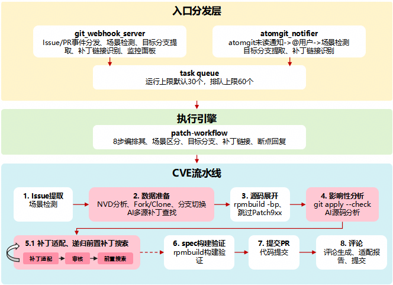
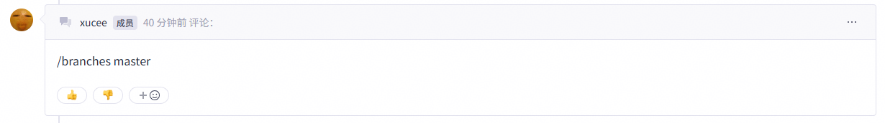
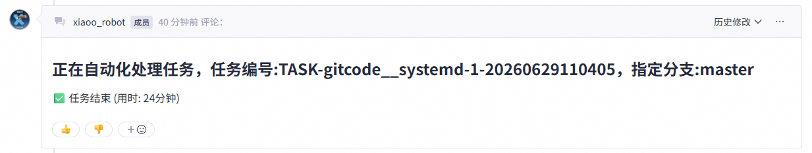
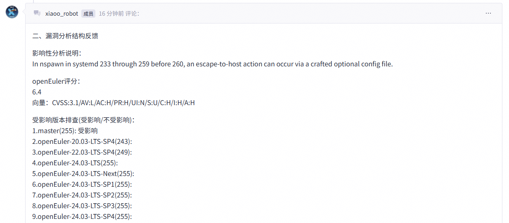
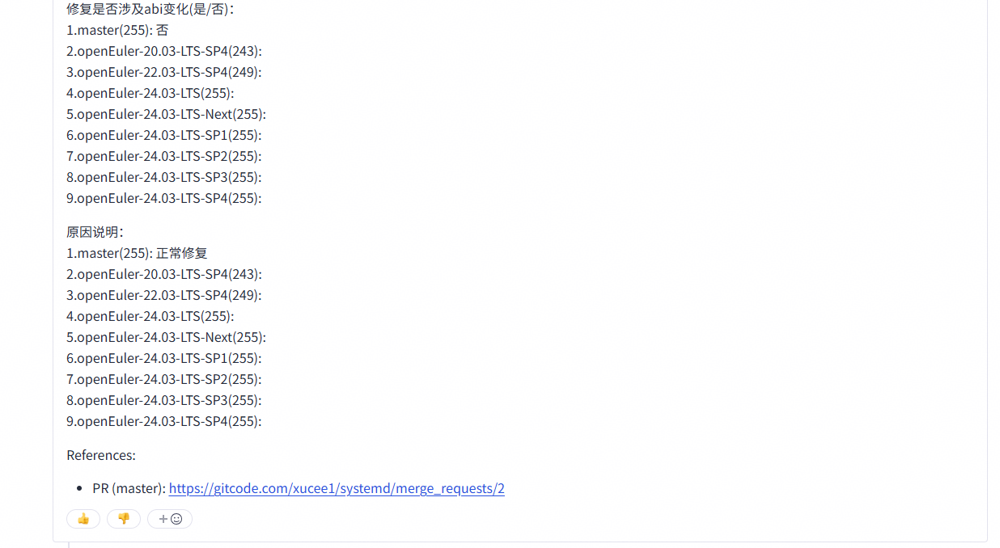
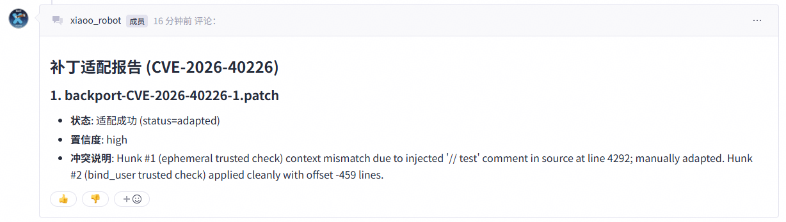
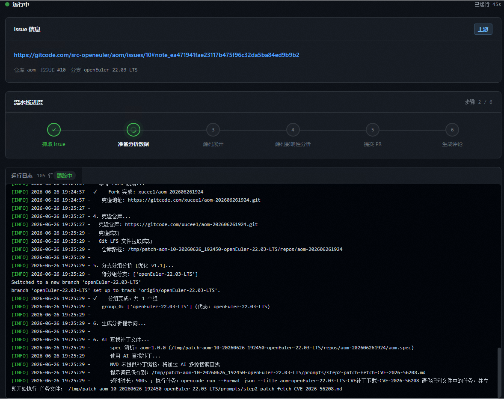

> OpenAtom openEuler（简称 “openEuler” 或 “开源欧拉”） AI漏洞修复平台是openEuler社区使用AI修复内核CVE和外围包CVE平台。上一篇[《openEuler社区AI漏洞修复平台：通过PatchFlow Agent完成内核CVE漏洞修复》](https://mp.weixin.qq.com/s/sXpZ2GtrjvS8taIqq-3hMg)着重介绍了内核CVE漏洞修复。本篇将着重介绍外围包漏洞修复。
●平台链接：<https://gitcode.com/openeuler/nvwa-cve-fixer>
 

 openEuler社区持续推进海量软件包的智能化运维效能提升，其中面向外围包CVE修复场景，由“Agent编排+Harness工程”驱动的Agent Workflow智能化补丁作业系统已在600+外围包仓库完成落地应用，支撑超过110+成功合入。为了方便介绍，下文将这套外围包CVE补丁作业系统简称为PatchHarness。

外围包由于其独特的代码组织模式，相比内核仓的CVE修复流程增加了许多前后置流程，包括基于SPEC更新、自研补丁适配、构建验证等，这些环节拥有相对固定的规范标准，对CVE修复工具的输出稳定性提出了要求。另外由于外围包数量众多，不同外围包的公开CVE补丁获取途径各异，因此要求CVE修复工具拥有高可扩展性，针对不同软件包的CVE补丁获取策略提供快速扩展能力。

PatchHarness面向稳定性、可扩展性以及可靠性，构建了一套“AI自治与刚性工程管控相结合”的混合处理系统，贯穿CVE分析、修复补丁搜索、影响性分析、代码仓Fork、源码压缩包展开、补丁应用与冲突适配、级联补丁搜索、SPEC更新、构建验证、PR创建等环节。其中确定性流程通过脚本固化，复杂任务通过Agent嵌入处理，Agent Skill支持抽屉式替换升级。另外通过状态文件跟踪流水线以及Agent执行状态，PatchHarness还支持检查点保存和恢复。

## 1. 问题切入：海量补丁智能化回合面临哪些现实挑战

外围包由于其独特的代码组织模式，相比内核仓的CVE修复流程增加了许多前后置流程，这也给PatchHarness的设计带来了新的挑战：

### **确定性和不确定流程混合，易引发代码幻觉**

openEuler外围包采用业界常见的RPM补丁仓管理模式，相比以源码管理的内核仓，新增了SPEC更新、自研补丁管理等环节，具有确定性的社区研发规范，与CVE影响性分析、补丁适配等不确定性流程混合处理，极易带来AI“代码幻觉”，导致AI处理结果差强人意。

### 外围包CVE修复补丁获取方式迥异

openEuler外围包的CVE通过NVD等公开途径披露，不同外围包的披露信息没有固定的规范，有的CVE可以直接从NVD中获取补丁链接，有的则需要通过互联网搜索，有的则需要基于社区历史提交与Issue分析获取，AI使用固定的补丁获取方式难以适应复杂的外围包场景。

### **缺少前置级联补丁导致CVE修复补丁应用失败**

openEuler版本分支多，老版本分支与上游源码仓分支版本差距大，由于缺少前置级联补丁，CVE修复补丁在这些老版本分支上往往难以直接合入，并且前置级联补丁可能递归依赖更前置的补丁。

## 2. 能力构建：构建稳定、可靠、可扩展的Agent Workflow补丁作业系统

针对上述高频且依赖经验的场景，PatchHarness摒弃了单纯堆砌人工或裸调模型的思路，确立了“Model + Harness（大模型降维为原子工具 + 脚手架工程刚性约束）”的新型治理方案，重点构建了智能化CVE作业流水线。。  

### **1. 三层架构：监控、调度与执行的高效协同**

PatchHarness由三大层级相互配合，实现全流程的自动化接管：  

- **入口分发层（感知）**：对外提供restful API接口，对接atomgit的webhook系统，通过CVE Issue评论区评论自动触发下游。  
- **执行引擎（编排）**：以 `patch-workflow.sh` 作为唯一入口，支持通过 6 步流水线进行场景感知与流程编排。系统具备**断点续传**能力，可通过状态文件记录完成状态，支持从任意中断步骤恢复执行。  
- **CVE流水线（混合引擎）**：采用 **“AI + 确定性混合引擎”**。在补丁发现、影响分析、代码适配、级联补丁搜索等关键环节调用大模型能力；在构建验证、比较、Spec 修改等确定性环节利用传统脚本，兼顾效率与可靠性。  

> 架构核心理念：入口分发层持续感知，执行引擎支持断点续传，CVE流水线融合 AI 与确定性脚本。  

### **2. 确定性+AI混合CVE流水线**

系统遵循“先展开、再检查、后应用”的精细控制粒度，将修复任务切分为标准的CVE流水线，通过“AI自治与刚性工程管控相结合”的设计，提升端到端作业结果的稳定性：  

- **Phase 1（Step 1-3）**：Issue 解析与数据准备。包括AI查询 NVD、克隆代码、补丁搜索以及分支分组，通过 `rpmbuild -bp` 展开源码。  
- **Phase 2（Step 4）**：确定性预检。利用 `git apply --check` 进行快速分类，区分出可直接应用的补丁与需要 AI 分析的补丁，并基于源码粒度分析CVE的影响性。  
- **Phase 3（Step 5-6）**：混合智能应用与闭环。调用 `rpm-patch-applier` 进行 3 阶段子代理协作（AI 适配 > AI 审核 > AI搜索级联补丁），通过后自动跨仓库提交 PR 并格式化回复 Issue。  

### **3. 多源CVE补丁搜索与源码级影响性分析**

不同外围包的NVD披露CVE方式存在差异，有些NVD中通过PR链接提供，有些NVD中通过commit链接提供，有些甚至需要自行去社区仓库搜索。对此，PatchHarness构建了一套多源搜索修复补丁的Skill，使用subagent分别从不同源头搜索CVE修复补丁，包括通过NVD API获取匹配版本的补丁、从上游源码历史commits获取、通过Issue/MR追溯等等。

### **4. 补丁适配与级联补丁递归搜索**

基于脚手架完成源码展开后，PatchHarness中使用Agent完成复杂的补丁适配任务。为了提高CVE补丁的合入成功率，补丁适配Skill采用subagent协同设计，主agent负责任务分配和编排，subA负责补丁冲突适配，subB负责对补丁适配结果进行审核，如果补丁适配失败，则启动subC，根据适配失败的代码hunk从上游源码仓中搜索前置补丁。另外，为了解决级联补丁嵌套搜索的问题，PatchHarness采用AI+工具链混合递归搜索，基于上游源码git blame搜索嵌套级联补丁并适配合入，解决单agent内部递归导致会话超长以及中间状态无法保存的问题。

## 3. 场景落地：五大核心模块如何驱动AI自治

PatchHarness系统已完成服务化部署上线，并通过webhook集成至openEuler外围包，实现openEuler Issue评论一键触发CVE修复任务。以下展示通过外围包CVE Issue评论触发CVE修复的流程。

### 1. 评论区触发CVE修复

PatchHarness提供CVE修复的触发命令，使用格式为`/branches <branch1>,<branch2>,...`，比如`/branches master`表示对外围包master分支进行CVE修复。

### 2. CVE影响性分析结果反馈

评论后触发自动化处理任务，进行CVE补丁搜索以及影响性分析。任务端到端完成后，PatchHarness会通过评论区反馈漏洞分析结果以及PR链接：

### 3. 补丁适配报告反馈

CVE修复补丁回合完成后，会在评论区反馈补丁适配报告：

### 4. 可视化看板

PatchHarness还提供了一套可视化看板，支持细粒度跟踪当前执行任务的流水线所处的环节，实时显示过程中输出的日志信息：

## 4. 平台落地成效与下一步演进

PatchHarness采用“AI自治与刚性工程管控相结合”的设计，解决AI修复外围包CVE长链路任务下的幻觉问题，已在openEuler 600+外围包仓库完成落地应用，支撑超过110+成功合入。在面对更深层次的复杂场景时，未来主要从以下三个方面持续演进：

1. **构建多维度Benchmark体系**：业界缺少系统性的CVE修复Benchmark，对于AI辅助CVE影响性分析、补丁搜索、适配回合等多维度效果无法量化评价，为此需要构建一套标准Becnchmark评测数据集。
2. **持续优化CVE分析修复效果**：外围包数量多，场景复杂，通用Skill难以面面俱到覆盖所有CVE场景，对于某些小众外围包，在CVE补丁搜索等效果上仍然存在优化空间。PatchHarness未来计划通过构建外围包知识库等方式，针对不同场景进行定制化CVE分析修复策略的导入，进一步提升端到端CVE修复成功率。
3. **易用性优化与看板持续改进**：易用性是促进开发者使用AI工具的重要因素之一，PatchHarness后续将持续提升工具易用性，比如支持多CVE合并成一个PR提交、看板上多维度任务成功率统计、失败日志追溯等功能。