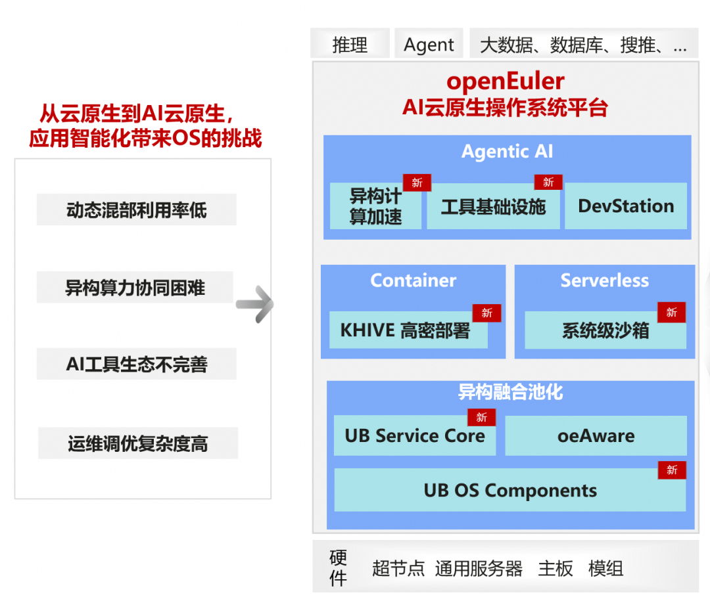
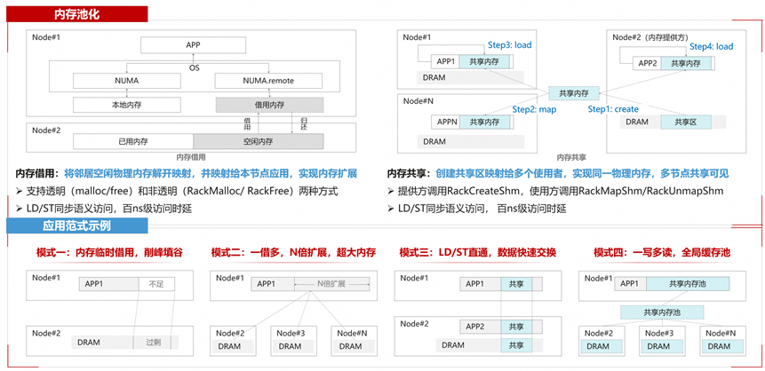

本文介绍OpenAtom openEuler（简称 “openEuler” 或 “开源欧拉”）在超节点操作系统与Agentic AI基础设施方向的技术探索与实践成果，包括异构融合、资源池化、系统级高并发沙箱、弹性内存、容器高密优化及Serverless快速启动等关键能力。通过软硬协同设计，构建面向Agent场景的高吞吐、高弹性、低时延基础设施，持续推进面向Agentic演进的OS生态建设。

## 特性介绍

随着Agent的发展以及大语言模型的性能突破，千行百业应用的智能化进一步加速，算力基础设施从云原生走向AI云原生时代，这也改变了传统应用的业务协作方式，操作系统交互、管理和运维模式迎来变革，对资源利用率、异构算力协同、工具和生态等都会带来更大的挑战。 面向Agentic AI时代，openEuler与鲲鹏持续构建新一代AI云原生操作系统平台，围绕Agent、Container、Serverless等场景重新定义传统OS的资源管理、算力抽象与生态入口能力：

在资源调度方向，openEuler基于鲲鹏超节点服务器，构建急速弹性、场景化调度与资源池化能力，实现超节点资源的透明使用与有效算力最优。其中KHIVE高密部署方案在SpecJBB + Spark等典型场景中实现部署密度提升1倍、吞吐提升15% 以上；UB OS Components提供对UB内存池化、UB通信及UB虚拟化能力的透明支持。

在Agent基础设施方向，openEuler提供Skills&MCP友好的工具生态与 XPU协同加速运行时，通过高性能RPC、通智算协同调度以及系统级高并发沙箱能力，降低Agent Tool调用时延并提升系统整体吞吐。xPUTurbo推理加速框架通过CPU + XPU协同卸载，实现主流LLM 推理吞吐提升12%以上。

同时，随着高速互联协议与超节点形态的持续演进，openEuler发布业界首个超节点OS，围绕资源池化、系统可靠性与统一运维底座展开创新，并基于超节点内存池化、remotefork等能力，探索Serverless容器快速启动与新型Agent应用范式。

**围绕超节点内存池化，提供多种应用范式创新的可能：**

面向未来，openEuler将持续面向Agentic OS方向演进，推动传统Linux OS在工具、调度、记忆、沙箱、推理运行时等多个方向的语义扩展与能力升级。通过软硬协同创新，结合鲲鹏与异构算力平台，openEuler 将持续构建开放、高性能、低门槛的Agent Infra生态，协同主流Agent中间件与AI云原生框架，帮助企业客户与生态伙伴降低Agent应用落地与基础设施改造成本，加速智能化转型。

## 结语

Agentic AI正在推动基础设施进入新的演进阶段，操作系统也将从传统资源管理平台逐步演进为AI时代的智能基础设施底座。openEuler将持续围绕超节点、资源池化、弹性调度、Agent Runtime与系统级沙箱等方向展开创新，构建面向未来AI云原生时代的Agent Infra能力，持续提升ARM/鲲鹏生态在Agentic时代的技术竞争力与产业影响力。